# Java Collections Framework — In-Depth Guide

A complete guide to the Java Collections Framework with hierarchy diagrams, internal working, practical Java examples, complexity analysis, best practices, and interview questions.

---

## Table of Contents

1. [What is the Java Collections Framework?](#1-what-is-the-java-collections-framework)
2. [Collections Framework Hierarchy](#2-collections-framework-hierarchy)
3. [Core Interfaces](#3-core-interfaces)
4. [List Interface](#4-list-interface)
   - [ArrayList](#41-arraylist)
   - [LinkedList](#42-linkedlist)
   - [Vector](#43-vector)
   - [Stack](#44-stack)
5. [Set Interface](#5-set-interface)
   - [HashSet](#51-hashset)
   - [LinkedHashSet](#52-linkedhashset)
   - [TreeSet](#53-treeset)
6. [Queue and Deque](#6-queue-and-deque)
   - [PriorityQueue](#61-priorityqueue)
   - [ArrayDeque](#62-arraydeque)
7. [Map Interface](#7-map-interface)
   - [HashMap](#71-hashmap)
   - [LinkedHashMap](#72-linkedhashmap)
   - [TreeMap](#73-treemap)
   - [Hashtable](#74-hashtable)
   - [ConcurrentHashMap](#75-concurrenthashmap)
8. [Iterator and ListIterator](#8-iterator-and-listiterator)
9. [Comparable and Comparator](#9-comparable-and-comparator)
10. [Collections Utility Class](#10-collections-utility-class)
11. [Fail-Fast and Fail-Safe Iterators](#11-fail-fast-and-fail-safe-iterators)
12. [Immutable and Unmodifiable Collections](#12-immutable-and-unmodifiable-collections)
13. [Thread-Safe Collections](#13-thread-safe-collections)
14. [Time Complexity Comparison](#14-time-complexity-comparison)
15. [Common Coding Examples](#15-common-coding-examples)
16. [Best Practices](#16-best-practices)
17. [Interview Questions and Answers](#17-interview-questions-and-answers)
18. [Summary](#18-summary)

---

# 1. What is the Java Collections Framework?

The Java Collections Framework is a set of interfaces and classes used to store, manipulate, and process groups of objects.

It provides reusable data structures such as:

- List
- Set
- Queue
- Deque
- Map

It also provides algorithms for:

- Sorting
- Searching
- Reversing
- Shuffling
- Finding minimum and maximum
- Synchronizing collections

## Why do we need collections?

Arrays have several limitations:

- Fixed size
- Limited built-in operations
- No direct support for sets, queues, maps, or sorting strategies
- Manual resizing is required

Collections solve these problems by offering dynamic and specialized data structures.

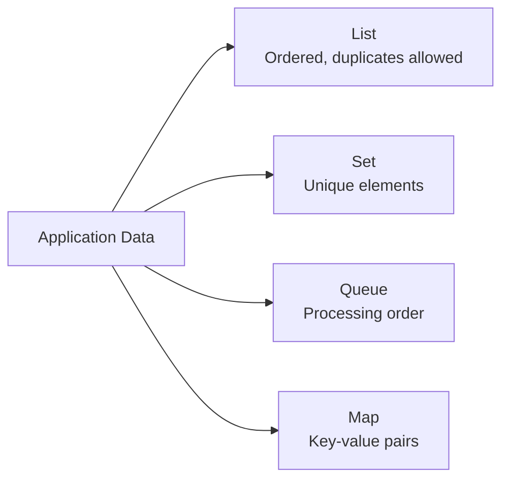

---

# 2. Collections Framework Hierarchy

## 2.1 Collection hierarchy

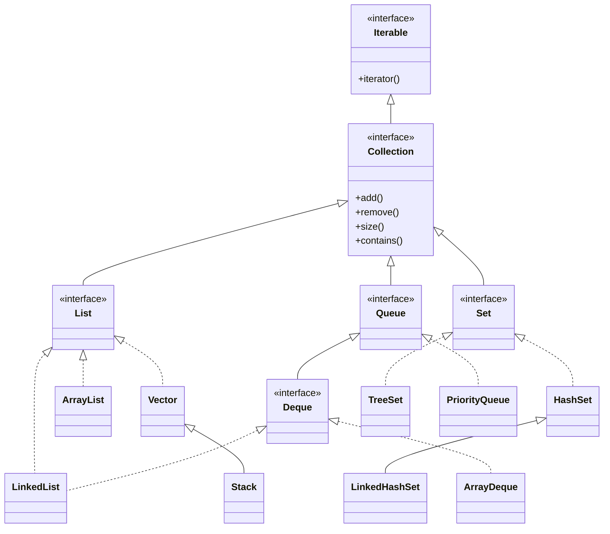

## 2.2 Map hierarchy

`Map` is part of the Collections Framework but does not extend `Collection`.

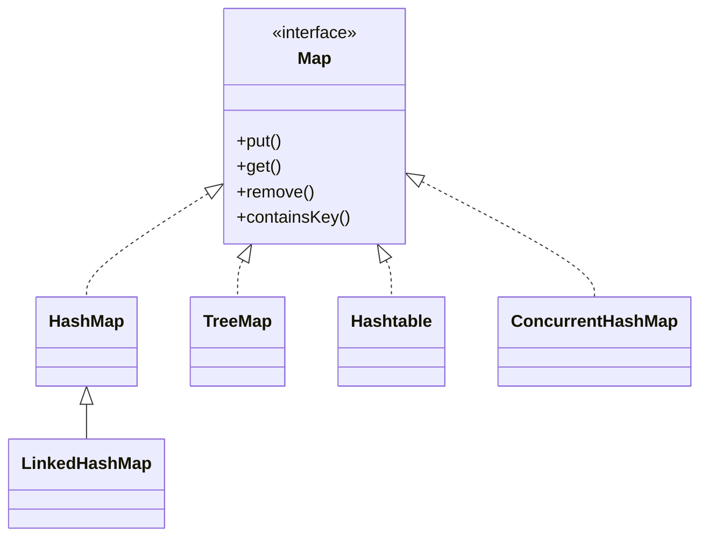

---

# 3. Core Interfaces

## 3.1 Collection

`Collection` is the root interface for most collection types.

Common methods:

```java
boolean add(E element);
boolean remove(Object object);
int size();
boolean isEmpty();
boolean contains(Object object);
void clear();
Iterator<E> iterator();
```

## 3.2 List

A `List`:

- Maintains insertion order
- Allows duplicate elements
- Supports index-based access
- Can contain multiple `null` values

Examples:

- `ArrayList`
- `LinkedList`
- `Vector`
- `Stack`

## 3.3 Set

A `Set`:

- Stores unique elements
- Does not allow duplicates
- May or may not maintain order

Examples:

- `HashSet`
- `LinkedHashSet`
- `TreeSet`

## 3.4 Queue

A `Queue` is generally used for processing elements in order.

Common model:

- FIFO: First In, First Out

Examples:

- `PriorityQueue`
- `LinkedList`

## 3.5 Deque

A `Deque` supports insertion and removal at both ends.

It can work as:

- Queue
- Stack

Examples:

- `ArrayDeque`
- `LinkedList`

## 3.6 Map

A `Map` stores key-value pairs.

Important rules:

- Keys are unique
- Values can be duplicated
- One key maps to one value

---

# 4. List Interface

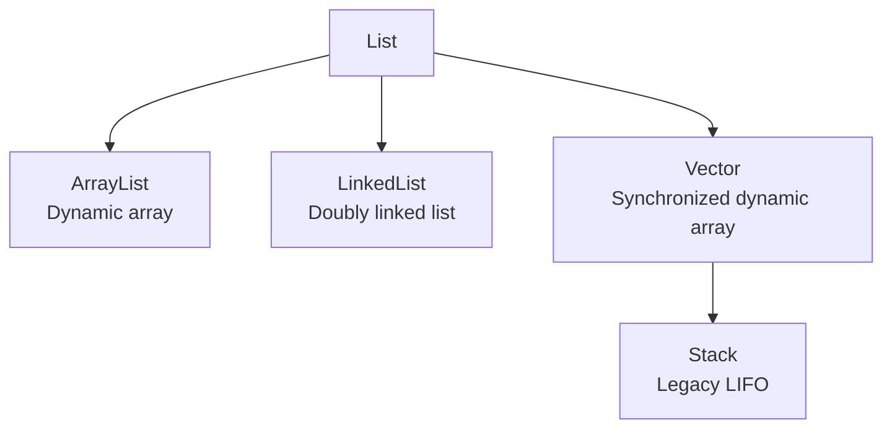

---

## 4.1 ArrayList

`ArrayList` is backed by a dynamically resizable array.

## Characteristics

- Maintains insertion order
- Allows duplicates
- Allows `null`
- Fast random access
- Slow insertion/removal in the middle
- Not synchronized

## Internal structure

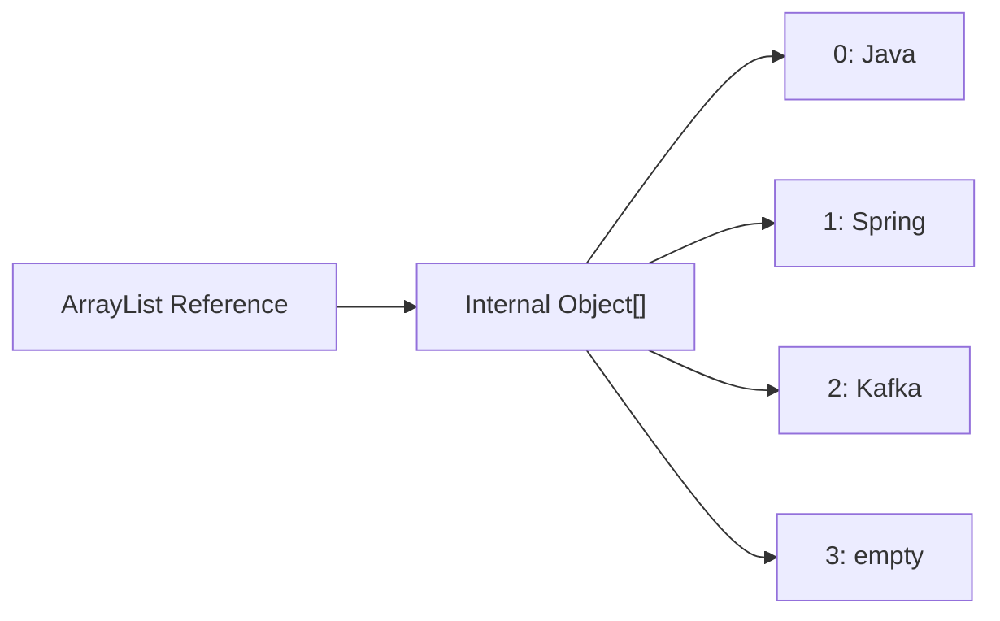

## Basic example

```java
import java.util.ArrayList;
import java.util.List;

public class ArrayListExample {

    public static void main(String[] args) {
        List<String> skills = new ArrayList<>();

        skills.add("Java");
        skills.add("Spring Boot");
        skills.add("Kafka");
        skills.add("Java");

        System.out.println(skills);
        System.out.println(skills.get(1));
        System.out.println(skills.contains("Kafka"));

        skills.remove("Java");

        System.out.println(skills);
    }
}
```

Output:

```text
[Java, Spring Boot, Kafka, Java]
Spring Boot
true
[Spring Boot, Kafka, Java]
```

## Internal resizing

When the internal array becomes full, `ArrayList` creates a larger array and copies elements.

Conceptually:

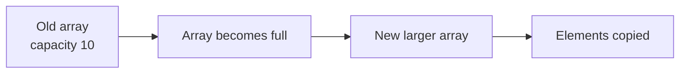

In modern Java, the capacity generally grows by approximately 50%.

Conceptual formula:

```text
newCapacity = oldCapacity + oldCapacity / 2
```

This is an implementation detail and should not be relied upon in application logic.

## Time complexity

| Operation | Complexity |
|---|---:|
| `get(index)` | O(1) |
| `set(index, value)` | O(1) |
| `add(element)` | Amortized O(1) |
| `add(index, element)` | O(n) |
| `remove(index)` | O(n) |
| `contains(element)` | O(n) |

## Why middle insertion is expensive

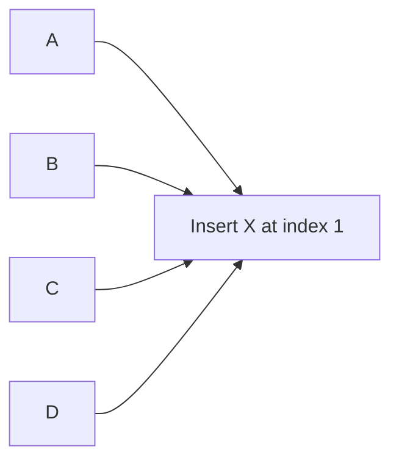

Elements after the insertion point must shift to the right.

```text
Before: [A, B, C, D]
After:  [A, X, B, C, D]
```

## Initial capacity

For large collections, specify capacity to reduce resizing:

```java
List<Integer> values = new ArrayList<>(10000);
```

---

## 4.2 LinkedList

`LinkedList` is implemented as a doubly linked list.

Each node contains:

- Previous-node reference
- Current value
- Next-node reference

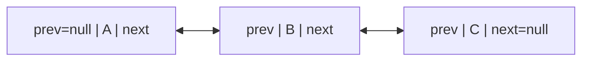

## Characteristics

- Maintains insertion order
- Allows duplicates
- Allows `null`
- Fast insertion/removal when node position is known
- Slow random access
- Implements both `List` and `Deque`
- Not synchronized

## Example

```java
import java.util.LinkedList;

public class LinkedListExample {

    public static void main(String[] args) {
        LinkedList<String> tasks = new LinkedList<>();

        tasks.add("Design");
        tasks.add("Develop");
        tasks.add("Test");

        tasks.addFirst("Plan");
        tasks.addLast("Deploy");

        System.out.println(tasks);
        System.out.println(tasks.getFirst());
        System.out.println(tasks.getLast());

        tasks.removeFirst();
        tasks.removeLast();

        System.out.println(tasks);
    }
}
```

## Time complexity

| Operation | Complexity |
|---|---:|
| `get(index)` | O(n) |
| `addFirst()` | O(1) |
| `addLast()` | O(1) |
| `removeFirst()` | O(1) |
| `removeLast()` | O(1) |
| `contains()` | O(n) |

## ArrayList vs LinkedList

| Feature | ArrayList | LinkedList |
|---|---|---|
| Internal structure | Dynamic array | Doubly linked list |
| Random access | Fast O(1) | Slow O(n) |
| Add at end | Amortized O(1) | O(1) |
| Insert at beginning | O(n) | O(1) |
| Memory usage | Lower | Higher |
| CPU cache locality | Better | Worse |
| Preferred for most lists | Yes | Only specific use cases |

Important practical point:

Even though linked-list insertion is O(1), finding the insertion position may still take O(n).

---

## 4.3 Vector

`Vector` is a legacy synchronized dynamic array.

```java
import java.util.Vector;

public class VectorExample {

    public static void main(String[] args) {
        Vector<String> vector = new Vector<>();

        vector.add("Java");
        vector.add("Spring");
        vector.add("Kafka");

        System.out.println(vector);
    }
}
```

## ArrayList vs Vector

| Feature | ArrayList | Vector |
|---|---|---|
| Synchronization | No | Yes |
| Performance | Faster | Usually slower |
| Growth | Around 50% | Typically doubles |
| Status | Preferred | Legacy |
| Thread safety | External or modern alternatives | Method-level synchronization |

For modern concurrent use cases, prefer:

- `Collections.synchronizedList(...)`
- `CopyOnWriteArrayList`
- Proper synchronization

---

## 4.4 Stack

`Stack` is a legacy LIFO data structure extending `Vector`.

LIFO means Last In, First Out.

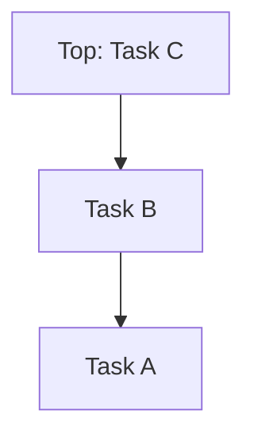

## Example

```java
import java.util.Stack;

public class StackExample {

    public static void main(String[] args) {
        Stack<String> stack = new Stack<>();

        stack.push("Page-1");
        stack.push("Page-2");
        stack.push("Page-3");

        System.out.println(stack.peek());
        System.out.println(stack.pop());
        System.out.println(stack);
    }
}
```

Prefer `ArrayDeque` instead of `Stack`:

```java
import java.util.ArrayDeque;
import java.util.Deque;

public class ModernStackExample {

    public static void main(String[] args) {
        Deque<String> stack = new ArrayDeque<>();

        stack.push("Page-1");
        stack.push("Page-2");
        stack.push("Page-3");

        System.out.println(stack.peek());
        System.out.println(stack.pop());
    }
}
```

---

# 5. Set Interface

A `Set` stores unique elements.

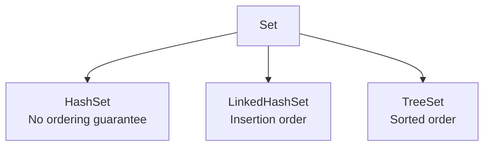

---

## 5.1 HashSet

`HashSet` is internally backed by a `HashMap`.

Elements added to the set are stored as map keys, while a constant dummy object is used as the value.

Conceptually:

```java
map.put(element, PRESENT);
```

## Characteristics

- No duplicates
- No guaranteed iteration order
- Allows one `null`
- Average O(1) add, remove, and contains
- Not synchronized

## Example

```java
import java.util.HashSet;
import java.util.Set;

public class HashSetExample {

    public static void main(String[] args) {
        Set<String> technologies = new HashSet<>();

        technologies.add("Java");
        technologies.add("Spring Boot");
        technologies.add("Kafka");
        technologies.add("Java");

        System.out.println(technologies);
        System.out.println(technologies.size());
    }
}
```

The duplicate `"Java"` is ignored.

## Why `equals()` and `hashCode()` matter

```java
import java.util.Objects;

public class Employee {

    private final String employeeId;
    private final String name;

    public Employee(String employeeId, String name) {
        this.employeeId = employeeId;
        this.name = name;
    }

    @Override
    public boolean equals(Object object) {
        if (this == object) {
            return true;
        }

        if (!(object instanceof Employee employee)) {
            return false;
        }

        return Objects.equals(
                employeeId,
                employee.employeeId
        );
    }

    @Override
    public int hashCode() {
        return Objects.hash(employeeId);
    }

    @Override
    public String toString() {
        return employeeId + " - " + name;
    }
}
```

```java
import java.util.HashSet;
import java.util.Set;

public class EmployeeSetExample {

    public static void main(String[] args) {
        Set<Employee> employees = new HashSet<>();

        employees.add(new Employee("E-101", "Amit"));
        employees.add(new Employee("E-101", "Amit Updated"));

        System.out.println(employees.size());
        System.out.println(employees);
    }
}
```

Because equality is based on `employeeId`, the second employee is treated as a duplicate.

---

## 5.2 LinkedHashSet

`LinkedHashSet` maintains insertion order.

It combines:

- Hash-based lookup
- Linked ordering

## Example

```java
import java.util.LinkedHashSet;
import java.util.Set;

public class LinkedHashSetExample {

    public static void main(String[] args) {
        Set<String> values = new LinkedHashSet<>();

        values.add("Java");
        values.add("Spring");
        values.add("Kafka");
        values.add("Java");

        System.out.println(values);
    }
}
```

Output:

```text
[Java, Spring, Kafka]
```

Use `LinkedHashSet` when:

- Uniqueness is needed
- Insertion order must be retained

---

## 5.3 TreeSet

`TreeSet` stores unique elements in sorted order.

It is internally based on a red-black tree.

## Characteristics

- No duplicates
- Sorted order
- O(log n) operations
- Does not normally allow `null`
- Elements must be comparable or a comparator must be provided

## Example with natural ordering

```java
import java.util.Set;
import java.util.TreeSet;

public class TreeSetExample {

    public static void main(String[] args) {
        Set<Integer> numbers = new TreeSet<>();

        numbers.add(30);
        numbers.add(10);
        numbers.add(20);
        numbers.add(10);

        System.out.println(numbers);
    }
}
```

Output:

```text
[10, 20, 30]
```

## Example with custom comparator

```java
import java.util.Comparator;
import java.util.Set;
import java.util.TreeSet;

public class TreeSetComparatorExample {

    public static void main(String[] args) {
        Set<String> names = new TreeSet<>(
                Comparator.comparingInt(String::length)
                        .thenComparing(
                                Comparator.naturalOrder()
                        )
        );

        names.add("Java");
        names.add("Go");
        names.add("Python");
        names.add("C");

        System.out.println(names);
    }
}
```

## Tree structure

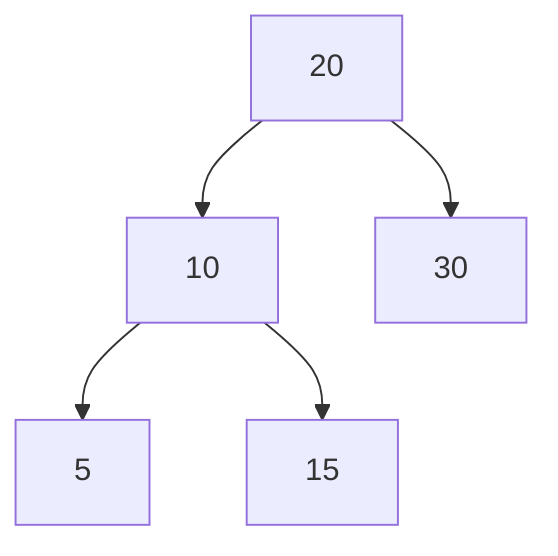

---

# 6. Queue and Deque

## Queue method pairs

| Throws exception | Returns special value |
|---|---|
| `add()` | `offer()` |
| `remove()` | `poll()` |
| `element()` | `peek()` |

Prefer:

- `offer()`
- `poll()`
- `peek()`

because they do not throw exceptions for normal empty/full conditions.

---

## 6.1 PriorityQueue

A `PriorityQueue` orders elements by priority rather than insertion order.

By default, the smallest element has the highest priority.

Internally, it uses a binary heap.

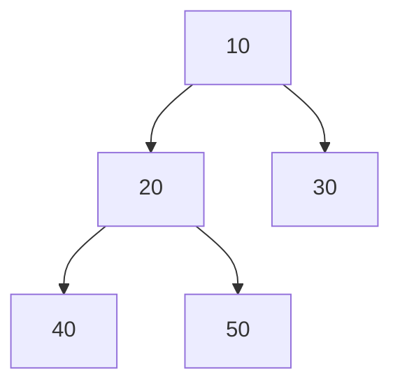

## Example

```java
import java.util.PriorityQueue;
import java.util.Queue;

public class PriorityQueueExample {

    public static void main(String[] args) {
        Queue<Integer> queue = new PriorityQueue<>();

        queue.offer(30);
        queue.offer(10);
        queue.offer(20);

        while (!queue.isEmpty()) {
            System.out.println(queue.poll());
        }
    }
}
```

Output:

```text
10
20
30
```

## Max-heap example

```java
import java.util.Comparator;
import java.util.PriorityQueue;
import java.util.Queue;

public class MaxHeapExample {

    public static void main(String[] args) {
        Queue<Integer> queue =
                new PriorityQueue<>(
                        Comparator.reverseOrder()
                );

        queue.offer(30);
        queue.offer(10);
        queue.offer(20);

        while (!queue.isEmpty()) {
            System.out.println(queue.poll());
        }
    }
}
```

## Important note

Iterating over a `PriorityQueue` does not guarantee sorted order.

Only repeated `poll()` operations return elements in priority order.

---

## 6.2 ArrayDeque

`ArrayDeque` is a resizable-array implementation of `Deque`.

It supports:

- Queue operations
- Stack operations
- Insertions/removals at both ends

## Queue example

```java
import java.util.ArrayDeque;
import java.util.Deque;

public class ArrayDequeQueueExample {

    public static void main(String[] args) {
        Deque<String> queue = new ArrayDeque<>();

        queue.offerLast("Task-1");
        queue.offerLast("Task-2");
        queue.offerLast("Task-3");

        System.out.println(queue.pollFirst());
        System.out.println(queue.pollFirst());
    }
}
```

## Stack example

```java
import java.util.ArrayDeque;
import java.util.Deque;

public class ArrayDequeStackExample {

    public static void main(String[] args) {
        Deque<String> stack = new ArrayDeque<>();

        stack.push("A");
        stack.push("B");
        stack.push("C");

        System.out.println(stack.pop());
        System.out.println(stack.pop());
    }
}
```

## Why prefer ArrayDeque?

- Faster than legacy `Stack`
- Usually faster than `LinkedList`
- No synchronization overhead
- Efficient at both ends

It does not allow `null`.

---

# 7. Map Interface

A `Map` stores key-value pairs.

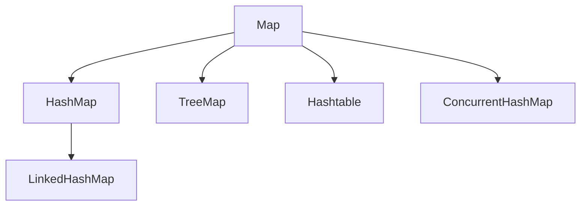

---

## 7.1 HashMap

`HashMap` is the most commonly used map implementation.

## Characteristics

- Stores key-value pairs
- Allows one `null` key
- Allows multiple `null` values
- No iteration-order guarantee
- Average O(1) `put()` and `get()`
- Not synchronized

## Basic example

```java
import java.util.HashMap;
import java.util.Map;

public class HashMapExample {

    public static void main(String[] args) {
        Map<String, Integer> scores = new HashMap<>();

        scores.put("Java", 90);
        scores.put("Spring", 85);
        scores.put("Kafka", 80);

        System.out.println(scores.get("Java"));
        System.out.println(scores.containsKey("Kafka"));

        scores.put("Java", 95);

        System.out.println(scores);
    }
}
```

Adding the same key replaces its previous value.

## HashMap internal working

The basic flow for `put(key, value)`:

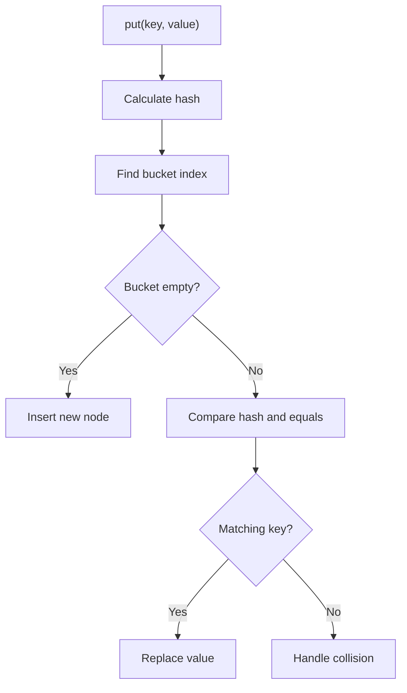

## Bucket structure

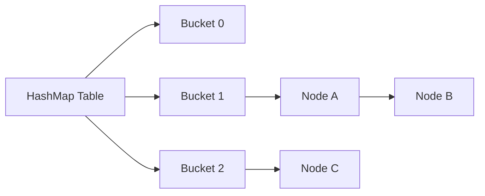

## Hash collision

A collision occurs when different keys map to the same bucket.

Java handles collisions using:

- Linked list
- Red-black tree when the bucket becomes large enough

In Java 8+, a bucket may be treeified when:

- Bucket node count reaches a threshold
- Table capacity is sufficiently large

Important common constants:

```text
TREEIFY_THRESHOLD = 8
UNTREEIFY_THRESHOLD = 6
MIN_TREEIFY_CAPACITY = 64
```

These are implementation details but frequently asked in interviews.

## `get()` flow

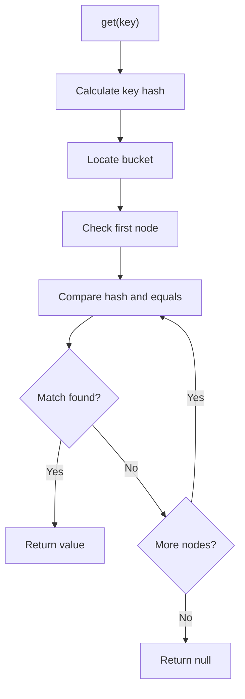

## HashMap capacity and load factor

Default values:

```text
Initial capacity: 16
Load factor: 0.75
```

Resize threshold:

```text
threshold = capacity × loadFactor
```

For default values:

```text
16 × 0.75 = 12
```

When the number of entries exceeds the threshold, the table resizes.

## Why immutable keys are recommended

If a key changes after insertion, its hash code may change.

Then `HashMap` may not find the key in the original bucket.

Bad example:

```java
import java.util.HashMap;
import java.util.Map;
import java.util.Objects;

class MutableKey {

    private String value;

    MutableKey(String value) {
        this.value = value;
    }

    void setValue(String value) {
        this.value = value;
    }

    @Override
    public boolean equals(Object object) {
        if (this == object) {
            return true;
        }

        if (!(object instanceof MutableKey key)) {
            return false;
        }

        return Objects.equals(value, key.value);
    }

    @Override
    public int hashCode() {
        return Objects.hash(value);
    }
}

public class MutableKeyExample {

    public static void main(String[] args) {
        Map<MutableKey, String> map = new HashMap<>();

        MutableKey key = new MutableKey("A");
        map.put(key, "Value");

        key.setValue("B");

        System.out.println(map.get(key));
    }
}
```

The result may be `null` because the key's hash changed.

Use immutable keys such as:

- `String`
- `Integer`
- Immutable records
- Proper immutable domain objects

---

## 7.2 LinkedHashMap

`LinkedHashMap` maintains predictable iteration order.

By default, it maintains insertion order.

```java
import java.util.LinkedHashMap;
import java.util.Map;

public class LinkedHashMapExample {

    public static void main(String[] args) {
        Map<String, Integer> map =
                new LinkedHashMap<>();

        map.put("Java", 1);
        map.put("Spring", 2);
        map.put("Kafka", 3);

        System.out.println(map);
    }
}
```

## Access-order mode

`LinkedHashMap` can maintain access order, useful for LRU caches.

```java
import java.util.LinkedHashMap;
import java.util.Map;

public class LruCache<K, V>
        extends LinkedHashMap<K, V> {

    private final int capacity;

    public LruCache(int capacity) {
        super(capacity, 0.75f, true);
        this.capacity = capacity;
    }

    @Override
    protected boolean removeEldestEntry(
            Map.Entry<K, V> eldest
    ) {
        return size() > capacity;
    }
}
```

```java
public class LruCacheExample {

    public static void main(String[] args) {
        LruCache<Integer, String> cache =
                new LruCache<>(3);

        cache.put(1, "A");
        cache.put(2, "B");
        cache.put(3, "C");

        cache.get(1);
        cache.put(4, "D");

        System.out.println(cache);
    }
}
```

Key `2` is removed because it is the least recently used.

---

## 7.3 TreeMap

`TreeMap` stores entries sorted by key.

It is based on a red-black tree.

## Characteristics

- Sorted keys
- O(log n) operations
- No `null` key with natural ordering
- Multiple `null` values allowed
- Supports navigation methods

## Example

```java
import java.util.Map;
import java.util.TreeMap;

public class TreeMapExample {

    public static void main(String[] args) {
        TreeMap<Integer, String> map =
                new TreeMap<>();

        map.put(30, "Thirty");
        map.put(10, "Ten");
        map.put(20, "Twenty");

        System.out.println(map);
        System.out.println(map.firstKey());
        System.out.println(map.lastKey());
        System.out.println(map.higherKey(20));
        System.out.println(map.lowerKey(20));
    }
}
```

---

## 7.4 Hashtable

`Hashtable` is a legacy synchronized map.

Characteristics:

- Thread-safe through method synchronization
- Does not allow `null` key
- Does not allow `null` values
- Usually slower than modern alternatives

```java
import java.util.Hashtable;
import java.util.Map;

public class HashtableExample {

    public static void main(String[] args) {
        Map<String, Integer> table =
                new Hashtable<>();

        table.put("Java", 1);
        table.put("Spring", 2);

        System.out.println(table);
    }
}
```

Prefer `ConcurrentHashMap` for most concurrent applications.

---

## 7.5 ConcurrentHashMap

`ConcurrentHashMap` supports safe concurrent access with better scalability than `Hashtable`.

## Characteristics

- Thread-safe
- Does not allow `null` keys or values
- Reads are highly concurrent
- Updates use fine-grained coordination
- Iterators are weakly consistent
- Provides atomic operations

## Example

```java
import java.util.Map;
import java.util.concurrent.ConcurrentHashMap;

public class ConcurrentHashMapExample {

    public static void main(String[] args) {
        Map<String, Integer> counts =
                new ConcurrentHashMap<>();

        counts.put("Java", 1);

        counts.compute(
                "Java",
                (key, value) ->
                        value == null ? 1 : value + 1
        );

        counts.putIfAbsent("Kafka", 1);

        System.out.println(counts);
    }
}
```

## Atomic counter update

```java
import java.util.concurrent.ConcurrentHashMap;
import java.util.concurrent.ConcurrentMap;

public class WordCounter {

    public static void main(String[] args) {
        ConcurrentMap<String, Integer> counts =
                new ConcurrentHashMap<>();

        String[] words = {
                "java",
                "spring",
                "java",
                "kafka",
                "java"
        };

        for (String word : words) {
            counts.merge(word, 1, Integer::sum);
        }

        System.out.println(counts);
    }
}
```

---

# 8. Iterator and ListIterator

## 8.1 Iterator

`Iterator` allows sequential traversal.

Main methods:

```java
boolean hasNext();
E next();
void remove();
```

## Example

```java
import java.util.ArrayList;
import java.util.Iterator;
import java.util.List;

public class IteratorExample {

    public static void main(String[] args) {
        List<String> values = new ArrayList<>(
                List.of("Java", "Spring", "Kafka")
        );

        Iterator<String> iterator =
                values.iterator();

        while (iterator.hasNext()) {
            String value = iterator.next();

            if ("Spring".equals(value)) {
                iterator.remove();
            }
        }

        System.out.println(values);
    }
}
```

Using `iterator.remove()` is the safe way to remove while iterating.

## 8.2 ListIterator

`ListIterator` is available only for lists.

It supports:

- Forward traversal
- Backward traversal
- Element replacement
- Element insertion

```java
import java.util.ArrayList;
import java.util.List;
import java.util.ListIterator;

public class ListIteratorExample {

    public static void main(String[] args) {
        List<String> values = new ArrayList<>(
                List.of("Java", "Spring", "Kafka")
        );

        ListIterator<String> iterator =
                values.listIterator();

        while (iterator.hasNext()) {
            String value = iterator.next();

            if ("Spring".equals(value)) {
                iterator.set("Spring Boot");
                iterator.add("Redis");
            }
        }

        System.out.println(values);

        while (iterator.hasPrevious()) {
            System.out.println(iterator.previous());
        }
    }
}
```

---

# 9. Comparable and Comparator

## 9.1 Comparable

`Comparable` defines the natural ordering of a class.

```java
public interface Comparable<T> {
    int compareTo(T other);
}
```

## Example

```java
public class Employee
        implements Comparable<Employee> {

    private final int id;
    private final String name;
    private final double salary;

    public Employee(
            int id,
            String name,
            double salary
    ) {
        this.id = id;
        this.name = name;
        this.salary = salary;
    }

    @Override
    public int compareTo(Employee other) {
        return Integer.compare(id, other.id);
    }

    public int getId() {
        return id;
    }

    public String getName() {
        return name;
    }

    public double getSalary() {
        return salary;
    }

    @Override
    public String toString() {
        return id + " - " + name + " - " + salary;
    }
}
```

```java
import java.util.ArrayList;
import java.util.Collections;
import java.util.List;

public class ComparableExample {

    public static void main(String[] args) {
        List<Employee> employees =
                new ArrayList<>();

        employees.add(
                new Employee(3, "Ravi", 90000)
        );
        employees.add(
                new Employee(1, "Amit", 80000)
        );
        employees.add(
                new Employee(2, "Neha", 95000)
        );

        Collections.sort(employees);

        employees.forEach(System.out::println);
    }
}
```

## 9.2 Comparator

`Comparator` defines external or custom ordering.

```java
import java.util.Comparator;

Comparator<Employee> bySalary =
        Comparator.comparingDouble(
                Employee::getSalary
        );

Comparator<Employee> byName =
        Comparator.comparing(
                Employee::getName
        );
```

## Multiple-field sorting

```java
Comparator<Employee> bySalaryThenName =
        Comparator.comparingDouble(
                        Employee::getSalary
                )
                .reversed()
                .thenComparing(
                        Employee::getName
                );
```

## Comparable vs Comparator

| Feature | Comparable | Comparator |
|---|---|---|
| Package | `java.lang` | `java.util` |
| Method | `compareTo()` | `compare()` |
| Ordering | Natural | Custom |
| Class modification | Required | Not required |
| Number of orderings | Usually one | Multiple |
| Usage | `Collections.sort(list)` | `sort(comparator)` |

---

# 10. Collections Utility Class

`java.util.Collections` provides static algorithms.

## Sorting

```java
Collections.sort(list);
```

```java
list.sort(Comparator.naturalOrder());
```

## Reverse

```java
Collections.reverse(list);
```

## Shuffle

```java
Collections.shuffle(list);
```

## Minimum and maximum

```java
Integer min = Collections.min(numbers);
Integer max = Collections.max(numbers);
```

## Frequency

```java
int frequency =
        Collections.frequency(values, "Java");
```

## Binary search

```java
Collections.sort(values);

int index =
        Collections.binarySearch(values, "Kafka");
```

The list must be sorted according to the same ordering before binary search.

## Example

```java
import java.util.ArrayList;
import java.util.Collections;
import java.util.List;

public class CollectionsUtilityExample {

    public static void main(String[] args) {
        List<Integer> numbers =
                new ArrayList<>(
                        List.of(5, 2, 8, 1, 3)
                );

        Collections.sort(numbers);
        System.out.println(numbers);

        Collections.reverse(numbers);
        System.out.println(numbers);

        System.out.println(
                Collections.max(numbers)
        );

        System.out.println(
                Collections.min(numbers)
        );
    }
}
```

---

# 11. Fail-Fast and Fail-Safe Iterators

## 11.1 Fail-fast iterator

A fail-fast iterator throws `ConcurrentModificationException` when a collection is structurally modified outside the iterator during iteration.

```java
import java.util.ArrayList;
import java.util.List;

public class FailFastExample {

    public static void main(String[] args) {
        List<String> values =
                new ArrayList<>(
                        List.of("A", "B", "C")
                );

        for (String value : values) {
            if ("B".equals(value)) {
                values.remove(value);
            }
        }
    }
}
```

This may throw:

```text
ConcurrentModificationException
```

## Why?

Many collections maintain a structural modification count.

The iterator compares:

- Expected modification count
- Actual modification count

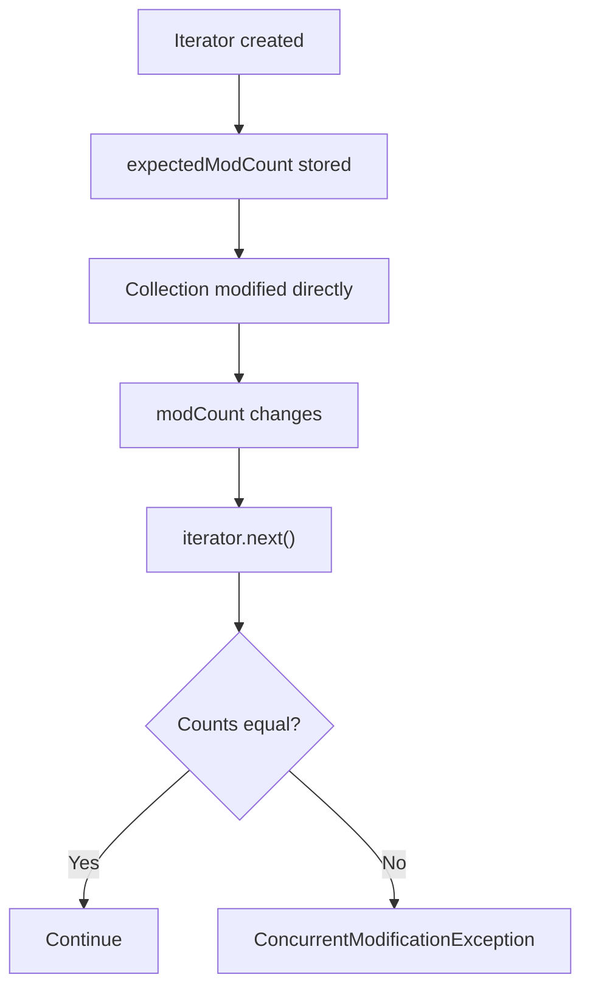

## Correct removal

```java
Iterator<String> iterator =
        values.iterator();

while (iterator.hasNext()) {
    if ("B".equals(iterator.next())) {
        iterator.remove();
    }
}
```

## 11.2 Fail-safe or weakly consistent iterator

The term "fail-safe" is commonly used in interviews, though it is not an official Java API term.

Concurrent collections often iterate over:

- A snapshot
- A weakly consistent view

Examples:

- `CopyOnWriteArrayList`
- `ConcurrentHashMap`

```java
import java.util.List;
import java.util.concurrent.CopyOnWriteArrayList;

public class WeaklyConsistentExample {

    public static void main(String[] args) {
        List<String> values =
                new CopyOnWriteArrayList<>(
                        List.of("A", "B", "C")
                );

        for (String value : values) {
            if ("B".equals(value)) {
                values.add("D");
            }
        }

        System.out.println(values);
    }
}
```

---

# 12. Immutable and Unmodifiable Collections

## 12.1 Immutable collection

An immutable collection cannot be changed.

```java
import java.util.List;
import java.util.Map;
import java.util.Set;

public class ImmutableCollectionExample {

    public static void main(String[] args) {
        List<String> list =
                List.of("Java", "Spring");

        Set<String> set =
                Set.of("Kafka", "Redis");

        Map<String, Integer> map =
                Map.of(
                        "Java", 1,
                        "Spring", 2
                );

        System.out.println(list);
        System.out.println(set);
        System.out.println(map);
    }
}
```

Attempting modification throws `UnsupportedOperationException`.

## 12.2 Unmodifiable view

```java
import java.util.ArrayList;
import java.util.Collections;
import java.util.List;

public class UnmodifiableViewExample {

    public static void main(String[] args) {
        List<String> mutable =
                new ArrayList<>();

        mutable.add("Java");

        List<String> view =
                Collections.unmodifiableList(
                        mutable
                );

        mutable.add("Spring");

        System.out.println(view);
    }
}
```

The view cannot be modified directly, but changes in the backing list are visible.

## Defensive copy

```java
import java.util.List;

public final class Course {

    private final List<String> topics;

    public Course(List<String> topics) {
        this.topics = List.copyOf(topics);
    }

    public List<String> getTopics() {
        return topics;
    }
}
```

`List.copyOf()` provides a safe immutable copy.

---

# 13. Thread-Safe Collections

## Options

### Synchronized wrapper

```java
List<String> list =
        Collections.synchronizedList(
                new ArrayList<>()
        );
```

Iteration still requires external synchronization:

```java
synchronized (list) {
    for (String value : list) {
        System.out.println(value);
    }
}
```

### CopyOnWriteArrayList

Best suited when:

- Reads are frequent
- Writes are rare
- Snapshot iteration is useful

```java
import java.util.List;
import java.util.concurrent.CopyOnWriteArrayList;

public class CopyOnWriteExample {

    public static void main(String[] args) {
        List<String> listeners =
                new CopyOnWriteArrayList<>();

        listeners.add("Listener-1");
        listeners.add("Listener-2");

        listeners.forEach(System.out::println);
    }
}
```

Every write creates a new internal array, so frequent writes are expensive.

### ConcurrentHashMap

Best suited for concurrent key-value access.

### BlockingQueue

Useful for producer-consumer systems.

```java
import java.util.concurrent.ArrayBlockingQueue;
import java.util.concurrent.BlockingQueue;

public class ProducerConsumerExample {

    public static void main(String[] args)
            throws InterruptedException {

        BlockingQueue<String> queue =
                new ArrayBlockingQueue<>(10);

        Thread producer = new Thread(() -> {
            try {
                queue.put("Task-1");
                queue.put("Task-2");
            } catch (InterruptedException exception) {
                Thread.currentThread().interrupt();
            }
        });

        Thread consumer = new Thread(() -> {
            try {
                System.out.println(queue.take());
                System.out.println(queue.take());
            } catch (InterruptedException exception) {
                Thread.currentThread().interrupt();
            }
        });

        producer.start();
        consumer.start();

        producer.join();
        consumer.join();
    }
}
```

---

# 14. Time Complexity Comparison

## List implementations

| Operation | ArrayList | LinkedList |
|---|---:|---:|
| Get by index | O(1) | O(n) |
| Set by index | O(1) | O(n) |
| Add at end | Amortized O(1) | O(1) |
| Add at beginning | O(n) | O(1) |
| Remove from beginning | O(n) | O(1) |
| Search | O(n) | O(n) |

## Set implementations

| Operation | HashSet | LinkedHashSet | TreeSet |
|---|---:|---:|---:|
| Add | Average O(1) | Average O(1) | O(log n) |
| Remove | Average O(1) | Average O(1) | O(log n) |
| Contains | Average O(1) | Average O(1) | O(log n) |
| Ordering | None | Insertion | Sorted |

## Map implementations

| Operation | HashMap | LinkedHashMap | TreeMap | ConcurrentHashMap |
|---|---:|---:|---:|---:|
| Get | Average O(1) | Average O(1) | O(log n) | Average O(1) |
| Put | Average O(1) | Average O(1) | O(log n) | Average O(1) |
| Remove | Average O(1) | Average O(1) | O(log n) | Average O(1) |
| Ordering | None | Insertion/access | Sorted keys | None |
| Thread-safe | No | No | No | Yes |

---

# 15. Common Coding Examples

## 15.1 Remove duplicates while preserving order

```java
import java.util.ArrayList;
import java.util.LinkedHashSet;
import java.util.List;

public class RemoveDuplicates {

    public static void main(String[] args) {
        List<Integer> values =
                List.of(1, 2, 2, 3, 1, 4);

        List<Integer> unique =
                new ArrayList<>(
                        new LinkedHashSet<>(values)
                );

        System.out.println(unique);
    }
}
```

Output:

```text
[1, 2, 3, 4]
```

## 15.2 Count word frequency

```java
import java.util.HashMap;
import java.util.Map;

public class WordFrequency {

    public static void main(String[] args) {
        String sentence =
                "java spring java kafka spring java";

        Map<String, Integer> frequency =
                new HashMap<>();

        for (String word : sentence.split("\\s+")) {
            frequency.merge(
                    word,
                    1,
                    Integer::sum
            );
        }

        System.out.println(frequency);
    }
}
```

## 15.3 Find first non-repeated character

```java
import java.util.LinkedHashMap;
import java.util.Map;

public class FirstNonRepeatedCharacter {

    public static void main(String[] args) {
        String value = "swiss";

        Map<Character, Integer> frequency =
                new LinkedHashMap<>();

        for (char character : value.toCharArray()) {
            frequency.merge(
                    character,
                    1,
                    Integer::sum
            );
        }

        Character result = frequency.entrySet()
                .stream()
                .filter(entry ->
                        entry.getValue() == 1
                )
                .map(Map.Entry::getKey)
                .findFirst()
                .orElse(null);

        System.out.println(result);
    }
}
```

## 15.4 Sort map by value

```java
import java.util.LinkedHashMap;
import java.util.Map;
import java.util.stream.Collectors;

public class SortMapByValue {

    public static void main(String[] args) {
        Map<String, Integer> scores =
                Map.of(
                        "Java", 90,
                        "Spring", 85,
                        "Kafka", 88
                );

        Map<String, Integer> sorted =
                scores.entrySet()
                        .stream()
                        .sorted(
                                Map.Entry
                                        .<String, Integer>
                                                comparingByValue()
                                        .reversed()
                        )
                        .collect(
                                Collectors.toMap(
                                        Map.Entry::getKey,
                                        Map.Entry::getValue,
                                        (first, second) -> first,
                                        LinkedHashMap::new
                                )
                        );

        System.out.println(sorted);
    }
}
```

## 15.5 Group employees by department

```java
import java.util.List;
import java.util.Map;
import java.util.stream.Collectors;

record Employee(
        String name,
        String department
) {
}

public class GroupEmployees {

    public static void main(String[] args) {
        List<Employee> employees =
                List.of(
                        new Employee(
                                "Amit",
                                "Engineering"
                        ),
                        new Employee(
                                "Neha",
                                "HR"
                        ),
                        new Employee(
                                "Ravi",
                                "Engineering"
                        )
                );

        Map<String, List<Employee>> grouped =
                employees.stream()
                        .collect(
                                Collectors.groupingBy(
                                        Employee::department
                                )
                        );

        grouped.forEach(
                (department, members) ->
                        System.out.println(
                                department
                                        + " -> "
                                        + members
                        )
        );
    }
}
```

## 15.6 Top K largest elements

```java
import java.util.List;
import java.util.PriorityQueue;
import java.util.Queue;

public class TopKLargest {

    public static void main(String[] args) {
        List<Integer> numbers =
                List.of(5, 1, 9, 3, 14, 8, 12);

        int k = 3;

        Queue<Integer> minHeap =
                new PriorityQueue<>();

        for (int number : numbers) {
            minHeap.offer(number);

            if (minHeap.size() > k) {
                minHeap.poll();
            }
        }

        System.out.println(minHeap);
    }
}
```

## 15.7 LRU cache using LinkedHashMap

```java
import java.util.LinkedHashMap;
import java.util.Map;

public class LruCache<K, V>
        extends LinkedHashMap<K, V> {

    private final int maximumSize;

    public LruCache(int maximumSize) {
        super(maximumSize, 0.75f, true);
        this.maximumSize = maximumSize;
    }

    @Override
    protected boolean removeEldestEntry(
            Map.Entry<K, V> eldest
    ) {
        return size() > maximumSize;
    }
}
```

## 15.8 Find duplicate values

```java
import java.util.HashSet;
import java.util.List;
import java.util.Set;

public class FindDuplicates {

    public static void main(String[] args) {
        List<Integer> values =
                List.of(1, 2, 3, 2, 4, 1, 5);

        Set<Integer> seen = new HashSet<>();
        Set<Integer> duplicates = new HashSet<>();

        for (Integer value : values) {
            if (!seen.add(value)) {
                duplicates.add(value);
            }
        }

        System.out.println(duplicates);
    }
}
```

---

# 16. Best Practices

## 1. Program to interfaces

Prefer:

```java
List<String> values = new ArrayList<>();
```

Instead of:

```java
ArrayList<String> values = new ArrayList<>();
```

This improves flexibility.

## 2. Choose the right implementation

Use:

- `ArrayList` for most list requirements
- `HashSet` for uniqueness
- `LinkedHashSet` for uniqueness plus insertion order
- `TreeSet` for sorted unique values
- `HashMap` for general key-value lookup
- `LinkedHashMap` for predictable order or LRU cache
- `TreeMap` for sorted keys
- `ArrayDeque` for stack or deque
- `PriorityQueue` for priority-based processing
- `ConcurrentHashMap` for concurrent maps

## 3. Use immutable keys in hash maps

Avoid keys whose `equals()` or `hashCode()` can change.

## 4. Override `equals()` and `hashCode()` together

Always maintain the contract.

## 5. Avoid modifying collections during enhanced for-loops

Use:

- `Iterator.remove()`
- `removeIf()`
- Concurrent collections when appropriate

## 6. Pre-size large collections

```java
Map<String, Integer> map =
        new HashMap<>(expectedSize);
```

This can reduce resizing.

## 7. Use `List.copyOf()` for defensive copying

```java
this.items = List.copyOf(items);
```

## 8. Avoid unnecessary synchronization

Choose concurrent structures only when required.

## 9. Prefer `ArrayDeque` over `Stack`

`Stack` is legacy.

## 10. Be careful with mutable values

An unmodifiable collection does not make its elements immutable.

---

# 17. Interview Questions and Answers

## 1. What is the difference between Collection and Collections?

`Collection` is an interface representing a group of objects.

`Collections` is a utility class containing static methods such as sorting, reversing, and synchronization wrappers.

---

## 2. Why does Map not extend Collection?

A `Collection` represents individual elements, while a `Map` represents key-value pairs. Their data models and operations are different.

---

## 3. What is the difference between ArrayList and LinkedList?

`ArrayList` uses a dynamic array and offers O(1) random access. `LinkedList` uses a doubly linked list and provides O(1) insertion/removal at the ends, but random access is O(n).

---

## 4. Which is better: ArrayList or LinkedList?

For most application use cases, `ArrayList` is better because it has better cache locality, lower memory overhead, and fast random access.

Use `LinkedList` only when frequent operations at both ends are important and random access is not needed.

---

## 5. How does HashMap work internally?

`HashMap` calculates a hash from the key, identifies a bucket index, and stores the key-value pair in that bucket. Collisions are handled using linked nodes and, for sufficiently large buckets, red-black trees.

---

## 6. What happens when two keys have the same hash code?

Both keys may be placed in the same bucket. `HashMap` then uses `equals()` to distinguish between them.

---

## 7. Why must equals and hashCode be overridden together?

If two objects are equal according to `equals()`, they must return the same hash code. Hash-based collections rely on this rule to locate objects correctly.

---

## 8. Can HashMap contain null?

Yes. `HashMap` allows:

- One `null` key
- Multiple `null` values

---

## 9. Why does ConcurrentHashMap not allow null?

In concurrent code, a `null` result from `get()` would be ambiguous:

- The key may be absent
- The key may be mapped to `null`

Disallowing `null` removes this ambiguity.

---

## 10. Is HashMap thread-safe?

No. Concurrent modifications can cause inconsistent behavior.

Use `ConcurrentHashMap` for concurrent access.

---

## 11. What is the difference between HashMap and Hashtable?

| HashMap | Hashtable |
|---|---|
| Not synchronized | Synchronized |
| Allows null key/value | Does not allow null |
| Usually faster | Usually slower |
| Modern general-purpose | Legacy |

---

## 12. What is the difference between HashMap and ConcurrentHashMap?

`ConcurrentHashMap` is thread-safe and allows concurrent reads and updates. `HashMap` is not thread-safe.

`ConcurrentHashMap` also provides atomic methods such as:

- `putIfAbsent`
- `compute`
- `merge`
- `replace`

---

## 13. What is the difference between HashSet and TreeSet?

`HashSet` provides average O(1) operations with no sorting guarantee.

`TreeSet` stores elements in sorted order with O(log n) operations.

---

## 14. How does HashSet work internally?

`HashSet` uses a `HashMap` internally. Set elements are stored as map keys with a shared dummy object as the value.

---

## 15. Can TreeSet store heterogeneous elements?

Normally no. Elements must be mutually comparable under the chosen ordering. Otherwise, a `ClassCastException` may occur.

---

## 16. What is the difference between Comparable and Comparator?

`Comparable` defines natural ordering inside the class using `compareTo()`.

`Comparator` defines external custom ordering using `compare()`.

---

## 17. What is fail-fast behavior?

Fail-fast iterators detect structural modification outside the iterator and throw `ConcurrentModificationException`.

---

## 18. Is ConcurrentModificationException guaranteed?

No. Fail-fast behavior is best effort and should not be used as a concurrency-control mechanism.

---

## 19. What is CopyOnWriteArrayList?

It is a thread-safe list that creates a new internal array for each write operation.

It is useful when:

- Reads are frequent
- Writes are rare
- Snapshot iteration is acceptable

---

## 20. What is the default initial capacity of HashMap?

The commonly used default capacity is 16.

---

## 21. What is the default load factor of HashMap?

The default load factor is 0.75.

---

## 22. When does HashMap resize?

When the number of entries exceeds:

```text
capacity × load factor
```

For default capacity 16 and load factor 0.75, the threshold is 12.

---

## 23. What is treeification in HashMap?

When too many entries occupy one bucket, Java may convert the linked structure into a red-black tree to improve worst-case lookup.

Common interview values:

```text
TREEIFY_THRESHOLD = 8
MIN_TREEIFY_CAPACITY = 64
```

---

## 24. Why should HashMap keys be immutable?

If a key's hash code changes after insertion, the map may search in a different bucket and fail to find the key.

---

## 25. What is the difference between peek, poll, and remove?

- `peek()` returns the head or `null`.
- `poll()` removes and returns the head or `null`.
- `remove()` removes and returns the head but throws an exception if empty.

---

## 26. Why is ArrayDeque preferred over Stack?

`ArrayDeque` is a modern, efficient deque implementation without the synchronization and legacy design of `Stack`.

---

## 27. Does PriorityQueue maintain complete sorted order internally?

No. It maintains heap order, which guarantees that the highest-priority element is at the head. Iteration order is not sorted.

---

## 28. What is the difference between immutable and unmodifiable collections?

An immutable collection cannot change.

An unmodifiable view cannot be changed through that reference, but its backing collection may still change.

---

## 29. Can an unmodifiable list contain mutable objects?

Yes. The list structure cannot change, but mutable elements can still change.

---

## 30. What is an identity-based map?

`IdentityHashMap` compares keys using `==` instead of `equals()`.

It is useful only for specialized reference-identity use cases.

---

## 31. What is WeakHashMap?

`WeakHashMap` stores keys using weak references. Entries may be removed automatically when keys are no longer strongly referenced.

Common use cases:

- Metadata caches
- Object-associated auxiliary information

---

## 32. What is EnumMap?

`EnumMap` is a specialized high-performance map for enum keys.

```java
import java.util.EnumMap;
import java.util.Map;

enum Status {
    NEW,
    PROCESSING,
    COMPLETED
}

public class EnumMapExample {

    public static void main(String[] args) {
        Map<Status, String> descriptions =
                new EnumMap<>(Status.class);

        descriptions.put(Status.NEW, "New order");
        descriptions.put(
                Status.PROCESSING,
                "Order in progress"
        );

        System.out.println(descriptions);
    }
}
```

---

## 33. What is EnumSet?

`EnumSet` is an efficient set implementation for enum values.

```java
import java.util.EnumSet;
import java.util.Set;

enum Permission {
    READ,
    WRITE,
    DELETE
}

public class EnumSetExample {

    public static void main(String[] args) {
        Set<Permission> permissions =
                EnumSet.of(
                        Permission.READ,
                        Permission.WRITE
                );

        System.out.println(permissions);
    }
}
```

---

## 34. What is the difference between iterator and enumeration?

`Enumeration` is a legacy traversal interface.

`Iterator` is newer and supports element removal.

---

## 35. Can a collection store primitive values?

No. Collections store objects.

Autoboxing converts primitives into wrapper objects:

```java
List<Integer> values =
        List.of(1, 2, 3);
```

---

## 36. What is the difference between remove(int) and remove(Object)?

For `List<Integer>`:

```java
list.remove(1);
```

removes the element at index 1.

To remove integer value `1`:

```java
list.remove(Integer.valueOf(1));
```

---

## 37. Why is binary search O(log n)?

Each comparison eliminates half of the remaining search area.

The collection must be sorted first.

---

## 38. How do you make a collection synchronized?

```java
List<String> list =
        Collections.synchronizedList(
                new ArrayList<>()
        );
```

For scalable concurrency, consider a concurrent collection instead.

---

## 39. What is a BlockingQueue?

A `BlockingQueue` waits when:

- A consumer tries to take from an empty queue
- A producer tries to insert into a full bounded queue

It is widely used in producer-consumer systems.

---

## 40. Which collection should be used for an LRU cache?

`LinkedHashMap` with access-order enabled is a common simple implementation.

For production caching, dedicated libraries such as Caffeine are often more suitable.

---

# 18. Summary

The Java Collections Framework provides reusable and efficient data structures.

## Quick selection guide

| Requirement | Recommended collection |
|---|---|
| General ordered list | `ArrayList` |
| Insert/remove at both ends | `ArrayDeque` |
| Unique elements | `HashSet` |
| Unique elements in insertion order | `LinkedHashSet` |
| Sorted unique elements | `TreeSet` |
| General key-value storage | `HashMap` |
| Predictable map order | `LinkedHashMap` |
| Sorted keys | `TreeMap` |
| Thread-safe map | `ConcurrentHashMap` |
| Read-heavy thread-safe list | `CopyOnWriteArrayList` |
| Priority processing | `PriorityQueue` |
| Producer-consumer system | `BlockingQueue` |
| Enum keys | `EnumMap` |
| Enum values | `EnumSet` |

## Core interview concepts to remember

- `ArrayList` uses a dynamic array.
- `LinkedList` uses a doubly linked list.
- `HashSet` internally uses `HashMap`.
- `HashMap` uses hashing, buckets, and equality comparison.
- `TreeMap` and `TreeSet` use sorted tree structures.
- `equals()` and `hashCode()` must follow their contract.
- Mutable hash keys should be avoided.
- `ConcurrentHashMap` is preferred for concurrent maps.
- `ArrayDeque` is preferred over legacy `Stack`.
- `Comparable` defines natural order.
- `Comparator` defines custom order.
- Fail-fast iterators detect structural modification.
- Immutable and unmodifiable collections are not identical.

---

## Recommended Practice Problems

1. Implement an LRU cache.
2. Find the first non-repeated character.
3. Count word frequencies.
4. Group employees by department.
5. Find the top K largest numbers.
6. Sort a map by value.
7. Remove duplicates while preserving order.
8. Find duplicates in a list.
9. Merge two frequency maps.
10. Build a producer-consumer queue.
11. Implement a custom comparator for multiple fields.
12. Find common elements between two lists.
13. Build a task scheduler using `PriorityQueue`.
14. Compare performance of `ArrayList` and `LinkedList`.
15. Create a thread-safe word counter using `ConcurrentHashMap`.
