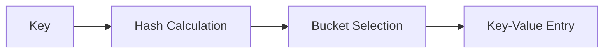
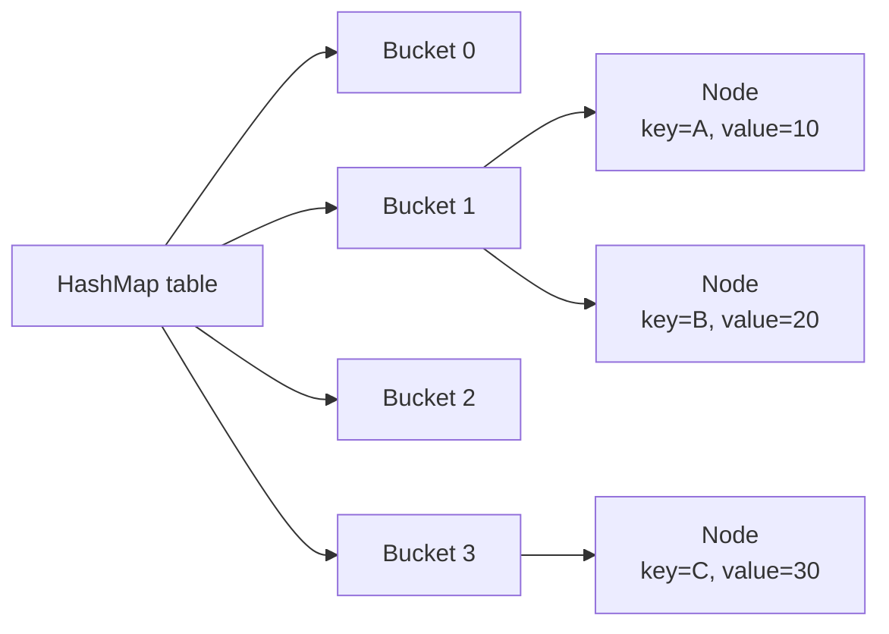
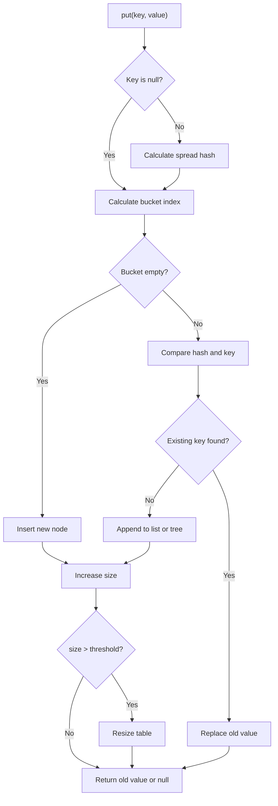
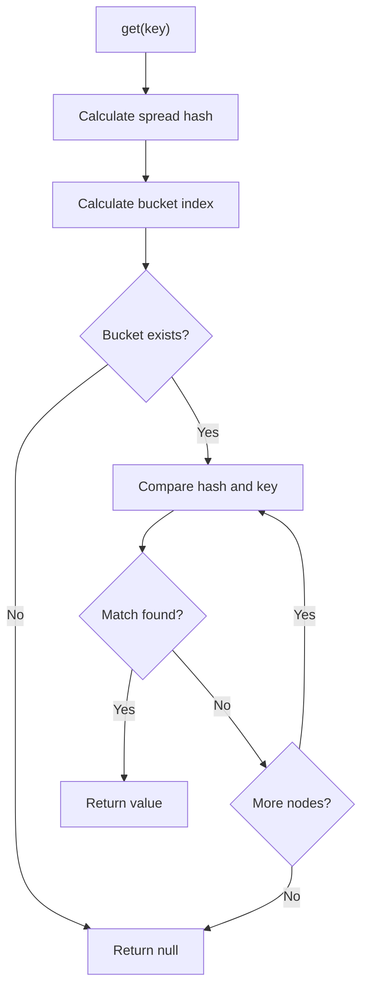
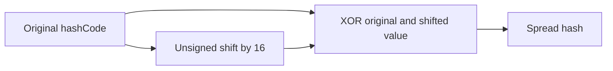
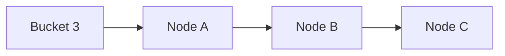
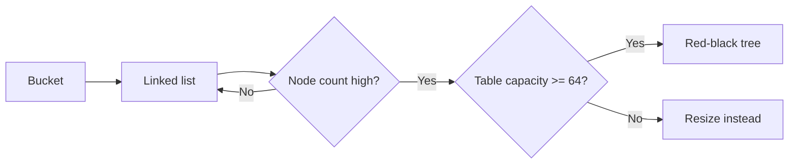
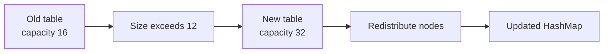
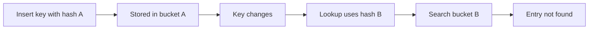
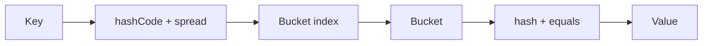

# Java HashMap — In-Depth Internal Working Guide

A complete guide to `HashMap` in Java, including internal data structures, hashing, bucket selection, collision handling, resizing, treeification, null handling, performance, best practices, coding examples, and interview questions.

---

## Table of Contents

1. [What is HashMap?](#1-what-is-hashmap)
2. [Key Characteristics](#2-key-characteristics)
3. [Basic Example](#3-basic-example)
4. [Internal Data Structure](#4-internal-data-structure)
5. [How put Works Internally](#5-how-put-works-internally)
6. [How get Works Internally](#6-how-get-works-internally)
7. [Hash Calculation](#7-hash-calculation)
8. [Bucket Index Calculation](#8-bucket-index-calculation)
9. [Collision Handling](#9-collision-handling)
10. [Linked List to Red-Black Tree](#10-linked-list-to-red-black-tree)
11. [Resizing and Rehashing](#11-resizing-and-rehashing)
12. [Load Factor and Capacity](#12-load-factor-and-capacity)
13. [Null Key and Null Values](#13-null-key-and-null-values)
14. [equals and hashCode Contract](#14-equals-and-hashcode-contract)
15. [Mutable Keys Problem](#15-mutable-keys-problem)
16. [Iteration in HashMap](#16-iteration-in-hashmap)
17. [Fail-Fast Behavior](#17-fail-fast-behavior)
18. [Important HashMap Methods](#18-important-hashmap-methods)
19. [Time Complexity](#19-time-complexity)
20. [HashMap vs Other Maps](#20-hashmap-vs-other-maps)
21. [Thread Safety](#21-thread-safety)
22. [Practical Examples](#22-practical-examples)
23. [Best Practices](#23-best-practices)
24. [Common Interview Questions](#24-common-interview-questions)
25. [Summary](#25-summary)

---

# 1. What is HashMap?

`HashMap` is a key-value data structure from the `java.util` package.

It stores entries in this form:

```text
key -> value
```

Example:

```text
"Java"   -> 95
"Spring" -> 90
"Kafka"  -> 85
```

A key must be unique.

A value may be duplicated.

```java
Map<String, Integer> scores = new HashMap<>();

scores.put("Java", 95);
scores.put("Spring", 90);
scores.put("Kafka", 85);
```

---

# 2. Key Characteristics

`HashMap`:

- Stores key-value pairs.
- Does not preserve insertion order.
- Allows one `null` key.
- Allows multiple `null` values.
- Is not thread-safe.
- Provides average O(1) lookup.
- Uses hashing internally.
- Uses buckets to store entries.
- Handles collisions using linked nodes and trees.



---

# 3. Basic Example

```java
import java.util.HashMap;
import java.util.Map;

public class HashMapBasicExample {

    public static void main(String[] args) {
        Map<String, Integer> employeeAges =
                new HashMap<>();

        employeeAges.put("Amit", 28);
        employeeAges.put("Neha", 26);
        employeeAges.put("Ravi", 30);

        System.out.println(
                employeeAges.get("Neha")
        );

        employeeAges.put("Amit", 29);

        System.out.println(employeeAges);

        System.out.println(
                employeeAges.containsKey("Ravi")
        );

        employeeAges.remove("Neha");

        System.out.println(employeeAges);
    }
}
```

Important behavior:

```java
employeeAges.put("Amit", 28);
employeeAges.put("Amit", 29);
```

The second call replaces the previous value.

---

# 4. Internal Data Structure

Internally, `HashMap` uses an array of buckets.

Conceptually:

```java
Node<K, V>[] table;
```

Each array position is called a bucket.



A simplified internal node looks like:

```java
static class Node<K, V> {

    final int hash;
    final K key;
    V value;
    Node<K, V> next;

    Node(
            int hash,
            K key,
            V value,
            Node<K, V> next
    ) {
        this.hash = hash;
        this.key = key;
        this.value = value;
        this.next = next;
    }
}
```

Each node stores:

- Hash
- Key
- Value
- Reference to next node

---

# 5. How put Works Internally

Consider:

```java
map.put("Java", 95);
```

The high-level steps are:

1. Calculate the key's hash.
2. Find the bucket index.
3. Check whether the bucket is empty.
4. Insert a new node if empty.
5. Otherwise compare keys.
6. Replace value if key already exists.
7. Handle collision if key is different.
8. Resize if threshold is exceeded.



## Simplified pseudocode

```java
V put(K key, V value) {
    int hash = hash(key);
    int index = (table.length - 1) & hash;

    Node<K, V> current = table[index];

    if (current == null) {
        table[index] =
                new Node<>(hash, key, value, null);

        size++;
        return null;
    }

    while (current != null) {
        if (current.hash == hash
                && keysAreEqual(current.key, key)) {

            V oldValue = current.value;
            current.value = value;
            return oldValue;
        }

        current = current.next;
    }

    appendNewNode(index, hash, key, value);
    size++;

    if (size > threshold) {
        resize();
    }

    return null;
}
```

---

# 6. How get Works Internally

Consider:

```java
Integer score = map.get("Java");
```

Steps:

1. Calculate the key's hash.
2. Find the bucket index.
3. Inspect the first node.
4. Compare hash and key.
5. Traverse linked nodes or tree.
6. Return matching value.
7. Return `null` if not found.



## Simplified pseudocode

```java
V get(Object key) {
    int hash = hash(key);
    int index = (table.length - 1) & hash;

    Node<K, V> current = table[index];

    while (current != null) {
        if (current.hash == hash
                && keysAreEqual(current.key, key)) {
            return current.value;
        }

        current = current.next;
    }

    return null;
}
```

---

# 7. Hash Calculation

`HashMap` does not directly use only `key.hashCode()`.

It spreads the high bits into lower bits.

Conceptually:

```java
static int hash(Object key) {
    int hashCode = key.hashCode();
    return hashCode ^ (hashCode >>> 16);
}
```

For a `null` key:

```java
hash = 0;
```

## Why spread the hash?

The bucket index calculation mostly uses lower bits.

If high bits contain useful variation but lower bits are similar, many keys could land in the same bucket.

The spread operation improves distribution.



Example:

```text
hash = hashCode ^ (hashCode >>> 16)
```

---

# 8. Bucket Index Calculation

HashMap capacities are powers of two.

Examples:

```text
16, 32, 64, 128
```

Bucket index is calculated as:

```java
index = (capacity - 1) & hash;
```

For capacity 16:

```text
capacity - 1 = 15
```

Binary:

```text
15 = 0000 1111
```

Only the lower four bits select the bucket.

## Example

Suppose:

```text
hash = 37
capacity = 16
```

Then:

```text
index = (16 - 1) & 37
      = 15 & 37
      = 5
```

The entry goes into bucket 5.

## Why not use modulo?

Instead of:

```java
index = hash % capacity;
```

HashMap uses:

```java
index = (capacity - 1) & hash;
```

Bitwise AND is efficient and works correctly because capacity is a power of two.

---

# 9. Collision Handling

A collision occurs when two different keys map to the same bucket.

Example:

```text
Key A -> bucket 3
Key B -> bucket 3
```



HashMap handles collisions by:

- Comparing hash values
- Comparing keys using `equals()`
- Storing multiple nodes in the same bucket
- Converting a long list into a tree when necessary

## Collision example

```java
import java.util.HashMap;
import java.util.Map;
import java.util.Objects;

final class BadKey {

    private final int id;

    BadKey(int id) {
        this.id = id;
    }

    @Override
    public int hashCode() {
        return 1;
    }

    @Override
    public boolean equals(Object object) {
        if (this == object) {
            return true;
        }

        if (!(object instanceof BadKey key)) {
            return false;
        }

        return id == key.id;
    }

    @Override
    public String toString() {
        return "BadKey{id=" + id + '}';
    }
}

public class CollisionExample {

    public static void main(String[] args) {
        Map<BadKey, String> map =
                new HashMap<>();

        map.put(new BadKey(1), "One");
        map.put(new BadKey(2), "Two");
        map.put(new BadKey(3), "Three");

        System.out.println(map);
    }
}
```

All keys return hash code `1`, so they collide.

They remain distinguishable because `equals()` compares `id`.

---

# 10. Linked List to Red-Black Tree

Before Java 8, collisions were handled only with linked lists.

In Java 8+, heavily populated buckets may become red-black trees.



Common implementation constants:

```text
TREEIFY_THRESHOLD = 8
UNTREEIFY_THRESHOLD = 6
MIN_TREEIFY_CAPACITY = 64
```

## Meaning

- If bucket size reaches 8, treeification may be considered.
- If the main table is smaller than 64, resizing is preferred.
- If tree node count drops below 6, it may return to linked form.

## Why treeify?

Linked-list search:

```text
O(n)
```

Red-black-tree search:

```text
O(log n)
```

This improves worst-case performance.

---

# 11. Resizing and Rehashing

HashMap resizes when:

```text
size > threshold
```

Threshold:

```text
threshold = capacity × load factor
```

Default values:

```text
capacity = 16
load factor = 0.75
threshold = 12
```

After the 13th entry, resizing is triggered.

The capacity typically doubles:

```text
16 -> 32 -> 64 -> 128
```



## Important Java 8 optimization

During resize from capacity `n` to `2n`, an entry either:

- Stays at the same index
- Moves to `oldIndex + oldCapacity`

This depends on one hash bit.

Conceptually:

```text
oldIndex
or
oldIndex + oldCapacity
```

This avoids recomputing everything from scratch.

## Example

If old capacity is 16 and old index is 5:

```text
new index is either 5 or 21
```

because:

```text
5 + 16 = 21
```

---

# 12. Load Factor and Capacity

## Capacity

Capacity is the number of buckets.

It is not the number of stored entries.

## Load factor

Load factor controls how full the map can become before resizing.

Default:

```text
0.75
```

## Why 0.75?

It offers a good balance between:

- Memory usage
- Collision probability
- Lookup performance

## Custom configuration

```java
Map<String, Integer> map =
        new HashMap<>(1000, 0.75f);
```

Use custom capacity when expected size is known.

## Capacity planning

To store 1000 entries without resizing:

```text
required capacity ≈ expectedSize / loadFactor
```

```text
1000 / 0.75 ≈ 1334
```

Since capacity must be a power of two, the map may use 2048.

A practical constructor:

```java
Map<String, Integer> map =
        new HashMap<>(1340);
```

---

# 13. Null Key and Null Values

HashMap allows:

- One `null` key
- Multiple `null` values

```java
import java.util.HashMap;
import java.util.Map;

public class NullExample {

    public static void main(String[] args) {
        Map<String, String> map =
                new HashMap<>();

        map.put(null, "Default");
        map.put("A", null);
        map.put("B", null);

        System.out.println(map);
    }
}
```

The `null` key gets hash value 0 and normally maps to bucket 0.

## Important ambiguity

```java
map.get("missing");
```

returns `null`.

But `null` can mean:

- Key does not exist
- Key exists and maps to `null`

Use:

```java
map.containsKey("missing");
```

to distinguish.

---

# 14. equals and hashCode Contract

HashMap depends heavily on:

- `hashCode()`
- `equals()`

## Contract

If:

```java
a.equals(b) == true
```

then:

```java
a.hashCode() == b.hashCode()
```

The reverse is not required.

Two unequal objects may have the same hash code.

## Correct key class

```java
import java.util.Objects;

public final class EmployeeKey {

    private final String employeeId;

    public EmployeeKey(String employeeId) {
        this.employeeId = employeeId;
    }

    @Override
    public boolean equals(Object object) {
        if (this == object) {
            return true;
        }

        if (!(object instanceof EmployeeKey key)) {
            return false;
        }

        return Objects.equals(
                employeeId,
                key.employeeId
        );
    }

    @Override
    public int hashCode() {
        return Objects.hash(employeeId);
    }
}
```

## Example

```java
import java.util.HashMap;
import java.util.Map;

public class EmployeeKeyExample {

    public static void main(String[] args) {
        Map<EmployeeKey, String> map =
                new HashMap<>();

        map.put(
                new EmployeeKey("EMP-101"),
                "Shailendra"
        );

        System.out.println(
                map.get(
                        new EmployeeKey("EMP-101")
                )
        );
    }
}
```

The lookup works because both objects are logically equal.

---

# 15. Mutable Keys Problem

Never use a mutable object as a HashMap key if fields involved in `equals()` or `hashCode()` can change.

## Problem example

```java
import java.util.HashMap;
import java.util.Map;
import java.util.Objects;

class MutableEmployeeKey {

    private String employeeId;

    MutableEmployeeKey(String employeeId) {
        this.employeeId = employeeId;
    }

    void setEmployeeId(String employeeId) {
        this.employeeId = employeeId;
    }

    @Override
    public boolean equals(Object object) {
        if (this == object) {
            return true;
        }

        if (!(object
                instanceof MutableEmployeeKey key)) {
            return false;
        }

        return Objects.equals(
                employeeId,
                key.employeeId
        );
    }

    @Override
    public int hashCode() {
        return Objects.hash(employeeId);
    }
}

public class MutableKeyProblem {

    public static void main(String[] args) {
        Map<MutableEmployeeKey, String> map =
                new HashMap<>();

        MutableEmployeeKey key =
                new MutableEmployeeKey("EMP-101");

        map.put(key, "Shailendra");

        key.setEmployeeId("EMP-999");

        System.out.println(map.get(key));
        System.out.println(map.containsKey(key));
    }
}
```

The lookup may fail because:

- Original bucket was selected using old hash.
- Current lookup uses new hash.
- The object remains stored in the old bucket.



Use immutable keys.

---

# 16. Iteration in HashMap

Common iteration styles:

## Iterate using entrySet

```java
for (Map.Entry<String, Integer> entry
        : map.entrySet()) {

    System.out.println(
            entry.getKey()
                    + " -> "
                    + entry.getValue()
    );
}
```

This is usually the best approach when both key and value are needed.

## Iterate using keySet

```java
for (String key : map.keySet()) {
    System.out.println(
            key + " -> " + map.get(key)
    );
}
```

This performs an additional lookup for each key.

## Iterate using values

```java
for (Integer value : map.values()) {
    System.out.println(value);
}
```

## forEach

```java
map.forEach(
        (key, value) ->
                System.out.println(
                        key + " -> " + value
                )
);
```

---

# 17. Fail-Fast Behavior

HashMap iterators are fail-fast.

This means structural modification during iteration may throw:

```text
ConcurrentModificationException
```

## Incorrect example

```java
for (String key : map.keySet()) {
    if ("Java".equals(key)) {
        map.remove(key);
    }
}
```

## Correct approach

```java
var iterator =
        map.entrySet().iterator();

while (iterator.hasNext()) {
    var entry = iterator.next();

    if ("Java".equals(entry.getKey())) {
        iterator.remove();
    }
}
```

## Another option

```java
map.entrySet().removeIf(
        entry ->
                "Java".equals(entry.getKey())
);
```

---

# 18. Important HashMap Methods

## put

```java
map.put("Java", 95);
```

## get

```java
Integer score = map.get("Java");
```

## getOrDefault

```java
Integer score =
        map.getOrDefault("Python", 0);
```

## putIfAbsent

```java
map.putIfAbsent("Java", 90);
```

Does not overwrite an existing key.

## computeIfAbsent

```java
map.computeIfAbsent(
        "Java",
        key -> 0
);
```

Useful for grouping:

```java
Map<String, List<String>> groups =
        new HashMap<>();

groups.computeIfAbsent(
        "Backend",
        key -> new ArrayList<>()
).add("Java");
```

## computeIfPresent

```java
map.computeIfPresent(
        "Java",
        (key, value) -> value + 5
);
```

## compute

```java
map.compute(
        "Java",
        (key, value) ->
                value == null ? 1 : value + 1
);
```

## merge

```java
map.merge(
        "Java",
        1,
        Integer::sum
);
```

Excellent for frequency counting.

## replace

```java
map.replace("Java", 100);
```

## replaceAll

```java
map.replaceAll(
        (key, value) -> value + 1
);
```

---

# 19. Time Complexity

## Average case

| Operation | Complexity |
|---|---:|
| `put()` | O(1) |
| `get()` | O(1) |
| `remove()` | O(1) |
| `containsKey()` | O(1) |
| Iteration | O(capacity + size) |

## Worst case

Before treeification:

```text
O(n)
```

With red-black-tree buckets:

```text
O(log n)
```

## Important iteration note

Iteration cost depends on both:

```text
capacity + number of entries
```

An oversized HashMap may have slower iteration due to many empty buckets.

---

# 20. HashMap vs Other Maps

## HashMap vs LinkedHashMap

| Feature | HashMap | LinkedHashMap |
|---|---|---|
| Order | No guarantee | Insertion/access order |
| Lookup | Average O(1) | Average O(1) |
| Memory | Lower | Higher |
| LRU support | No | Yes |

## HashMap vs TreeMap

| Feature | HashMap | TreeMap |
|---|---|---|
| Order | None | Sorted by key |
| Lookup | Average O(1) | O(log n) |
| Null key | One allowed | Usually not allowed |
| Structure | Hash table | Red-black tree |

## HashMap vs Hashtable

| Feature | HashMap | Hashtable |
|---|---|---|
| Thread-safe | No | Yes |
| Null key | Allowed | Not allowed |
| Null values | Allowed | Not allowed |
| Status | Modern | Legacy |

## HashMap vs ConcurrentHashMap

| Feature | HashMap | ConcurrentHashMap |
|---|---|---|
| Thread-safe | No | Yes |
| Null key/value | Allowed | Not allowed |
| Concurrent reads | Unsafe | Supported |
| Atomic methods | Limited | Rich support |

---

# 21. Thread Safety

HashMap is not thread-safe.

Problems may include:

- Lost updates
- Inconsistent reads
- Race conditions
- Structural corruption in incorrect concurrent use

## Unsafe example

```java
Map<String, Integer> counts =
        new HashMap<>();
```

Multiple threads updating this map without synchronization is unsafe.

## Options

### Use ConcurrentHashMap

```java
Map<String, Integer> counts =
        new ConcurrentHashMap<>();
```

### Use synchronizedMap

```java
Map<String, Integer> map =
        Collections.synchronizedMap(
                new HashMap<>()
        );
```

Iteration still needs synchronization:

```java
synchronized (map) {
    for (Map.Entry<String, Integer> entry
            : map.entrySet()) {
        System.out.println(entry);
    }
}
```

Prefer `ConcurrentHashMap` for most concurrent workloads.

---

# 22. Practical Examples

## 22.1 Word frequency

```java
import java.util.HashMap;
import java.util.Map;

public class WordFrequency {

    public static void main(String[] args) {
        String text =
                "java spring java kafka java spring";

        Map<String, Integer> frequency =
                new HashMap<>();

        for (String word : text.split("\\s+")) {
            frequency.merge(
                    word,
                    1,
                    Integer::sum
            );
        }

        System.out.println(frequency);
    }
}
```

---

## 22.2 Group employees by department

```java
import java.util.ArrayList;
import java.util.HashMap;
import java.util.List;
import java.util.Map;

record Employee(
        String name,
        String department
) {
}

public class GroupEmployees {

    public static void main(String[] args) {
        List<Employee> employees =
                List.of(
                        new Employee(
                                "Amit",
                                "Engineering"
                        ),
                        new Employee(
                                "Neha",
                                "HR"
                        ),
                        new Employee(
                                "Ravi",
                                "Engineering"
                        )
                );

        Map<String, List<Employee>> grouped =
                new HashMap<>();

        for (Employee employee : employees) {
            grouped.computeIfAbsent(
                    employee.department(),
                    key -> new ArrayList<>()
            ).add(employee);
        }

        System.out.println(grouped);
    }
}
```

---

## 22.3 Two Sum problem

```java
import java.util.HashMap;
import java.util.Map;
import java.util.Arrays;

public class TwoSum {

    public static int[] findTwoSum(
            int[] numbers,
            int target
    ) {
        Map<Integer, Integer> indexByValue =
                new HashMap<>();

        for (int index = 0;
                index < numbers.length;
                index++) {

            int required =
                    target - numbers[index];

            if (indexByValue.containsKey(required)) {
                return new int[]{
                        indexByValue.get(required),
                        index
                };
            }

            indexByValue.put(
                    numbers[index],
                    index
            );
        }

        return new int[]{-1, -1};
    }

    public static void main(String[] args) {
        int[] result =
                findTwoSum(
                        new int[]{2, 7, 11, 15},
                        9
                );

        System.out.println(
                Arrays.toString(result)
        );
    }
}
```

Time complexity:

```text
O(n)
```

Space complexity:

```text
O(n)
```

---

## 22.4 First non-repeated character

```java
import java.util.HashMap;
import java.util.Map;

public class FirstNonRepeatedCharacter {

    public static Character findFirstUnique(
            String value
    ) {
        Map<Character, Integer> frequency =
                new HashMap<>();

        for (char character
                : value.toCharArray()) {

            frequency.merge(
                    character,
                    1,
                    Integer::sum
            );
        }

        for (char character
                : value.toCharArray()) {

            if (frequency.get(character) == 1) {
                return character;
            }
        }

        return null;
    }

    public static void main(String[] args) {
        System.out.println(
                findFirstUnique("swiss")
        );
    }
}
```

---

## 22.5 Cache example

```java
import java.util.HashMap;
import java.util.Map;

public class UserCache {

    private final Map<Long, String> cache =
            new HashMap<>();

    public String getUserName(long userId) {
        return cache.computeIfAbsent(
                userId,
                this::loadUserFromDatabase
        );
    }

    private String loadUserFromDatabase(
            long userId
    ) {
        System.out.println(
                "Loading user from database: "
                        + userId
        );

        return "User-" + userId;
    }

    public static void main(String[] args) {
        UserCache cache = new UserCache();

        System.out.println(
                cache.getUserName(101)
        );

        System.out.println(
                cache.getUserName(101)
        );
    }
}
```

The database method runs only once for the same key.

---

# 23. Best Practices

## 1. Use immutable keys

Good choices:

- `String`
- `Integer`
- UUID
- Immutable record
- Immutable domain identifier

## 2. Override equals and hashCode together

Never override only one.

## 3. Pre-size when expected size is known

```java
Map<String, Integer> map =
        new HashMap<>(1000);
```

## 4. Avoid excessive capacity

Oversized maps waste memory and slow iteration.

## 5. Prefer entrySet when key and value are required

```java
for (Map.Entry<K, V> entry
        : map.entrySet()) {
}
```

## 6. Use merge for counters

```java
frequency.merge(
        word,
        1,
        Integer::sum
);
```

## 7. Use computeIfAbsent for grouping

```java
map.computeIfAbsent(
        key,
        ignored -> new ArrayList<>()
).add(value);
```

## 8. Do not use HashMap for concurrent modification

Use `ConcurrentHashMap`.

## 9. Avoid depending on iteration order

HashMap does not guarantee order.

## 10. Avoid poor hashCode implementations

Bad:

```java
@Override
public int hashCode() {
    return 1;
}
```

This creates many collisions.

---

# 24. Common Interview Questions

## 1. How does HashMap work internally?

HashMap calculates a spread hash from the key, determines a bucket index, and stores the entry in that bucket. Collisions are handled using linked nodes or red-black trees.

---

## 2. What is the default capacity?

The commonly used default initial capacity is 16.

---

## 3. What is the default load factor?

The default load factor is 0.75.

---

## 4. When does HashMap resize?

When:

```text
size > capacity × load factor
```

---

## 5. Why must capacity be a power of two?

It allows efficient bucket calculation using:

```java
(capacity - 1) & hash
```

It also supports efficient redistribution during resize.

---

## 6. How are collisions handled?

Collisions are handled using a linked structure. In Java 8+, a sufficiently large bucket may become a red-black tree.

---

## 7. What is treeification?

Treeification is converting a bucket's linked nodes into a red-black tree to improve worst-case search from O(n) to O(log n).

---

## 8. What are the common treeification thresholds?

Common implementation values are:

```text
TREEIFY_THRESHOLD = 8
UNTREEIFY_THRESHOLD = 6
MIN_TREEIFY_CAPACITY = 64
```

---

## 9. Can HashMap contain null?

Yes.

- One `null` key
- Multiple `null` values

---

## 10. Why is only one null key allowed?

Keys must be unique. A second `null` key replaces the first null-key entry's value.

---

## 11. What happens if two keys have the same hash code?

They may be stored in the same bucket. `equals()` distinguishes them.

---

## 12. Can different objects have the same hash code?

Yes. This is called a collision.

---

## 13. Can equal objects have different hash codes?

They should not. That violates the `hashCode()` contract and can break hash-based collection behavior.

---

## 14. Why are mutable keys dangerous?

Changing a key may change its hash code, causing future lookups to search a different bucket.

---

## 15. What is the time complexity of get and put?

Average:

```text
O(1)
```

Worst case with tree bins:

```text
O(log n)
```

---

## 16. Is HashMap synchronized?

No.

---

## 17. How can HashMap be made thread-safe?

Use:

```java
Collections.synchronizedMap(...)
```

or preferably:

```java
ConcurrentHashMap
```

---

## 18. Does HashMap preserve insertion order?

No.

Use `LinkedHashMap` when order matters.

---

## 19. How does HashMap handle a null key?

A null key receives hash 0 and is generally stored in bucket 0.

---

## 20. What does put return?

`put()` returns:

- Previous value for an existing key
- `null` for a new key or if previous value was null

---

## 21. What is the difference between get and getOrDefault?

`get()` returns null when absent.

`getOrDefault()` returns a provided fallback value.

---

## 22. What is the difference between put and putIfAbsent?

`put()` always inserts or replaces.

`putIfAbsent()` inserts only when the key is absent or mapped to null.

---

## 23. What is computeIfAbsent used for?

It calculates and inserts a value only when the key does not already have a value.

Common uses:

- Caching
- Grouping
- Lazy initialization

---

## 24. Why is entrySet iteration preferred?

It avoids an extra lookup when both key and value are needed.

---

## 25. What is structural modification?

A change that alters the number of entries or internal structure, such as adding or removing mappings.

Replacing an existing value is generally not considered structural.

---

## 26. Why does ConcurrentModificationException occur?

HashMap's iterator detects that the map was structurally modified outside the iterator.

---

## 27. Is fail-fast behavior guaranteed?

No. It is best effort.

---

## 28. What happens during resizing?

A larger table is created and entries are redistributed. In Java 8, each entry either remains at its old index or moves by the old capacity.

---

## 29. Why is load factor 0.75 a good default?

It balances memory usage and collision probability.

---

## 30. What happens if load factor is too high?

- More collisions
- Longer bucket chains
- Slower lookup

---

## 31. What happens if load factor is too low?

- More memory consumption
- More empty buckets
- Potentially slower iteration

---

## 32. Can HashMap store duplicate values?

Yes.

---

## 33. Can HashMap store duplicate keys?

No. A duplicate key replaces the old value.

---

## 34. Does HashMap call equals before hashCode?

No. Hashing is used first to locate a bucket. Then equality is used for candidate keys.

---

## 35. Why is String a good HashMap key?

`String` is immutable and correctly implements `equals()` and `hashCode()`.

---

# 25. Summary

HashMap is one of Java's most important data structures.

Core internal flow:



## Key points to remember

- HashMap stores entries in a bucket array.
- Bucket index is computed using bitwise AND.
- Collisions are resolved using linked nodes or trees.
- Default capacity is 16.
- Default load factor is 0.75.
- Resize happens after threshold is exceeded.
- One null key is allowed.
- Multiple null values are allowed.
- Keys should be immutable.
- `equals()` and `hashCode()` must be consistent.
- HashMap is not thread-safe.
- Average get and put are O(1).
- Tree bins improve worst-case behavior to O(log n).
- Iteration order is not guaranteed.

---

## Recommended Practice Problems

1. Implement a simplified HashMap.
2. Solve Two Sum using HashMap.
3. Count word frequency.
4. Group objects by category.
5. Find duplicate values.
6. Build a simple cache.
7. Demonstrate collision handling.
8. Demonstrate mutable-key failure.
9. Compare HashMap and TreeMap performance.
10. Build a thread-safe counter using ConcurrentHashMap.
