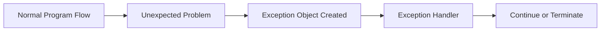
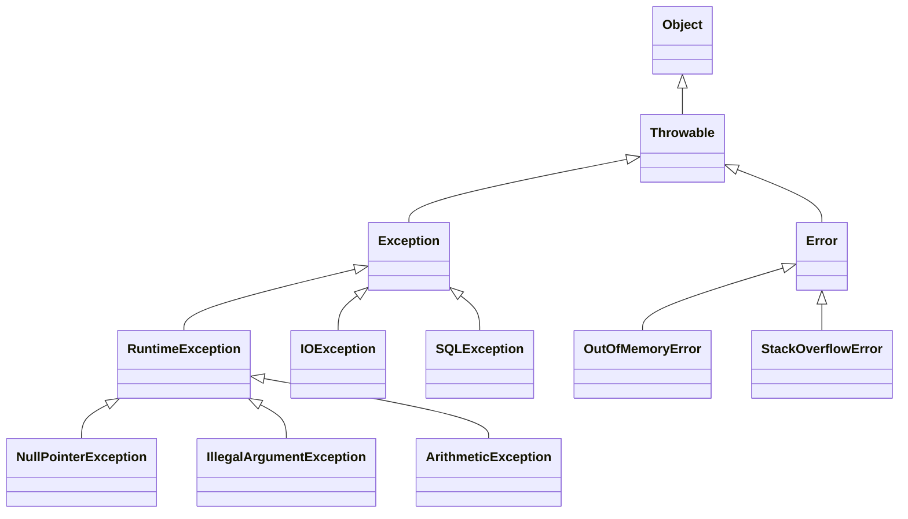
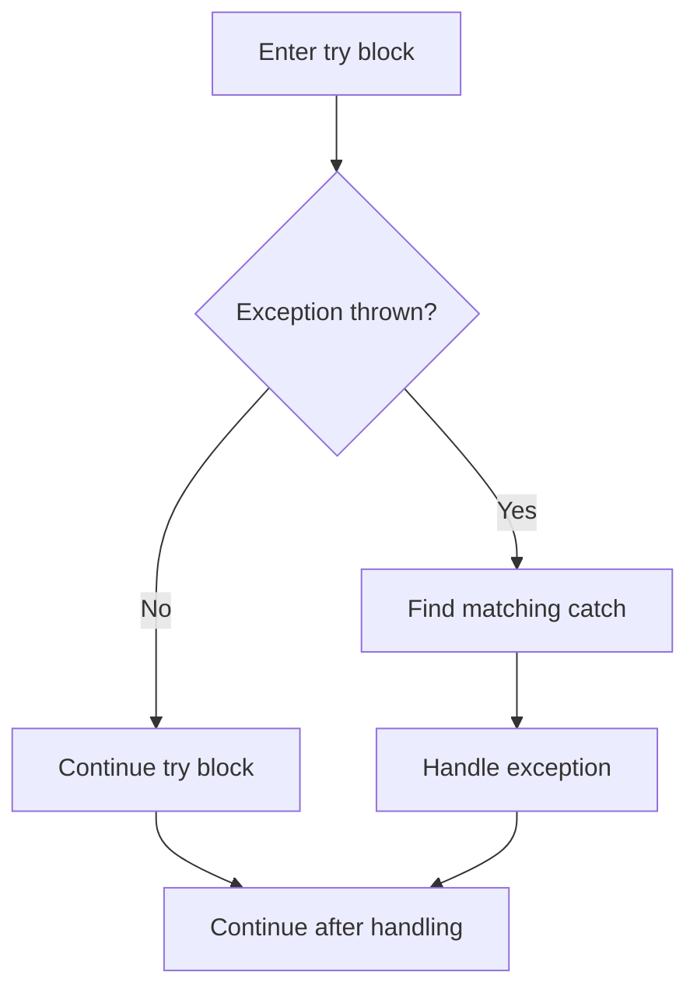
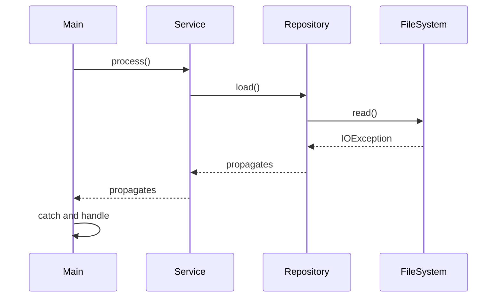
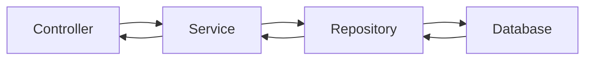

# Java Exception Handling — In-Depth Guide

A complete guide to exception handling in Java with hierarchy diagrams, checked and unchecked exceptions, `try-catch-finally`, `throw`, `throws`, custom exceptions, exception propagation, try-with-resources, best practices, practical code examples, and interview questions.

---

## Table of Contents

1. [What is an Exception?](#1-what-is-an-exception)
2. [Why Exception Handling is Needed](#2-why-exception-handling-is-needed)
3. [Java Exception Hierarchy](#3-java-exception-hierarchy)
4. [Error vs Exception](#4-error-vs-exception)
5. [Checked vs Unchecked Exceptions](#5-checked-vs-unchecked-exceptions)
6. [try-catch Block](#6-try-catch-block)
7. [Multiple catch Blocks](#7-multiple-catch-blocks)
8. [Multi-Catch](#8-multi-catch)
9. [finally Block](#9-finally-block)
10. [throw Keyword](#10-throw-keyword)
11. [throws Keyword](#11-throws-keyword)
12. [throw vs throws](#12-throw-vs-throws)
13. [Exception Propagation](#13-exception-propagation)
14. [Custom Exceptions](#14-custom-exceptions)
15. [Try-With-Resources](#15-try-with-resources)
16. [AutoCloseable and Closeable](#16-autocloseable-and-closeable)
17. [Suppressed Exceptions](#17-suppressed-exceptions)
18. [Exception Chaining](#18-exception-chaining)
19. [Rethrowing Exceptions](#19-rethrowing-exceptions)
20. [Overriding Rules for Exceptions](#20-overriding-rules-for-exceptions)
21. [Common Runtime Exceptions](#21-common-runtime-exceptions)
22. [Common Checked Exceptions](#22-common-checked-exceptions)
23. [Exception Handling in Streams and Lambdas](#23-exception-handling-in-streams-and-lambdas)
24. [Exception Handling in Spring Applications](#24-exception-handling-in-spring-applications)
25. [Practical Examples](#25-practical-examples)
26. [Anti-Patterns](#26-anti-patterns)
27. [Best Practices](#27-best-practices)
28. [Interview Questions and Answers](#28-interview-questions-and-answers)
29. [Summary](#29-summary)

---

# 1. What is an Exception?

An exception is an event that disrupts the normal flow of a program.

Examples:

- Dividing by zero
- Accessing an invalid array index
- Reading a missing file
- Connecting to an unavailable database
- Parsing invalid input
- Calling a method on `null`



## Example

```java
public class BasicExceptionExample {

    public static void main(String[] args) {
        int result = 10 / 0;

        System.out.println(result);
    }
}
```

This throws:

```text
ArithmeticException
```

---

# 2. Why Exception Handling is Needed

Exception handling helps us:

- Prevent abrupt application termination
- Separate error-handling logic from business logic
- Provide meaningful error messages
- Recover from failures
- Release resources safely
- Propagate errors to higher layers
- Maintain application stability

## Without exception handling

```java
public class WithoutHandling {

    public static void main(String[] args) {
        int value = Integer.parseInt("abc");

        System.out.println(value);
    }
}
```

The program terminates.

## With exception handling

```java
public class WithHandling {

    public static void main(String[] args) {
        try {
            int value = Integer.parseInt("abc");
            System.out.println(value);
        } catch (NumberFormatException exception) {
            System.out.println(
                    "Invalid number format"
            );
        }

        System.out.println(
                "Program continues"
        );
    }
}
```

---

# 3. Java Exception Hierarchy

All exceptions and errors inherit from `Throwable`.



## Throwable

`Throwable` is the root class.

Important methods:

```java
String getMessage();
String getLocalizedMessage();
Throwable getCause();
void printStackTrace();
StackTraceElement[] getStackTrace();
Throwable[] getSuppressed();
```

---

# 4. Error vs Exception

## Error

An `Error` usually represents a serious JVM or system-level problem.

Examples:

- `OutOfMemoryError`
- `StackOverflowError`
- `NoClassDefFoundError`

Applications usually should not try to recover from most errors.

## Exception

An `Exception` represents a condition that application code may handle.

Examples:

- `IOException`
- `SQLException`
- `IllegalArgumentException`
- `NullPointerException`

## Comparison

| Feature | Error | Exception |
|---|---|---|
| Meaning | Serious JVM/system issue | Application-level issue |
| Recovery | Usually not possible | Often possible |
| Handling | Usually avoided | Commonly handled |
| Examples | OOM, StackOverflow | IO, SQL, validation |

---

# 5. Checked vs Unchecked Exceptions

## Checked exceptions

Checked exceptions are verified by the compiler.

They must be:

- Caught
- Or declared using `throws`

Examples:

- `IOException`
- `SQLException`
- `ClassNotFoundException`
- `InterruptedException`

```java
import java.io.IOException;

public class CheckedExceptionExample {

    public void readData() throws IOException {
        throw new IOException(
                "Unable to read data"
        );
    }
}
```

## Unchecked exceptions

Unchecked exceptions extend `RuntimeException`.

The compiler does not force handling.

Examples:

- `NullPointerException`
- `IllegalArgumentException`
- `ArithmeticException`
- `IndexOutOfBoundsException`

```java
public class UncheckedExceptionExample {

    public void validateAge(int age) {
        if (age < 0) {
            throw new IllegalArgumentException(
                    "Age cannot be negative"
            );
        }
    }
}
```

## Comparison

| Feature | Checked | Unchecked |
|---|---|---|
| Compiler checks | Yes | No |
| Must catch or declare | Yes | No |
| Extends | `Exception` | `RuntimeException` |
| Typical use | Recoverable external problem | Programming or validation error |
| Example | `IOException` | `IllegalArgumentException` |

---

# 6. try-catch Block

The `try` block contains code that may throw an exception.

The `catch` block handles the exception.

```java
try {
    // Risky code
} catch (ExceptionType exception) {
    // Handling code
}
```

## Example

```java
public class TryCatchExample {

    public static void main(String[] args) {
        try {
            int result = 100 / 0;

            System.out.println(result);
        } catch (ArithmeticException exception) {
            System.out.println(
                    "Division by zero is not allowed"
            );
        }
    }
}
```

## Flow



---

# 7. Multiple catch Blocks

A `try` block can have multiple `catch` blocks.

```java
public class MultipleCatchExample {

    public static void main(String[] args) {
        try {
            String value = args[0];

            int number =
                    Integer.parseInt(value);

            System.out.println(
                    100 / number
            );
        } catch (ArrayIndexOutOfBoundsException exception) {
            System.out.println(
                    "Input argument is missing"
            );
        } catch (NumberFormatException exception) {
            System.out.println(
                    "Input must be a number"
            );
        } catch (ArithmeticException exception) {
            System.out.println(
                    "Number cannot be zero"
            );
        }
    }
}
```

## Catch ordering rule

Specific exceptions must appear before general exceptions.

Correct:

```java
try {
    // Code
} catch (NumberFormatException exception) {
    // Specific
} catch (RuntimeException exception) {
    // General
}
```

Incorrect:

```java
try {
    // Code
} catch (RuntimeException exception) {
    // General
} catch (NumberFormatException exception) {
    // Unreachable
}
```

---

# 8. Multi-Catch

Java allows multiple exception types in one catch block.

```java
try {
    // Risky code
} catch (
        IOException
        | SQLException exception
) {
    // Common handling
}
```

## Example

```java
import java.io.IOException;
import java.sql.SQLException;

public class MultiCatchExample {

    public static void process(
            boolean ioFailure
    ) {
        try {
            if (ioFailure) {
                throw new IOException(
                        "File failure"
                );
            }

            throw new SQLException(
                    "Database failure"
            );
        } catch (
                IOException
                | SQLException exception
        ) {
            System.out.println(
                    "Operation failed: "
                            + exception.getMessage()
            );
        }
    }

    public static void main(String[] args) {
        process(true);
        process(false);
    }
}
```

Exception variable in multi-catch is implicitly final.

---

# 9. finally Block

The `finally` block generally executes whether an exception occurs or not.

It is used for cleanup.

```java
try {
    // Risky code
} catch (Exception exception) {
    // Handle
} finally {
    // Cleanup
}
```

## Example

```java
public class FinallyExample {

    public static void main(String[] args) {
        try {
            System.out.println(
                    "Inside try"
            );

            int result = 10 / 0;

            System.out.println(result);
        } catch (ArithmeticException exception) {
            System.out.println(
                    "Inside catch"
            );
        } finally {
            System.out.println(
                    "Inside finally"
            );
        }
    }
}
```

## When finally may not execute

Rare cases:

- `System.exit(...)`
- JVM crash
- Process killed externally
- Infinite loop before finally
- Hardware failure

## Dangerous return in finally

```java
public static int test() {
    try {
        return 1;
    } finally {
        return 2;
    }
}
```

Result:

```text
2
```

Never return from `finally`.

It can suppress:

- Return values
- Exceptions
- Control flow

---

# 10. throw Keyword

`throw` explicitly throws an exception object.

```java
throw new IllegalArgumentException(
        "Invalid value"
);
```

## Example

```java
public class ThrowExample {

    public static void validateAge(int age) {
        if (age < 18) {
            throw new IllegalArgumentException(
                    "Age must be at least 18"
            );
        }
    }

    public static void main(String[] args) {
        validateAge(16);
    }
}
```

Only one exception object can be thrown at a time.

---

# 11. throws Keyword

`throws` declares exceptions that a method may propagate.

```java
public void readFile()
        throws IOException {
}
```

## Example

```java
import java.io.IOException;
import java.nio.file.Files;
import java.nio.file.Path;

public class ThrowsExample {

    public static String readFile(
            Path path
    ) throws IOException {

        return Files.readString(path);
    }

    public static void main(String[] args) {
        try {
            String content =
                    readFile(
                            Path.of("data.txt")
                    );

            System.out.println(content);
        } catch (IOException exception) {
            System.out.println(
                    "Unable to read file"
            );
        }
    }
}
```

---

# 12. throw vs throws

| Feature | `throw` | `throws` |
|---|---|---|
| Purpose | Throws exception object | Declares possible exceptions |
| Location | Method body | Method signature |
| Count | One object at a time | Multiple types |
| Followed by | Exception instance | Exception classes |

Example:

```java
public void process()
        throws IOException {

    throw new IOException(
            "Processing failed"
    );
}
```

---

# 13. Exception Propagation

If a method does not handle an exception, it propagates to the caller.



## Example

```java
import java.io.IOException;

public class PropagationExample {

    public static void levelThree()
            throws IOException {

        throw new IOException(
                "Failure at level three"
        );
    }

    public static void levelTwo()
            throws IOException {

        levelThree();
    }

    public static void levelOne()
            throws IOException {

        levelTwo();
    }

    public static void main(String[] args) {
        try {
            levelOne();
        } catch (IOException exception) {
            System.out.println(
                    exception.getMessage()
            );
        }
    }
}
```

---

# 14. Custom Exceptions

Custom exceptions represent domain-specific failures.

Examples:

- `InsufficientBalanceException`
- `OrderNotFoundException`
- `PaymentFailedException`
- `InvalidProductException`

## Custom unchecked exception

```java
public class InsufficientBalanceException
        extends RuntimeException {

    public InsufficientBalanceException(
            String message
    ) {
        super(message);
    }
}
```

## Usage

```java
public class BankAccount {

    private double balance;

    public BankAccount(double balance) {
        this.balance = balance;
    }

    public void withdraw(double amount) {
        if (amount > balance) {
            throw new InsufficientBalanceException(
                    "Requested amount exceeds balance"
            );
        }

        balance -= amount;
    }
}
```

## Custom checked exception

```java
public class PaymentGatewayException
        extends Exception {

    public PaymentGatewayException(
            String message
    ) {
        super(message);
    }

    public PaymentGatewayException(
            String message,
            Throwable cause
    ) {
        super(message, cause);
    }
}
```

## When to use custom exceptions

Use them when:

- Domain meaning matters
- Caller needs specific handling
- Technical exceptions must be translated
- API error mapping is needed
- Business rules must be explicit

---

# 15. Try-With-Resources

Try-with-resources automatically closes resources.

A resource must implement:

- `AutoCloseable`
- Or `Closeable`

## Traditional approach

```java
BufferedReader reader = null;

try {
    reader = Files.newBufferedReader(path);
} finally {
    if (reader != null) {
        reader.close();
    }
}
```

## Modern approach

```java
import java.io.BufferedReader;
import java.io.IOException;
import java.nio.file.Files;
import java.nio.file.Path;

public class TryWithResourcesExample {

    public static void main(String[] args) {
        Path path = Path.of("data.txt");

        try (
            BufferedReader reader =
                    Files.newBufferedReader(path)
        ) {
            System.out.println(
                    reader.readLine()
            );
        } catch (IOException exception) {
            System.out.println(
                    "Unable to read file"
            );
        }
    }
}
```

Resources close in reverse declaration order.

```java
try (
    ResourceOne first = new ResourceOne();
    ResourceTwo second = new ResourceTwo()
) {
    // Use resources
}
```

Close order:

```text
second
first
```

---

# 16. AutoCloseable and Closeable

## AutoCloseable

```java
public interface AutoCloseable {
    void close() throws Exception;
}
```

## Closeable

```java
public interface Closeable
        extends AutoCloseable {

    void close() throws IOException;
}
```

`Closeable` is more specific to I/O resources.

## Custom AutoCloseable example

```java
public class DatabaseSession
        implements AutoCloseable {

    public DatabaseSession() {
        System.out.println(
                "Session opened"
        );
    }

    public void execute() {
        System.out.println(
                "Executing query"
        );
    }

    @Override
    public void close() {
        System.out.println(
                "Session closed"
        );
    }
}
```

```java
public class CustomResourceExample {

    public static void main(String[] args) {
        try (
            DatabaseSession session =
                    new DatabaseSession()
        ) {
            session.execute();
        }
    }
}
```

---

# 17. Suppressed Exceptions

If both:

- Try block throws an exception
- Resource close throws another exception

the close exception becomes suppressed.

## Example

```java
public class FailingResource
        implements AutoCloseable {

    public void process() {
        throw new IllegalStateException(
                "Processing failed"
        );
    }

    @Override
    public void close() {
        throw new IllegalStateException(
                "Closing failed"
        );
    }
}
```

```java
public class SuppressedExceptionExample {

    public static void main(String[] args) {
        try (
            FailingResource resource =
                    new FailingResource()
        ) {
            resource.process();
        } catch (Exception exception) {
            System.out.println(
                    "Primary: "
                            + exception.getMessage()
            );

            for (Throwable suppressed
                    : exception.getSuppressed()) {

                System.out.println(
                        "Suppressed: "
                                + suppressed.getMessage()
                );
            }
        }
    }
}
```

---

# 18. Exception Chaining

Exception chaining preserves the original cause.

## Bad approach

```java
catch (SQLException exception) {
    throw new RuntimeException(
            "Database operation failed"
    );
}
```

The original cause is lost.

## Correct approach

```java
catch (SQLException exception) {
    throw new RuntimeException(
            "Database operation failed",
            exception
    );
}
```

## Domain translation example

```java
public class OrderRepositoryException
        extends RuntimeException {

    public OrderRepositoryException(
            String message,
            Throwable cause
    ) {
        super(message, cause);
    }
}
```

```java
public class OrderRepository {

    public void save() {
        try {
            simulateDatabaseCall();
        } catch (Exception exception) {
            throw new OrderRepositoryException(
                    "Unable to save order",
                    exception
            );
        }
    }

    private void simulateDatabaseCall()
            throws Exception {

        throw new Exception(
                "Connection timeout"
        );
    }
}
```

---

# 19. Rethrowing Exceptions

A catch block may rethrow an exception.

```java
try {
    process();
} catch (IOException exception) {
    log(exception);
    throw exception;
}
```

## Example

```java
import java.io.IOException;

public class RethrowExample {

    public static void process()
            throws IOException {

        try {
            throw new IOException(
                    "File error"
            );
        } catch (IOException exception) {
            System.out.println(
                    "Logging: "
                            + exception.getMessage()
            );

            throw exception;
        }
    }
}
```

Rethrow only when the current layer cannot fully handle the problem.

---

# 20. Overriding Rules for Exceptions

When overriding a method:

- Unchecked exceptions may be added freely.
- Checked exceptions must be same type or narrower.
- Broader checked exceptions are not allowed.
- A method may remove declared exceptions.

## Parent class

```java
import java.io.IOException;

public class Parent {

    public void process()
            throws IOException {
    }
}
```

## Valid child

```java
import java.io.FileNotFoundException;

public class Child extends Parent {

    @Override
    public void process()
            throws FileNotFoundException {
    }
}
```

## Invalid child

```java
// Invalid
public class InvalidChild extends Parent {

    @Override
    public void process()
            throws Exception {
    }
}
```

`Exception` is broader than `IOException`.

---

# 21. Common Runtime Exceptions

## NullPointerException

```java
String value = null;
value.length();
```

## ArithmeticException

```java
int result = 10 / 0;
```

## ArrayIndexOutOfBoundsException

```java
int[] values = {1, 2};
System.out.println(values[5]);
```

## NumberFormatException

```java
Integer.parseInt("abc");
```

## ClassCastException

```java
Object value = "Java";
Integer number = (Integer) value;
```

## IllegalArgumentException

```java
throw new IllegalArgumentException(
        "Invalid input"
);
```

## IllegalStateException

```java
throw new IllegalStateException(
        "Operation not allowed now"
);
```

## ConcurrentModificationException

Occurs when structurally modifying many collections during iteration.

---

# 22. Common Checked Exceptions

## IOException

File or stream failure.

## SQLException

Database-related failure.

## ClassNotFoundException

Requested class cannot be found.

## InterruptedException

Thread was interrupted while waiting or sleeping.

## ParseException

Parsing failure in older date/text APIs.

## ReflectiveOperationException

Reflection-related failures.

---

# 23. Exception Handling in Streams and Lambdas

Java functional interfaces usually do not allow checked exceptions.

## Problem

```java
paths.stream()
        .map(Files::readString);
```

This fails because `readString()` throws `IOException`.

## Wrap checked exception

```java
import java.io.IOException;
import java.io.UncheckedIOException;
import java.nio.file.Files;
import java.nio.file.Path;
import java.util.List;

public class StreamExceptionExample {

    public static void main(String[] args) {
        List<Path> paths =
                List.of(
                        Path.of("a.txt"),
                        Path.of("b.txt")
                );

        List<String> contents =
                paths.stream()
                        .map(path -> {
                            try {
                                return Files.readString(path);
                            } catch (IOException exception) {
                                throw new UncheckedIOException(
                                        exception
                                );
                            }
                        })
                        .toList();

        System.out.println(contents);
    }
}
```

## Helper wrapper

```java
@FunctionalInterface
public interface CheckedFunction<T, R> {

    R apply(T value) throws Exception;
}
```

```java
import java.util.function.Function;

public final class LambdaUtils {

    private LambdaUtils() {
    }

    public static <T, R>
    Function<T, R> unchecked(
            CheckedFunction<T, R> function
    ) {
        return value -> {
            try {
                return function.apply(value);
            } catch (Exception exception) {
                throw new RuntimeException(
                        exception
                );
            }
        };
    }
}
```

---

# 24. Exception Handling in Spring Applications

A common layered flow:



Recommended strategy:

- Repository translates persistence failures
- Service throws business exceptions
- Controller advice maps exceptions to HTTP responses

## Business exception

```java
public class OrderNotFoundException
        extends RuntimeException {

    public OrderNotFoundException(
            String orderId
    ) {
        super(
                "Order not found: " + orderId
        );
    }
}
```

## Global exception handler

```java
@RestControllerAdvice
public class GlobalExceptionHandler {

    @ExceptionHandler(
            OrderNotFoundException.class
    )
    public ResponseEntity<ErrorResponse>
    handleOrderNotFound(
            OrderNotFoundException exception
    ) {
        ErrorResponse response =
                new ErrorResponse(
                        "ORDER_NOT_FOUND",
                        exception.getMessage()
                );

        return ResponseEntity
                .status(HttpStatus.NOT_FOUND)
                .body(response);
    }
}
```

## Error response

```java
public record ErrorResponse(
        String code,
        String message
) {
}
```

---

# 25. Practical Examples

## 25.1 Input validation

```java
public class UserValidator {

    public void validateEmail(
            String email
    ) {
        if (email == null
                || !email.contains("@")) {

            throw new IllegalArgumentException(
                    "Valid email is required"
            );
        }
    }
}
```

---

## 25.2 Bank withdrawal

```java
public class InsufficientFundsException
        extends RuntimeException {

    public InsufficientFundsException(
            String message
    ) {
        super(message);
    }
}
```

```java
public class Account {

    private double balance;

    public Account(double balance) {
        this.balance = balance;
    }

    public void withdraw(double amount) {
        if (amount <= 0) {
            throw new IllegalArgumentException(
                    "Amount must be positive"
            );
        }

        if (amount > balance) {
            throw new InsufficientFundsException(
                    "Insufficient funds"
            );
        }

        balance -= amount;
    }
}
```

---

## 25.3 File processing

```java
import java.io.IOException;
import java.io.UncheckedIOException;
import java.nio.file.Files;
import java.nio.file.Path;

public class FileService {

    public String loadFile(
            Path path
    ) {
        try {
            return Files.readString(path);
        } catch (IOException exception) {
            throw new UncheckedIOException(
                    "Unable to load file: "
                            + path,
                    exception
            );
        }
    }
}
```

---

## 25.4 Exception translation

```java
public class PaymentException
        extends RuntimeException {

    public PaymentException(
            String message,
            Throwable cause
    ) {
        super(message, cause);
    }
}
```

```java
public class PaymentService {

    public void processPayment() {
        try {
            callGateway();
        } catch (Exception exception) {
            throw new PaymentException(
                    "Payment processing failed",
                    exception
            );
        }
    }

    private void callGateway()
            throws Exception {

        throw new Exception(
                "Gateway timeout"
        );
    }
}
```

---

## 25.5 Retry example

```java
public class RetryService {

    public void executeWithRetry(
            Runnable operation,
            int maxAttempts
    ) {
        RuntimeException lastException =
                null;

        for (int attempt = 1;
                attempt <= maxAttempts;
                attempt++) {

            try {
                operation.run();
                return;
            } catch (RuntimeException exception) {
                lastException = exception;

                System.out.println(
                        "Attempt "
                                + attempt
                                + " failed"
                );
            }
        }

        throw new IllegalStateException(
                "Operation failed after "
                        + maxAttempts
                        + " attempts",
                lastException
        );
    }
}
```

Use retries only for transient failures.

---

# 26. Anti-Patterns

## 1. Swallowing exceptions

Bad:

```java
try {
    process();
} catch (Exception exception) {
}
```

This hides failures.

## 2. Catching Exception everywhere

Bad:

```java
catch (Exception exception) {
}
```

Catch the most specific exception possible.

## 3. Logging and rethrowing at every layer

This creates duplicate logs.

Log once at the correct boundary.

## 4. Using exceptions for normal control flow

Bad:

```java
try {
    return list.get(index);
} catch (IndexOutOfBoundsException exception) {
    return null;
}
```

Better:

```java
if (index >= 0 && index < list.size()) {
    return list.get(index);
}
```

## 5. Returning from finally

This can hide exceptions.

## 6. Throwing generic RuntimeException

Prefer meaningful domain exceptions.

## 7. Losing the original cause

Always preserve cause when translating.

## 8. Exposing internal exceptions directly

Avoid leaking database or framework details to API users.

---

# 27. Best Practices

## 1. Catch specific exceptions

```java
catch (IOException exception) {
}
```

instead of:

```java
catch (Exception exception) {
}
```

## 2. Preserve the original cause

```java
throw new ServiceException(
        "Operation failed",
        exception
);
```

## 3. Use meaningful messages

Bad:

```java
throw new RuntimeException(
        "Error"
);
```

Better:

```java
throw new OrderNotFoundException(
        "Order not found: ORDER-101"
);
```

## 4. Use try-with-resources

Prefer automatic resource management.

## 5. Do not expose sensitive information

Avoid returning:

- Stack traces
- SQL queries
- Internal hostnames
- Credentials
- File paths

## 6. Use unchecked exceptions for programming and business-rule violations

Examples:

- Invalid state
- Invalid argument
- Missing domain entity

## 7. Use checked exceptions when callers can reasonably recover

Examples:

- File unavailable
- External connection failure
- User-selected resource missing

## 8. Validate early

Fail fast near the source of invalid input.

## 9. Avoid oversized try blocks

Keep only risky statements inside `try`.

## 10. Document exceptions

```java
/**
 * @throws IllegalArgumentException
 *         if amount is not positive
 */
```

## 11. Do not catch Error unless there is a very specific reason

Most errors indicate unrecoverable conditions.

## 12. Restore interrupt status

```java
catch (InterruptedException exception) {
    Thread.currentThread().interrupt();
}
```

---

# 28. Interview Questions and Answers

## 1. What is an exception?

An exception is an object representing an abnormal condition that disrupts normal program flow.

---

## 2. What is the root class of Java exception hierarchy?

`Throwable`.

---

## 3. What is the difference between Error and Exception?

Errors generally represent serious JVM or system failures. Exceptions represent application-level conditions that may be handled.

---

## 4. What is a checked exception?

A checked exception must be caught or declared at compile time.

---

## 5. What is an unchecked exception?

An unchecked exception extends `RuntimeException` and is not enforced by the compiler.

---

## 6. Give examples of checked exceptions.

- `IOException`
- `SQLException`
- `ClassNotFoundException`
- `InterruptedException`

---

## 7. Give examples of unchecked exceptions.

- `NullPointerException`
- `IllegalArgumentException`
- `ArithmeticException`
- `IndexOutOfBoundsException`

---

## 8. What is the difference between throw and throws?

`throw` throws an exception object.

`throws` declares possible exceptions in a method signature.

---

## 9. Can we have try without catch?

Yes, when followed by `finally`.

```java
try {
} finally {
}
```

---

## 10. Can we have catch without try?

No.

---

## 11. Can we have multiple catch blocks?

Yes.

---

## 12. What is catch block ordering?

More specific exceptions must appear before broader exceptions.

---

## 13. What is multi-catch?

A single catch block handling multiple unrelated exception types.

```java
catch (IOException | SQLException exception)
```

---

## 14. Does finally always execute?

Usually yes, but not in cases such as JVM termination, `System.exit()`, or process crash.

---

## 15. What happens if both try and finally return?

The finally return overrides the try return.

This should be avoided.

---

## 16. What happens if finally throws an exception?

It can replace or suppress the original exception.

---

## 17. What is exception propagation?

An unhandled exception moves up the call stack to the caller.

---

## 18. What is exception chaining?

Wrapping an exception while preserving the original as the cause.

---

## 19. Why preserve the exception cause?

It keeps diagnostic information and the original stack trace.

---

## 20. What is a custom exception?

A user-defined exception representing a specific domain or application failure.

---

## 21. Should business exceptions be checked or unchecked?

Usually unchecked exceptions are preferred for business-rule violations, especially in modern service applications.

---

## 22. What is try-with-resources?

A construct that automatically closes resources implementing `AutoCloseable`.

---

## 23. In what order are resources closed?

Reverse declaration order.

---

## 24. What is a suppressed exception?

An exception thrown during resource closing while another exception is already active.

---

## 25. What is the difference between AutoCloseable and Closeable?

`Closeable.close()` throws `IOException`.

`AutoCloseable.close()` may throw any `Exception`.

---

## 26. Can we throw multiple exceptions using throw?

No. Only one exception object can be thrown at a time.

---

## 27. Can constructors throw exceptions?

Yes.

---

## 28. Can static blocks throw checked exceptions?

Not directly unless handled inside the static block.

---

## 29. Can overriding methods throw broader checked exceptions?

No.

---

## 30. Can overriding methods throw unchecked exceptions?

Yes.

---

## 31. Can a method declare multiple exceptions?

Yes.

```java
throws IOException, SQLException
```

---

## 32. What is the difference between final, finally, and finalize?

- `final`: keyword for constants, methods, and classes
- `finally`: cleanup block
- `finalize()`: deprecated cleanup mechanism

---

## 33. Why is finalize deprecated?

It is unpredictable, slow, and unsafe for resource management.

---

## 34. What is a stack trace?

A stack trace shows the sequence of method calls leading to an exception.

---

## 35. What does printStackTrace do?

It prints exception type, message, and stack frames.

Production applications should prefer structured logging.

---

## 36. Can we catch Throwable?

Technically yes, but generally it is a bad practice because it also catches serious errors.

---

## 37. Can we catch Error?

Technically yes, but usually not recommended.

---

## 38. Why should exceptions not be used for control flow?

They are slower, reduce readability, and represent exceptional rather than normal conditions.

---

## 39. What is an empty catch block?

A catch block that does nothing.

It is dangerous because it hides failures.

---

## 40. What is the best place to log an exception?

At the boundary where the exception is fully handled or converted into an external response.

---

## 41. What is exception translation?

Converting a low-level exception into a higher-level meaningful exception.

---

## 42. What is fail-fast validation?

Rejecting invalid input immediately near the source.

---

## 43. Why use IllegalArgumentException?

To indicate that a caller passed an invalid argument.

---

## 44. Why use IllegalStateException?

To indicate that an operation is invalid for the object's current state.

---

## 45. What happens when no catch block matches?

The exception propagates up the call stack. If unhandled, the thread terminates.

---

## 46. Can finally modify a return value?

For mutable objects, it can mutate the object before return.

Avoid such side effects.

---

## 47. What is UncheckedIOException?

A runtime wrapper for `IOException`, useful in streams and lambdas.

---

## 48. How should InterruptedException be handled?

Either propagate it or restore the interrupt status.

```java
Thread.currentThread().interrupt();
```

---

## 49. What is the difference between getMessage and getCause?

`getMessage()` returns descriptive text.

`getCause()` returns the original underlying exception.

---

## 50. How should exceptions be handled in REST APIs?

Use centralized exception handling and map domain exceptions to appropriate HTTP status codes and error responses.

---

# 29. Summary

Java exception handling provides structured failure management.

## Core keywords

| Keyword | Purpose |
|---|---|
| `try` | Contains risky code |
| `catch` | Handles matching exception |
| `finally` | Cleanup logic |
| `throw` | Throws exception object |
| `throws` | Declares possible exceptions |

## Key principles

- Catch specific exceptions.
- Preserve original causes.
- Use meaningful custom exceptions.
- Prefer try-with-resources.
- Avoid empty catch blocks.
- Do not return from finally.
- Do not expose internal details.
- Use exceptions only for exceptional situations.
- Validate input early.
- Handle exceptions at the correct application layer.

---

## Recommended Practice Problems

1. Create a custom validation exception.
2. Build a bank withdrawal example.
3. Implement file reading using try-with-resources.
4. Demonstrate exception chaining.
5. Handle multiple exceptions using multi-catch.
6. Create a global REST exception handler.
7. Demonstrate suppressed exceptions.
8. Write a retry utility.
9. Handle checked exceptions in streams.
10. Refactor code with empty catch blocks.
11. Demonstrate overriding rules.
12. Build a domain-specific exception hierarchy.
13. Compare checked and unchecked exception designs.
14. Handle InterruptedException correctly.
15. Create a resource implementing AutoCloseable.
