# Java Multithreading and Concurrency — In-Depth Guide

A complete guide to Java multithreading and concurrency with thread lifecycle diagrams, synchronization internals, locks, executors, concurrent collections, `CompletableFuture`, virtual threads, practical examples, common problems, best practices, and interview questions.

---

## Table of Contents

1. [What is Multithreading?](#1-what-is-multithreading)
2. [Process vs Thread](#2-process-vs-thread)
3. [Concurrency vs Parallelism](#3-concurrency-vs-parallelism)
4. [Thread Lifecycle](#4-thread-lifecycle)
5. [Creating Threads](#5-creating-threads)
6. [Thread Methods](#6-thread-methods)
7. [Thread Scheduling](#7-thread-scheduling)
8. [Race Condition](#8-race-condition)
9. [Synchronization](#9-synchronization)
10. [Intrinsic Locks and Monitors](#10-intrinsic-locks-and-monitors)
11. [Synchronized Method vs Block](#11-synchronized-method-vs-block)
12. [Static Synchronization](#12-static-synchronization)
13. [Visibility and volatile](#13-visibility-and-volatile)
14. [Atomic Variables](#14-atomic-variables)
15. [CAS — Compare and Set](#15-cas--compare-and-set)
16. [Thread Communication](#16-thread-communication)
17. [wait, notify, and notifyAll](#17-wait-notify-and-notifyall)
18. [Producer-Consumer Problem](#18-producer-consumer-problem)
19. [Deadlock](#19-deadlock)
20. [Livelock and Starvation](#20-livelock-and-starvation)
21. [Lock Interface](#21-lock-interface)
22. [ReentrantLock](#22-reentrantlock)
23. [ReadWriteLock](#23-readwritelock)
24. [StampedLock](#24-stampedlock)
25. [Semaphore](#25-semaphore)
26. [CountDownLatch](#26-countdownlatch)
27. [CyclicBarrier](#27-cyclicbarrier)
28. [Phaser](#28-phaser)
29. [Exchanger](#29-exchanger)
30. [Executor Framework](#30-executor-framework)
31. [Thread Pools](#31-thread-pools)
32. [Callable and Future](#32-callable-and-future)
33. [CompletableFuture](#33-completablefuture)
34. [ForkJoinPool](#34-forkjoinpool)
35. [Parallel Streams](#35-parallel-streams)
36. [Concurrent Collections](#36-concurrent-collections)
37. [ThreadLocal](#37-threadlocal)
38. [Virtual Threads](#38-virtual-threads)
39. [Java Memory Model](#39-java-memory-model)
40. [Happens-Before Relationship](#40-happens-before-relationship)
41. [Immutability and Thread Safety](#41-immutability-and-thread-safety)
42. [Common Coding Problems](#42-common-coding-problems)
43. [Best Practices](#43-best-practices)
44. [Interview Questions and Answers](#44-interview-questions-and-answers)
45. [Summary](#45-summary)

---

# 1. What is Multithreading?

Multithreading is the ability of a program to execute multiple threads within the same process.

A thread is the smallest unit of execution managed by the operating system and JVM.

A Java application starts with at least one thread:

```text
main thread
```

Additional threads can be created for:

- Background processing
- Parallel computation
- Request handling
- I/O operations
- Scheduled tasks
- Message consumption
- Asynchronous workflows

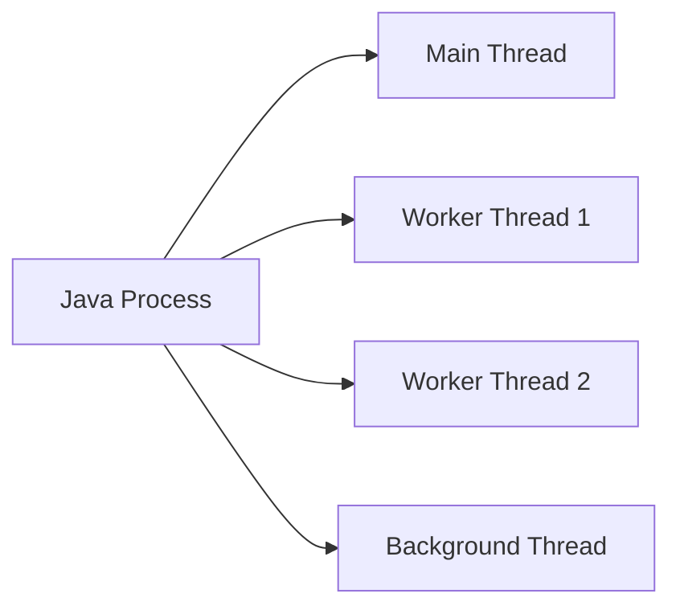

---

# 2. Process vs Thread

## Process

A process is an independent running program.

Each process has its own:

- Heap memory
- Address space
- Resources
- File handles

## Thread

Threads inside the same process share:

- Heap memory
- Static variables
- Open resources

Each thread has its own:

- Stack
- Program counter
- Local variables

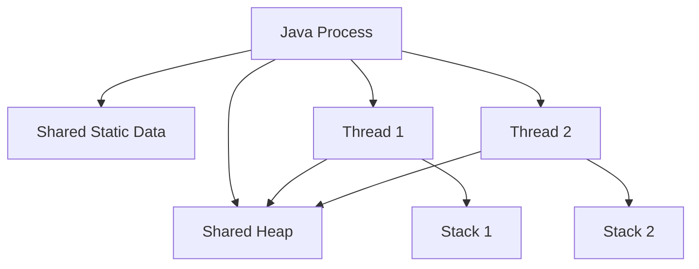

## Comparison

| Feature | Process | Thread |
|---|---|---|
| Memory | Separate | Shared within process |
| Creation cost | Higher | Lower |
| Communication | IPC required | Shared memory |
| Failure isolation | Better | Lower |
| Context switch | More expensive | Less expensive |

---

# 3. Concurrency vs Parallelism

## Concurrency

Concurrency means multiple tasks make progress during overlapping time periods.

A single CPU core can execute concurrent tasks by switching between them.

## Parallelism

Parallelism means multiple tasks execute at exactly the same time on multiple CPU cores.

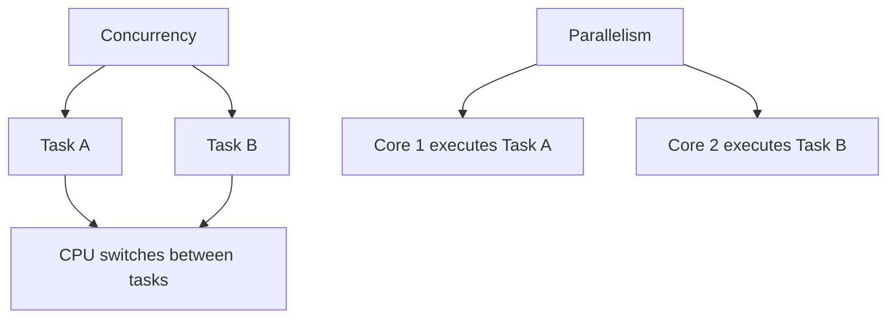

## Example

- Web server handling many requests: concurrency
- Image processing across multiple CPU cores: parallelism

---

# 4. Thread Lifecycle

Java thread states are defined in `Thread.State`.

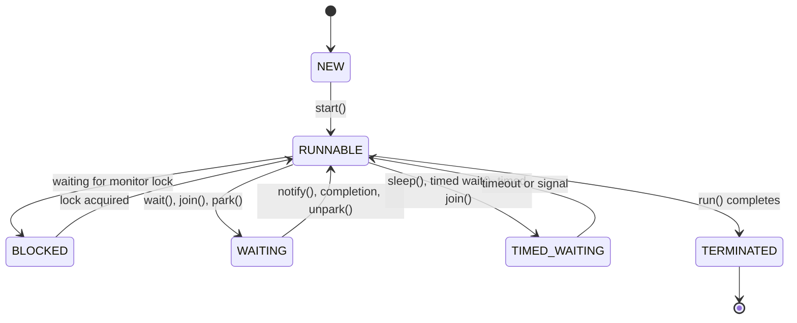

## States

### NEW

Thread object created but `start()` not called.

```java
Thread thread = new Thread();
```

### RUNNABLE

Thread is ready to run or currently running.

### BLOCKED

Thread is waiting to acquire an intrinsic monitor lock.

### WAITING

Thread waits indefinitely for another thread.

Examples:

```java
object.wait();
thread.join();
LockSupport.park();
```

### TIMED_WAITING

Thread waits for a limited time.

Examples:

```java
Thread.sleep(1000);
object.wait(1000);
thread.join(1000);
```

### TERMINATED

Thread's `run()` method has completed.

---

# 5. Creating Threads

## 5.1 Extending Thread

```java
public class WorkerThread extends Thread {

    @Override
    public void run() {
        System.out.println(
                "Running on: "
                        + Thread.currentThread().getName()
        );
    }

    public static void main(String[] args) {
        WorkerThread thread = new WorkerThread();
        thread.start();
    }
}
```

## 5.2 Implementing Runnable

```java
public class RunnableExample {

    public static void main(String[] args) {
        Runnable task = () ->
                System.out.println(
                        "Task executed by: "
                                + Thread.currentThread().getName()
                );

        Thread thread = new Thread(task);
        thread.start();
    }
}
```

## 5.3 Using ExecutorService

```java
import java.util.concurrent.ExecutorService;
import java.util.concurrent.Executors;

public class ExecutorExample {

    public static void main(String[] args) {
        ExecutorService executor =
                Executors.newFixedThreadPool(2);

        executor.submit(() ->
                System.out.println(
                        "Executed by: "
                                + Thread.currentThread().getName()
                )
        );

        executor.shutdown();
    }
}
```

## Preferred approach

For production code, prefer:

- `ExecutorService`
- `CompletableFuture`
- Virtual-thread executors

Avoid manually creating many platform threads.

---

# 6. Thread Methods

## start()

Starts a new thread and invokes `run()` on that thread.

```java
thread.start();
```

## run()

Contains thread logic.

Calling it directly does not start a new thread.

```java
thread.run();
```

## sleep()

Pauses the current thread.

```java
Thread.sleep(1000);
```

## join()

Waits for another thread to finish.

```java
thread.join();
```

## interrupt()

Requests interruption.

```java
thread.interrupt();
```

## isInterrupted()

Checks interruption status without clearing it.

```java
thread.isInterrupted();
```

## interrupted()

Static method that checks and clears the current thread's interruption status.

```java
Thread.interrupted();
```

## Example

```java
public class JoinExample {

    public static void main(String[] args)
            throws InterruptedException {

        Thread worker = new Thread(() -> {
            try {
                Thread.sleep(1000);
                System.out.println("Worker completed");
            } catch (InterruptedException exception) {
                Thread.currentThread().interrupt();
            }
        });

        worker.start();
        worker.join();

        System.out.println("Main completed");
    }
}
```

---

# 7. Thread Scheduling

Thread scheduling is controlled by:

- JVM
- Operating system scheduler
- Thread priority
- CPU availability

Java does not guarantee exact execution order.

```java
Thread first = new Thread(
        () -> System.out.println("First")
);

Thread second = new Thread(
        () -> System.out.println("Second")
);

first.start();
second.start();
```

Possible output:

```text
First
Second
```

or:

```text
Second
First
```

Never depend on thread scheduling order unless explicit synchronization is used.

---

# 8. Race Condition

A race condition occurs when multiple threads access shared mutable state and the result depends on timing.

## Unsafe counter

```java
public class UnsafeCounter {

    private int count;

    public void increment() {
        count++;
    }

    public int getCount() {
        return count;
    }
}
```

The operation:

```java
count++;
```

is not atomic.

It is conceptually:

```text
1. Read count
2. Add 1
3. Write count
```

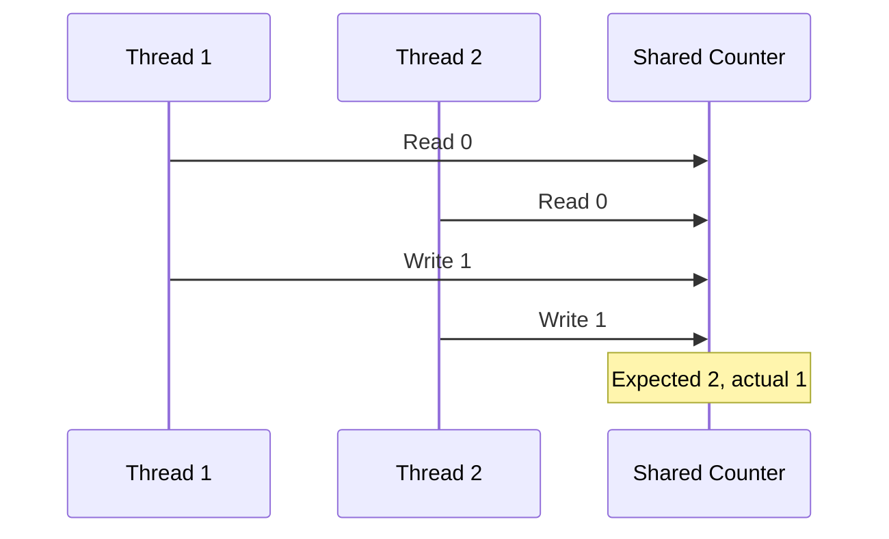

## Demonstration

```java
public class RaceConditionExample {

    private int count;

    public void increment() {
        count++;
    }

    public static void main(String[] args)
            throws InterruptedException {

        RaceConditionExample counter =
                new RaceConditionExample();

        Runnable task = () -> {
            for (int i = 0; i < 100_000; i++) {
                counter.increment();
            }
        };

        Thread first = new Thread(task);
        Thread second = new Thread(task);

        first.start();
        second.start();

        first.join();
        second.join();

        System.out.println(
                "Expected: 200000"
        );

        System.out.println(
                "Actual: " + counter.count
        );
    }
}
```

---

# 9. Synchronization

Synchronization ensures only one thread executes a protected critical section at a time.

## Synchronized counter

```java
public class SynchronizedCounter {

    private int count;

    public synchronized void increment() {
        count++;
    }

    public synchronized int getCount() {
        return count;
    }
}
```

## Critical section

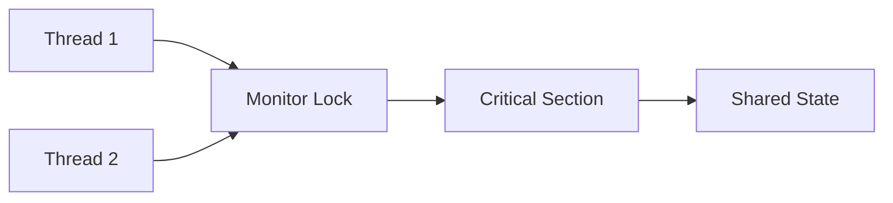

Only one thread can hold the same monitor lock at a time.

---

# 10. Intrinsic Locks and Monitors

Every Java object has an intrinsic lock, also called a monitor.

For an instance synchronized method:

```java
public synchronized void update() {
}
```

the lock is:

```text
this
```

For a static synchronized method:

```java
public static synchronized void update() {
}
```

the lock is:

```text
ClassName.class
```

## Example

```java
public class Account {

    private double balance;

    public synchronized void deposit(
            double amount
    ) {
        balance += amount;
    }
}
```

Equivalent block:

```java
public void deposit(double amount) {
    synchronized (this) {
        balance += amount;
    }
}
```

---

# 11. Synchronized Method vs Block

## Synchronized method

```java
public synchronized void process() {
    stepOne();
    stepTwo();
}
```

Locks the complete method.

## Synchronized block

```java
private final Object lock = new Object();

public void process() {
    stepOne();

    synchronized (lock) {
        stepTwo();
    }
}
```

Locks only the necessary section.

## Benefits of synchronized blocks

- Smaller critical sections
- Better concurrency
- Dedicated lock objects
- Reduced contention

## Best practice

Keep synchronized sections as small as possible, but large enough to preserve correctness.

---

# 12. Static Synchronization

Static synchronized methods lock the `Class` object.

```java
public class GlobalCounter {

    private static int count;

    public static synchronized void increment() {
        count++;
    }
}
```

Equivalent:

```java
public static void increment() {
    synchronized (GlobalCounter.class) {
        count++;
    }
}
```

Two different instances still compete for the same class lock.

---

# 13. Visibility and volatile

Modern processors and compilers may cache or reorder memory operations.

A thread may not immediately see changes made by another thread.

## Visibility problem

```java
public class VisibilityProblem {

    private boolean running = true;

    public void stop() {
        running = false;
    }

    public void runLoop() {
        while (running) {
            // Work
        }
    }
}
```

The worker thread may keep reading a cached value.

## volatile solution

```java
public class VolatileExample {

    private volatile boolean running = true;

    public void stop() {
        running = false;
    }

    public void runLoop() {
        while (running) {
            // Work
        }
    }
}
```

`volatile` guarantees:

- Visibility
- Ordering around volatile accesses

It does not guarantee compound-operation atomicity.

## Incorrect volatile counter

```java
private volatile int count;

public void increment() {
    count++;
}
```

This is still unsafe because `count++` is not atomic.

---

# 14. Atomic Variables

Atomic classes provide lock-free thread-safe operations.

Common classes:

- `AtomicInteger`
- `AtomicLong`
- `AtomicBoolean`
- `AtomicReference`
- `LongAdder`
- `LongAccumulator`

## AtomicInteger example

```java
import java.util.concurrent.atomic.AtomicInteger;

public class AtomicCounter {

    private final AtomicInteger count =
            new AtomicInteger();

    public void increment() {
        count.incrementAndGet();
    }

    public int getCount() {
        return count.get();
    }
}
```

## LongAdder

`LongAdder` performs well under high contention.

```java
import java.util.concurrent.atomic.LongAdder;

public class RequestCounter {

    private final LongAdder counter =
            new LongAdder();

    public void increment() {
        counter.increment();
    }

    public long getTotal() {
        return counter.sum();
    }
}
```

Use:

- `AtomicLong` when exact atomic reads are important
- `LongAdder` for high-throughput counters

---

# 15. CAS — Compare and Set

CAS means Compare-And-Set.

It updates a value only if it still equals the expected value.

```text
compare current value with expected value
if equal:
    update to new value
else:
    retry or fail
```

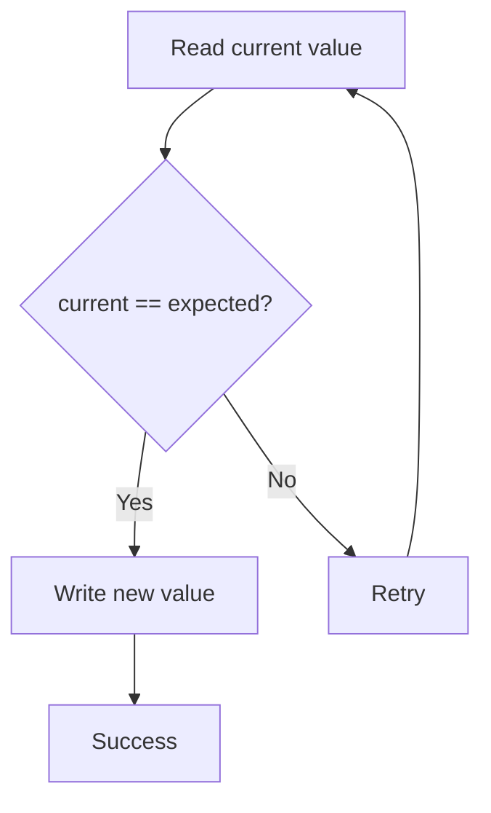

## Example

```java
import java.util.concurrent.atomic.AtomicInteger;

public class CasExample {

    public static void main(String[] args) {
        AtomicInteger value =
                new AtomicInteger(10);

        boolean updated =
                value.compareAndSet(10, 20);

        System.out.println(updated);
        System.out.println(value.get());
    }
}
```

---

# 16. Thread Communication

Threads often need to coordinate rather than only protect shared data.

Common mechanisms:

- `wait()`
- `notify()`
- `notifyAll()`
- `BlockingQueue`
- `CountDownLatch`
- `CyclicBarrier`
- `Semaphore`
- `Condition`

---

# 17. wait, notify, and notifyAll

These methods belong to `Object`.

They must be called while holding the object's monitor.

## wait()

- Releases the monitor
- Places thread in waiting state
- Reacquires monitor before returning

## notify()

Wakes one waiting thread.

## notifyAll()

Wakes all waiting threads.

## Example

```java
public class SharedMessage {

    private String message;
    private boolean available;

    public synchronized void produce(
            String message
    ) throws InterruptedException {

        while (available) {
            wait();
        }

        this.message = message;
        available = true;

        notifyAll();
    }

    public synchronized String consume()
            throws InterruptedException {

        while (!available) {
            wait();
        }

        String result = message;
        available = false;

        notifyAll();

        return result;
    }
}
```

## Why use while instead of if?

Because of:

- Spurious wakeups
- Multiple competing threads
- Condition may no longer be true after reacquiring lock

Correct:

```java
while (!condition) {
    wait();
}
```

---

# 18. Producer-Consumer Problem

A producer creates data.

A consumer processes data.

## Using BlockingQueue

```java
import java.util.concurrent.ArrayBlockingQueue;
import java.util.concurrent.BlockingQueue;

public class ProducerConsumer {

    public static void main(String[] args)
            throws InterruptedException {

        BlockingQueue<Integer> queue =
                new ArrayBlockingQueue<>(5);

        Thread producer = new Thread(() -> {
            try {
                for (int value = 1;
                        value <= 10;
                        value++) {

                    queue.put(value);

                    System.out.println(
                            "Produced: " + value
                    );
                }
            } catch (InterruptedException exception) {
                Thread.currentThread().interrupt();
            }
        });

        Thread consumer = new Thread(() -> {
            try {
                for (int index = 1;
                        index <= 10;
                        index++) {

                    int value = queue.take();

                    System.out.println(
                            "Consumed: " + value
                    );
                }
            } catch (InterruptedException exception) {
                Thread.currentThread().interrupt();
            }
        });

        producer.start();
        consumer.start();

        producer.join();
        consumer.join();
    }
}
```


`BlockingQueue` is usually preferable to manual `wait()` and `notify()`.

---

# 19. Deadlock

Deadlock occurs when threads wait forever for locks held by one another.

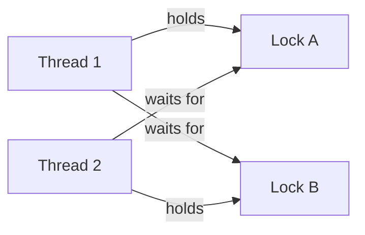

## Deadlock example

```java
public class DeadlockExample {

    private static final Object LOCK_A =
            new Object();

    private static final Object LOCK_B =
            new Object();

    public static void main(String[] args) {
        Thread first = new Thread(() -> {
            synchronized (LOCK_A) {
                sleep();

                synchronized (LOCK_B) {
                    System.out.println(
                            "Thread 1 completed"
                    );
                }
            }
        });

        Thread second = new Thread(() -> {
            synchronized (LOCK_B) {
                sleep();

                synchronized (LOCK_A) {
                    System.out.println(
                            "Thread 2 completed"
                    );
                }
            }
        });

        first.start();
        second.start();
    }

    private static void sleep() {
        try {
            Thread.sleep(100);
        } catch (InterruptedException exception) {
            Thread.currentThread().interrupt();
        }
    }
}
```

## Deadlock conditions

Coffman conditions:

1. Mutual exclusion
2. Hold and wait
3. No preemption
4. Circular wait

All four are needed.

## Prevention

- Consistent lock ordering
- Avoid nested locks
- Use `tryLock()`
- Add timeouts
- Reduce lock scope

## Fixed lock ordering

```java
synchronized (LOCK_A) {
    synchronized (LOCK_B) {
        // Safe ordering
    }
}
```

All threads must acquire locks in the same order.

---

# 20. Livelock and Starvation

## Livelock

Threads are active but continuously react to each other and make no progress.

Example analogy:

Two people repeatedly step aside in the same direction.

## Starvation

A thread cannot access required resources because other threads continuously take priority.

Causes:

- Unfair locks
- High-priority threads
- Long critical sections
- Poor thread-pool design

---

# 21. Lock Interface

`java.util.concurrent.locks.Lock` provides more control than `synchronized`.

Main methods:

```java
void lock();
void unlock();
boolean tryLock();
void lockInterruptibly();
Condition newCondition();
```

Benefits:

- Timed lock attempts
- Interruptible locking
- Multiple conditions
- Fairness option

---

# 22. ReentrantLock

A reentrant lock allows the same thread to acquire it multiple times.

```java
import java.util.concurrent.locks.Lock;
import java.util.concurrent.locks.ReentrantLock;

public class ReentrantLockCounter {

    private final Lock lock =
            new ReentrantLock();

    private int count;

    public void increment() {
        lock.lock();

        try {
            count++;
        } finally {
            lock.unlock();
        }
    }

    public int getCount() {
        lock.lock();

        try {
            return count;
        } finally {
            lock.unlock();
        }
    }
}
```

Always release locks in `finally`.

## tryLock()

```java
if (lock.tryLock()) {
    try {
        // Critical section
    } finally {
        lock.unlock();
    }
}
```

## Timed tryLock

```java
if (lock.tryLock(
        1,
        TimeUnit.SECONDS
)) {
    try {
        // Critical section
    } finally {
        lock.unlock();
    }
}
```

---

# 23. ReadWriteLock

`ReadWriteLock` separates read and write locks.

Rules:

- Multiple readers can proceed together
- Only one writer can proceed
- Writer excludes readers

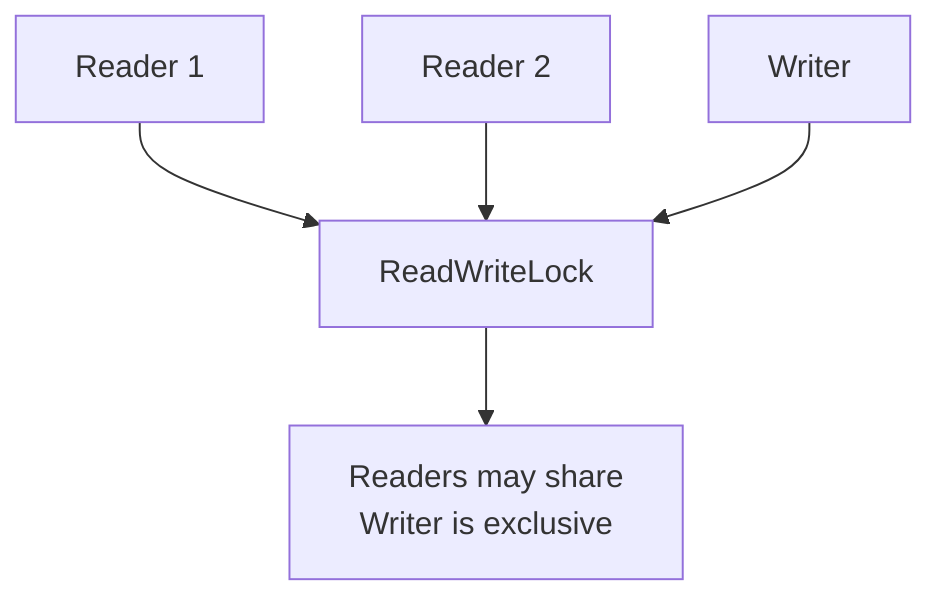

## Example

```java
import java.util.HashMap;
import java.util.Map;
import java.util.concurrent.locks.ReadWriteLock;
import java.util.concurrent.locks.ReentrantReadWriteLock;

public class ThreadSafeCache<K, V> {

    private final Map<K, V> cache =
            new HashMap<>();

    private final ReadWriteLock lock =
            new ReentrantReadWriteLock();

    public V get(K key) {
        lock.readLock().lock();

        try {
            return cache.get(key);
        } finally {
            lock.readLock().unlock();
        }
    }

    public void put(K key, V value) {
        lock.writeLock().lock();

        try {
            cache.put(key, value);
        } finally {
            lock.writeLock().unlock();
        }
    }
}
```

---

# 24. StampedLock

`StampedLock` supports:

- Write lock
- Read lock
- Optimistic read

Optimistic reads can improve read-heavy workloads.

```java
import java.util.concurrent.locks.StampedLock;

public class Point {

    private double x;
    private double y;

    private final StampedLock lock =
            new StampedLock();

    public void move(
            double deltaX,
            double deltaY
    ) {
        long stamp = lock.writeLock();

        try {
            x += deltaX;
            y += deltaY;
        } finally {
            lock.unlockWrite(stamp);
        }
    }

    public double distanceFromOrigin() {
        long stamp = lock.tryOptimisticRead();

        double currentX = x;
        double currentY = y;

        if (!lock.validate(stamp)) {
            stamp = lock.readLock();

            try {
                currentX = x;
                currentY = y;
            } finally {
                lock.unlockRead(stamp);
            }
        }

        return Math.sqrt(
                currentX * currentX
                        + currentY * currentY
        );
    }
}
```

`StampedLock` is not reentrant.

---

# 25. Semaphore

A semaphore controls the number of threads allowed to access a resource.

Example: allow only three concurrent requests.

```java
import java.util.concurrent.Semaphore;

public class ConnectionPoolLimiter {

    private final Semaphore semaphore =
            new Semaphore(3);

    public void accessResource()
            throws InterruptedException {

        semaphore.acquire();

        try {
            System.out.println(
                    Thread.currentThread().getName()
                            + " acquired permit"
            );

            Thread.sleep(500);
        } finally {
            semaphore.release();
        }
    }
}
```


---

# 26. CountDownLatch

`CountDownLatch` allows one or more threads to wait until a count reaches zero.

It is one-time use.

```java
import java.util.concurrent.CountDownLatch;

public class ServiceStartup {

    public static void main(String[] args)
            throws InterruptedException {

        CountDownLatch latch =
                new CountDownLatch(3);

        Runnable service = () -> {
            try {
                Thread.sleep(500);
                System.out.println(
                        Thread.currentThread().getName()
                                + " started"
                );
            } catch (InterruptedException exception) {
                Thread.currentThread().interrupt();
            } finally {
                latch.countDown();
            }
        };

        new Thread(service, "Database").start();
        new Thread(service, "Cache").start();
        new Thread(service, "Messaging").start();

        latch.await();

        System.out.println(
                "All services started"
        );
    }
}
```

---

# 27. CyclicBarrier

`CyclicBarrier` makes a group of threads wait for each other at a common point.

It is reusable.

```java
import java.util.concurrent.CyclicBarrier;

public class BarrierExample {

    public static void main(String[] args) {
        CyclicBarrier barrier =
                new CyclicBarrier(
                        3,
                        () -> System.out.println(
                                "All tasks reached barrier"
                        )
                );

        Runnable task = () -> {
            try {
                System.out.println(
                        Thread.currentThread().getName()
                                + " working"
                );

                Thread.sleep(300);

                barrier.await();

                System.out.println(
                        Thread.currentThread().getName()
                                + " continuing"
                );
            } catch (Exception exception) {
                Thread.currentThread().interrupt();
            }
        };

        new Thread(task).start();
        new Thread(task).start();
        new Thread(task).start();
    }
}
```

## CountDownLatch vs CyclicBarrier

| Feature | CountDownLatch | CyclicBarrier |
|---|---|---|
| Reusable | No | Yes |
| Threads wait for | Count reaching zero | Each other |
| Count changed by | `countDown()` | `await()` |
| Common use | Startup coordination | Multi-phase tasks |

---

# 28. Phaser

`Phaser` supports multiple phases and dynamic party registration.

```java
import java.util.concurrent.Phaser;

public class PhaserExample {

    public static void main(String[] args) {
        Phaser phaser = new Phaser(1);

        for (int i = 1; i <= 3; i++) {
            phaser.register();

            int taskId = i;

            new Thread(() -> {
                System.out.println(
                        "Task " + taskId
                                + " phase 1"
                );

                phaser.arriveAndAwaitAdvance();

                System.out.println(
                        "Task " + taskId
                                + " phase 2"
                );

                phaser.arriveAndDeregister();
            }).start();
        }

        phaser.arriveAndDeregister();
    }
}
```

Use `Phaser` for complex multi-stage workflows.

---

# 29. Exchanger

`Exchanger` allows two threads to exchange objects.

```java
import java.util.concurrent.Exchanger;

public class ExchangerExample {

    public static void main(String[] args) {
        Exchanger<String> exchanger =
                new Exchanger<>();

        Thread first = new Thread(() -> {
            try {
                String received =
                        exchanger.exchange(
                                "Data from thread 1"
                        );

                System.out.println(
                        "Thread 1 received: "
                                + received
                );
            } catch (InterruptedException exception) {
                Thread.currentThread().interrupt();
            }
        });

        Thread second = new Thread(() -> {
            try {
                String received =
                        exchanger.exchange(
                                "Data from thread 2"
                        );

                System.out.println(
                        "Thread 2 received: "
                                + received
                );
            } catch (InterruptedException exception) {
                Thread.currentThread().interrupt();
            }
        });

        first.start();
        second.start();
    }
}
```

---

# 30. Executor Framework

The Executor Framework separates:

- Task submission
- Thread creation
- Scheduling
- Resource management

Main interfaces:

- `Executor`
- `ExecutorService`
- `ScheduledExecutorService`


## Example

```java
import java.util.concurrent.ExecutorService;
import java.util.concurrent.Executors;

public class ExecutorServiceExample {

    public static void main(String[] args) {
        ExecutorService executor =
                Executors.newFixedThreadPool(3);

        for (int taskId = 1;
                taskId <= 5;
                taskId++) {

            int currentTask = taskId;

            executor.submit(() ->
                    System.out.println(
                            "Task "
                                    + currentTask
                                    + " executed by "
                                    + Thread.currentThread()
                                            .getName()
                    )
            );
        }

        executor.shutdown();
    }
}
```

## Shutdown methods

```java
executor.shutdown();
```

Stops accepting new tasks and completes submitted tasks.

```java
executor.shutdownNow();
```

Attempts to interrupt running tasks and returns queued tasks.

---

# 31. Thread Pools

## Fixed thread pool

```java
Executors.newFixedThreadPool(4);
```

Good for bounded worker concurrency.

## Cached thread pool

```java
Executors.newCachedThreadPool();
```

Can create many threads and must be used carefully.

## Single-thread executor

```java
Executors.newSingleThreadExecutor();
```

Executes tasks sequentially.

## Scheduled thread pool

```java
Executors.newScheduledThreadPool(2);
```

Supports delayed and periodic tasks.

## Work-stealing pool

```java
Executors.newWorkStealingPool();
```

Uses `ForkJoinPool`.

## Custom ThreadPoolExecutor

```java
import java.util.concurrent.ArrayBlockingQueue;
import java.util.concurrent.ThreadPoolExecutor;
import java.util.concurrent.TimeUnit;

public class CustomThreadPool {

    public static void main(String[] args) {
        ThreadPoolExecutor executor =
                new ThreadPoolExecutor(
                        2,
                        4,
                        60,
                        TimeUnit.SECONDS,
                        new ArrayBlockingQueue<>(100),
                        new ThreadPoolExecutor.CallerRunsPolicy()
                );

        executor.submit(() ->
                System.out.println("Task executed")
        );

        executor.shutdown();
    }
}
```

## Important parameters

- Core pool size
- Maximum pool size
- Keep-alive time
- Work queue
- Thread factory
- Rejection policy

## Rejection policies

- `AbortPolicy`
- `CallerRunsPolicy`
- `DiscardPolicy`
- `DiscardOldestPolicy`

---

# 32. Callable and Future

`Runnable`:

- Returns no result
- Cannot throw checked exceptions directly

`Callable<V>`:

- Returns a value
- May throw checked exceptions

## Example

```java
import java.util.concurrent.Callable;
import java.util.concurrent.ExecutorService;
import java.util.concurrent.Executors;
import java.util.concurrent.Future;

public class CallableExample {

    public static void main(String[] args)
            throws Exception {

        ExecutorService executor =
                Executors.newSingleThreadExecutor();

        Callable<Integer> task = () -> {
            Thread.sleep(500);
            return 42;
        };

        Future<Integer> future =
                executor.submit(task);

        System.out.println(
                "Result: " + future.get()
        );

        executor.shutdown();
    }
}
```

## Future limitations

- Blocking `get()`
- Difficult chaining
- Limited composition
- Limited error pipelines

`CompletableFuture` improves these areas.

---

# 33. CompletableFuture

`CompletableFuture` supports asynchronous pipelines.

## Basic example

```java
import java.util.concurrent.CompletableFuture;

public class CompletableFutureExample {

    public static void main(String[] args) {
        CompletableFuture<String> future =
                CompletableFuture.supplyAsync(
                        () -> "Java"
                );

        String result = future
                .thenApply(value ->
                        value + " Multithreading"
                )
                .join();

        System.out.println(result);
    }
}
```

## thenApply

Transforms a result synchronously.

```java
future.thenApply(String::toUpperCase);
```

## thenAccept

Consumes result without returning another value.

```java
future.thenAccept(System.out::println);
```

## thenRun

Runs a task after completion without input.

```java
future.thenRun(
        () -> System.out.println("Done")
);
```

## thenCompose

Chains dependent asynchronous operations.

```java
CompletableFuture<String> userFuture =
        getUserId()
                .thenCompose(
                        this::getUserDetails
                );
```

## thenCombine

Combines independent futures.

```java
CompletableFuture<String> nameFuture =
        CompletableFuture.supplyAsync(
                () -> "Shailendra"
        );

CompletableFuture<Integer> scoreFuture =
        CompletableFuture.supplyAsync(
                () -> 95
        );

CompletableFuture<String> combined =
        nameFuture.thenCombine(
                scoreFuture,
                (name, score) ->
                        name + ": " + score
        );
```

## Exception handling

```java
CompletableFuture<String> future =
        CompletableFuture
                .supplyAsync(() -> {
                    throw new IllegalStateException(
                            "Failure"
                    );
                })
                .exceptionally(
                        exception -> "Fallback"
                );
```

## allOf

```java
CompletableFuture<Void> all =
        CompletableFuture.allOf(
                first,
                second,
                third
        );
```

## Custom executor

```java
ExecutorService executor =
        Executors.newFixedThreadPool(4);

CompletableFuture.supplyAsync(
        this::loadData,
        executor
);
```

Avoid overusing the common pool for blocking I/O.

---

# 34. ForkJoinPool

`ForkJoinPool` is designed for divide-and-conquer tasks.

It uses work stealing.

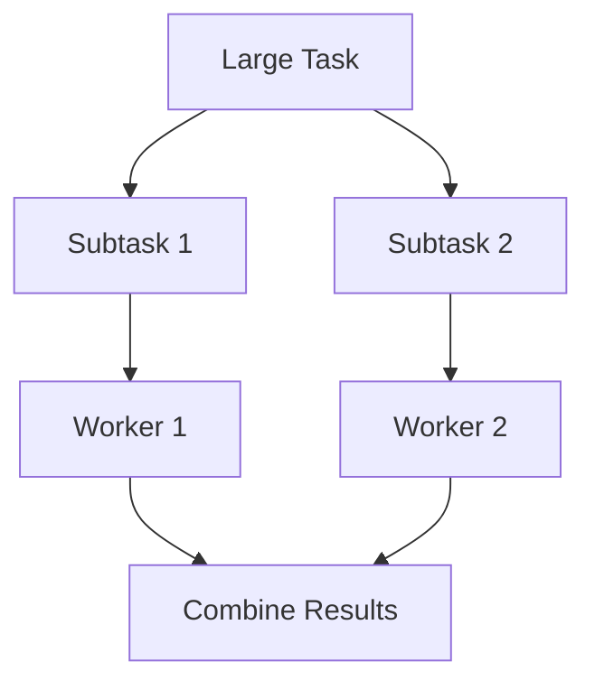

## RecursiveTask example

```java
import java.util.concurrent.ForkJoinPool;
import java.util.concurrent.RecursiveTask;

public class SumTask
        extends RecursiveTask<Long> {

    private static final int THRESHOLD = 10_000;

    private final long[] values;
    private final int start;
    private final int end;

    public SumTask(
            long[] values,
            int start,
            int end
    ) {
        this.values = values;
        this.start = start;
        this.end = end;
    }

    @Override
    protected Long compute() {
        int length = end - start;

        if (length <= THRESHOLD) {
            long sum = 0;

            for (int index = start;
                    index < end;
                    index++) {
                sum += values[index];
            }

            return sum;
        }

        int middle = start + length / 2;

        SumTask left =
                new SumTask(
                        values,
                        start,
                        middle
                );

        SumTask right =
                new SumTask(
                        values,
                        middle,
                        end
                );

        left.fork();

        long rightResult = right.compute();
        long leftResult = left.join();

        return leftResult + rightResult;
    }

    public static void main(String[] args) {
        long[] values = new long[1_000_000];

        for (int index = 0;
                index < values.length;
                index++) {
            values[index] = 1;
        }

        long result =
                ForkJoinPool.commonPool()
                        .invoke(
                                new SumTask(
                                        values,
                                        0,
                                        values.length
                                )
                        );

        System.out.println(result);
    }
}
```

---

# 35. Parallel Streams

Parallel streams split work across the common `ForkJoinPool`.

```java
long count = values
        .parallelStream()
        .filter(this::isValid)
        .count();
```

## Use parallel streams when

- Data set is large
- Work is CPU-bound
- Operations are stateless
- Splitting is efficient
- Common pool interference is acceptable

## Avoid when

- Tasks are blocking I/O
- Data set is small
- Order is important
- Shared mutable state exists
- Latency predictability matters

## Unsafe example

```java
List<Integer> result =
        new ArrayList<>();

numbers.parallelStream()
        .forEach(result::add);
```

`ArrayList` is not thread-safe.

Better:

```java
List<Integer> result =
        numbers.parallelStream()
                .map(value -> value * 2)
                .toList();
```

---

# 36. Concurrent Collections

## ConcurrentHashMap

```java
ConcurrentHashMap<String, Integer> counts =
        new ConcurrentHashMap<>();

counts.merge(
        "Java",
        1,
        Integer::sum
);
```

## CopyOnWriteArrayList

Best for read-heavy and write-light workloads.

```java
CopyOnWriteArrayList<String> listeners =
        new CopyOnWriteArrayList<>();
```

## BlockingQueue

Useful for producer-consumer systems.

Implementations:

- `ArrayBlockingQueue`
- `LinkedBlockingQueue`
- `PriorityBlockingQueue`
- `DelayQueue`
- `SynchronousQueue`

## ConcurrentLinkedQueue

Non-blocking thread-safe queue.

```java
ConcurrentLinkedQueue<String> queue =
        new ConcurrentLinkedQueue<>();
```

## ConcurrentSkipListMap

Sorted concurrent map.

```java
ConcurrentSkipListMap<Integer, String> map =
        new ConcurrentSkipListMap<>();
```

---

# 37. ThreadLocal

`ThreadLocal` gives each thread its own isolated value.

```java
public class RequestContext {

    private static final ThreadLocal<String>
            REQUEST_ID =
            new ThreadLocal<>();

    public static void set(String requestId) {
        REQUEST_ID.set(requestId);
    }

    public static String get() {
        return REQUEST_ID.get();
    }

    public static void clear() {
        REQUEST_ID.remove();
    }
}
```

## Usage

```java
public class ThreadLocalExample {

    public static void main(String[] args) {
        Runnable task = () -> {
            try {
                RequestContext.set(
                        Thread.currentThread().getName()
                );

                System.out.println(
                        RequestContext.get()
                );
            } finally {
                RequestContext.clear();
            }
        };

        new Thread(task, "REQ-101").start();
        new Thread(task, "REQ-102").start();
    }
}
```

## Important warning

Always call:

```java
threadLocal.remove();
```

especially in thread pools, otherwise stale data may leak between tasks.

---

# 38. Virtual Threads

Virtual threads are lightweight JVM-managed threads intended for high-concurrency workloads, especially blocking I/O.

They are much cheaper than platform threads.

## Basic example

```java
public class VirtualThreadExample {

    public static void main(String[] args)
            throws InterruptedException {

        Thread thread =
                Thread.startVirtualThread(() ->
                        System.out.println(
                                "Virtual thread: "
                                        + Thread.currentThread()
                        )
                );

        thread.join();
    }
}
```

## Executor example

```java
import java.util.concurrent.ExecutorService;
import java.util.concurrent.Executors;

public class VirtualThreadExecutorExample {

    public static void main(String[] args)
            throws Exception {

        try (ExecutorService executor =
                Executors
                        .newVirtualThreadPerTaskExecutor()) {

            for (int taskId = 1;
                    taskId <= 10_000;
                    taskId++) {

                int currentTask = taskId;

                executor.submit(() -> {
                    Thread.sleep(100);
                    return currentTask;
                });
            }
        }
    }
}
```

## Platform vs virtual threads

| Feature | Platform Thread | Virtual Thread |
|---|---|---|
| Managed by | OS and JVM | JVM |
| Cost | Higher | Much lower |
| Count | Limited | Very large |
| Best for | CPU-heavy, limited concurrency | Blocking I/O, high concurrency |
| Thread pooling | Common | Usually unnecessary |

## Important point

Virtual threads do not make CPU-bound work faster.

They improve scalability for blocking operations.

---

# 39. Java Memory Model

The Java Memory Model defines:

- How threads interact through memory
- Visibility rules
- Ordering rules
- Atomicity guarantees

Without synchronization, one thread's writes may not be visible to another.


Synchronization tools create visibility guarantees:

- `synchronized`
- `volatile`
- Thread start
- Thread join
- Concurrent utilities
- Atomic variables

---

# 40. Happens-Before Relationship

A happens-before relationship guarantees visibility and ordering.

Important rules:

## Program order

Earlier operations in a thread happen-before later operations in the same thread.

## Monitor rule

Unlocking a monitor happens-before another thread locks the same monitor.

## Volatile rule

A write to a volatile variable happens-before a later read of that variable.

## Thread start

Actions before `thread.start()` happen-before actions in the new thread.

## Thread join

All actions in a thread happen-before another thread successfully returns from `join()`.

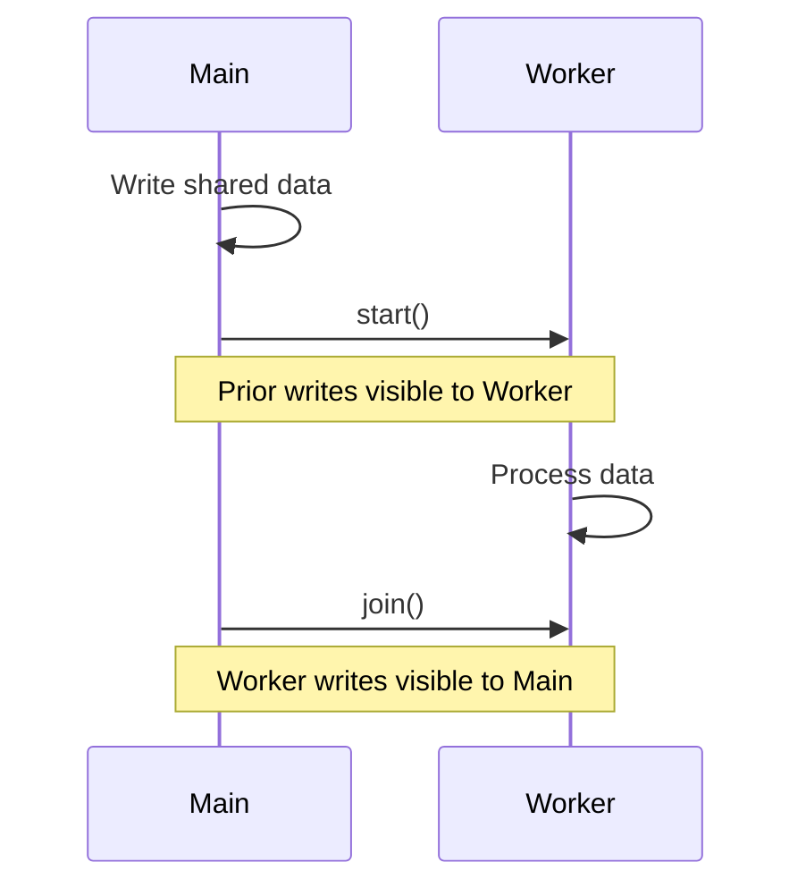

---

# 41. Immutability and Thread Safety

Immutable objects are naturally thread-safe because their state cannot change.

## Immutable example

```java
import java.util.List;

public final class UserProfile {

    private final String userId;
    private final List<String> roles;

    public UserProfile(
            String userId,
            List<String> roles
    ) {
        this.userId = userId;
        this.roles = List.copyOf(roles);
    }

    public String getUserId() {
        return userId;
    }

    public List<String> getRoles() {
        return roles;
    }
}
```

Benefits:

- No race conditions on state
- Safe sharing
- Easier reasoning
- No synchronization needed for reads

---

# 42. Common Coding Problems

## 42.1 Print odd and even numbers using two threads

```java
public class OddEvenPrinter {

    private int number = 1;
    private final int limit;

    public OddEvenPrinter(int limit) {
        this.limit = limit;
    }

    public synchronized void printOdd()
            throws InterruptedException {

        while (number <= limit) {
            while (number % 2 == 0) {
                wait();
            }

            if (number <= limit) {
                System.out.println(
                        "Odd: " + number++
                );
                notifyAll();
            }
        }
    }

    public synchronized void printEven()
            throws InterruptedException {

        while (number <= limit) {
            while (number % 2 != 0) {
                wait();
            }

            if (number <= limit) {
                System.out.println(
                        "Even: " + number++
                );
                notifyAll();
            }
        }
    }

    public static void main(String[] args) {
        OddEvenPrinter printer =
                new OddEvenPrinter(10);

        Thread odd = new Thread(() -> {
            try {
                printer.printOdd();
            } catch (InterruptedException exception) {
                Thread.currentThread().interrupt();
            }
        });

        Thread even = new Thread(() -> {
            try {
                printer.printEven();
            } catch (InterruptedException exception) {
                Thread.currentThread().interrupt();
            }
        });

        odd.start();
        even.start();
    }
}
```

---

## 42.2 Thread-safe singleton

```java
public final class Singleton {

    private Singleton() {
    }

    private static class Holder {

        private static final Singleton INSTANCE =
                new Singleton();
    }

    public static Singleton getInstance() {
        return Holder.INSTANCE;
    }
}
```

This uses class initialization guarantees.

---

## 42.3 Double-checked locking

```java
public final class LazySingleton {

    private static volatile LazySingleton instance;

    private LazySingleton() {
    }

    public static LazySingleton getInstance() {
        if (instance == null) {
            synchronized (LazySingleton.class) {
                if (instance == null) {
                    instance =
                            new LazySingleton();
                }
            }
        }

        return instance;
    }
}
```

`volatile` is required to prevent unsafe publication and reordering.

---

## 42.4 Thread-safe bank transfer

```java
public class BankAccount {

    private final long id;
    private int balance;

    public BankAccount(long id, int balance) {
        this.id = id;
        this.balance = balance;
    }

    public long getId() {
        return id;
    }

    public int getBalance() {
        return balance;
    }

    private void debit(int amount) {
        balance -= amount;
    }

    private void credit(int amount) {
        balance += amount;
    }

    public static void transfer(
            BankAccount from,
            BankAccount to,
            int amount
    ) {
        BankAccount first =
                from.id < to.id ? from : to;

        BankAccount second =
                from.id < to.id ? to : from;

        synchronized (first) {
            synchronized (second) {
                if (from.balance < amount) {
                    throw new IllegalStateException(
                            "Insufficient balance"
                    );
                }

                from.debit(amount);
                to.credit(amount);
            }
        }
    }
}
```

Lock ordering prevents deadlock.

---

## 42.5 Concurrent word counter

```java
import java.util.concurrent.ConcurrentHashMap;
import java.util.concurrent.ConcurrentMap;

public class ConcurrentWordCounter {

    public static void main(String[] args) {
        ConcurrentMap<String, Integer> counts =
                new ConcurrentHashMap<>();

        String[] words = {
                "java",
                "spring",
                "java",
                "kafka",
                "java"
        };

        for (String word : words) {
            counts.merge(
                    word,
                    1,
                    Integer::sum
            );
        }

        System.out.println(counts);
    }
}
```

---

# 43. Best Practices

## 1. Prefer high-level concurrency utilities

Prefer:

- Executors
- Blocking queues
- Concurrent collections
- CompletableFuture
- Structured task coordination

over low-level `wait()` and `notify()` when possible.

## 2. Minimize shared mutable state

Use:

- Immutable objects
- Local variables
- Message passing
- Thread confinement

## 3. Keep critical sections small

Long synchronized blocks reduce throughput.

## 4. Always release explicit locks in finally

```java
lock.lock();

try {
    // Critical section
} finally {
    lock.unlock();
}
```

## 5. Restore interruption status

```java
catch (InterruptedException exception) {
    Thread.currentThread().interrupt();
}
```

## 6. Shut down executors

```java
executor.shutdown();
```

## 7. Use bounded queues

Unbounded queues can cause memory problems under load.

## 8. Avoid blocking in common ForkJoinPool

Blocking tasks can starve parallel streams and CompletableFuture tasks.

## 9. Use immutable keys and values where possible

This simplifies thread safety.

## 10. Measure before parallelizing

Concurrency adds overhead and complexity.

## 11. Avoid ThreadLocal leaks

Always call `remove()` in thread-pool environments.

## 12. Prefer virtual threads for blocking I/O concurrency

Use platform-thread pools for controlled CPU-bound work.

---

# 44. Interview Questions and Answers

## 1. What is a thread?

A thread is the smallest unit of execution within a process.

---

## 2. What is the difference between process and thread?

Processes have separate memory spaces. Threads share process memory but have separate stacks.

---

## 3. What is the difference between concurrency and parallelism?

Concurrency means overlapping progress. Parallelism means simultaneous execution.

---

## 4. What are Java thread states?

- NEW
- RUNNABLE
- BLOCKED
- WAITING
- TIMED_WAITING
- TERMINATED

---

## 5. What is the difference between start() and run()?

`start()` creates a new execution thread. Calling `run()` directly executes on the current thread.

---

## 6. Can a thread be started twice?

No. Calling `start()` twice throws `IllegalThreadStateException`.

---

## 7. What is a race condition?

A race condition occurs when multiple threads access shared mutable state and the result depends on execution timing.

---

## 8. What is synchronization?

Synchronization controls access to shared resources and establishes memory-visibility guarantees.

---

## 9. What lock is used by an instance synchronized method?

The current object, `this`.

---

## 10. What lock is used by a static synchronized method?

The class object, such as `MyClass.class`.

---

## 11. Is synchronized reentrant?

Yes. A thread holding a monitor can reacquire it.

---

## 12. What is volatile?

`volatile` guarantees visibility and ordering for a variable, but not atomicity for compound operations.

---

## 13. Is count++ atomic?

No. It is a read-modify-write operation.

---

## 14. What is CAS?

Compare-And-Set atomically updates a value when it matches an expected value.

---

## 15. AtomicInteger vs synchronized counter?

`AtomicInteger` often performs better for simple atomic operations. `synchronized` is more suitable for multi-step invariants.

---

## 16. LongAdder vs AtomicLong?

`LongAdder` scales better under high contention, while `AtomicLong` provides a single exact atomic value.

---

## 17. What is deadlock?

Deadlock occurs when threads wait forever for resources held by each other.

---

## 18. What are the four deadlock conditions?

- Mutual exclusion
- Hold and wait
- No preemption
- Circular wait

---

## 19. How can deadlock be prevented?

Use consistent lock ordering, reduce nested locks, use timed `tryLock()`, and minimize lock scope.

---

## 20. What is livelock?

Threads remain active but repeatedly respond to each other without making progress.

---

## 21. What is starvation?

A thread is continually denied access to CPU time or resources.

---

## 22. Difference between wait() and sleep()?

`wait()` releases the monitor and must be called inside synchronized code.

`sleep()` does not release held locks.

---

## 23. Why should wait() be used inside a loop?

Because of spurious wakeups and changing conditions after monitor reacquisition.

---

## 24. notify() vs notifyAll()?

`notify()` wakes one waiting thread.

`notifyAll()` wakes all waiting threads.

`notifyAll()` is often safer when different conditions share a monitor.

---

## 25. What is ExecutorService?

It manages task execution using reusable worker threads.

---

## 26. Runnable vs Callable?

`Runnable` returns no result.

`Callable` returns a result and may throw checked exceptions.

---

## 27. Future vs CompletableFuture?

`Future` mainly supports blocking retrieval.

`CompletableFuture` supports asynchronous composition, transformation, and error handling.

---

## 28. thenApply vs thenCompose?

`thenApply` transforms a value.

`thenCompose` flattens dependent asynchronous operations.

---

## 29. What is ForkJoinPool?

A work-stealing pool designed for recursive divide-and-conquer tasks.

---

## 30. Are parallel streams always faster?

No. They can be slower for small data sets, blocking tasks, ordered operations, or shared mutable state.

---

## 31. What is ThreadLocal?

It provides a separate value for each thread.

---

## 32. Why can ThreadLocal cause memory leaks?

Thread-pool threads live a long time. Values can remain attached unless `remove()` is called.

---

## 33. What is ConcurrentHashMap?

A thread-safe map designed for high concurrency and atomic key-based operations.

---

## 34. Why does ConcurrentHashMap not allow null?

A null result would be ambiguous between absent key and null value in concurrent code.

---

## 35. CopyOnWriteArrayList use case?

Read-heavy workloads with rare writes and snapshot iteration.

---

## 36. CountDownLatch vs CyclicBarrier?

`CountDownLatch` is one-time and waits for a count to reach zero.

`CyclicBarrier` is reusable and lets threads wait for each other.

---

## 37. Semaphore use case?

Limiting concurrent access to a finite resource, such as connections.

---

## 38. ReentrantLock vs synchronized?

`ReentrantLock` supports fairness, timed attempts, interruptible locking, and multiple conditions.

`synchronized` is simpler and automatically releases locks.

---

## 39. ReadWriteLock use case?

Read-heavy structures where multiple readers can proceed concurrently and writes are exclusive.

---

## 40. What is happens-before?

A memory-ordering relationship guaranteeing that one thread's actions are visible to another.

---

## 41. Does thread start create happens-before?

Yes. Actions before `start()` are visible to the started thread.

---

## 42. Does join create happens-before?

Yes. A thread's actions become visible to the thread that successfully returns from `join()`.

---

## 43. Why are immutable objects thread-safe?

Their state cannot change after construction, so concurrent reads cannot race with writes.

---

## 44. What are virtual threads?

Lightweight JVM-managed threads designed for high-concurrency blocking workloads.

---

## 45. Are virtual threads faster for CPU-bound tasks?

No. CPU-bound work is still limited by available processor cores.

---

## 46. Should virtual threads be pooled?

Usually no. They are cheap enough to create per task.

---

## 47. What is thread interruption?

A cooperative cancellation mechanism using an interruption flag and `InterruptedException`.

---

## 48. Why restore interrupt status?

Catching `InterruptedException` clears the status. Restoring it allows higher layers to detect cancellation.

---

## 49. What is a daemon thread?

A background thread that does not prevent JVM termination when all user threads finish.

---

## 50. How do you detect deadlocks?

Use:

- Thread dumps
- `jstack`
- Java Flight Recorder
- VisualVM
- `ThreadMXBean`

---

# 45. Summary

Java provides low-level and high-level concurrency tools.

## Core concepts

| Topic | Key idea |
|---|---|
| Thread | Independent execution path |
| Race condition | Unsafe shared-state timing |
| synchronized | Mutual exclusion and visibility |
| volatile | Visibility without compound atomicity |
| Atomic classes | Lock-free atomic updates |
| Lock | Advanced synchronization control |
| ExecutorService | Managed task execution |
| CompletableFuture | Asynchronous composition |
| Concurrent collections | Thread-safe data structures |
| Virtual threads | Lightweight blocking concurrency |
| Happens-before | Memory visibility guarantee |

## Recommended tool selection

| Requirement | Recommended tool |
|---|---|
| Simple mutual exclusion | `synchronized` |
| Advanced locking | `ReentrantLock` |
| Read-heavy shared structure | `ReadWriteLock` |
| Atomic counter | `AtomicInteger` or `LongAdder` |
| Producer-consumer | `BlockingQueue` |
| Wait for services | `CountDownLatch` |
| Multi-phase coordination | `CyclicBarrier` or `Phaser` |
| Limit resource access | `Semaphore` |
| Task execution | `ExecutorService` |
| Async pipeline | `CompletableFuture` |
| CPU divide-and-conquer | `ForkJoinPool` |
| Concurrent map | `ConcurrentHashMap` |
| Blocking I/O at scale | Virtual threads |

---

## Recommended Practice Problems

1. Print odd and even numbers using two threads.
2. Build producer-consumer using `BlockingQueue`.
3. Implement a thread-safe counter.
4. Demonstrate and fix a race condition.
5. Create and prevent a deadlock.
6. Build a bounded thread pool.
7. Combine API calls using `CompletableFuture`.
8. Build a thread-safe cache.
9. Implement rate limiting using `Semaphore`.
10. Coordinate startup using `CountDownLatch`.
11. Build a multi-phase workflow using `Phaser`.
12. Compare platform and virtual threads.
13. Implement a concurrent word counter.
14. Write a lock-free counter using CAS.
15. Analyze a thread dump for blocked threads.
