# Advanced Java Concurrency — In-Depth Guide

A deep guide to advanced Java concurrency for backend engineering and FAANG-style interviews. It covers the Java Memory Model, happens-before, CAS, ABA, lock-free programming, memory barriers, false sharing, concurrent collections, thread-pool tuning, `CompletableFuture`, virtual threads, structured concurrency concepts, debugging, performance, and interview questions.

---

## Table of Contents

1. [Concurrency Fundamentals](#1-concurrency-fundamentals)
2. [Java Memory Model](#2-java-memory-model)
3. [Atomicity, Visibility, and Ordering](#3-atomicity-visibility-and-ordering)
4. [Happens-Before Rules](#4-happens-before-rules)
5. [Memory Reordering](#5-memory-reordering)
6. [Memory Barriers](#6-memory-barriers)
7. [volatile Internals](#7-volatile-internals)
8. [synchronized Internals](#8-synchronized-internals)
9. [Monitor Locks](#9-monitor-locks)
10. [Lock States and Contention](#10-lock-states-and-contention)
11. [CAS](#11-cas)
12. [ABA Problem](#12-aba-problem)
13. [Atomic Classes](#13-atomic-classes)
14. [LongAdder and Striped Counters](#14-longadder-and-striped-counters)
15. [Lock-Free Programming](#15-lock-free-programming)
16. [Wait-Free vs Lock-Free vs Blocking](#16-wait-free-vs-lock-free-vs-blocking)
17. [False Sharing](#17-false-sharing)
18. [Cache Coherence](#18-cache-coherence)
19. [ReentrantLock Internals](#19-reentrantlock-internals)
20. [AbstractQueuedSynchronizer](#20-abstractqueuedsynchronizer)
21. [Condition Objects](#21-condition-objects)
22. [ReadWriteLock](#22-readwritelock)
23. [StampedLock](#23-stampedlock)
24. [ConcurrentHashMap Internals](#24-concurrenthashmap-internals)
25. [CopyOnWriteArrayList](#25-copyonwritearraylist)
26. [BlockingQueue Internals](#26-blockingqueue-internals)
27. [ForkJoinPool and Work Stealing](#27-forkjoinpool-and-work-stealing)
28. [ThreadPoolExecutor Internals](#28-threadpoolexecutor-internals)
29. [Thread Pool Sizing](#29-thread-pool-sizing)
30. [Backpressure and Bounded Queues](#30-backpressure-and-bounded-queues)
31. [CompletableFuture Internals](#31-completablefuture-internals)
32. [Virtual Threads](#32-virtual-threads)
33. [Pinning and Blocking](#33-pinning-and-blocking)
34. [Structured Concurrency Concepts](#34-structured-concurrency-concepts)
35. [ThreadLocal Internals](#35-threadlocal-internals)
36. [InheritableThreadLocal](#36-inheritablethreadlocal)
37. [Deadlock, Livelock, and Starvation](#37-deadlock-livelock-and-starvation)
38. [Deadlock Detection](#38-deadlock-detection)
39. [Thread Dumps](#39-thread-dumps)
40. [Performance Measurement](#40-performance-measurement)
41. [Practical Coding Examples](#41-practical-coding-examples)
42. [Best Practices](#42-best-practices)
43. [Anti-Patterns](#43-anti-patterns)
44. [Interview Questions and Answers](#44-interview-questions-and-answers)
45. [Summary](#45-summary)

---

# 1. Concurrency Fundamentals

Concurrency means multiple tasks make progress during overlapping periods.

Parallelism means multiple tasks execute simultaneously on different CPU cores.

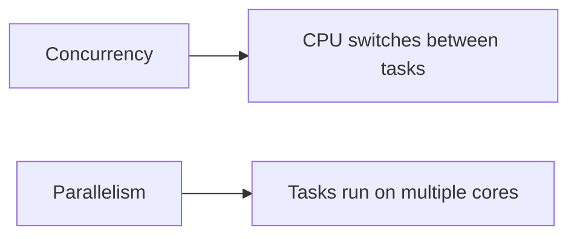

Advanced concurrency focuses on:

- Shared mutable state
- Memory visibility
- Lock contention
- Non-blocking algorithms
- Thread coordination
- Resource isolation
- Scheduler behavior
- Performance under load

---

# 2. Java Memory Model

The Java Memory Model defines how threads interact through memory.

It specifies:

- When writes become visible
- Which operations are atomic
- Which reordering is legal
- How synchronization creates ordering guarantees

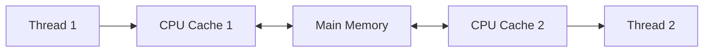

Each thread may observe values through CPU caches and compiler optimizations.

Without synchronization, one thread may not see another thread's updates immediately.

---

# 3. Atomicity, Visibility, and Ordering

## Atomicity

An operation appears indivisible.

Example:

```java
int value = 10;
```

A plain 32-bit integer read or write is atomic.

But this is not atomic:

```java
count++;
```

It is:

```text
read
increment
write
```

## Visibility

A write by one thread becomes visible to another.

## Ordering

Operations appear in a defined order.

The compiler and processor may reorder instructions when single-thread behavior remains unchanged.

---

# 4. Happens-Before Rules

Happens-before guarantees visibility and ordering.

Important rules:

## Program order

Earlier actions in one thread happen-before later actions in that thread.

## Monitor unlock-lock

Unlocking a monitor happens-before another thread locks the same monitor.

## volatile write-read

A volatile write happens-before a later read of the same variable.

## Thread start

Actions before `start()` happen-before actions inside the started thread.

## Thread join

Actions in a thread happen-before another thread successfully returns from `join()`.

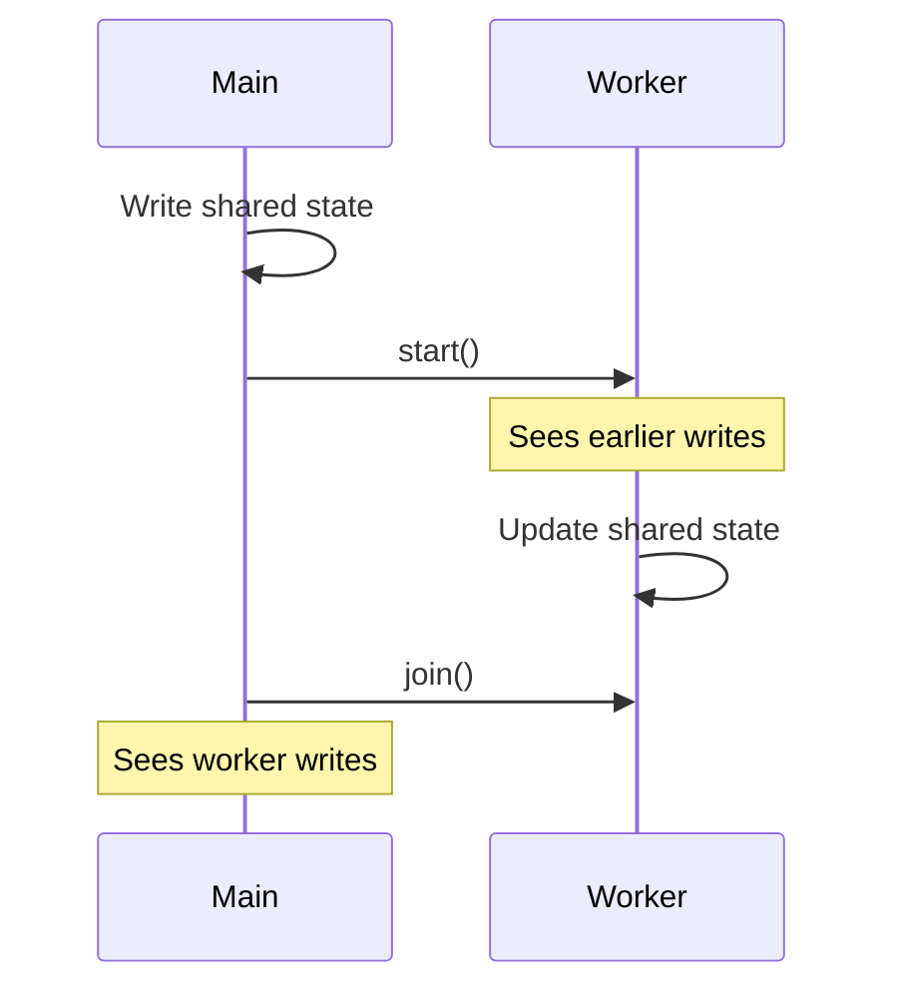

---

# 5. Memory Reordering

The compiler and CPU may reorder independent instructions.

Example:

```java
value = 42;
ready = true;
```

Another thread may observe:

```text
ready == true
value == 0
```

without a happens-before relationship.

## Safe publication

```java
private volatile boolean ready;
private int value;

public void publish() {
    value = 42;
    ready = true;
}
```

A volatile write prevents prior writes from being reordered after it.

---

# 6. Memory Barriers

Memory barriers restrict reordering.

Conceptual barrier types:

- LoadLoad
- LoadStore
- StoreStore
- StoreLoad

A volatile write acts roughly like a release barrier.

A volatile read acts roughly like an acquire barrier.

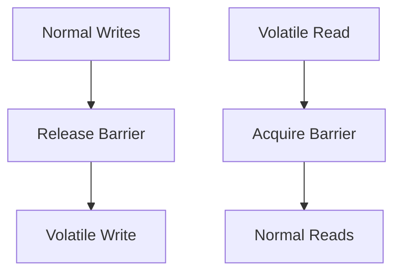

---

# 7. volatile Internals

`volatile` guarantees:

- Visibility
- Ordering around access

It does not guarantee atomicity for compound operations.

## Correct flag

```java
public class ShutdownFlag {

    private volatile boolean running = true;

    public void stop() {
        running = false;
    }

    public void work() {
        while (running) {
            // Work
        }
    }
}
```

## Incorrect counter

```java
private volatile int count;

public void increment() {
    count++;
}
```

This is still unsafe.

Use `AtomicInteger` or synchronization.

---

# 8. synchronized Internals

`synchronized` provides:

- Mutual exclusion
- Visibility
- Reentrancy

For instance methods, the lock is `this`.

For static methods, the lock is the `Class` object.

```java
public synchronized void update() {
}
```

Equivalent:

```java
public void update() {
    synchronized (this) {
    }
}
```

---

# 9. Monitor Locks

Every Java object can act as a monitor.

A thread entering synchronized code acquires the monitor.

Other threads attempting the same monitor may enter `BLOCKED`.

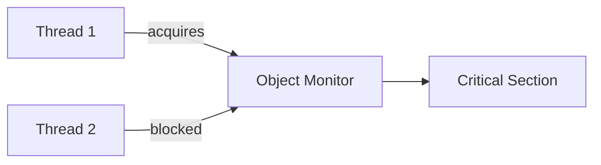

Monitor exit publishes writes to the next thread acquiring the same monitor.

---

# 10. Lock States and Contention

Under low contention, locking can be cheap.

Under high contention:

- Threads block
- Context switches increase
- Throughput drops
- Latency becomes unstable

Design goal:

```text
Protect correctness while minimizing contention
```

Strategies:

- Reduce lock scope
- Partition state
- Use immutable objects
- Use concurrent collections
- Use atomics for simple state
- Avoid global locks

---

# 11. CAS

CAS means Compare-And-Set.

It atomically updates a value only if the current value equals the expected value.

```text
if current == expected:
    current = newValue
```

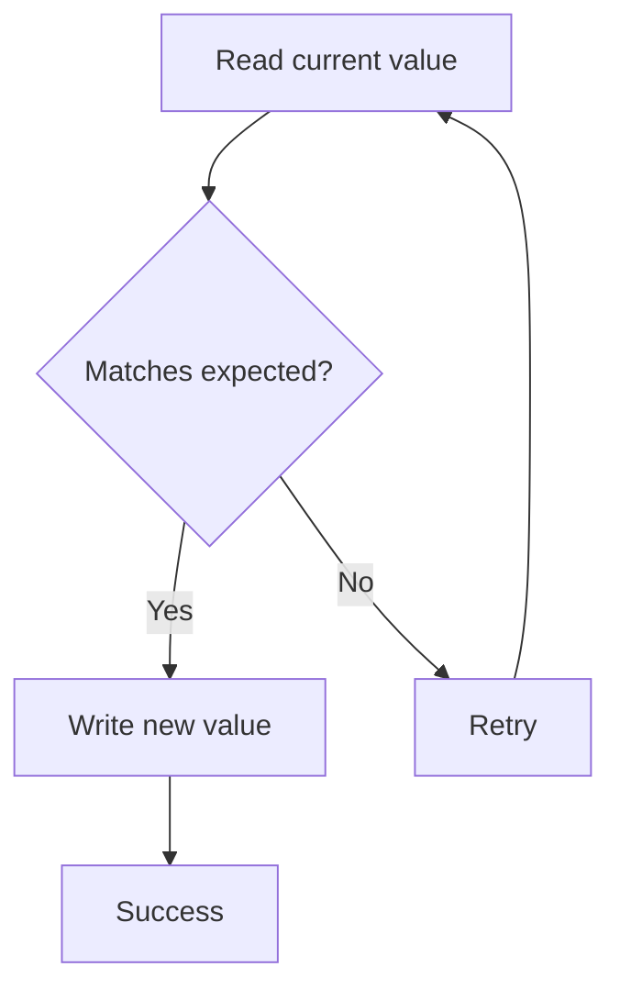

## Example

```java
import java.util.concurrent.atomic.AtomicInteger;

public class CasCounter {

    private final AtomicInteger count =
            new AtomicInteger();

    public void increment() {
        int current;
        int next;

        do {
            current = count.get();
            next = current + 1;
        } while (!count.compareAndSet(
                current,
                next
        ));
    }
}
```

---

# 12. ABA Problem

The ABA problem occurs when:

```text
A changes to B
B changes back to A
CAS sees A and assumes nothing changed
```

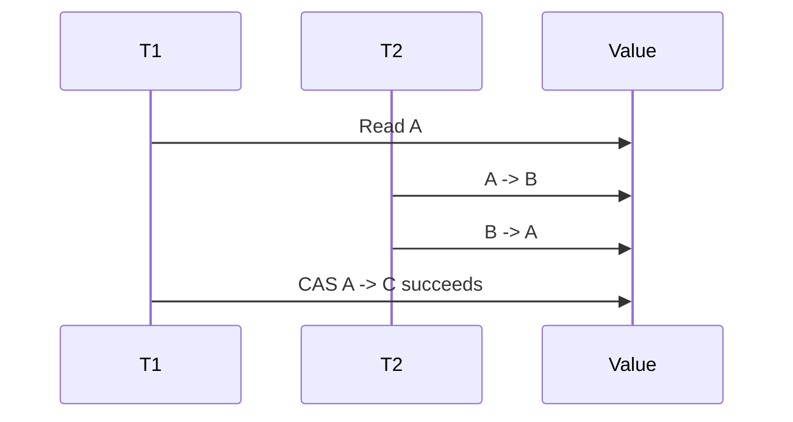

The value looks unchanged, but state changed in between.

## Solution

Use versioning.

```java
import java.util.concurrent.atomic.AtomicStampedReference;

public class AbaSolution {

    public static void main(String[] args) {
        AtomicStampedReference<String> reference =
                new AtomicStampedReference<>(
                        "A",
                        0
                );

        int[] stampHolder = new int[1];

        String value =
                reference.get(stampHolder);

        int stamp = stampHolder[0];

        reference.compareAndSet(
                "A",
                "B",
                stamp,
                stamp + 1
        );
    }
}
```

---

# 13. Atomic Classes

Common classes:

- `AtomicInteger`
- `AtomicLong`
- `AtomicBoolean`
- `AtomicReference`
- `AtomicStampedReference`
- `AtomicMarkableReference`
- `AtomicIntegerArray`
- `AtomicReferenceArray`

## AtomicReference example

```java
import java.util.concurrent.atomic.AtomicReference;

public class AtomicState {

    private final AtomicReference<String> state =
            new AtomicReference<>("NEW");

    public boolean start() {
        return state.compareAndSet(
                "NEW",
                "RUNNING"
        );
    }
}
```

---

# 14. LongAdder and Striped Counters

`AtomicLong` uses one shared value.

Under high contention, many threads compete on the same memory location.

`LongAdder` spreads updates across multiple cells.

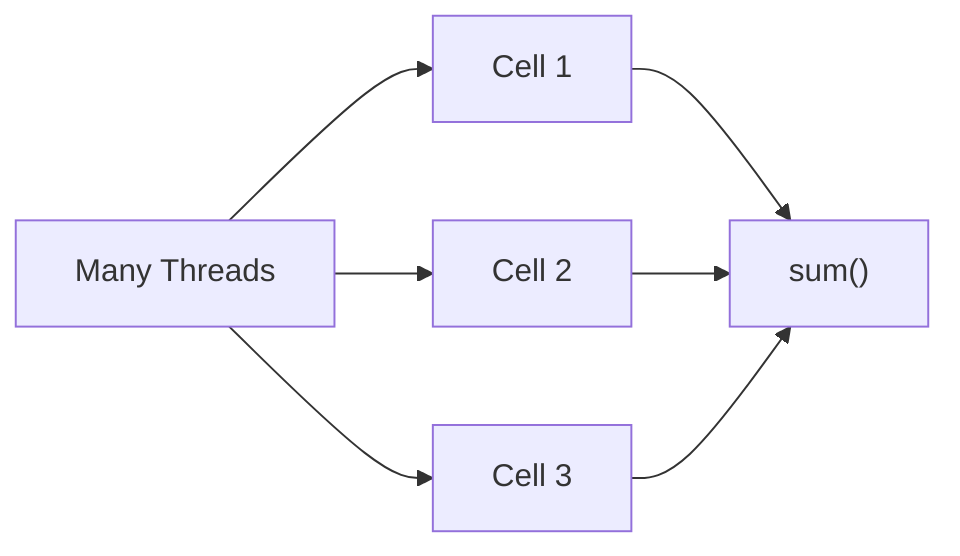

## Example

```java
import java.util.concurrent.atomic.LongAdder;

public class MetricsCounter {

    private final LongAdder requests =
            new LongAdder();

    public void increment() {
        requests.increment();
    }

    public long total() {
        return requests.sum();
    }
}
```

Use `LongAdder` for high-throughput metrics.

Use `AtomicLong` when each read must reflect a single exact atomic value.

---

# 15. Lock-Free Programming

Lock-free algorithms use atomic operations instead of mutual exclusion.

Benefits:

- Avoid deadlock
- Avoid lock convoy
- Better progress under contention

Costs:

- Harder to reason about
- CAS retry loops
- ABA risk
- Memory reclamation complexity

## Lock-free stack

```java
import java.util.concurrent.atomic.AtomicReference;

public class LockFreeStack<T> {

    private static final class Node<T> {

        private final T value;
        private final Node<T> next;

        private Node(
                T value,
                Node<T> next
        ) {
            this.value = value;
            this.next = next;
        }
    }

    private final AtomicReference<Node<T>> head =
            new AtomicReference<>();

    public void push(T value) {
        Node<T> current;
        Node<T> next;

        do {
            current = head.get();
            next = new Node<>(value, current);
        } while (!head.compareAndSet(
                current,
                next
        ));
    }

    public T pop() {
        Node<T> current;
        Node<T> next;

        do {
            current = head.get();

            if (current == null) {
                return null;
            }

            next = current.next;
        } while (!head.compareAndSet(
                current,
                next
        ));

        return current.value;
    }
}
```

---

# 16. Wait-Free vs Lock-Free vs Blocking

## Blocking

A thread may wait for another thread holding a lock.

## Lock-free

The system as a whole always makes progress.

An individual thread may starve.

## Wait-free

Every thread completes within a bounded number of steps.

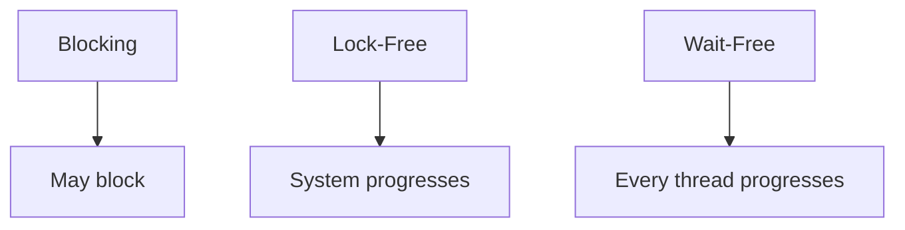

Wait-free algorithms are strongest and hardest to implement.

---

# 17. False Sharing

False sharing occurs when independent variables used by different threads share the same CPU cache line.

Updates invalidate the whole cache line.

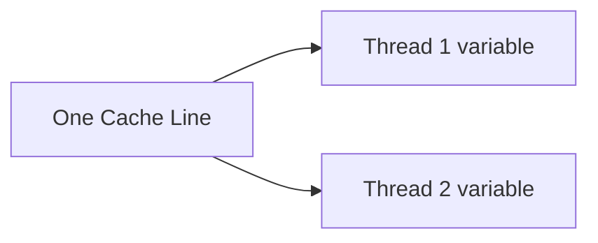

Even though threads do not share the same variable, they contend at hardware level.

Symptoms:

- High CPU usage
- Poor scaling
- Unexpected contention

Solutions:

- Separate frequently updated fields
- Padding
- Use striped counters
- Use specialized JVM annotations only with care

---

# 18. Cache Coherence

Modern CPUs maintain cache coherence.

When one core writes shared memory, other cores' cached copies may be invalidated.

CAS-heavy code can create cache-line ping-pong.

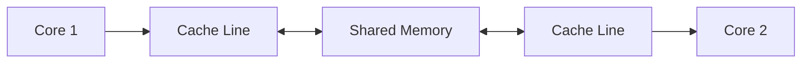

This is why reducing shared writes matters.

---

# 19. ReentrantLock Internals

`ReentrantLock` provides:

- Reentrancy
- Interruptible acquisition
- Timed acquisition
- Fairness option
- Multiple conditions

```java
import java.util.concurrent.locks.ReentrantLock;

public class SafeCounter {

    private final ReentrantLock lock =
            new ReentrantLock();

    private int count;

    public void increment() {
        lock.lock();

        try {
            count++;
        } finally {
            lock.unlock();
        }
    }
}
```

Fair lock:

```java
new ReentrantLock(true);
```

Fairness reduces starvation but may reduce throughput.

---

# 20. AbstractQueuedSynchronizer

AQS is the foundation for many concurrency utilities.

Used by:

- `ReentrantLock`
- `Semaphore`
- `CountDownLatch`
- `ReentrantReadWriteLock`

AQS maintains:

- Synchronization state
- FIFO wait queue
- Acquire/release logic


AQS supports:

- Exclusive mode
- Shared mode

---

# 21. Condition Objects

A `Condition` works like advanced `wait/notify`.

```java
import java.util.concurrent.locks.Condition;
import java.util.concurrent.locks.ReentrantLock;

public class BoundedBuffer<T> {

    private final ReentrantLock lock =
            new ReentrantLock();

    private final Condition notEmpty =
            lock.newCondition();

    private final Condition notFull =
            lock.newCondition();
}
```

Benefits:

- Multiple waiting conditions
- Clearer coordination
- Interruptible waiting
- Timed waiting

---

# 22. ReadWriteLock

A read-write lock allows:

- Multiple concurrent readers
- One exclusive writer

```java
import java.util.concurrent.locks.ReentrantReadWriteLock;

public class ReadMostlyCache<K, V> {

    private final ReentrantReadWriteLock lock =
            new ReentrantReadWriteLock();

    private final Map<K, V> map =
            new HashMap<>();

    public V get(K key) {
        lock.readLock().lock();

        try {
            return map.get(key);
        } finally {
            lock.readLock().unlock();
        }
    }

    public void put(K key, V value) {
        lock.writeLock().lock();

        try {
            map.put(key, value);
        } finally {
            lock.writeLock().unlock();
        }
    }
}
```

Use only when read concurrency meaningfully outweighs lock overhead.

---

# 23. StampedLock

`StampedLock` supports optimistic reads.

```java
import java.util.concurrent.locks.StampedLock;

public class Point {

    private double x;
    private double y;

    private final StampedLock lock =
            new StampedLock();

    public double distance() {
        long stamp =
                lock.tryOptimisticRead();

        double localX = x;
        double localY = y;

        if (!lock.validate(stamp)) {
            stamp = lock.readLock();

            try {
                localX = x;
                localY = y;
            } finally {
                lock.unlockRead(stamp);
            }
        }

        return Math.sqrt(
                localX * localX
                        + localY * localY
        );
    }
}
```

Important:

- Not reentrant
- More complex
- Best for specialized read-heavy scenarios

---

# 24. ConcurrentHashMap Internals

Modern `ConcurrentHashMap` uses:

- CAS
- Fine-grained synchronization
- Bucket-level coordination
- Tree bins under collisions

Reads are mostly non-blocking.

Updates coordinate only around affected bins.

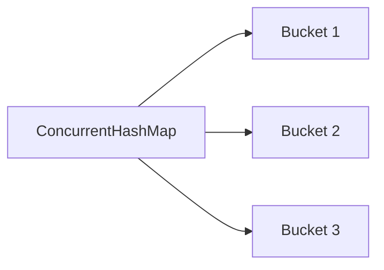

## Atomic update

```java
ConcurrentHashMap<String, Integer> counts =
        new ConcurrentHashMap<>();

counts.merge(
        "java",
        1,
        Integer::sum
);
```

Avoid:

```java
counts.put(
        key,
        counts.getOrDefault(key, 0) + 1
);
```

That is not atomic.

---

# 25. CopyOnWriteArrayList

Writes copy the entire internal array.

Reads are lock-free and stable.

Best for:

- Many reads
- Rare writes
- Listener lists
- Configuration snapshots

```java
CopyOnWriteArrayList<String> listeners =
        new CopyOnWriteArrayList<>();
```

Avoid for write-heavy workloads.

---

# 26. BlockingQueue Internals

Blocking queues coordinate producers and consumers.

Common implementations:

- `ArrayBlockingQueue`
- `LinkedBlockingQueue`
- `PriorityBlockingQueue`
- `SynchronousQueue`
- `DelayQueue`

## ArrayBlockingQueue

- Bounded
- Array-backed
- Predictable memory

## LinkedBlockingQueue

- Linked nodes
- Optionally bounded
- Separate put and take locks in many implementations

## SynchronousQueue

No internal capacity.

Each producer waits for a consumer handoff.


---

# 27. ForkJoinPool and Work Stealing

ForkJoinPool uses work-stealing queues.

Each worker has a deque.

Idle workers steal tasks from others.

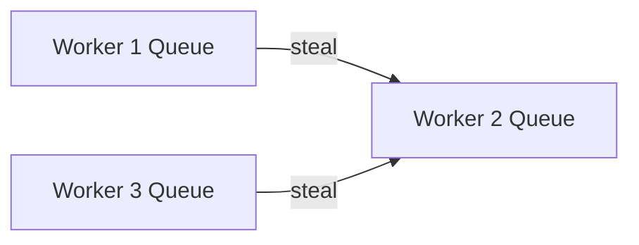

Best for:

- Recursive divide-and-conquer
- CPU-bound tasks
- Independent subtasks

Avoid blocking I/O in the common pool.

---

# 28. ThreadPoolExecutor Internals

A thread pool contains:

- Worker threads
- Task queue
- Rejection policy
- Core pool size
- Maximum pool size
- Keep-alive time

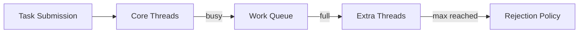

## Example

```java
ThreadPoolExecutor executor =
        new ThreadPoolExecutor(
                4,
                8,
                60,
                TimeUnit.SECONDS,
                new ArrayBlockingQueue<>(100),
                new ThreadPoolExecutor.CallerRunsPolicy()
        );
```

---

# 29. Thread Pool Sizing

## CPU-bound tasks

Approximation:

```text
threads ≈ number of CPU cores
```

or:

```text
cores + 1
```

## I/O-bound tasks

Approximation:

```text
threads = cores × (1 + waitTime / computeTime)
```

Example:

```text
8 cores
wait time = 90 ms
compute time = 10 ms

threads = 8 × (1 + 9) = 80
```

This is only a starting estimate.

Always measure.

---

# 30. Backpressure and Bounded Queues

Backpressure prevents producers from overwhelming consumers.

Bounded queues are essential.

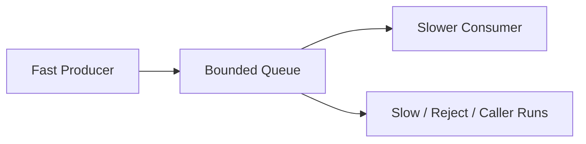

`CallerRunsPolicy` slows the producer by executing rejected work in the caller thread.

---

# 31. CompletableFuture Internals

`CompletableFuture` builds dependency graphs of stages.

Common methods:

- `thenApply`
- `thenCompose`
- `thenCombine`
- `handle`
- `exceptionally`
- `whenComplete`

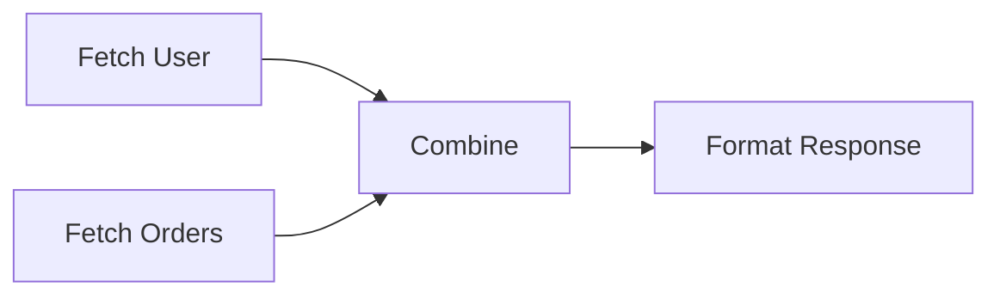

## Example

```java
CompletableFuture<User> userFuture =
        CompletableFuture.supplyAsync(
                this::loadUser,
                executor
        );

CompletableFuture<List<Order>> ordersFuture =
        CompletableFuture.supplyAsync(
                this::loadOrders,
                executor
        );

CompletableFuture<Response> response =
        userFuture.thenCombine(
                ordersFuture,
                Response::new
        );
```

Use custom executors for blocking I/O.

---

# 32. Virtual Threads

Virtual threads are lightweight JVM-managed threads.

They are suitable for:

- Blocking I/O
- High concurrency
- Request-per-thread style

```java
try (
    ExecutorService executor =
            Executors
                    .newVirtualThreadPerTaskExecutor()
) {
    Future<String> future =
            executor.submit(
                    this::callRemoteService
            );

    System.out.println(future.get());
}
```

Virtual threads improve scalability, not CPU speed.

---

# 33. Pinning and Blocking

A virtual thread normally unmounts from its carrier during blocking operations.

Pinning occurs when it cannot unmount.

Typical causes include blocking while holding certain monitors or entering native code.

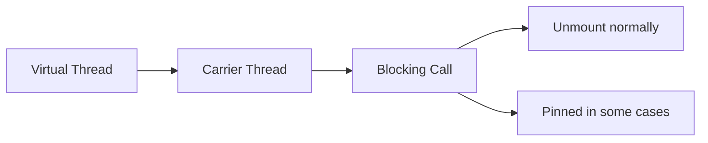

Keep synchronized regions short and avoid blocking inside them where possible.

---

# 34. Structured Concurrency Concepts

Structured concurrency treats related tasks as one unit.

Goals:

- Parent owns child tasks
- Failure propagates clearly
- Cancellation is coordinated
- Lifetimes are bounded

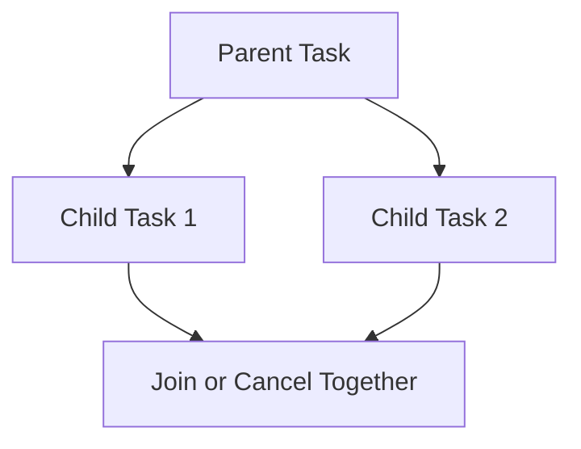

This improves reliability compared with detached background futures.

---

# 35. ThreadLocal Internals

`ThreadLocal` stores values inside each thread.

Conceptually:

```text
Thread -> ThreadLocalMap -> entries
```

```mermaid
flowchart LR
    Thread["Thread"]
    Map["ThreadLocalMap"]
    K1["ThreadLocal Key"]
    V1["Thread-Specific Value"]

    Thread --> Map
    Map --> K1
    K1 --> V1
```

Keys are weak references.

Values are strongly referenced.

If the key is garbage collected but the thread lives, stale values can remain.

Always call:

```java
threadLocal.remove();
```

in thread pools.

---

# 36. InheritableThreadLocal

`InheritableThreadLocal` copies values from parent thread to child thread at creation.

It can be misleading with thread pools because worker threads are reused.

Avoid it for request context in pooled environments.

Use explicit context propagation.

---

# 37. Deadlock, Livelock, and Starvation

## Deadlock

Threads wait forever for each other's locks.

## Livelock

Threads remain active but make no progress.

## Starvation

A thread is continually denied resources.

```mermaid
flowchart LR
    T1["Thread 1"]
    L1["Lock A"]
    L2["Lock B"]
    T2["Thread 2"]

    T1 --> L1
    T1 -->|waits| L2
    T2 --> L2
    T2 -->|waits| L1
```

---

# 38. Deadlock Detection

Use:

- `jstack`
- `jcmd`
- Java Flight Recorder
- VisualVM
- `ThreadMXBean`

## Programmatic detection

```java
import java.lang.management.ManagementFactory;
import java.lang.management.ThreadMXBean;

public class DeadlockDetector {

    public static void main(String[] args) {
        ThreadMXBean bean =
                ManagementFactory
                        .getThreadMXBean();

        long[] ids =
                bean.findDeadlockedThreads();

        if (ids != null) {
            System.out.println(
                    "Deadlock detected"
            );
        }
    }
}
```

---

# 39. Thread Dumps

A thread dump shows:

- Thread names
- States
- Stack traces
- Held locks
- Waiting locks

Common states:

- RUNNABLE
- BLOCKED
- WAITING
- TIMED_WAITING

Look for:

- Many blocked threads
- Repeated stack traces
- Deadlocks
- Pool exhaustion
- Long waits on external calls

---

# 40. Performance Measurement

Do not benchmark concurrency with naive loops.

Use:

- JMH
- Java Flight Recorder
- Async Profiler
- Thread dumps
- CPU profiles
- Allocation profiles

Measure:

- Throughput
- p95 and p99 latency
- Contention
- Queue size
- Context switches
- CPU utilization
- Allocation rate

---

# 41. Practical Coding Examples

## 41.1 Atomic state machine

```java
public enum State {
    NEW,
    RUNNING,
    COMPLETED,
    FAILED
}
```

```java
public class TaskState {

    private final AtomicReference<State> state =
            new AtomicReference<>(State.NEW);

    public boolean start() {
        return state.compareAndSet(
                State.NEW,
                State.RUNNING
        );
    }

    public boolean complete() {
        return state.compareAndSet(
                State.RUNNING,
                State.COMPLETED
        );
    }
}
```

---

## 41.2 Bounded executor

```java
public final class ExecutorFactory {

    private ExecutorFactory() {
    }

    public static ExecutorService create() {
        return new ThreadPoolExecutor(
                4,
                8,
                30,
                TimeUnit.SECONDS,
                new ArrayBlockingQueue<>(200),
                new ThreadPoolExecutor.CallerRunsPolicy()
        );
    }
}
```

---

## 41.3 Timeout with CompletableFuture

```java
CompletableFuture<String> result =
        CompletableFuture
                .supplyAsync(
                        this::loadData,
                        executor
                )
                .orTimeout(
                        2,
                        TimeUnit.SECONDS
                )
                .exceptionally(
                        exception -> "fallback"
                );
```

---

## 41.4 Concurrent frequency counter

```java
ConcurrentHashMap<String, LongAdder> counts =
        new ConcurrentHashMap<>();

public void record(String key) {
    counts.computeIfAbsent(
            key,
            ignored -> new LongAdder()
    ).increment();
}
```

---

## 41.5 Safe memoization

```java
public class Memoizer<K, V> {

    private final ConcurrentHashMap<
            K,
            CompletableFuture<V>
            > cache =
            new ConcurrentHashMap<>();

    public V compute(
            K key,
            Function<K, V> function
    ) {
        CompletableFuture<V> future =
                cache.computeIfAbsent(
                        key,
                        currentKey ->
                                CompletableFuture
                                        .supplyAsync(
                                                () ->
                                                        function.apply(
                                                                currentKey
                                                        )
                                        )
                );

        try {
            return future.join();
        } catch (RuntimeException exception) {
            cache.remove(key, future);
            throw exception;
        }
    }
}
```

---

# 42. Best Practices

1. Minimize shared mutable state.
2. Prefer immutable objects.
3. Use high-level concurrency utilities.
4. Use bounded queues.
5. Use custom executors for blocking tasks.
6. Keep lock scope small.
7. Avoid blocking in common ForkJoinPool.
8. Restore interrupt status.
9. Shut down executors.
10. Use atomic compound operations.
11. Measure before optimizing.
12. Avoid ThreadLocal leaks.
13. Use virtual threads for blocking I/O concurrency.
14. Design idempotent tasks.
15. Use backpressure instead of unlimited buffering.

---

# 43. Anti-Patterns

## 1. Unbounded thread creation

```java
new Thread(task).start();
```

for every request does not scale.

## 2. Unbounded queues

They hide overload until memory is exhausted.

## 3. Blocking common pool

Can starve unrelated tasks.

## 4. Global synchronized lock

Creates system-wide contention.

## 5. Busy waiting

```java
while (!ready) {
}
```

wastes CPU unless intentionally designed with proper memory semantics.

## 6. Swallowing InterruptedException

Breaks cancellation.

## 7. Non-atomic check-then-act

```java
if (!map.containsKey(key)) {
    map.put(key, value);
}
```

Use `putIfAbsent` or `computeIfAbsent`.

---

# 44. Interview Questions and Answers

## 1. What does the Java Memory Model define?

Visibility, ordering, and atomicity rules between threads.

## 2. What is happens-before?

A relationship guaranteeing visibility and ordering.

## 3. Does volatile make count++ atomic?

No.

## 4. What does synchronized guarantee?

Mutual exclusion, visibility, and reentrancy.

## 5. What is CAS?

An atomic conditional update.

## 6. What is the ABA problem?

A value changes and returns to its original value, misleading CAS.

## 7. How is ABA solved?

Use version stamps or immutable state.

## 8. AtomicLong vs LongAdder?

AtomicLong is a single exact value. LongAdder scales better under contention.

## 9. What is lock-free?

The system as a whole always makes progress.

## 10. What is wait-free?

Every thread completes in a bounded number of steps.

## 11. What is false sharing?

Independent variables contend because they share a cache line.

## 12. What is AQS?

A framework for building synchronizers using state and wait queues.

## 13. Why is ReentrantLock called reentrant?

The owning thread can acquire it again.

## 14. Fair vs unfair lock?

Fair locks favor waiting order; unfair locks often provide better throughput.

## 15. What is optimistic reading?

Reading without acquiring a full read lock, then validating.

## 16. Why is ConcurrentHashMap scalable?

Reads are mostly lock-free and updates are coordinated per bin.

## 17. Why use merge or compute?

They perform compound updates atomically.

## 18. When should CopyOnWriteArrayList be used?

Read-heavy, write-light workloads.

## 19. What is SynchronousQueue?

A zero-capacity handoff queue.

## 20. What is work stealing?

Idle workers take tasks from busy workers' queues.

## 21. How do you size a CPU-bound pool?

Approximately number of CPU cores.

## 22. How do you size an I/O-bound pool?

Based on cores and wait-to-compute ratio.

## 23. Why use bounded queues?

To enforce backpressure and avoid memory exhaustion.

## 24. What is CallerRunsPolicy?

The submitting thread executes the rejected task.

## 25. Why use a custom CompletableFuture executor?

To isolate blocking work from the common pool.

## 26. thenApply vs thenCompose?

Transform value vs flatten dependent future.

## 27. What are virtual threads best for?

High-concurrency blocking I/O.

## 28. Do virtual threads make CPU work faster?

No.

## 29. What is virtual-thread pinning?

A virtual thread remains attached to its carrier during some blocking situations.

## 30. What is structured concurrency?

Managing child tasks as a bounded unit with coordinated failure and cancellation.

## 31. Why can ThreadLocal leak?

Thread-pool threads outlive tasks and retain values.

## 32. What is deadlock?

Circular waiting for locks.

## 33. How do you prevent deadlock?

Lock ordering, timeouts, fewer nested locks, tryLock.

## 34. What is starvation?

A thread repeatedly fails to obtain resources.

## 35. What is livelock?

Threads are active but make no progress.

## 36. How do you detect deadlock?

Thread dumps, ThreadMXBean, JFR, jstack.

## 37. What is a lock convoy?

Many threads serialize behind one contended lock.

## 38. What is backpressure?

Slowing or rejecting producers when capacity is exhausted.

## 39. Why is state partitioning useful?

It reduces contention by spreading updates.

## 40. What is safe publication?

Making an object visible with initialization guarantees.

## 41. How can objects be safely published?

Final fields, volatile reference, synchronized block, concurrent collection, static initialization.

## 42. Why are immutable objects thread-safe?

Their state cannot change after construction.

## 43. Why should interrupts be propagated?

Interruption is cooperative cancellation.

## 44. What is spurious wakeup?

A waiting thread wakes without explicit notification.

## 45. Why wait in a loop?

The condition may still be false after waking.

## 46. What is lock striping?

Using multiple locks for independent sections of state.

## 47. Why can CAS perform poorly under contention?

Many threads repeatedly fail and retry.

## 48. Why is benchmarking concurrency difficult?

Scheduling, JIT, warmup, GC, and CPU topology affect results.

## 49. What tool should be used for microbenchmarks?

JMH.

## 50. What is the most important concurrency principle?

Minimize shared mutable state and make coordination explicit.

---

# 45. Summary

Advanced Java concurrency combines JVM memory semantics, hardware behavior, synchronization primitives, concurrent data structures, and execution frameworks.

## Key topics

| Topic | Core idea |
|---|---|
| JMM | Visibility and ordering |
| volatile | Visibility, not compound atomicity |
| synchronized | Mutual exclusion and happens-before |
| CAS | Atomic conditional update |
| AQS | Foundation for synchronizers |
| LongAdder | Scalable high-contention counter |
| ConcurrentHashMap | Fine-grained concurrent map |
| ForkJoinPool | Work stealing |
| ThreadPoolExecutor | Controlled task execution |
| CompletableFuture | Async composition |
| Virtual threads | Lightweight blocking concurrency |
| ThreadLocal | Per-thread state |
| Backpressure | Prevent overload |
| False sharing | Hardware-level contention |

## Final mindset

- Correctness comes first.
- Shared mutation is expensive.
- Visibility matters as much as locking.
- Non-blocking does not automatically mean faster.
- Bounded resources are safer.
- Virtual threads simplify blocking concurrency.
- Measure under realistic load.
- Use thread dumps and profiling tools during incidents.

---

## Recommended Practice Problems

1. Implement a lock-free stack.
2. Demonstrate and solve ABA.
3. Build a high-contention counter benchmark.
4. Design a bounded thread pool.
5. Build a memoization cache.
6. Implement producer-consumer using Condition.
7. Analyze a deadlock thread dump.
8. Compare AtomicLong and LongAdder.
9. Compare platform and virtual threads.
10. Create a CompletableFuture aggregation pipeline.
