# Caching in Depth — System Design and Java Guide

A complete guide to caching for backend engineering and FAANG-style interviews. It covers cache fundamentals, local and distributed caches, eviction policies, consistency models, cache invalidation, Redis internals, hot keys, cache stampede, write strategies, Spring Boot examples, production trade-offs, and interview questions.

---

## Table of Contents

1. [What is Caching?](#1-what-is-caching)
2. [Why Caching is Used](#2-why-caching-is-used)
3. [Cache Hierarchy](#3-cache-hierarchy)
4. [Local vs Distributed Cache](#4-local-vs-distributed-cache)
5. [Cache Hit and Miss](#5-cache-hit-and-miss)
6. [Cache Hit Ratio](#6-cache-hit-ratio)
7. [Cache Latency and Throughput](#7-cache-latency-and-throughput)
8. [Cache-Aside Pattern](#8-cache-aside-pattern)
9. [Read-Through Cache](#9-read-through-cache)
10. [Write-Through Cache](#10-write-through-cache)
11. [Write-Behind Cache](#11-write-behind-cache)
12. [Write-Around Cache](#12-write-around-cache)
13. [Cache Invalidation](#13-cache-invalidation)
14. [TTL-Based Expiration](#14-ttl-based-expiration)
15. [Event-Based Invalidation](#15-event-based-invalidation)
16. [Eviction Policies](#16-eviction-policies)
17. [LRU](#17-lru)
18. [LFU](#18-lfu)
19. [FIFO and Random Eviction](#19-fifo-and-random-eviction)
20. [Cache Consistency](#20-cache-consistency)
21. [Strong vs Eventual Cache Consistency](#21-strong-vs-eventual-cache-consistency)
22. [Stale Data](#22-stale-data)
23. [Cache Stampede](#23-cache-stampede)
24. [Cache Penetration](#24-cache-penetration)
25. [Cache Avalanche](#25-cache-avalanche)
26. [Hot Keys](#26-hot-keys)
27. [Cache Warming](#27-cache-warming)
28. [Negative Caching](#28-negative-caching)
29. [Request Coalescing](#29-request-coalescing)
30. [Distributed Locks](#30-distributed-locks)
31. [Redis Architecture](#31-redis-architecture)
32. [Redis Data Structures](#32-redis-data-structures)
33. [Redis Persistence](#33-redis-persistence)
34. [Redis Replication](#34-redis-replication)
35. [Redis Sentinel](#35-redis-sentinel)
36. [Redis Cluster](#36-redis-cluster)
37. [Redis Hash Slots](#37-redis-hash-slots)
38. [Redis Transactions and Lua](#38-redis-transactions-and-lua)
39. [Caching with Spring Boot](#39-caching-with-spring-boot)
40. [Caffeine Cache](#40-caffeine-cache)
41. [Multi-Level Caching](#41-multi-level-caching)
42. [CDN Caching](#42-cdn-caching)
43. [HTTP Caching](#43-http-caching)
44. [Cache Key Design](#44-cache-key-design)
45. [Serialization](#45-serialization)
46. [Cache Observability](#46-cache-observability)
47. [Capacity Planning](#47-capacity-planning)
48. [Security](#48-security)
49. [Practical System Design Example](#49-practical-system-design-example)
50. [Common Production Problems](#50-common-production-problems)
51. [Best Practices](#51-best-practices)
52. [Anti-Patterns](#52-anti-patterns)
53. [Interview Questions and Answers](#53-interview-questions-and-answers)
54. [Summary](#54-summary)

---

# 1. What is Caching?

Caching stores frequently accessed or expensive-to-compute data in a faster storage layer.

Instead of repeatedly accessing a slower system, the application first checks the cache.

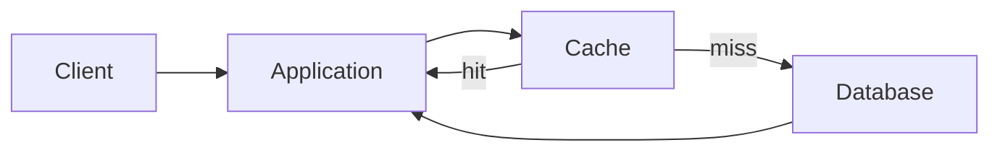

Examples of cached data:

- User profiles
- Product details
- Session data
- API responses
- Database query results
- Authentication tokens
- Configuration
- Images and static files

---

# 2. Why Caching is Used

Caching improves:

- Latency
- Throughput
- Database load
- Cost efficiency
- Availability during temporary backend failures
- User experience

Example:

```text
Database response: 40 ms
Cache response: 2 ms
```

A cache can dramatically reduce request latency.

---

# 3. Cache Hierarchy

Caching can exist at multiple layers.

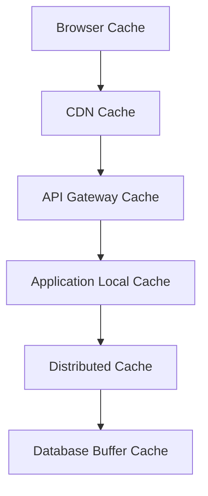

Common layers:

- CPU cache
- Operating-system page cache
- Browser cache
- CDN
- Reverse proxy
- Application memory
- Distributed cache
- Database buffer pool

---

# 4. Local vs Distributed Cache

## Local cache

Stored inside one application instance.

Examples:

- Caffeine
- Guava Cache
- In-memory maps

Advantages:

- Very low latency
- No network call
- Simple

Disadvantages:

- Data duplicated across instances
- Invalidation is harder
- Lost on restart
- Limited by process memory

## Distributed cache

Shared by many application instances.

Examples:

- Redis
- Memcached

Advantages:

- Shared state
- Centralized invalidation
- Larger capacity
- Horizontal scaling

Disadvantages:

- Network latency
- Operational complexity
- External dependency

---

# 5. Cache Hit and Miss

## Cache hit

Requested data exists in cache.

## Cache miss

Requested data is absent or expired.

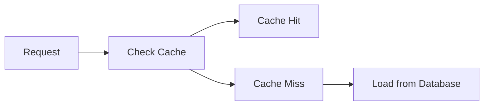

---

# 6. Cache Hit Ratio

Cache hit ratio:

```text
cache hits / total cache lookups
```

Example:

```text
90,000 hits
10,000 misses

Hit ratio = 90%
```

A higher hit ratio usually reduces backend load.

However, hit ratio alone is not enough.

Also monitor:

- Latency
- Evictions
- Memory usage
- Miss cost
- Hot keys
- Error rate

---

# 7. Cache Latency and Throughput

A cache is useful when:

```text
cache lookup cost + miss handling cost
<
direct backend cost
```

A remote cache adds:

- Network latency
- Serialization cost
- Connection-pool overhead

A local cache is faster but less consistent across instances.

---

# 8. Cache-Aside Pattern

Cache-aside is the most common caching pattern.

Flow:

1. Application reads cache
2. On hit, return value
3. On miss, query database
4. Store result in cache
5. Return result

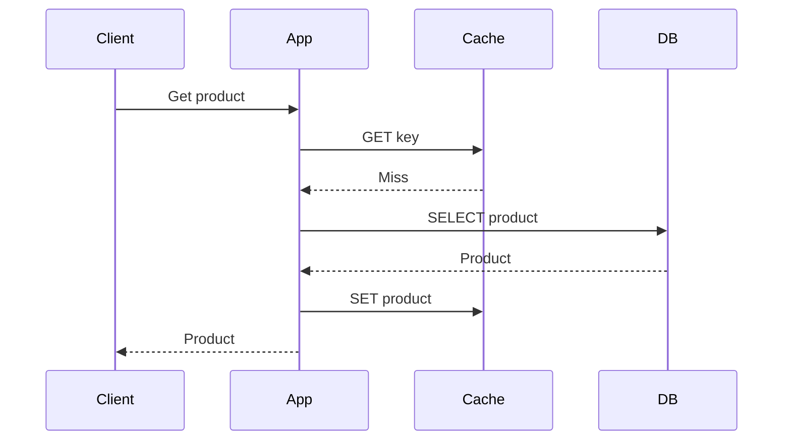

## Java-style pseudocode

```java
public Product getProduct(String productId) {
    Product cached =
            cache.get(productId);

    if (cached != null) {
        return cached;
    }

    Product product =
            repository.findById(productId)
                    .orElseThrow();

    cache.put(productId, product);

    return product;
}
```

---

# 9. Read-Through Cache

In read-through caching, the cache loads data from the backend automatically.

The application talks only to the cache abstraction.

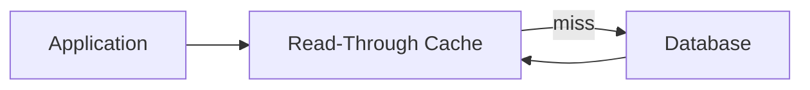

Benefits:

- Simpler application code
- Centralized loading logic

Costs:

- Cache layer becomes more complex
- Backend coupling moves into cache implementation

---

# 10. Write-Through Cache

In write-through caching, writes update cache and database synchronously.

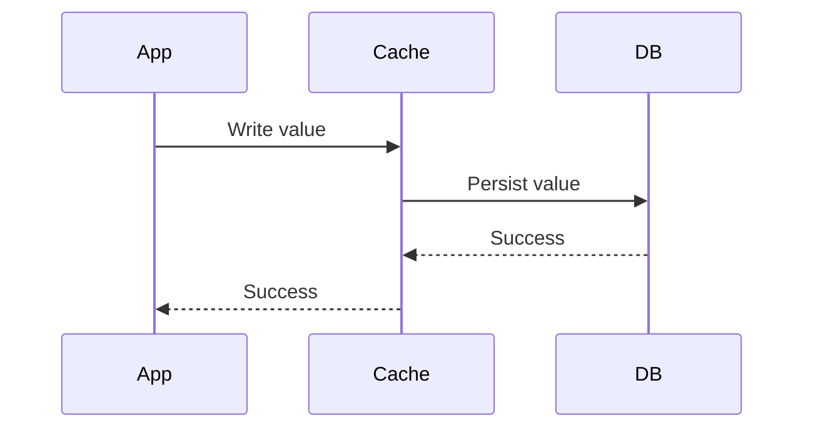

Advantages:

- Cache remains fresh
- Reads are fast

Disadvantages:

- Higher write latency
- Cache participates in write path

---

# 11. Write-Behind Cache

Write-behind stores data in cache first and persists asynchronously.

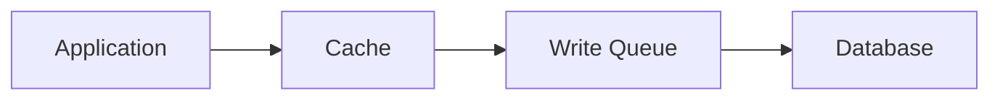

Advantages:

- Very fast writes
- Write batching

Disadvantages:

- Risk of data loss
- More complex durability
- Eventual persistence

Use only when durability requirements permit it.

---

# 12. Write-Around Cache

Writes go directly to the database and bypass the cache.

Reads populate the cache later.

Good for data that is written often but rarely read immediately.

Risk:

- First read after write is a cache miss

---

# 13. Cache Invalidation

Cache invalidation removes or updates stale entries.

Common strategies:

- TTL
- Delete on write
- Update on write
- Event-based invalidation
- Versioned keys
- Manual invalidation

The classic challenge is:

```text
There are only two hard things in computer science:
cache invalidation and naming things.
```

The design must define acceptable staleness.

---

# 14. TTL-Based Expiration

TTL means Time To Live.

```text
SET product:101 value EX 300
```

The key expires after 300 seconds.

Advantages:

- Simple
- Self-cleaning

Disadvantages:

- Data may remain stale until expiry
- Simultaneous expiry can cause spikes

Use randomized TTL to avoid synchronized expiration.

```text
base TTL + random jitter
```

---

# 15. Event-Based Invalidation

When data changes, publish an invalidation event.

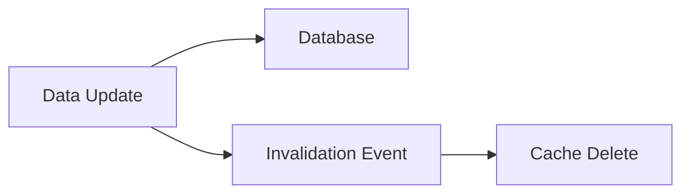

Example event:

```json
{
  "type": "PRODUCT_UPDATED",
  "productId": "101"
}
```

Consumers delete or refresh related keys.

---

# 16. Eviction Policies

When cache memory is full, some entries must be removed.

Common policies:

- LRU
- LFU
- FIFO
- Random
- TTL-based
- Size-based

---

# 17. LRU

LRU means Least Recently Used.

The least recently accessed entry is evicted.

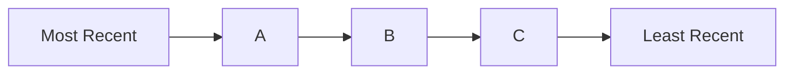

Good when recently accessed items are likely to be accessed again.

---

# 18. LFU

LFU means Least Frequently Used.

Entries with the lowest access frequency are evicted.

Useful when long-term popularity matters.

Potential issue:

An old once-popular key may remain too long unless frequency aging is used.

---

# 19. FIFO and Random Eviction

## FIFO

Evicts the oldest inserted entry.

Simple but ignores access patterns.

## Random

Evicts a random entry.

It is simple and can perform surprisingly well in some workloads.

---

# 20. Cache Consistency

Cache consistency means keeping cache and source of truth aligned.

Common challenges:

- Database updated, cache not updated
- Cache updated, database write fails
- Concurrent writes
- Reordering of events
- Delayed invalidation
- Multi-region propagation

---

# 21. Strong vs Eventual Cache Consistency

## Strong consistency

Reads should reflect the latest committed write.

This is difficult and expensive with distributed caches.

## Eventual consistency

Cache may temporarily be stale but converges later.

Most cache designs accept bounded staleness.

---

# 22. Stale Data

Stale data is outdated cached data.

Possible handling:

- Short TTL
- Explicit invalidation
- Version checks
- Read from primary for critical requests
- Stale-while-revalidate
- User-specific bypass

Critical domains such as balances and inventory may need stronger guarantees.

---

# 23. Cache Stampede

A cache stampede occurs when many requests miss the same key and all query the backend.

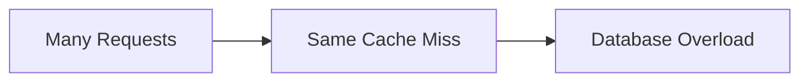

Solutions:

- Distributed lock
- Request coalescing
- Early refresh
- Stale-while-revalidate
- Randomized TTL
- Background refresh

---

# 24. Cache Penetration

Cache penetration occurs when requests repeatedly ask for nonexistent data.

Each request misses cache and hits the database.

Solutions:

- Negative caching
- Input validation
- Bloom filter
- Rate limiting

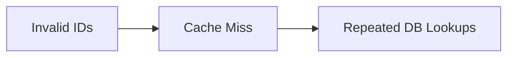

---

# 25. Cache Avalanche

Cache avalanche occurs when many keys expire together or the cache cluster fails.

Effects:

- Sudden backend traffic spike
- Database overload
- Cascading failure

Solutions:

- TTL jitter
- Multi-level cache
- Graceful degradation
- Rate limiting
- Cache high availability
- Prewarming

---

# 26. Hot Keys

A hot key receives disproportionately high traffic.

Examples:

- Viral post
- Popular product
- Global configuration
- Celebrity profile

Problems:

- One cache node becomes overloaded
- Network saturation
- Uneven CPU usage

Solutions:

- Local caching
- Key replication
- Read replicas
- Request coalescing
- Sharded copies
- CDN

---

# 27. Cache Warming

Cache warming preloads expected hot data.

Useful during:

- Deployment
- Traffic spikes
- Promotions
- Cache restart

Risks:

- Warming unnecessary data
- Load spike against backend

Warm only important keys.

---

# 28. Negative Caching

Negative caching stores “not found” results temporarily.

Example:

```text
user:999 -> NOT_FOUND, TTL 30 seconds
```

Benefits:

- Protects backend from repeated invalid lookups

Use short TTL to avoid hiding newly created data for too long.

---

# 29. Request Coalescing

Multiple requests for the same missing key share one backend load.

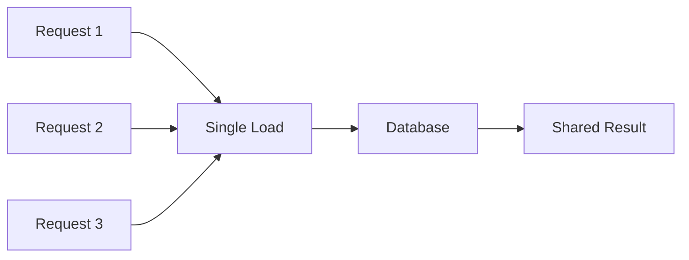

This is also called single-flight behavior.

---

# 30. Distributed Locks

A distributed lock can prevent multiple nodes from rebuilding the same key.

Pseudo-flow:

```text
Try lock cache:lock:product:101
If acquired:
    load from database
    populate cache
    release lock
Else:
    wait briefly or serve stale data
```

Risks:

- Lock expiry
- Stale owner
- Network partition
- Incorrect release

Use fencing tokens for critical distributed coordination.

---

# 31. Redis Architecture

Redis is an in-memory data store commonly used as a distributed cache.

Key characteristics:

- In-memory
- Single-threaded command execution for core data operations
- Event-driven networking
- Rich data structures
- Persistence options
- Replication
- Clustering

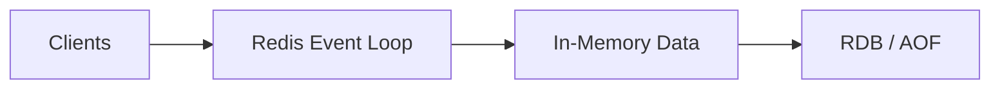

---

# 32. Redis Data Structures

Common structures:

- String
- Hash
- List
- Set
- Sorted set
- Stream
- Bitmap
- HyperLogLog
- Geospatial index

## String

Useful for:

- JSON objects
- Counters
- Tokens

## Hash

Useful for object fields.

## Sorted set

Useful for:

- Leaderboards
- Priority queues
- Delayed jobs

## Stream

Useful for append-only event data and consumer groups.

---

# 33. Redis Persistence

## RDB

Periodic point-in-time snapshots.

Advantages:

- Compact
- Fast restart

Disadvantages:

- Possible data loss between snapshots

## AOF

Logs write operations.

Advantages:

- Better durability

Disadvantages:

- Larger files
- More write overhead

Redis can use both.

---

# 34. Redis Replication

Redis supports primary-replica replication.

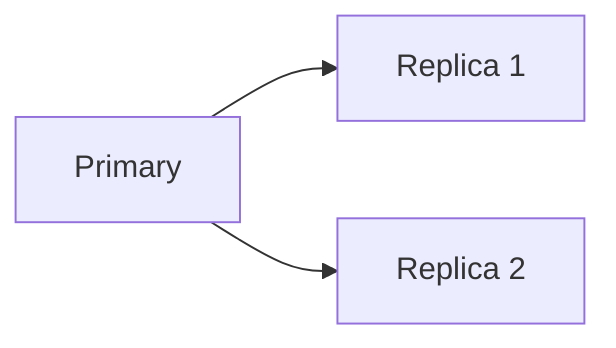

Replication is generally asynchronous.

A recent write may be lost during failover.

---

# 35. Redis Sentinel

Sentinel provides:

- Monitoring
- Failure detection
- Automatic failover
- Primary discovery

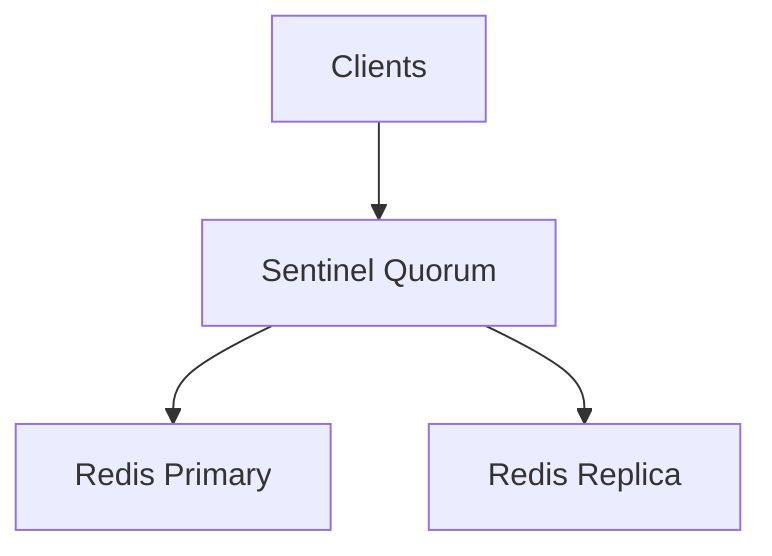

---

# 36. Redis Cluster

Redis Cluster partitions data across multiple nodes.

Benefits:

- Horizontal scale
- Automatic sharding
- High availability

Each key maps to a hash slot.

---

# 37. Redis Hash Slots

Redis Cluster uses 16,384 hash slots.

```text
slot = CRC16(key) mod 16384
```

Each node owns a range of slots.

Hash tags force related keys into the same slot.

Example:

```text
order:{101}:header
order:{101}:items
```

Both use `{101}` for slot calculation.

---

# 38. Redis Transactions and Lua

## MULTI/EXEC

Queues commands and executes them together.

It does not provide rollback like a relational database.

## Lua scripts

Lua runs atomically inside Redis.

Useful for:

- Rate limiting
- Compare-and-delete lock release
- Multi-key updates
- Counters with expiry

Example conceptual script:

```text
if current value equals lock token:
    delete key
```

---

# 39. Caching with Spring Boot

## Enable caching

```java
@Configuration
@EnableCaching
public class CacheConfig {
}
```

## Cacheable

```java
@Service
public class ProductService {

    @Cacheable(
            cacheNames = "products",
            key = "#productId"
    )
    public Product getProduct(
            String productId
    ) {
        return repository.findById(productId)
                .orElseThrow();
    }
}
```

## CachePut

```java
@CachePut(
        cacheNames = "products",
        key = "#product.id"
)
public Product updateProduct(
        Product product
) {
    return repository.save(product);
}
```

## CacheEvict

```java
@CacheEvict(
        cacheNames = "products",
        key = "#productId"
)
public void deleteProduct(
        String productId
) {
    repository.deleteById(productId);
}
```

---

# 40. Caffeine Cache

Caffeine is a high-performance local Java cache.

Example:

```java
Cache<String, Product> cache =
        Caffeine.newBuilder()
                .maximumSize(10_000)
                .expireAfterWrite(
                        Duration.ofMinutes(5)
                )
                .build();
```

Benefits:

- Very low latency
- Advanced eviction
- Async loading
- Statistics

Use for per-instance hot data.

---

# 41. Multi-Level Caching

A multi-level cache combines:

- L1 local cache
- L2 distributed cache
- Database

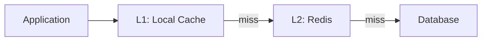

Benefits:

- Very low latency
- Reduced distributed-cache traffic

Challenges:

- Invalidation across instances
- More complex consistency

---

# 42. CDN Caching

A CDN caches content near users.

Useful for:

- Images
- Videos
- Static files
- Public API responses

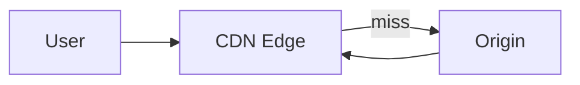

Common controls:

- `Cache-Control`
- `ETag`
- `Last-Modified`
- TTL
- Invalidation API

---

# 43. HTTP Caching

Important headers:

## Cache-Control

```http
Cache-Control: public, max-age=300
```

## ETag

```http
ETag: "version-123"
```

Client sends:

```http
If-None-Match: "version-123"
```

Server may return:

```http
304 Not Modified
```

## Last-Modified

Supports conditional requests using timestamps.

---

# 44. Cache Key Design

A good cache key should be:

- Unique
- Stable
- Compact
- Versioned
- Tenant-aware
- Easy to invalidate

Example:

```text
v2:tenant:42:product:101
```

Avoid:

- Ambiguous keys
- Missing tenant identifier
- Unbounded key length
- Raw sensitive data

---

# 45. Serialization

Remote caches store bytes.

Common formats:

- JSON
- Java serialization
- MessagePack
- Protobuf
- Avro

Trade-offs:

| Format | Strength | Weakness |
|---|---|---|
| JSON | Readable | Larger, slower |
| Protobuf | Compact, fast | Schema required |
| Java serialization | Easy | Fragile and risky |
| MessagePack | Compact | Less human-readable |

Avoid native Java serialization for untrusted data.

---

# 46. Cache Observability

Monitor:

- Hit ratio
- Miss ratio
- Latency
- Evictions
- Memory usage
- Key count
- Expirations
- Error rate
- Connection usage
- Hot keys
- Replication lag
- CPU

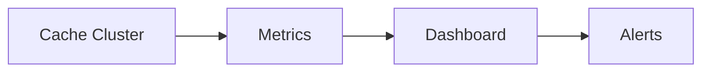

---

# 47. Capacity Planning

Estimate:

- Number of keys
- Average value size
- Metadata overhead
- Replication factor
- Growth
- Eviction headroom

Example:

```text
10 million keys
Average key + value + metadata = 1 KB

Raw memory ≈ 10 GB
```

With replication and safety headroom, required capacity may be much higher.

Do not size cache at 100% memory utilization.

---

# 48. Security

Protect caches using:

- Private networking
- Authentication
- TLS
- ACLs
- Secret rotation
- Least privilege
- Command restrictions
- Data encryption where required

Do not cache:

- Plaintext passwords
- Highly sensitive secrets
- Unbounded personal data
- Data without retention controls

---

# 49. Practical System Design Example

## Product Catalog Cache

Requirements:

- Product reads are frequent
- Product updates are less frequent
- Read latency should be low
- Short staleness is acceptable

## Architecture

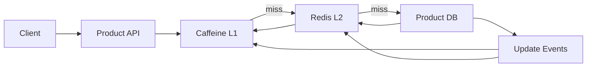

## Read flow

1. Check local cache
2. Check Redis
3. Query database
4. Populate Redis
5. Populate local cache
6. Return result

## Update flow

1. Update database
2. Commit transaction
3. Publish product-updated event
4. Evict Redis key
5. Evict local cache entries

## Reliability

- TTL as safety net
- Idempotent invalidation
- Retry invalidation events
- Monitor event lag
- Use negative caching for missing products

---

# 50. Common Production Problems

## Low hit ratio

Possible causes:

- TTL too short
- Poor key design
- Working set larger than cache
- Random access pattern

## High eviction rate

Possible causes:

- Cache too small
- Too many low-value entries
- Wrong eviction policy

## Database spike after cache restart

Cause:

- Cold cache

Solutions:

- Warm critical keys
- Rate limit misses
- Use multi-level cache

## Stale data complaints

Possible causes:

- Long TTL
- Failed invalidation
- Event lag
- Multiple cache layers

## Hot Redis node

Possible cause:

- Hot key
- Uneven hash distribution
- Large commands

---

# 51. Best Practices

1. Cache only data that benefits from caching.
2. Define acceptable staleness.
3. Use TTL as a safety net.
4. Add TTL jitter.
5. Make invalidation idempotent.
6. Use bounded local caches.
7. Monitor hit ratio and miss cost.
8. Protect against stampedes.
9. Use negative caching carefully.
10. Design stable versioned keys.
11. Avoid very large values.
12. Separate hot and cold data.
13. Plan cache failure behavior.
14. Do not treat cache as the source of truth unless designed for it.
15. Test cold-cache scenarios.

---

# 52. Anti-Patterns

## 1. Cache everything

This wastes memory and increases complexity.

## 2. No TTL

Stale entries may live forever.

## 3. Same TTL for all keys

Can cause cache avalanche.

## 4. Cache as primary database accidentally

Data may be lost during eviction or restart.

## 5. No miss protection

Cache stampede can overload the database.

## 6. Giant cached objects

Serialization and network costs become high.

## 7. Ignoring tenant in key

Can leak data across tenants.

## 8. Updating cache before database commit

May expose data that never committed.

## 9. Blind distributed locking

Incorrect lock handling can create correctness bugs.

## 10. No cache observability

Performance issues become difficult to diagnose.

---

# 53. Interview Questions and Answers

## 1. What is caching?

Storing data in a faster layer to reduce repeated expensive access.

## 2. What is a cache hit?

The requested value is found in cache.

## 3. What is a cache miss?

The requested value is absent or expired.

## 4. What is cache hit ratio?

Hits divided by total lookups.

## 5. Local cache vs distributed cache?

Local cache is per instance and faster; distributed cache is shared and more consistent across nodes.

## 6. What is cache-aside?

Application loads cache on miss and populates it.

## 7. What is read-through caching?

Cache automatically loads data from backend.

## 8. What is write-through caching?

Writes update cache and database synchronously.

## 9. What is write-behind caching?

Writes enter cache first and persist asynchronously.

## 10. What is write-around caching?

Writes bypass cache and go directly to database.

## 11. What is TTL?

Time after which a cache entry expires.

## 12. What is cache invalidation?

Removing or refreshing stale entries.

## 13. What is LRU?

Evict least recently used entry.

## 14. What is LFU?

Evict least frequently used entry.

## 15. What is stale data?

Cached data older than source-of-truth data.

## 16. What is cache stampede?

Many requests miss the same key and overload backend.

## 17. How do you prevent cache stampede?

Single-flight loading, locks, early refresh, stale serving, and TTL jitter.

## 18. What is cache penetration?

Repeated requests for nonexistent data bypass cache.

## 19. How do you prevent cache penetration?

Negative caching, validation, Bloom filters, and rate limiting.

## 20. What is cache avalanche?

Many keys expire together or cache fails, causing backend overload.

## 21. What is a hot key?

A key receiving disproportionate traffic.

## 22. How do you handle hot keys?

Local copies, replication, sharded copies, request coalescing, and CDN.

## 23. What is cache warming?

Preloading expected hot data.

## 24. What is negative caching?

Temporarily caching not-found results.

## 25. What is request coalescing?

Combining concurrent misses for the same key into one load.

## 26. Why is distributed locking difficult?

Leases, failures, stale owners, and network partitions complicate correctness.

## 27. What is Redis?

An in-memory data store used for caching, messaging, and coordination.

## 28. Why is Redis fast?

In-memory data, efficient structures, event-driven networking, and simple command execution.

## 29. What is Redis persistence?

RDB snapshots and AOF logging.

## 30. What is Redis Sentinel?

Monitoring and automatic failover for primary-replica Redis.

## 31. What is Redis Cluster?

A sharded Redis deployment using hash slots.

## 32. How many Redis Cluster hash slots exist?

16,384.

## 33. What are Redis hash tags?

A key substring inside braces used for slot calculation.

## 34. What is a Redis Lua script used for?

Atomic multi-step operations.

## 35. What is multi-level caching?

Combining local and distributed caches.

## 36. What is CDN caching?

Caching content at edge locations near users.

## 37. What is an ETag?

A version identifier for HTTP cache validation.

## 38. What is Cache-Control?

An HTTP header defining caching rules.

## 39. Why version cache keys?

To safely change schemas and invalidate old formats.

## 40. What makes a good cache key?

Uniqueness, stability, compactness, versioning, and tenant awareness.

## 41. What is cache consistency?

Keeping cached data aligned with source data.

## 42. Strong vs eventual cache consistency?

Strong reflects latest writes; eventual allows temporary staleness.

## 43. Why add TTL jitter?

To prevent many entries from expiring simultaneously.

## 44. Why avoid giant cache values?

They increase memory, serialization, latency, and network costs.

## 45. Why use bounded local caches?

To avoid process memory exhaustion.

## 46. What metrics should be monitored?

Hit ratio, miss rate, latency, evictions, memory, errors, and hot keys.

## 47. What happens when Redis is unavailable?

Use fallback, direct database access with protection, stale data, or graceful degradation.

## 48. Should cache be a source of truth?

Usually no, unless the system is explicitly designed for durable cache semantics.

## 49. What is stale-while-revalidate?

Serve stale value while refreshing it in the background.

## 50. What is the most important caching principle?

Define consistency and failure behavior before adding the cache.

---

# 54. Summary

Caching improves latency and throughput by storing data in faster layers.

## Core concepts

| Topic | Key Idea |
|---|---|
| Cache-aside | Load on miss |
| Read-through | Cache loads backend |
| Write-through | Synchronous cache and DB write |
| Write-behind | Async persistence |
| TTL | Automatic expiration |
| LRU | Evict least recent |
| LFU | Evict least frequent |
| Stampede | Many misses overload backend |
| Penetration | Invalid keys bypass cache |
| Avalanche | Mass expiry or cache failure |
| Hot key | Uneven traffic concentration |
| Redis Cluster | Distributed hash-slot cache |
| Multi-level cache | Local plus distributed cache |

## Final mindset

- Cache only valuable data.
- Define acceptable staleness.
- Add TTL and jitter.
- Protect the backend from misses.
- Keep the source of truth clear.
- Make invalidation reliable.
- Monitor cache effectiveness.
- Plan for cache failure.
- Use stable and secure keys.
- Test cold-cache and failure scenarios.

---

## Recommended Practice Tasks

1. Implement an LRU cache.
2. Implement cache-aside with Redis.
3. Add negative caching.
4. Prevent a cache stampede.
5. Build a two-level cache with Caffeine and Redis.
6. Design product-cache invalidation using Kafka.
7. Implement a Redis-based rate limiter.
8. Analyze hot-key traffic.
9. Configure Redis Sentinel or Cluster.
10. Add cache metrics to a Spring Boot service.
