# Database Internals — In-Depth Guide

A complete guide to database internals for backend engineering and FAANG-style interviews. It covers storage engines, pages, B+ trees, indexing, query planning, transactions, locking, MVCC, isolation levels, write-ahead logging, recovery, replication, partitioning, sharding, connection pooling, performance tuning, and interview questions.

---

## Table of Contents

1. [What is a Database Internals Study?](#1-what-is-a-database-internals-study)
2. [Database Architecture Overview](#2-database-architecture-overview)
3. [Storage Engine](#3-storage-engine)
4. [Pages and Blocks](#4-pages-and-blocks)
5. [Rows and Record Layout](#5-rows-and-record-layout)
6. [Heap Files](#6-heap-files)
7. [B-Tree and B+ Tree](#7-b-tree-and-b-tree)
8. [Hash Indexes](#8-hash-indexes)
9. [Clustered and Non-Clustered Indexes](#9-clustered-and-non-clustered-indexes)
10. [Primary and Secondary Indexes](#10-primary-and-secondary-indexes)
11. [Composite Indexes](#11-composite-indexes)
12. [Covering Indexes](#12-covering-indexes)
13. [Index Selectivity](#13-index-selectivity)
14. [Index Scan vs Table Scan](#14-index-scan-vs-table-scan)
15. [Query Processing Pipeline](#15-query-processing-pipeline)
16. [Query Parser and Optimizer](#16-query-parser-and-optimizer)
17. [Execution Plans](#17-execution-plans)
18. [Join Algorithms](#18-join-algorithms)
19. [Sort and Aggregate Operations](#19-sort-and-aggregate-operations)
20. [ACID Properties](#20-acid-properties)
21. [Transactions](#21-transactions)
22. [Isolation Levels](#22-isolation-levels)
23. [Dirty Read](#23-dirty-read)
24. [Non-Repeatable Read](#24-non-repeatable-read)
25. [Phantom Read](#25-phantom-read)
26. [Lost Update](#26-lost-update)
27. [Locking](#27-locking)
28. [Shared and Exclusive Locks](#28-shared-and-exclusive-locks)
29. [Intent Locks](#29-intent-locks)
30. [Row, Page, and Table Locks](#30-row-page-and-table-locks)
31. [Deadlocks](#31-deadlocks)
32. [MVCC](#32-mvcc)
33. [Snapshot Isolation](#33-snapshot-isolation)
34. [Optimistic vs Pessimistic Locking](#34-optimistic-vs-pessimistic-locking)
35. [Write-Ahead Logging](#35-write-ahead-logging)
36. [Checkpoints](#36-checkpoints)
37. [Crash Recovery](#37-crash-recovery)
38. [Buffer Pool](#38-buffer-pool)
39. [Page Cache](#39-page-cache)
40. [Replication](#40-replication)
41. [Synchronous vs Asynchronous Replication](#41-synchronous-vs-asynchronous-replication)
42. [Read Replicas](#42-read-replicas)
43. [Partitioning](#43-partitioning)
44. [Sharding](#44-sharding)
45. [Consistent Hashing](#45-consistent-hashing)
46. [Distributed Transactions](#46-distributed-transactions)
47. [Connection Pooling](#47-connection-pooling)
48. [Pagination](#48-pagination)
49. [N+1 Query Problem](#49-n1-query-problem)
50. [Query Optimization](#50-query-optimization)
51. [Database Observability](#51-database-observability)
52. [Practical SQL Examples](#52-practical-sql-examples)
53. [Common Production Problems](#53-common-production-problems)
54. [Best Practices](#54-best-practices)
55. [Anti-Patterns](#55-anti-patterns)
56. [Interview Questions and Answers](#56-interview-questions-and-answers)
57. [Summary](#57-summary)

---

# 1. What is a Database Internals Study?

Database internals explain how a database stores, indexes, retrieves, updates, and protects data.

A backend engineer should understand:

- How rows are stored
- How indexes work
- How queries are planned
- How transactions stay correct
- How crashes are recovered
- How replication works
- Why some queries are slow
- How databases scale

---

# 2. Database Architecture Overview

A relational database commonly contains:

- SQL parser
- Query optimizer
- Execution engine
- Buffer manager
- Transaction manager
- Lock manager
- Storage engine
- Recovery manager

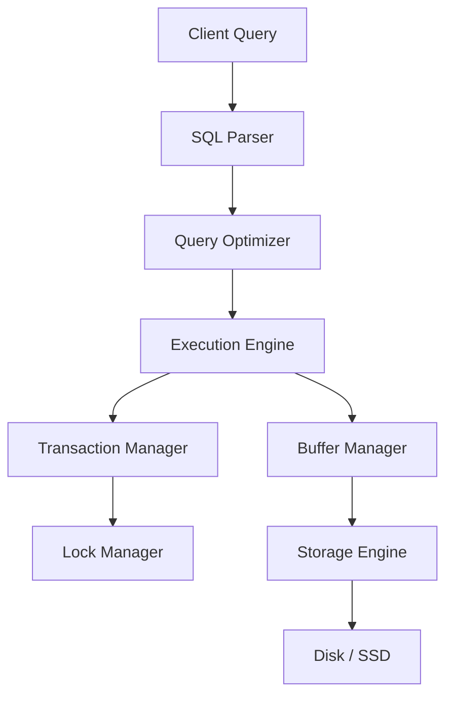

---

# 3. Storage Engine

The storage engine manages how data is physically stored.

Responsibilities:

- Page layout
- Row storage
- Index maintenance
- Buffering
- Logging
- Recovery
- Concurrency control

Different database systems may support different storage engines.

Examples include:

- Row-oriented engines
- Column-oriented engines
- LSM-tree engines
- B-tree-based engines

---

# 4. Pages and Blocks

Databases do not usually read one row directly from disk.

They read fixed-size units called pages or blocks.

Typical sizes may be:

```text
4 KB
8 KB
16 KB
```

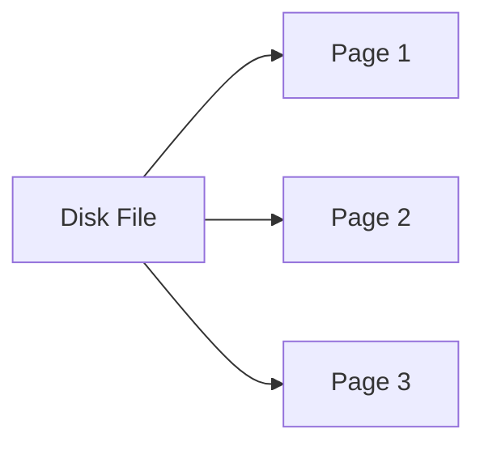

A page may contain:

- Header
- Row directory
- Row data
- Free space

---

# 5. Rows and Record Layout

A row typically contains:

- Fixed-length columns
- Variable-length columns
- Null bitmap
- Row metadata
- Transaction metadata

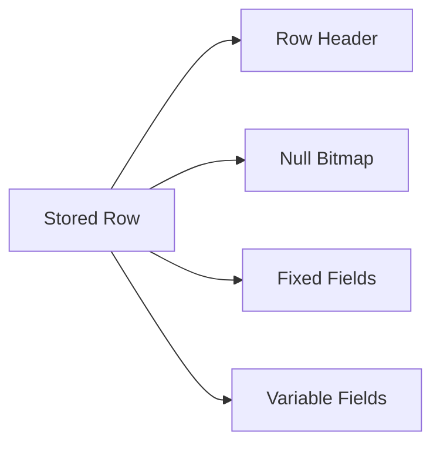

Wide rows consume more pages and increase I/O.

---

# 6. Heap Files

A heap file stores rows without a defined physical order.

Advantages:

- Fast insertion
- Simple storage

Disadvantages:

- Full scans can be expensive
- Lookup often requires an index

An index may point from key to row location.

---

# 7. B-Tree and B+ Tree

B+ trees are widely used for database indexes.

Properties:

- Balanced tree
- Sorted keys
- High branching factor
- Few disk reads
- Efficient range queries

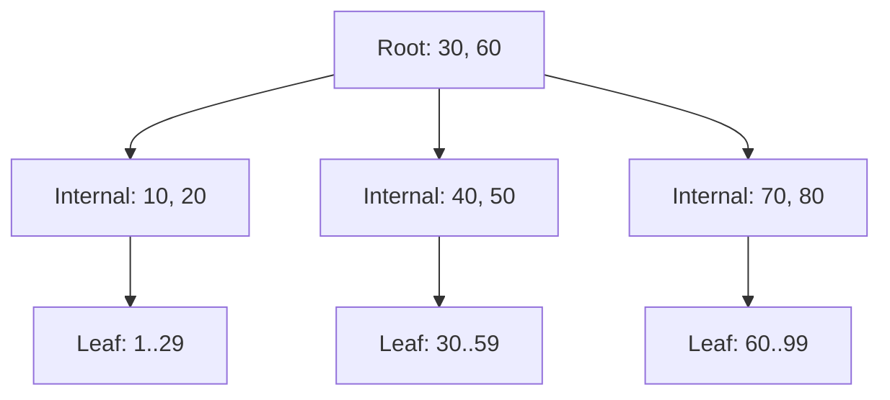

## Why B+ tree instead of binary tree?

Because each node stores many keys.

This reduces tree height and disk I/O.

## Leaf nodes

Leaf nodes are usually linked.

This makes range scans efficient.

---

# 8. Hash Indexes

Hash indexes map a key to a bucket.

Best for:

```text
Exact equality lookup
```

Example:

```sql
WHERE user_id = 101
```

Weak for:

- Range queries
- Sorting
- Prefix scans

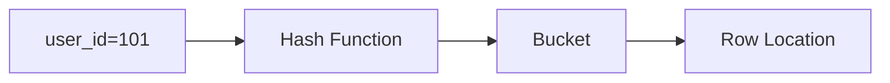

---

# 9. Clustered and Non-Clustered Indexes

## Clustered index

The table data is physically organized according to the index order.

A table generally has one clustered order.

## Non-clustered index

The index is separate from the table data and points to rows.

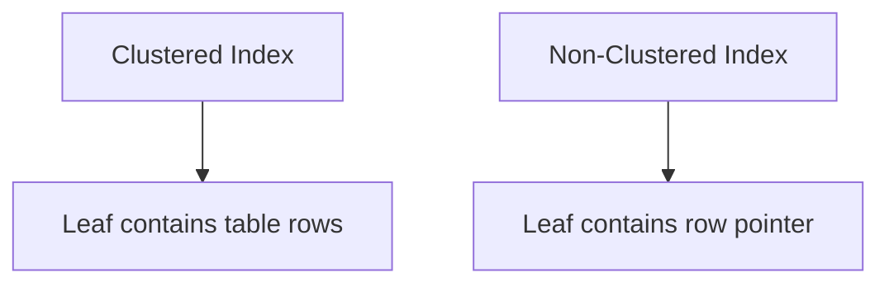

---

# 10. Primary and Secondary Indexes

A primary index is commonly associated with the primary key.

A secondary index is built on non-primary columns.

Example:

```sql
CREATE INDEX idx_users_email
ON users(email);
```

Secondary indexes improve reads but increase:

- Storage
- Insert cost
- Update cost
- Delete cost

---

# 11. Composite Indexes

A composite index contains multiple columns.

Example:

```sql
CREATE INDEX idx_orders_customer_status
ON orders(customer_id, status);
```

The column order matters.

This index may support:

```sql
WHERE customer_id = ?
```

and:

```sql
WHERE customer_id = ?
AND status = ?
```

It may not efficiently support:

```sql
WHERE status = ?
```

This is commonly described by the leftmost-prefix rule.

---

# 12. Covering Indexes

A covering index contains all columns required by a query.

Example:

```sql
CREATE INDEX idx_orders_cover
ON orders(customer_id, status, total_amount);
```

Query:

```sql
SELECT status, total_amount
FROM orders
WHERE customer_id = ?;
```

The database may answer from the index without reading the table.

Benefits:

- Fewer page reads
- Lower latency

Costs:

- Larger index
- More write overhead

---

# 13. Index Selectivity

Selectivity measures how uniquely an index filters data.

High selectivity:

```text
email
order_id
phone_number
```

Low selectivity:

```text
gender
boolean status
country with few values
```

Low-selectivity indexes may not be useful for many queries.

---

# 14. Index Scan vs Table Scan

## Table scan

Reads most or all table pages.

Good when:

- Table is small
- Query returns large percentage of rows
- Index is unavailable

## Index scan

Uses index structure to find rows.

Good when:

- Predicate is selective
- Range is small
- Index covers query

The optimizer chooses based on estimated cost.

---

# 15. Query Processing Pipeline

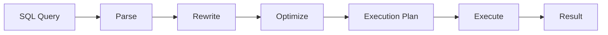

---

# 16. Query Parser and Optimizer

## Parser

Checks:

- Syntax
- Object names
- Data types
- Permissions

## Optimizer

Chooses:

- Join order
- Join algorithm
- Index usage
- Scan type
- Sort strategy
- Parallelism

The optimizer relies on statistics.

Poor or stale statistics can produce poor plans.

---

# 17. Execution Plans

Execution plans show how the database will run a query.

Common operators:

- Sequential scan
- Index scan
- Index-only scan
- Nested-loop join
- Hash join
- Merge join
- Sort
- Aggregate

Example:

```sql
EXPLAIN ANALYZE
SELECT *
FROM orders
WHERE customer_id = 101;
```

Important values:

- Estimated rows
- Actual rows
- Cost
- Execution time
- Loops
- Buffers

Large differences between estimated and actual rows indicate statistics or data-distribution issues.

---

# 18. Join Algorithms

## Nested-loop join

For each row in outer input, search matching rows in inner input.

Good when:

- Outer result is small
- Inner side has useful index

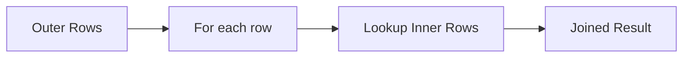

## Hash join

Builds a hash table for one input and probes it with the other.

Good for:

- Equality joins
- Large unsorted inputs

## Merge join

Sorts or uses sorted inputs and merges them.

Good for:

- Sorted data
- Large range joins
- Equality joins

---

# 19. Sort and Aggregate Operations

Sorting may happen:

- In memory
- On disk if memory is insufficient

Disk spills are slower.

Aggregations may use:

- Hash aggregation
- Sort aggregation

Monitor temporary disk usage during large queries.

---

# 20. ACID Properties

## Atomicity

A transaction fully succeeds or fully fails.

## Consistency

A transaction preserves database rules.

## Isolation

Concurrent transactions behave according to an isolation model.

## Durability

Committed data survives failures.

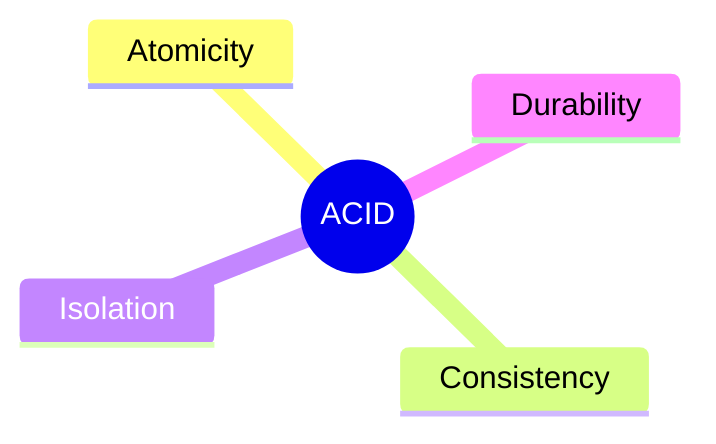

---

# 21. Transactions

A transaction groups operations into one logical unit.

```sql
BEGIN;

UPDATE accounts
SET balance = balance - 100
WHERE account_id = 1;

UPDATE accounts
SET balance = balance + 100
WHERE account_id = 2;

COMMIT;
```

On failure:

```sql
ROLLBACK;
```

Transactions should be:

- Short
- Focused
- Consistent in lock ordering

---

# 22. Isolation Levels

Common isolation levels:

- Read Uncommitted
- Read Committed
- Repeatable Read
- Serializable

| Isolation Level | Dirty Read | Non-Repeatable Read | Phantom Read |
|---|---|---|---|
| Read Uncommitted | Possible | Possible | Possible |
| Read Committed | Prevented | Possible | Possible |
| Repeatable Read | Prevented | Prevented | Depends on implementation |
| Serializable | Prevented | Prevented | Prevented |

Actual behavior varies by database implementation.

---

# 23. Dirty Read

A transaction reads uncommitted data from another transaction.

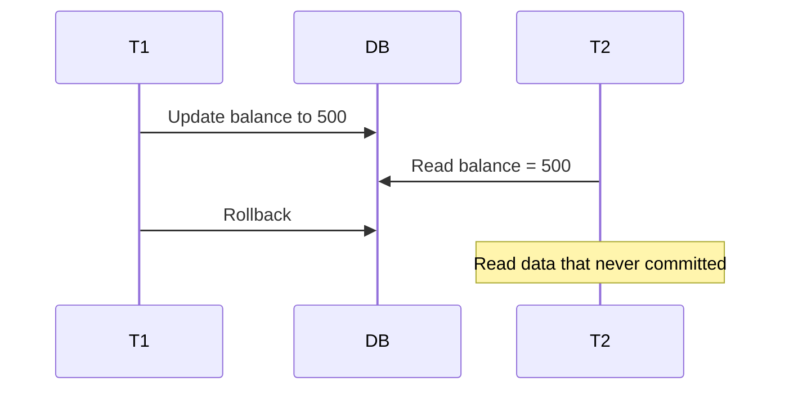

---

# 24. Non-Repeatable Read

A transaction reads the same row twice and sees different values.

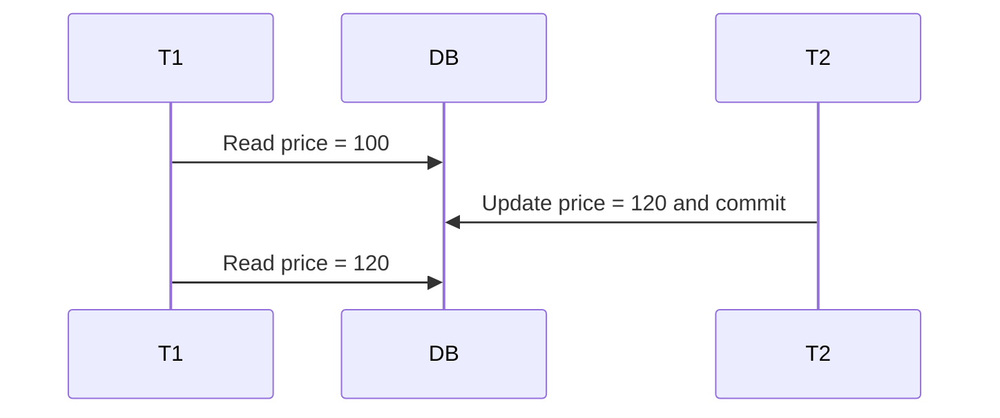

---

# 25. Phantom Read

A transaction repeats a query and sees new or missing rows.

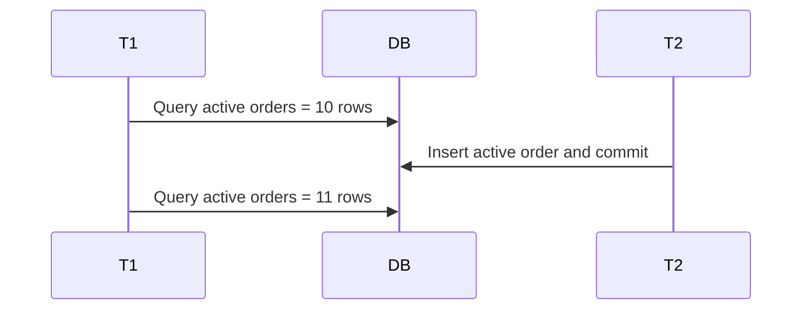

---

# 26. Lost Update

Two transactions read the same value and overwrite each other.

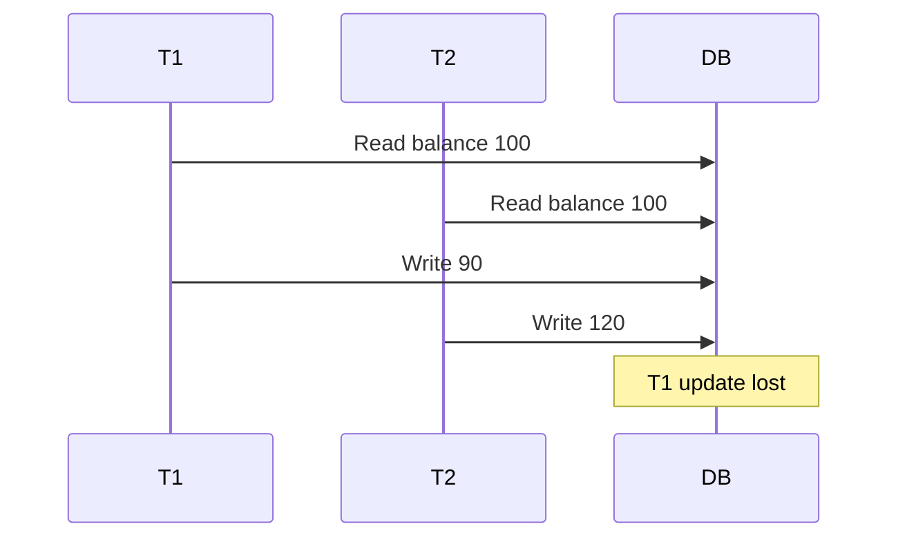

Solutions:

- Atomic SQL update
- Optimistic locking
- Pessimistic locking
- Serializable isolation

---

# 27. Locking

Locks coordinate concurrent transactions.

Common lock types:

- Shared
- Exclusive
- Intent
- Predicate
- Row
- Page
- Table

Locking improves correctness but may reduce concurrency.

---

# 28. Shared and Exclusive Locks

## Shared lock

Allows multiple readers.

## Exclusive lock

Allows one writer and blocks conflicting access.

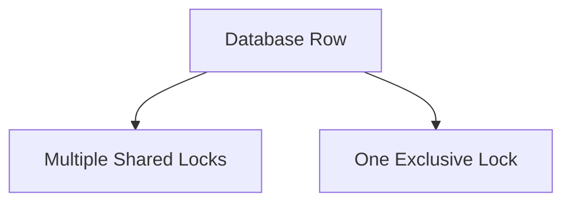

---

# 29. Intent Locks

Intent locks indicate that lower-level locks exist or will be acquired.

Examples:

- Intent shared
- Intent exclusive
- Shared with intent exclusive

They help the database coordinate row and table-level locking.

---

# 30. Row, Page, and Table Locks

## Row lock

High concurrency, higher lock-management overhead.

## Page lock

Locks a group of rows.

## Table lock

Low overhead but low concurrency.

Some databases perform lock escalation when too many fine-grained locks are held.

---

# 31. Deadlocks

A deadlock occurs when transactions wait on each other.

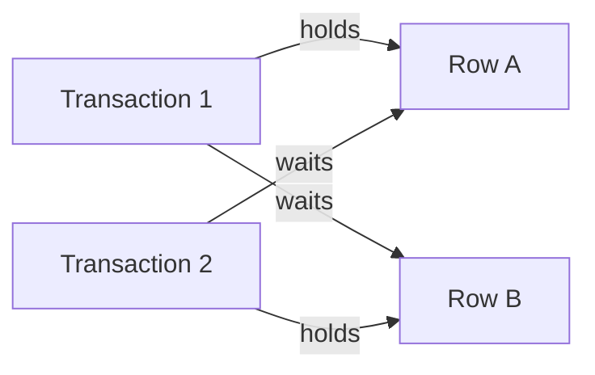

The database detects the cycle and aborts one transaction.

Prevention:

- Consistent update order
- Short transactions
- Proper indexes
- Retry aborted transactions
- Avoid unnecessary lock duration

---

# 32. MVCC

MVCC means Multi-Version Concurrency Control.

Instead of overwriting a row immediately, the database may keep multiple versions.

Readers can see a consistent snapshot while writers continue.

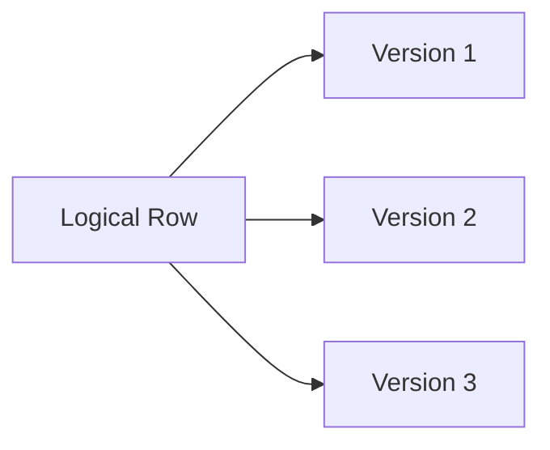

Benefits:

- Readers often do not block writers
- Better concurrency
- Snapshot-based reads

Costs:

- Old-version cleanup
- Storage overhead
- Vacuum or purge work

---

# 33. Snapshot Isolation

A transaction reads from a consistent snapshot.

It may avoid many read anomalies.

However, snapshot isolation can still allow write skew in some systems.

Serializable isolation provides stronger guarantees.

---

# 34. Optimistic vs Pessimistic Locking

## Optimistic locking

Assumes conflicts are rare.

Uses a version column.

```sql
UPDATE products
SET stock = 9,
    version = version + 1
WHERE product_id = 101
  AND version = 5;
```

If affected rows are zero, a conflict occurred.

## Pessimistic locking

Locks the row before modification.

```sql
SELECT *
FROM products
WHERE product_id = 101
FOR UPDATE;
```

Use optimistic locking for low conflict.

Use pessimistic locking for high-conflict critical updates.

---

# 35. Write-Ahead Logging

WAL means changes are written to a durable log before data pages are persisted.

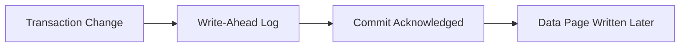

WAL provides:

- Durability
- Crash recovery
- Replication support

---

# 36. Checkpoints

A checkpoint records that dirty pages up to a known log position have been flushed.

Benefits:

- Reduces recovery time
- Limits WAL replay

Too-frequent checkpoints can create I/O spikes.

Too-infrequent checkpoints increase recovery time.

---

# 37. Crash Recovery

After a crash, the database may:

1. Read the WAL
2. Redo committed changes
3. Undo incomplete changes
4. Restore a consistent state

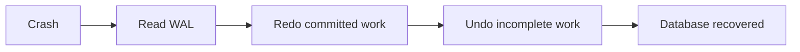

---

# 38. Buffer Pool

The buffer pool caches database pages in memory.

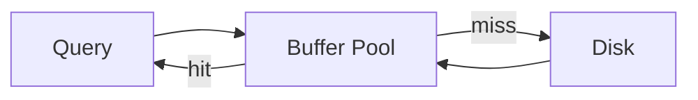

A high buffer hit ratio usually indicates fewer disk reads.

However, hit ratio alone does not prove good performance.

---

# 39. Page Cache

The operating system may also cache disk pages.

Some databases rely heavily on OS page cache.

Others manage their own buffer pool.

Total memory planning must account for both database and OS caching.

---

# 40. Replication

Replication copies data to other nodes.

Common purposes:

- High availability
- Read scaling
- Disaster recovery
- Geographic distribution

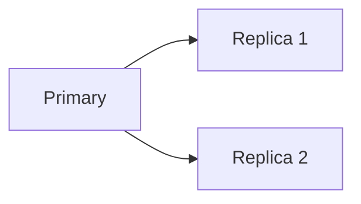

---

# 41. Synchronous vs Asynchronous Replication

## Synchronous

Commit waits for replica acknowledgment.

Advantages:

- Stronger durability

Disadvantages:

- Higher latency
- Reduced availability if replica is unavailable

## Asynchronous

Primary acknowledges first.

Advantages:

- Lower latency
- Better write availability

Disadvantages:

- Replication lag
- Possible data loss during failover

---

# 42. Read Replicas

Read replicas can serve read-only traffic.

Good for:

- Reports
- Analytics
- Product browsing
- Search-like reads

Risks:

- Stale reads
- Read-after-write inconsistency
- Replica lag

Critical reads may need primary routing.

---

# 43. Partitioning

Partitioning splits a large table logically.

Types:

- Range
- Hash
- List
- Time-based

Example:

```text
orders_2025
orders_2026
```

Benefits:

- Faster pruning
- Easier archival
- Smaller maintenance units

---

# 44. Sharding

Sharding splits data across independent database nodes.

```mermaid
flowchart TB
    Router["Shard Router"]
    S1["Shard 1"]
    S2["Shard 2"]
    S3["Shard 3"]

    Router --> S1
    Router --> S2
    Router --> S3
```

Challenges:

- Cross-shard joins
- Rebalancing
- Global uniqueness
- Distributed transactions
- Hot shards

---

# 45. Consistent Hashing

Consistent hashing reduces key movement when shard nodes change.

Virtual nodes improve balance.

Useful for:

- Distributed caches
- Key-value stores
- Sharded services

---

# 46. Distributed Transactions

A transaction spanning multiple databases is difficult.

Approaches:

- Two-phase commit
- Saga
- Transactional outbox
- Idempotent consumers

Two-phase commit provides coordination but can reduce availability.

Modern microservices often prefer sagas and local transactions.

---

# 47. Connection Pooling

Database connections are expensive.

A pool reuses connections.

```mermaid
flowchart LR
    Requests["Application Requests"]
    Pool["Connection Pool"]
    DB["Database"]

    Requests --> Pool
    Pool --> DB
```

Important settings:

- Maximum pool size
- Minimum idle
- Connection timeout
- Idle timeout
- Max lifetime
- Validation

Too many connections can overload the database.

---

# 48. Pagination

## Offset pagination

```sql
SELECT *
FROM orders
ORDER BY created_at DESC
LIMIT 20 OFFSET 100000;
```

Problems:

- Large offsets are slow
- Results may shift during updates

## Keyset pagination

```sql
SELECT *
FROM orders
WHERE created_at < ?
ORDER BY created_at DESC
LIMIT 20;
```

Benefits:

- Better performance
- Stable navigation

---

# 49. N+1 Query Problem

One query loads parent rows.

Then one query per parent loads children.

```text
1 query for orders
N queries for order items
```

Solutions:

- Join fetch
- Batch fetching
- Entity graph
- Explicit query
- Data loader pattern

---

# 50. Query Optimization

Optimization workflow:

1. Identify slow query
2. Capture execution plan
3. Check actual vs estimated rows
4. Review indexes
5. Reduce selected columns
6. Remove unnecessary joins
7. Avoid functions on indexed columns
8. Check sorting and spills
9. Refresh statistics
10. Test under realistic load

## Sargable query

Good:

```sql
WHERE created_at >= '2026-01-01'
```

Poor:

```sql
WHERE YEAR(created_at) = 2026
```

The function may prevent index usage.

---

# 51. Database Observability

Monitor:

- Query latency
- Slow queries
- Active connections
- Lock waits
- Deadlocks
- Buffer hit ratio
- Cache misses
- Replication lag
- WAL growth
- Disk IOPS
- CPU
- Temporary files
- Checkpoint duration

```mermaid
flowchart LR
    DB["Database"]
    Metrics["Metrics"]
    Logs["Logs"]
    Traces["Query Traces"]
    Dashboard["Dashboard"]

    DB --> Metrics
    DB --> Logs
    DB --> Traces
    Metrics --> Dashboard
    Logs --> Dashboard
    Traces --> Dashboard
```

---

# 52. Practical SQL Examples

## Composite index

```sql
CREATE INDEX idx_orders_customer_created
ON orders(customer_id, created_at DESC);
```

## Atomic inventory decrement

```sql
UPDATE inventory
SET quantity = quantity - 1
WHERE product_id = ?
  AND quantity > 0;
```

Check affected row count.

## Optimistic locking

```sql
UPDATE accounts
SET balance = ?,
    version = version + 1
WHERE account_id = ?
  AND version = ?;
```

## Keyset pagination

```sql
SELECT order_id,
       created_at,
       status
FROM orders
WHERE created_at < ?
ORDER BY created_at DESC
LIMIT 50;
```

## Upsert

Database syntax varies, but the goal is atomic insert-or-update.

---

# 53. Common Production Problems

## Slow query after data growth

Cause:

- Missing index
- Poor plan
- Stale statistics
- Larger result set

## Connection pool exhaustion

Cause:

- Slow queries
- Leaked connections
- Oversized transactions
- Database saturation

## Deadlock spikes

Cause:

- Inconsistent lock order
- Long transactions
- Missing indexes

## Replica lag

Cause:

- High write rate
- Slow replica disk
- Long-running queries
- Network delay

## Table bloat

Cause:

- MVCC dead versions
- Delayed vacuum or cleanup

---

# 54. Best Practices

1. Design indexes from query patterns.
2. Keep transactions short.
3. Use connection pools with bounded size.
4. Avoid `SELECT *` in hot paths.
5. Use atomic SQL updates.
6. Monitor execution plans.
7. Use keyset pagination for large data sets.
8. Keep statistics current.
9. Separate OLTP and heavy analytics workloads.
10. Plan replication lag behavior.
11. Use optimistic locking where conflicts are rare.
12. Handle deadlock retries.
13. Avoid cross-shard queries where possible.
14. Archive old data.
15. Test schema changes safely.

---

# 55. Anti-Patterns

## 1. Indexing every column

Writes become expensive and storage grows.

## 2. No indexes

Reads become table scans.

## 3. Long-running transactions

Locks and old MVCC versions accumulate.

## 4. Unlimited database connections

The database becomes overloaded.

## 5. Offset pagination at huge offsets

Performance degrades.

## 6. Shared database ownership across many services

Creates coupling.

## 7. Ignoring replica lag

Users may see stale data.

## 8. Blind ORM usage

Can create N+1 queries and inefficient SQL.

## 9. Using database as message queue without design

Can create contention and polling load.

## 10. Optimizing without execution plans

Changes may make performance worse.

---

# 56. Interview Questions and Answers

## 1. What is a database page?

A fixed-size unit of storage and I/O.

## 2. Why do databases use B+ trees?

They provide shallow trees, sorted keys, and efficient range scans.

## 3. B+ tree vs hash index?

B+ tree supports equality and range queries. Hash index is mainly for equality.

## 4. What is a clustered index?

An index whose order determines the physical row organization.

## 5. What is a secondary index?

An additional index on non-primary columns.

## 6. What is a composite index?

An index over multiple columns.

## 7. What is the leftmost-prefix rule?

A composite index is most useful when query predicates use leading indexed columns.

## 8. What is a covering index?

An index containing all columns needed by a query.

## 9. What is selectivity?

How effectively a predicate narrows rows.

## 10. What is a table scan?

Reading most or all table pages.

## 11. What does a query optimizer do?

Chooses an execution plan based on estimated cost.

## 12. Why are statistics important?

They help estimate row counts and selectivity.

## 13. What is a nested-loop join?

For each outer row, search matching inner rows.

## 14. What is a hash join?

Build a hash table on one input and probe it with the other.

## 15. What is a merge join?

Merge two sorted inputs.

## 16. What does ACID stand for?

Atomicity, Consistency, Isolation, Durability.

## 17. What is a dirty read?

Reading uncommitted data.

## 18. What is a non-repeatable read?

Reading the same row twice and seeing different committed values.

## 19. What is a phantom read?

Repeating a query and seeing different row sets.

## 20. What is a lost update?

One transaction overwrites another transaction's update.

## 21. What is MVCC?

Maintaining multiple row versions for concurrent snapshots.

## 22. Why does MVCC improve concurrency?

Readers often avoid blocking writers.

## 23. What is snapshot isolation?

Transactions read from a consistent snapshot.

## 24. What is optimistic locking?

Detecting conflicts using versions at update time.

## 25. What is pessimistic locking?

Locking data before modification.

## 26. What is WAL?

A durable log written before data pages.

## 27. Why is WAL important?

It supports durability and crash recovery.

## 28. What is a checkpoint?

A point where dirty pages are persisted and recovery boundaries advance.

## 29. What is a buffer pool?

An in-memory cache of database pages.

## 30. What is replication lag?

Delay between primary changes and replica application.

## 31. Synchronous vs asynchronous replication?

Synchronous waits for replica acknowledgment. Asynchronous does not.

## 32. What is a read replica?

A replica serving read-only traffic.

## 33. What is table partitioning?

Splitting one logical table into partitions.

## 34. What is sharding?

Splitting data across independent database nodes.

## 35. What is a hot shard?

A shard receiving disproportionate traffic.

## 36. What is connection pooling?

Reusing database connections.

## 37. Why can too many connections be harmful?

They increase memory, scheduling, and lock contention.

## 38. What is the N+1 problem?

One parent query followed by one child query per parent.

## 39. How do you solve N+1?

Join fetch, batch fetching, explicit queries, or data loaders.

## 40. Offset vs keyset pagination?

Offset skips rows; keyset continues from a last-seen key.

## 41. Why is keyset pagination faster?

It avoids scanning and discarding large offsets.

## 42. What is a sargable predicate?

A predicate that allows efficient index usage.

## 43. Why can functions on indexed columns be slow?

They may prevent direct index lookup.

## 44. What causes deadlocks?

Circular lock waiting.

## 45. How do databases resolve deadlocks?

Detect the cycle and abort one transaction.

## 46. What is lock escalation?

Replacing many fine-grained locks with a coarser lock.

## 47. Why are long transactions dangerous?

They hold locks and retain old versions.

## 48. What is a covering query?

A query answered entirely from an index.

## 49. What is execution-plan cardinality error?

Estimated row count differs greatly from actual rows.

## 50. What is the best database optimization mindset?

Measure, inspect the plan, understand access patterns, and change one thing at a time.

---

# 57. Summary

Database internals explain how data is stored, indexed, queried, protected, recovered, and scaled.

## Core concepts

| Topic | Key Idea |
|---|---|
| Pages | Unit of storage and I/O |
| B+ tree | Ordered index structure |
| Query optimizer | Chooses execution plan |
| ACID | Transaction correctness |
| Locks | Coordinate concurrent access |
| MVCC | Multiple row versions |
| WAL | Durability and recovery |
| Buffer pool | In-memory page cache |
| Replication | Copies data |
| Sharding | Splits data across nodes |
| Connection pool | Reuses connections |
| Execution plan | Shows query strategy |

## Final mindset

- Index for real query patterns.
- Keep transactions short.
- Understand isolation levels.
- Prefer atomic updates.
- Inspect execution plans.
- Monitor locks and lag.
- Use bounded connection pools.
- Avoid N+1 queries.
- Use keyset pagination at scale.
- Tune from measurements, not assumptions.

---

## Recommended Practice Tasks

1. Build and compare B+ tree and hash-index examples.
2. Analyze execution plans.
3. Reproduce a deadlock.
4. Demonstrate dirty and non-repeatable reads.
5. Implement optimistic locking.
6. Compare offset and keyset pagination.
7. Fix an N+1 query.
8. Monitor connection-pool saturation.
9. Design a read-replica routing strategy.
10. Design a sharded orders database.
