# Distributed Systems — In-Depth Guide

A complete guide to distributed systems with architecture diagrams, scalability patterns, consistency models, replication, partitioning, consensus, distributed transactions, caching, messaging, fault tolerance, observability, design examples, and interview questions.

---

## Table of Contents

1. [What is a Distributed System?](#1-what-is-a-distributed-system)
2. [Why Distributed Systems Are Used](#2-why-distributed-systems-are-used)
3. [Core Characteristics](#3-core-characteristics)
4. [Challenges in Distributed Systems](#4-challenges-in-distributed-systems)
5. [Scalability](#5-scalability)
6. [Vertical vs Horizontal Scaling](#6-vertical-vs-horizontal-scaling)
7. [Load Balancing](#7-load-balancing)
8. [CAP Theorem](#8-cap-theorem)
9. [Consistency Models](#9-consistency-models)
10. [Availability and Reliability](#10-availability-and-reliability)
11. [Replication](#11-replication)
12. [Leader-Based Replication](#12-leader-based-replication)
13. [Leaderless Replication](#13-leaderless-replication)
14. [Partitioning and Sharding](#14-partitioning-and-sharding)
15. [Consistent Hashing](#15-consistent-hashing)
16. [Quorum](#16-quorum)
17. [Consensus](#17-consensus)
18. [Leader Election](#18-leader-election)
19. [Distributed Clocks](#19-distributed-clocks)
20. [Logical Clocks](#20-logical-clocks)
21. [Idempotency](#21-idempotency)
22. [Distributed Transactions](#22-distributed-transactions)
23. [Two-Phase Commit](#23-two-phase-commit)
24. [Saga Pattern](#24-saga-pattern)
25. [Transactional Outbox](#25-transactional-outbox)
26. [Messaging and Event-Driven Architecture](#26-messaging-and-event-driven-architecture)
27. [Caching](#27-caching)
28. [Cache Invalidation Strategies](#28-cache-invalidation-strategies)
29. [Rate Limiting](#29-rate-limiting)
30. [Fault Tolerance Patterns](#30-fault-tolerance-patterns)
31. [Circuit Breaker](#31-circuit-breaker)
32. [Retries and Backoff](#32-retries-and-backoff)
33. [Bulkhead Pattern](#33-bulkhead-pattern)
34. [Timeouts](#34-timeouts)
35. [Service Discovery](#35-service-discovery)
36. [API Gateway](#36-api-gateway)
37. [Data Storage Choices](#37-data-storage-choices)
38. [Observability](#38-observability)
39. [Security](#39-security)
40. [Distributed System Design Example](#40-distributed-system-design-example)
41. [Common Failure Scenarios](#41-common-failure-scenarios)
42. [Best Practices](#42-best-practices)
43. [Anti-Patterns](#43-anti-patterns)
44. [Interview Questions and Answers](#44-interview-questions-and-answers)
45. [Summary](#45-summary)

---

# 1. What is a Distributed System?

A distributed system is a collection of independent computers that work together and appear to users as a single coherent system.

Each machine is called a node.

Nodes communicate using a network.

Examples:

- Search engines
- E-commerce platforms
- Banking systems
- Social networks
- Cloud storage
- Messaging platforms
- Streaming systems
- Distributed databases

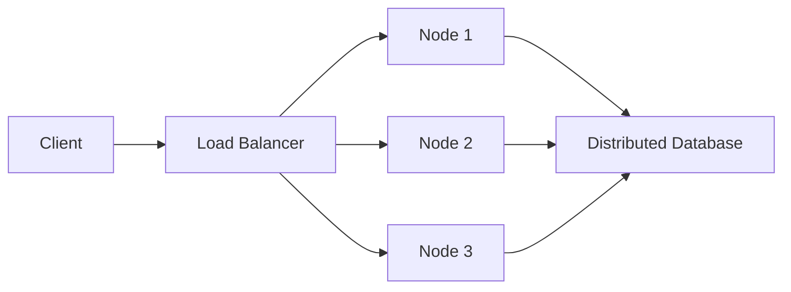

---

# 2. Why Distributed Systems Are Used

Distributed systems provide:

- Scalability
- High availability
- Fault tolerance
- Geographic distribution
- Better performance
- Resource sharing
- Independent deployment
- Large-scale data processing

## Example

A single server may handle:

```text
1,000 requests per second
```

A distributed cluster with ten servers may handle much more, depending on workload and architecture.

---

# 3. Core Characteristics

A distributed system usually has:

- Multiple independent nodes
- Network communication
- Shared goals
- Partial failure
- Concurrent execution
- No perfect global clock
- Data replication
- Coordination mechanisms

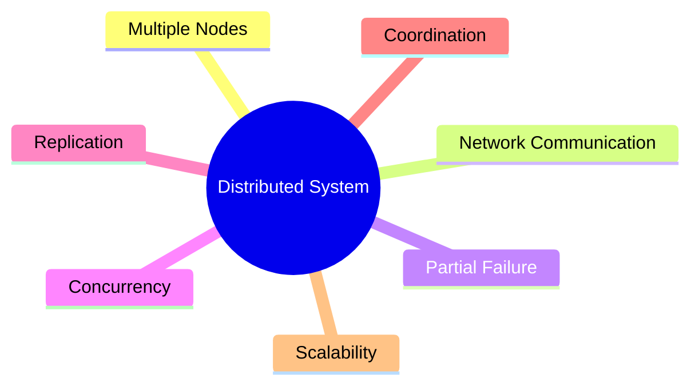

---

# 4. Challenges in Distributed Systems

Distributed systems are difficult because networks and machines fail independently.

Common challenges:

- Network latency
- Packet loss
- Duplicate requests
- Out-of-order messages
- Node crashes
- Partial failures
- Clock differences
- Data inconsistency
- Split brain
- Cascading failures
- Operational complexity

## Partial failure

One service may fail while the rest of the system remains healthy.

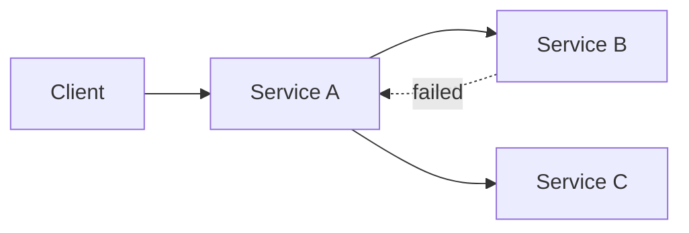

---

# 5. Scalability

Scalability is the ability of a system to handle increased load.

Load may increase in:

- Requests
- Users
- Data volume
- Events
- Connections
- Computation

## Types

- Vertical scaling
- Horizontal scaling

---

# 6. Vertical vs Horizontal Scaling

## Vertical scaling

Increase resources of one machine.

Examples:

- More CPU
- More RAM
- Faster disk

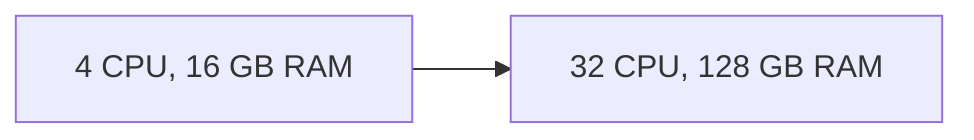

Advantages:

- Simpler architecture
- Easier consistency

Disadvantages:

- Hardware limit
- Expensive
- Single point of failure

## Horizontal scaling

Add more machines.

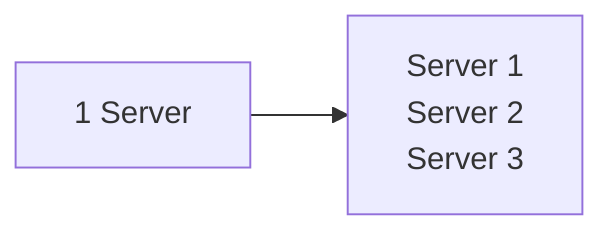

Advantages:

- Better fault tolerance
- High scalability
- Commodity hardware

Disadvantages:

- More complexity
- Distributed coordination
- Data consistency challenges

---

# 7. Load Balancing

A load balancer distributes traffic across servers.

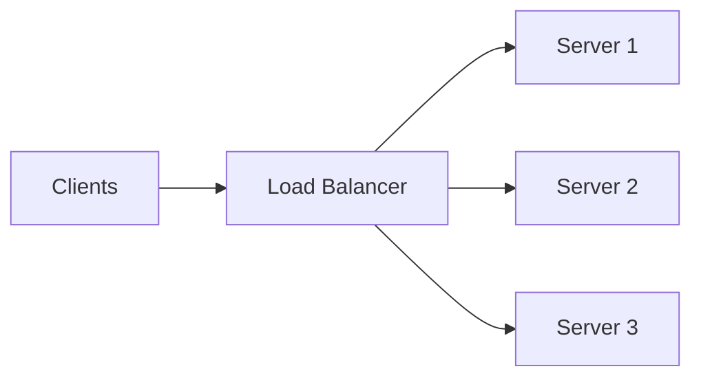

## Algorithms

- Round robin
- Weighted round robin
- Least connections
- Least response time
- IP hash
- Random
- Consistent hashing

## Health checks

A load balancer should stop sending traffic to unhealthy instances.

---

# 8. CAP Theorem

CAP states that during a network partition, a distributed system must choose between:

- Consistency
- Availability

The three properties are:

- Consistency
- Availability
- Partition tolerance

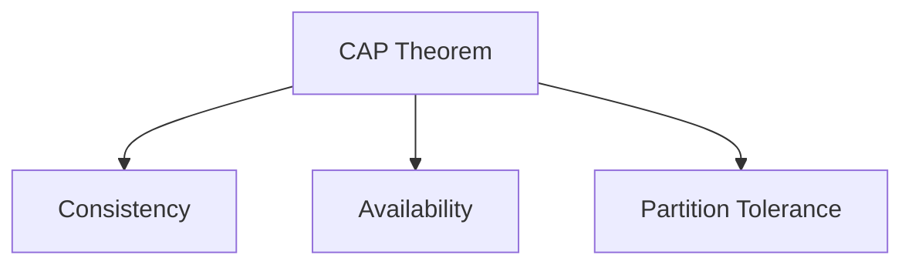

## Consistency

Every read receives the latest write or an error.

## Availability

Every request receives a non-error response, though it may not contain the latest data.

## Partition tolerance

The system continues operating despite network communication failure between nodes.

In real distributed systems, partition tolerance is usually required.

Therefore, during a partition, systems usually choose:

```text
CP or AP
```

## CP system

Prioritizes consistency.

Example behavior:

- Reject some requests during partition
- Avoid stale data

## AP system

Prioritizes availability.

Example behavior:

- Continue serving requests
- Accept temporary inconsistency

---

# 9. Consistency Models

## Strong consistency

Reads always return the latest committed value.

## Eventual consistency

All replicas converge eventually if no new updates occur.

## Read-your-writes consistency

A user sees their own recent writes.

## Monotonic reads

A user never sees an older value after seeing a newer value.

## Causal consistency

Causally related operations are observed in order.

## Sequential consistency

Operations appear in a single total order consistent with each process's order.

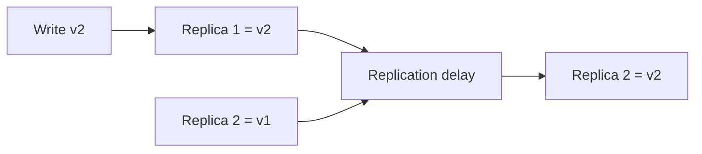

---

# 10. Availability and Reliability

## Availability

Probability that the system is operational.

```text
Availability = Uptime / Total Time
```

Example:

```text
99.9% availability
```

## Reliability

Probability that the system performs correctly over time.

A system can be available but return wrong data.

---

# 11. Replication

Replication stores copies of data on multiple nodes.

Benefits:

- High availability
- Fault tolerance
- Read scalability
- Geographic locality

Costs:

- Replication lag
- Conflict resolution
- More storage
- Coordination complexity

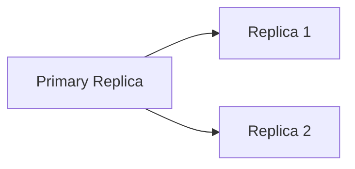

---

# 12. Leader-Based Replication

One node acts as leader.

Writes go to the leader.

Followers replicate the leader.

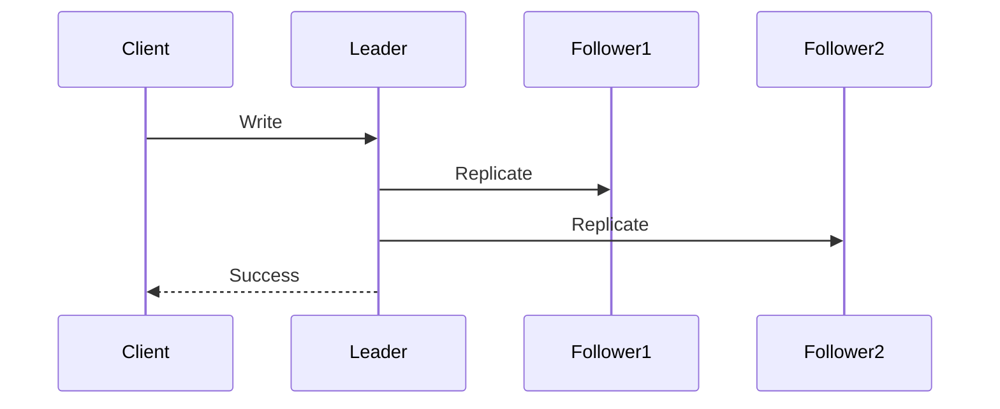

## Advantages

- Simple conflict handling
- Ordered writes
- Easy consistency model

## Disadvantages

- Leader bottleneck
- Failover complexity
- Replication lag

---

# 13. Leaderless Replication

Clients write to multiple replicas.

Reads may query multiple replicas.

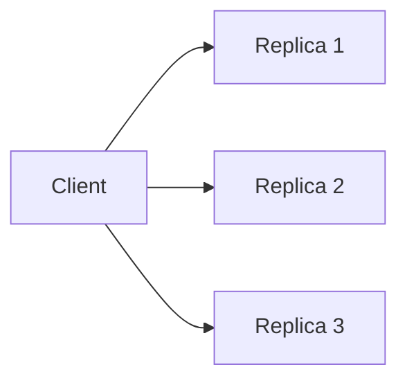

Leaderless systems often use quorums.

Advantages:

- No single leader bottleneck
- Better write availability

Disadvantages:

- Conflict resolution
- Read repair
- More complex consistency

---

# 14. Partitioning and Sharding

Partitioning splits data across nodes.

Example:

```text
Users 1–1,000,000 -> Shard 1
Users 1,000,001–2,000,000 -> Shard 2
```

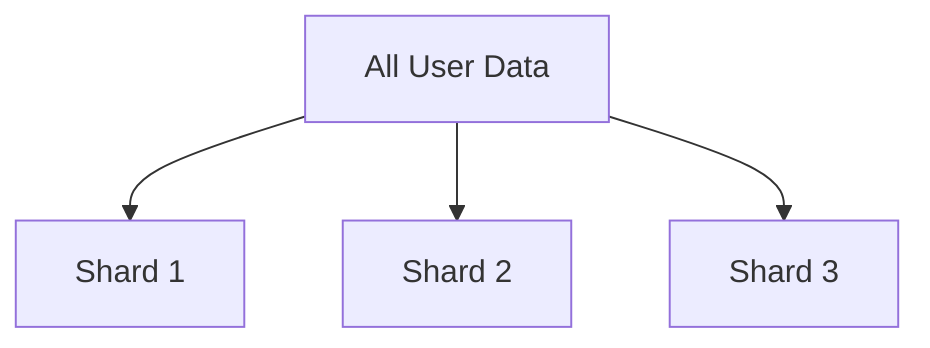

## Strategies

- Range partitioning
- Hash partitioning
- Directory-based partitioning
- Geographic partitioning

## Problems

- Hot shards
- Rebalancing
- Cross-shard joins
- Distributed transactions
- Uneven growth

---

# 15. Consistent Hashing

Consistent hashing distributes keys across nodes while minimizing data movement when nodes change.

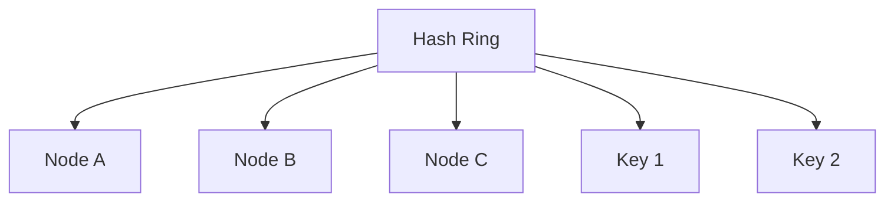

Without consistent hashing:

```text
Adding one node may remap most keys
```

With consistent hashing:

```text
Only a fraction of keys move
```

Virtual nodes improve load distribution.

---

# 16. Quorum

A quorum determines how many replicas must participate in reads and writes.

Let:

```text
N = total replicas
W = write acknowledgments required
R = read responses required
```

Strong overlap condition:

```text
R + W > N
```

Example:

```text
N = 3
W = 2
R = 2
```

Then:

```text
R + W = 4 > 3
```

A read and write quorum overlap.

---

# 17. Consensus

Consensus means distributed nodes agree on a value or sequence of values.

Used for:

- Leader election
- Configuration
- Metadata
- Replicated logs
- Membership

Common algorithms:

- Raft
- Paxos
- Zab

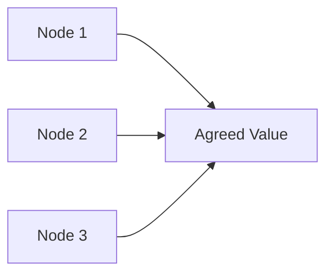

Consensus is difficult because:

- Nodes may fail
- Messages may be delayed
- Network partitions may occur

---

# 18. Leader Election

Leader election chooses one node to coordinate operations.

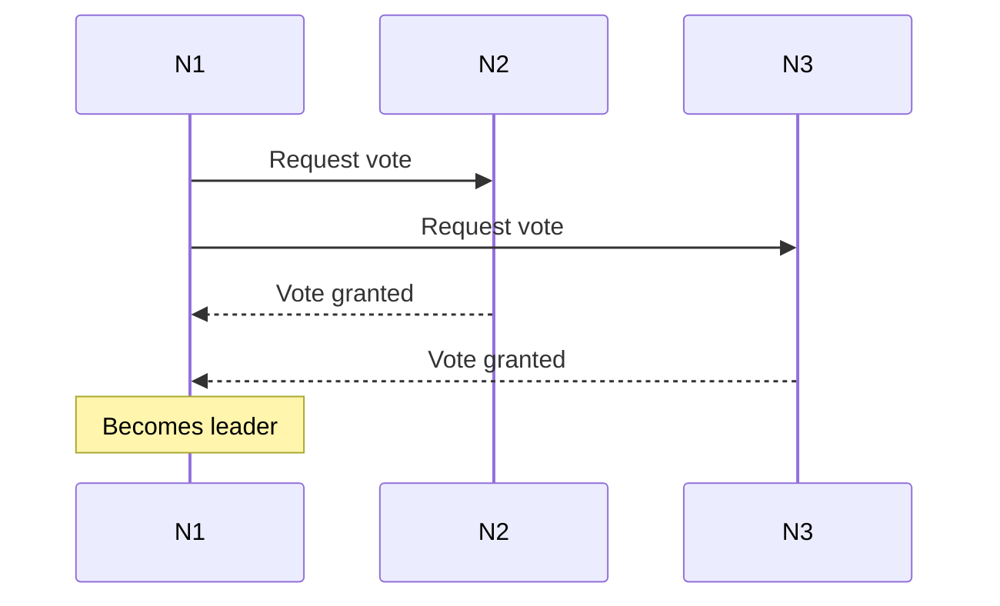

A leader must periodically prove liveness.

If it fails, another election occurs.

---

# 19. Distributed Clocks

Physical clocks are not perfectly synchronized.

Problems include:

- Clock drift
- Clock skew
- Network delay
- Time-zone differences
- NTP adjustments

Therefore, timestamps alone cannot always establish causal order.

---

# 20. Logical Clocks

Logical clocks track event ordering without relying on physical time.

## Lamport clock

Each process maintains a counter.

Rules:

1. Increment before local event
2. Send timestamp with message
3. Receiver updates to max(local, received) + 1

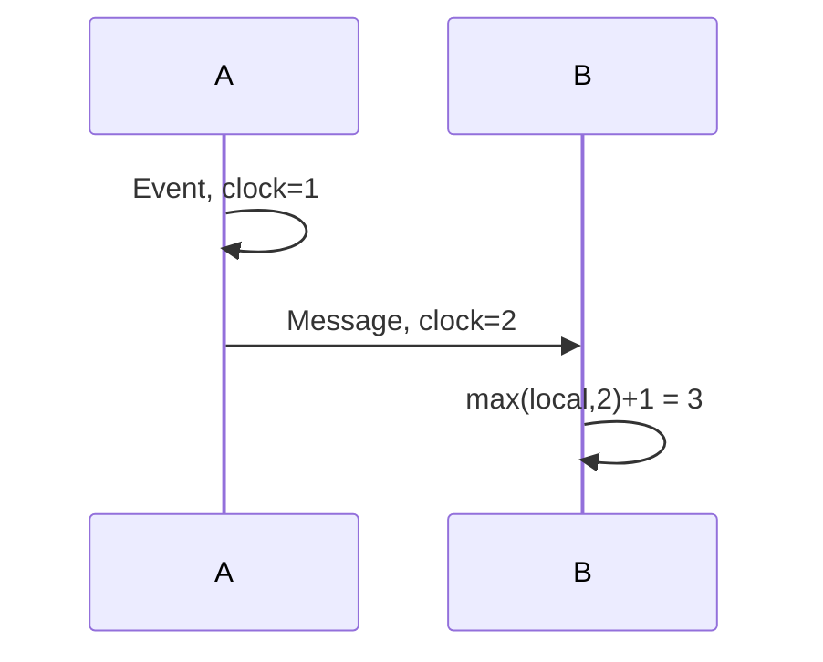

## Vector clock

Tracks causality across multiple nodes.

Useful for conflict detection.

---

# 21. Idempotency

An operation is idempotent if repeating it produces the same final result.

Example:

```text
Set account status to ACTIVE
```

Repeating this is safe.

Non-idempotent example:

```text
Increment balance by 100
```

Repeating changes the result again.

## Idempotency key

```java
public record PaymentRequest(
        String idempotencyKey,
        String orderId,
        double amount
) {
}
```

The server stores processed keys and returns the previous result for duplicates.

---

# 22. Distributed Transactions

A distributed transaction spans multiple services or databases.

Example:

```text
Order service
Payment service
Inventory service
```

Challenges:

- Partial failure
- Network timeout
- Duplicate processing
- Rollback coordination
- Long locks

Common approaches:

- Two-phase commit
- Saga
- Transactional outbox
- Idempotent consumers

---

# 23. Two-Phase Commit

Two-phase commit coordinates atomic commit across participants.

## Phase 1: Prepare

Coordinator asks participants if they can commit.

## Phase 2: Commit or rollback

Coordinator sends final decision.

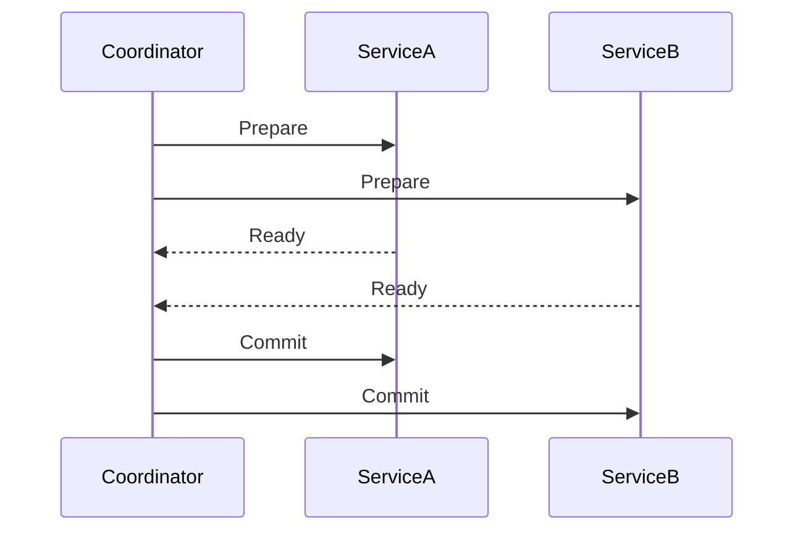

## Problems

- Blocking
- Coordinator failure
- Reduced availability
- Poor scalability

---

# 24. Saga Pattern

A saga breaks a transaction into local transactions.

Each step has a compensating action.

Example:

```text
Create order
Reserve inventory
Charge payment
```

Compensation:

```text
Cancel order
Release inventory
Refund payment
```

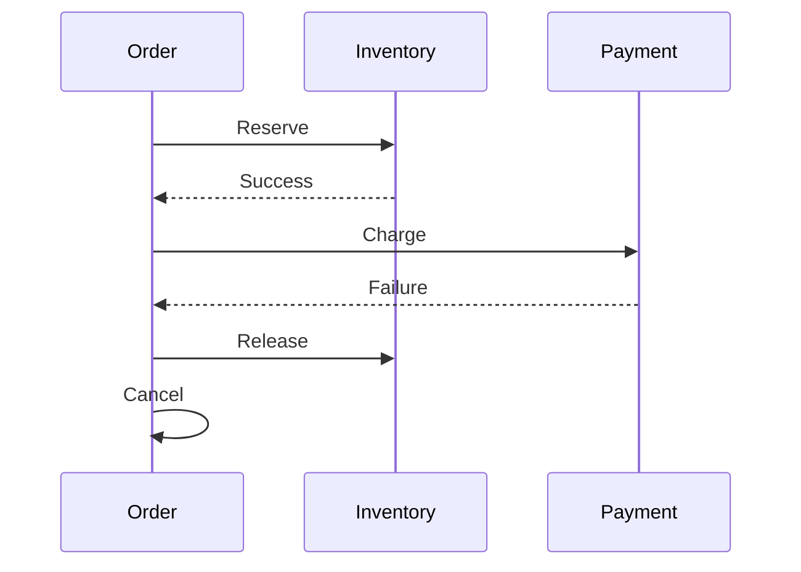

## Types

- Choreography
- Orchestration

---

# 25. Transactional Outbox

The outbox pattern solves dual-write problems.

Instead of:

```text
Write database
Publish event separately
```

write both business data and an outbox record in one local transaction.

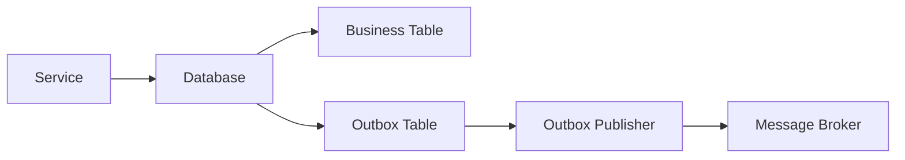

This avoids inconsistency between database and message broker.

---

# 26. Messaging and Event-Driven Architecture

Messaging enables asynchronous communication.

Benefits:

- Loose coupling
- Buffering
- Retry
- Replay
- Scalability
- Failure isolation

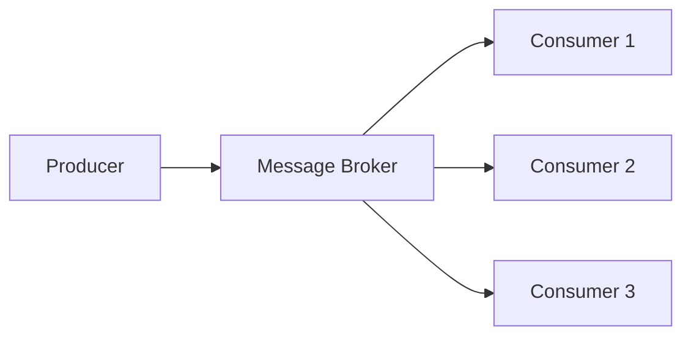

Common systems:

- Apache Kafka
- RabbitMQ
- Amazon SQS
- Google Pub/Sub

---

# 27. Caching

Caching stores frequently accessed data closer to clients.

Types:

- Client cache
- CDN
- Application cache
- Distributed cache
- Database cache

```mermaid
flowchart LR
    Client["Client"]
    Cache["Cache"]
    DB["Database"]

    Client --> Cache
    Cache -->|miss| DB
    DB --> Cache
    Cache --> Client
```

Benefits:

- Lower latency
- Reduced database load
- Higher throughput

Risks:

- Stale data
- Cache inconsistency
- Eviction complexity
- Stampede

---

# 28. Cache Invalidation Strategies

## Cache-aside

Application reads cache first.

On miss:

- Load from database
- Put in cache

## Write-through

Write to cache and database synchronously.

## Write-behind

Write to cache first, database later.

## TTL

Expire after a fixed duration.

## Event-based invalidation

Publish an event when data changes.

```mermaid
flowchart LR
    Update["Data Updated"]
    Event["Invalidation Event"]
    Cache["Cache Entry Removed"]

    Update --> Event
    Event --> Cache
```

---

# 29. Rate Limiting

Rate limiting controls request volume.

Algorithms:

- Fixed window
- Sliding window
- Token bucket
- Leaky bucket

## Token bucket

```mermaid
flowchart LR
    Tokens["Token Bucket"]
    Request["Incoming Request"]
    Allowed{"Token available?"}
    Process["Process Request"]
    Reject["Reject / 429"]

    Request --> Allowed
    Tokens --> Allowed
    Allowed -->|Yes| Process
    Allowed -->|No| Reject
```

Distributed rate limiting may use Redis or an API gateway.

---

# 30. Fault Tolerance Patterns

Important patterns:

- Timeout
- Retry
- Circuit breaker
- Bulkhead
- Fallback
- Rate limiting
- Health checks
- Graceful degradation

---

# 31. Circuit Breaker

A circuit breaker stops calls to a failing dependency.

States:

- Closed
- Open
- Half-open

```mermaid
stateDiagram-v2
    [*] --> Closed
    Closed --> Open : failure threshold reached
    Open --> HalfOpen : timeout elapsed
    HalfOpen --> Closed : test succeeds
    HalfOpen --> Open : test fails
```

## Benefits

- Prevents cascading failures
- Reduces load on failing service
- Improves recovery

---

# 32. Retries and Backoff

Retries are useful for transient failures.

Bad retry:

```text
Retry immediately forever
```

Good retry:

- Limited attempts
- Exponential backoff
- Jitter
- Retry only idempotent operations
- Respect timeouts

```text
100 ms
200 ms
400 ms
800 ms
```

Jitter avoids synchronized retry storms.

---

# 33. Bulkhead Pattern

Bulkhead isolates resources so one failure does not consume everything.

```mermaid
flowchart LR
    Requests["Requests"]
    PoolA["Thread Pool A"]
    PoolB["Thread Pool B"]
    ServiceA["Service A"]
    ServiceB["Service B"]

    Requests --> PoolA
    Requests --> PoolB
    PoolA --> ServiceA
    PoolB --> ServiceB
```

Examples:

- Separate thread pools
- Separate connection pools
- Separate queues

---

# 34. Timeouts

Every remote call should have a timeout.

Without timeouts:

- Threads remain blocked
- Connection pools exhaust
- Cascading failure occurs

Types:

- Connection timeout
- Read timeout
- Write timeout
- Overall deadline

Deadlines are often better than independent timeouts because they carry remaining time across service calls.

---

# 35. Service Discovery

Service discovery maps logical service names to network locations.

```mermaid
flowchart LR
    ServiceA["Service A"]
    Registry["Service Registry"]
    ServiceB1["Service B Instance 1"]
    ServiceB2["Service B Instance 2"]

    ServiceB1 --> Registry
    ServiceB2 --> Registry
    ServiceA --> Registry
    Registry --> ServiceA
```

Types:

- Client-side discovery
- Server-side discovery

Examples:

- Kubernetes service discovery
- Consul
- Eureka

---

# 36. API Gateway

An API gateway is a single entry point for clients.

Responsibilities:

- Routing
- Authentication
- Rate limiting
- Request transformation
- Aggregation
- Logging
- Metrics
- Circuit breaking

```mermaid
flowchart LR
    Client["Client"]
    Gateway["API Gateway"]
    Auth["Auth Service"]
    Order["Order Service"]
    Product["Product Service"]

    Client --> Gateway
    Gateway --> Auth
    Gateway --> Order
    Gateway --> Product
```

---

# 37. Data Storage Choices

Choose storage based on workload.

## Relational database

Good for:

- Transactions
- Joins
- Strong consistency
- Structured data

## Document database

Good for:

- Flexible schema
- Aggregate-oriented data

## Key-value store

Good for:

- Fast lookup
- Caching
- Sessions

## Wide-column store

Good for:

- Large-scale writes
- Time-series-like data

## Search engine

Good for:

- Full-text search
- Analytics

## Time-series database

Good for:

- Metrics
- Sensor data
- Time-based aggregation

---

# 38. Observability

Observability includes:

- Logs
- Metrics
- Traces

```mermaid
flowchart TB
    System["Distributed System"]
    Logs["Logs"]
    Metrics["Metrics"]
    Traces["Distributed Traces"]
    Dashboard["Dashboard / Alerting"]

    System --> Logs
    System --> Metrics
    System --> Traces
    Logs --> Dashboard
    Metrics --> Dashboard
    Traces --> Dashboard
```

## Important metrics

- Request rate
- Error rate
- Latency
- Saturation
- Queue depth
- Consumer lag
- Cache hit ratio
- Database connection usage

---

# 39. Security

Distributed security includes:

- Authentication
- Authorization
- Encryption
- Secret management
- Audit logging
- Zero-trust networking
- Service identity

Best practices:

- TLS everywhere
- Short-lived credentials
- Least privilege
- Rotate secrets
- Validate input
- Protect internal APIs

---

# 40. Distributed System Design Example

## URL Shortener

Requirements:

- Create short URL
- Redirect quickly
- Support high read traffic
- Track clicks
- Expire URLs

## Architecture

```mermaid
flowchart LR
    Client["Client"]
    Gateway["API Gateway"]
    URLService["URL Service"]
    Cache["Redis Cache"]
    DB["Database"]
    Queue["Event Queue"]
    Analytics["Analytics Service"]

    Client --> Gateway
    Gateway --> URLService
    URLService --> Cache
    URLService --> DB
    URLService --> Queue
    Queue --> Analytics
```

## Write flow

1. Client sends long URL
2. Service generates unique ID
3. ID is encoded using Base62
4. Mapping stored in database
5. Cache populated
6. Short URL returned

## Read flow

1. Client requests short code
2. Service checks cache
3. On miss, load from database
4. Redirect client
5. Publish click event asynchronously

## Scalability decisions

- Stateless application servers
- Redis cache
- Database sharding
- Asynchronous analytics
- CDN for geographic performance
- Consistent hashing for cache distribution

---

# 41. Common Failure Scenarios

## Network partition

Nodes cannot communicate.

Response depends on CP or AP choice.

## Node crash

Use replication and failover.

## Duplicate request

Use idempotency keys.

## Slow dependency

Use timeout and circuit breaker.

## Retry storm

Use exponential backoff and jitter.

## Cache stampede

Use:

- Request coalescing
- Locking
- Early refresh
- Staggered TTL

## Hot partition

Use better partition key or salting.

## Split brain

Use quorum and fencing tokens.

---

# 42. Best Practices

## 1. Assume every network call can fail

Never treat remote calls like local method calls.

## 2. Use timeouts everywhere

Prevent resource exhaustion.

## 3. Make operations idempotent

Retries become safer.

## 4. Prefer asynchronous communication for loose coupling

Use events where immediate response is not required.

## 5. Use bounded resources

Bound queues, thread pools, and connection pools.

## 6. Monitor saturation

Watch CPU, memory, queue depth, and pool usage.

## 7. Design for graceful degradation

Return partial or cached responses when possible.

## 8. Avoid distributed transactions when possible

Prefer sagas and outbox patterns.

## 9. Use stable partition keys

Prevent uneven load.

## 10. Test failure scenarios

Use chaos testing and fault injection.

---

# 43. Anti-Patterns

## 1. Distributed monolith

Many services but tightly coupled deployment and communication.

## 2. Chatty service calls

Too many synchronous calls increase latency and failure risk.

## 3. No timeout

Remote calls can block indefinitely.

## 4. Blind retries

Can overload a failing dependency.

## 5. Shared database across all services

Creates coupling and ownership confusion.

## 6. Global transactions everywhere

Reduce availability and scalability.

## 7. No idempotency

Duplicate requests cause incorrect state.

## 8. Ignoring observability

Failures become difficult to diagnose.

## 9. Over-sharding too early

Adds complexity without clear benefit.

## 10. Assuming clocks are perfectly synchronized

Can break ordering and expiry logic.

---

# 44. Interview Questions and Answers

## 1. What is a distributed system?

A distributed system is a set of independent nodes that coordinate over a network to provide a unified service.

---

## 2. What is partial failure?

Some components fail while others continue operating.

---

## 3. What is horizontal scaling?

Adding more machines to handle increased load.

---

## 4. What is vertical scaling?

Increasing resources of one machine.

---

## 5. What is CAP theorem?

During a network partition, a distributed system must choose between consistency and availability.

---

## 6. What is eventual consistency?

Replicas may temporarily differ but converge over time.

---

## 7. What is strong consistency?

Reads return the latest committed write.

---

## 8. What is replication?

Maintaining copies of data on multiple nodes.

---

## 9. What is sharding?

Splitting data across multiple nodes.

---

## 10. What is consistent hashing?

A key-distribution technique that minimizes remapping when nodes change.

---

## 11. What is a hot shard?

A shard receiving disproportionately high traffic.

---

## 12. What is quorum?

A minimum number of replicas required for read or write agreement.

---

## 13. What does R + W > N mean?

Read and write quorums overlap, increasing the chance of reading the latest value.

---

## 14. What is consensus?

Agreement among distributed nodes on a value or sequence.

---

## 15. Name consensus algorithms.

Raft, Paxos, and Zab.

---

## 16. What is leader election?

Selecting one node to coordinate a replicated group.

---

## 17. What is split brain?

Multiple nodes incorrectly believe they are leader.

---

## 18. What is idempotency?

Repeating an operation produces the same final state.

---

## 19. Why is idempotency important?

It makes retries and duplicate requests safe.

---

## 20. What is two-phase commit?

A distributed commit protocol with prepare and commit phases.

---

## 21. What are disadvantages of two-phase commit?

Blocking, coordinator dependency, and reduced availability.

---

## 22. What is a saga?

A sequence of local transactions with compensating actions.

---

## 23. Choreography vs orchestration?

Choreography uses events between services.

Orchestration uses a central coordinator.

---

## 24. What is the outbox pattern?

Write business data and an event record in one local transaction, then publish asynchronously.

---

## 25. What is cache-aside?

Application loads cache on miss and writes results into cache.

---

## 26. What is cache stampede?

Many requests simultaneously miss and overload the backend.

---

## 27. What is a circuit breaker?

A pattern that stops calls to a failing dependency temporarily.

---

## 28. What is exponential backoff?

Retry delays increase exponentially after failures.

---

## 29. Why add jitter to retries?

To prevent many clients from retrying simultaneously.

---

## 30. What is a bulkhead?

Resource isolation that prevents one failure from exhausting all capacity.

---

## 31. Why are timeouts essential?

They prevent blocked resources and cascading failure.

---

## 32. What is service discovery?

Finding available service instances dynamically.

---

## 33. What is an API gateway?

A centralized entry point handling routing and cross-cutting concerns.

---

## 34. What is distributed tracing?

Tracking one request across multiple services.

---

## 35. What is a correlation ID?

An identifier used to connect logs and traces for one request.

---

## 36. What is backpressure?

A mechanism for slowing producers when consumers cannot keep up.

---

## 37. What is a distributed lock?

A lock coordinated across multiple nodes.

---

## 38. Why are distributed locks risky?

They depend on timing, lease expiry, network behavior, and correct fencing.

---

## 39. What is a fencing token?

A monotonically increasing token used to reject stale lock holders.

---

## 40. What is read repair?

Fixing stale replicas during reads.

---

## 41. What is hinted handoff?

Temporarily storing writes for an unavailable replica and replaying them later.

---

## 42. What is anti-entropy?

Background synchronization that detects and repairs replica divergence.

---

## 43. What is a vector clock?

A logical clock used to track causality across nodes.

---

## 44. What is a Lamport clock?

A logical counter that establishes a partial ordering of events.

---

## 45. Why is global ordering difficult?

There is no perfect global clock and messages may be delayed.

---

## 46. What is graceful degradation?

Continuing with reduced functionality during failures.

---

## 47. What is a distributed monolith?

A microservice-style system with strong coupling and poor independent deployability.

---

## 48. What is eventual convergence?

Replicas become consistent after updates stop.

---

## 49. What is an availability zone?

An isolated infrastructure location within a cloud region.

---

## 50. What is the most important mindset in distributed systems?

Assume failure, delay, duplication, and partial availability are normal.

---

# 45. Summary

Distributed systems provide scalability, availability, and fault tolerance by coordinating multiple independent nodes.

## Core concepts

| Concept | Meaning |
|---|---|
| Scalability | Handle increased load |
| Replication | Copy data across nodes |
| Sharding | Split data across nodes |
| Consistency | Rules for data visibility |
| Consensus | Agreement among nodes |
| Idempotency | Safe repeated operation |
| Quorum | Minimum replica participation |
| Saga | Distributed transaction workflow |
| Outbox | Reliable database-to-event publishing |
| Circuit breaker | Stop calls to failing dependency |

## Final design principles

- Assume partial failure
- Use timeouts
- Design idempotent APIs
- Use retries carefully
- Prefer asynchronous workflows where appropriate
- Monitor everything
- Keep services loosely coupled
- Use replication and failover
- Avoid unnecessary distributed transactions
- Test failure behavior

---

## Recommended Practice Projects

1. Design a distributed URL shortener.
2. Build a distributed rate limiter.
3. Design an order-processing system using Kafka.
4. Implement an idempotent payment API.
5. Build a transactional outbox.
6. Design a distributed cache.
7. Create a saga-based checkout workflow.
8. Implement consistent hashing.
9. Design a notification platform.
10. Build a distributed job scheduler.
