# High-Level Design (HLD) — In-Depth Guide

A complete guide to High-Level Design for software engineering and system design interviews. This document covers requirements gathering, capacity estimation, architecture design, scalability, databases, caching, messaging, reliability, security, observability, trade-offs, end-to-end examples, and interview questions.

---

## Table of Contents

1. [What is High-Level Design?](#1-what-is-high-level-design)
2. [HLD vs LLD](#2-hld-vs-lld)
3. [Goals of HLD](#3-goals-of-hld)
4. [HLD Design Process](#4-hld-design-process)
5. [Functional Requirements](#5-functional-requirements)
6. [Non-Functional Requirements](#6-non-functional-requirements)
7. [Capacity Estimation](#7-capacity-estimation)
8. [API Design](#8-api-design)
9. [Core Components](#9-core-components)
10. [Load Balancing](#10-load-balancing)
11. [Application Layer](#11-application-layer)
12. [Database Design](#12-database-design)
13. [SQL vs NoSQL](#13-sql-vs-nosql)
14. [Replication](#14-replication)
15. [Partitioning and Sharding](#15-partitioning-and-sharding)
16. [Caching](#16-caching)
17. [CDN](#17-cdn)
18. [Messaging and Event-Driven Architecture](#18-messaging-and-event-driven-architecture)
19. [Search Systems](#19-search-systems)
20. [Object Storage](#20-object-storage)
21. [Consistency Models](#21-consistency-models)
22. [CAP Theorem](#22-cap-theorem)
23. [Availability and Reliability](#23-availability-and-reliability)
24. [Fault-Tolerance Patterns](#24-fault-tolerance-patterns)
25. [Rate Limiting](#25-rate-limiting)
26. [Security](#26-security)
27. [Observability](#27-observability)
28. [Multi-Region Architecture](#28-multi-region-architecture)
29. [Deployment and DevOps](#29-deployment-and-devops)
30. [HLD Diagrams](#30-hld-diagrams)
31. [Trade-Off Analysis](#31-trade-off-analysis)
32. [URL Shortener HLD](#32-url-shortener-hld)
33. [Event-Driven Order System HLD](#33-event-driven-order-system-hld)
34. [Notification System HLD](#34-notification-system-hld)
35. [API Gateway HLD](#35-api-gateway-hld)
36. [Common HLD Mistakes](#36-common-hld-mistakes)
37. [HLD Interview Framework](#37-hld-interview-framework)
38. [Interview Questions and Answers](#38-interview-questions-and-answers)
39. [HLD Checklist](#39-hld-checklist)
40. [Summary](#40-summary)

---

# 1. What is High-Level Design?

High-Level Design describes the overall architecture of a software system.

It explains:

- Major components
- Relationships between components
- Data flow
- Storage choices
- Communication patterns
- Scalability strategy
- Reliability strategy
- Security boundaries
- Deployment model

HLD answers:

```text
What are the major building blocks?
How do they communicate?
How does the system scale?
How does the system handle failure?
Where is data stored?
What are the major trade-offs?
```

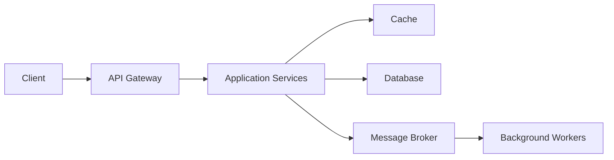

---

# 2. HLD vs LLD

## High-Level Design

HLD focuses on:

- Architecture
- Services
- Components
- Databases
- Message brokers
- Caching
- Load balancing
- Deployment
- Scalability
- Reliability

## Low-Level Design

LLD focuses on:

- Classes
- Interfaces
- Methods
- Design patterns
- Object relationships
- Algorithms
- Data structures

## Comparison

| Area | HLD | LLD |
|---|---|---|
| Scope | Entire system | Individual component |
| Focus | Architecture | Implementation |
| Audience | Architects, senior engineers | Developers |
| Diagrams | Component, deployment, data flow | Class, sequence, state |
| Questions | How services interact | How code is structured |
| Example | Kafka between services | Strategy pattern in service |

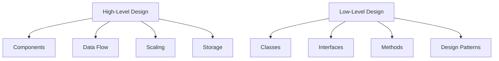

---

# 3. Goals of HLD

A strong HLD should make the system:

- Scalable
- Available
- Reliable
- Maintainable
- Secure
- Observable
- Cost-effective
- Extensible
- Fault tolerant

A design is not only about adding technologies.

A good HLD explains why each component is required.

---

# 4. HLD Design Process

A reliable HLD process:

```mermaid
flowchart LR
    Req["Clarify Requirements"]
    Estimate["Estimate Scale"]
    API["Design APIs"]
    Model["Define Data Model"]
    Architecture["Create Architecture"]
    DeepDive["Deep Dive"]
    Reliability["Handle Failures"]
    Tradeoffs["Discuss Trade-Offs"]

    Req --> Estimate
    Estimate --> API
    API --> Model
    Model --> Architecture
    Architecture --> DeepDive
    DeepDive --> Reliability
    Reliability --> Tradeoffs
```

## Recommended order

1. Clarify requirements
2. Estimate scale
3. Define APIs
4. Identify core entities
5. Build high-level architecture
6. Select storage
7. Add caching and messaging
8. Handle scaling
9. Handle failures
10. Discuss security
11. Add observability
12. Explain trade-offs

---

# 5. Functional Requirements

Functional requirements describe what the system must do.

Example for a URL shortener:

- Create a short URL
- Redirect short URL
- Support custom alias
- Support expiry
- Track clicks

Example for an order system:

- Create order
- Reserve inventory
- Process payment
- Send notification
- Track order state

## Best practice

Prioritize requirements:

```text
Must have
Should have
Nice to have
Out of scope
```

This prevents overdesign.

---

# 6. Non-Functional Requirements

Non-functional requirements define system quality.

Examples:

- Availability
- Latency
- Throughput
- Consistency
- Durability
- Scalability
- Security
- Compliance
- Cost
- Recovery objectives

## Example

```text
Read latency: under 100 ms
Availability: 99.99%
Peak traffic: 50,000 requests/second
Data retention: 5 years
Event durability: no acknowledged event loss
```

## Common NFR categories

| Category | Example |
|---|---|
| Availability | 99.99% |
| Latency | p95 below 200 ms |
| Throughput | 20,000 RPS |
| Durability | No acknowledged loss |
| Consistency | Strong for payment |
| Recovery | RPO 5 min, RTO 30 min |

---

# 7. Capacity Estimation

Capacity estimation helps determine architecture scale.

## Core calculations

Estimate:

- Daily active users
- Requests per second
- Peak requests per second
- Read/write ratio
- Storage growth
- Bandwidth
- Cache size
- Number of partitions
- Number of servers

## Request estimation

Suppose:

```text
100 million requests/day
```

Average RPS:

```text
100,000,000 / 86,400 ≈ 1,157 RPS
```

Peak traffic may be 5 to 10 times average:

```text
Peak ≈ 5,000 to 12,000 RPS
```

## Storage estimation

Suppose:

```text
10 million records/day
Record size = 1 KB
```

Daily storage:

```text
10,000,000 × 1 KB = 10 GB/day
```

Yearly:

```text
10 GB × 365 = 3.65 TB/year
```

With replication factor 3:

```text
3.65 TB × 3 = 10.95 TB/year
```

## Bandwidth estimation

Suppose:

```text
10,000 RPS
Average response = 20 KB
```

Bandwidth:

```text
10,000 × 20 KB = 200 MB/s
```

---

# 8. API Design

APIs define system boundaries.

## REST example

```http
POST /api/v1/orders
GET /api/v1/orders/{orderId}
POST /api/v1/orders/{orderId}/cancel
```

## API design considerations

- Idempotency
- Pagination
- Validation
- Versioning
- Authentication
- Error format
- Timeout
- Rate limit
- Request size
- Response size

## Idempotency example

```http
POST /payments
Idempotency-Key: 0e61929f-...
```

Repeated requests with the same key should return the same result.

## Error response

```json
{
  "code": "ORDER_NOT_FOUND",
  "message": "Order ORDER-101 was not found",
  "traceId": "abc-123"
}
```

---

# 9. Core Components

Typical distributed application components:

- Client
- DNS
- CDN
- Load balancer
- API gateway
- Application services
- Cache
- Database
- Message broker
- Worker
- Search engine
- Object storage
- Monitoring platform

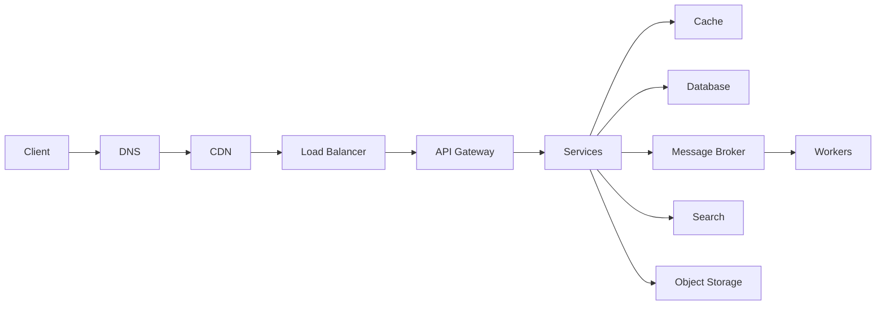

---

# 10. Load Balancing

A load balancer distributes requests across servers.

## Common algorithms

- Round robin
- Weighted round robin
- Least connections
- Least response time
- IP hash
- Consistent hashing

## Layer 4 vs Layer 7

### Layer 4

Routes using:

- IP
- TCP
- Port

### Layer 7

Routes using:

- HTTP path
- Header
- Hostname
- Cookie

## Example

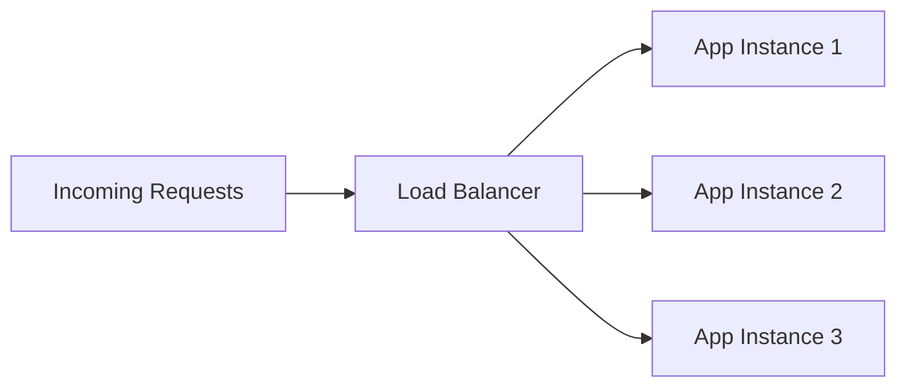

## Health checks

Unhealthy nodes must be removed from rotation.

---

# 11. Application Layer

Application services should usually be stateless.

Stateless services are easier to scale horizontally.

## Stateless example

Session state is stored in:

- Redis
- Database
- Client token
- External session store

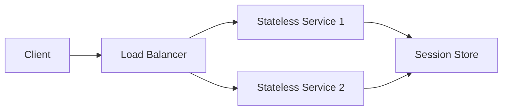

---

# 12. Database Design

Database choice depends on:

- Query pattern
- Transaction requirement
- Scale
- Data model
- Consistency
- Availability
- Operational maturity

## Questions to ask

- Is the data relational?
- Are joins required?
- Is strong consistency required?
- Is schema flexibility important?
- Is write scale very high?
- Is geographic distribution required?
- What are access patterns?

---

# 13. SQL vs NoSQL

## SQL

Best for:

- Transactions
- Joins
- Structured data
- Strong consistency
- Financial systems

Examples:

- PostgreSQL
- MySQL
- Oracle

## NoSQL

Best for:

- Flexible schema
- Massive horizontal scale
- Key-value access
- Document-oriented data
- Wide-column workloads

Examples:

- MongoDB
- Cassandra
- DynamoDB
- Redis

## Comparison

| Feature | SQL | NoSQL |
|---|---|---|
| Schema | Structured | Flexible |
| Transactions | Strong | Varies |
| Joins | Strong | Limited |
| Scaling | Often vertical + replicas | Horizontal |
| Query flexibility | High | Access-pattern driven |
| Consistency | Usually strong | Often configurable |

---

# 14. Replication

Replication stores multiple copies of data.

Benefits:

- High availability
- Read scaling
- Disaster recovery
- Fault tolerance

## Synchronous replication

Write acknowledged after replicas confirm.

Advantages:

- Strong durability

Disadvantages:

- Higher latency

## Asynchronous replication

Leader acknowledges before follower catches up.

Advantages:

- Lower latency

Disadvantages:

- Replication lag
- Possible data loss during failure

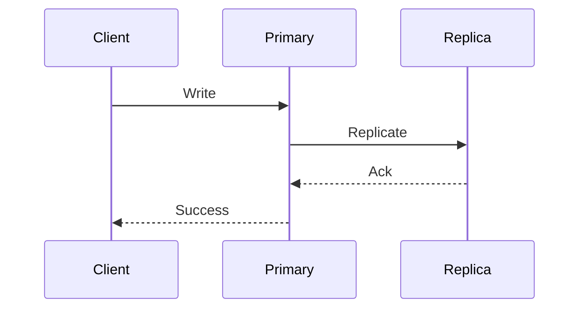

---

# 15. Partitioning and Sharding

Sharding distributes data across nodes.

## Range sharding

```text
A–F -> Shard 1
G–M -> Shard 2
N–Z -> Shard 3
```

## Hash sharding

```text
shard = hash(key) % numberOfShards
```

## Geographic sharding

```text
India users -> India shard
US users -> US shard
```

## Challenges

- Hot shards
- Rebalancing
- Cross-shard queries
- Distributed joins
- Global uniqueness
- Multi-shard transactions

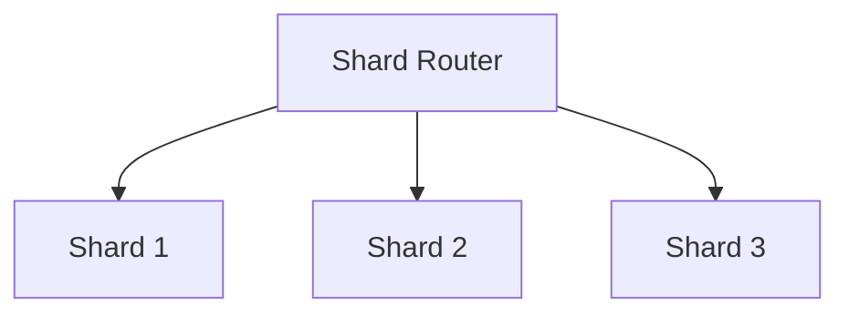

---

# 16. Caching

Caching reduces latency and backend load.

## Cache levels

- Browser cache
- CDN cache
- API gateway cache
- Application cache
- Distributed cache
- Database cache

## Cache-aside pattern

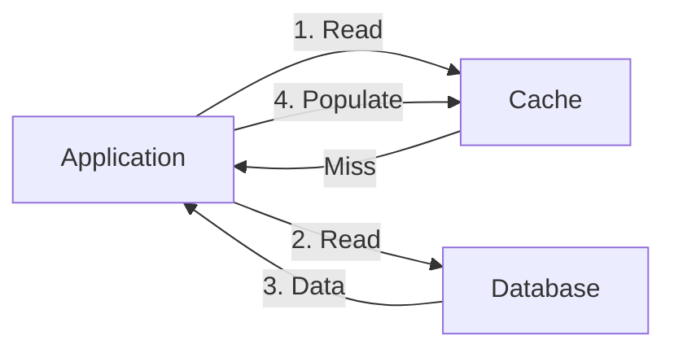

## Common strategies

- Cache-aside
- Read-through
- Write-through
- Write-behind
- Refresh-ahead

## Risks

- Stale data
- Cache stampede
- Cache penetration
- Hot keys
- Eviction storms

---

# 17. CDN

A CDN caches static or cacheable content near users.

Useful for:

- Images
- Videos
- JavaScript
- CSS
- Downloads
- Public API responses

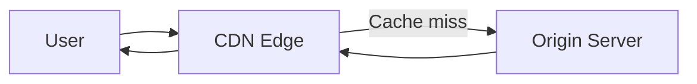

Benefits:

- Lower latency
- Reduced origin load
- Better global performance

---

# 18. Messaging and Event-Driven Architecture

Message brokers decouple producers and consumers.

Examples:

- Kafka
- RabbitMQ
- SQS
- Pub/Sub

## Benefits

- Asynchronous processing
- Buffering
- Retry
- Replay
- Failure isolation
- Independent scaling

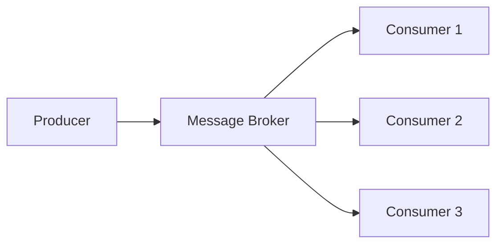

## Queue vs stream

| Queue | Stream |
|---|---|
| Message often removed after consumption | Retained for configured duration |
| One consumer typically processes message | Multiple groups can replay |
| Work distribution | Event history |

---

# 19. Search Systems

Databases are often not optimized for full-text search.

Use search engines for:

- Text search
- Fuzzy matching
- Ranking
- Faceting
- Aggregation

Examples:

- Elasticsearch
- OpenSearch
- Solr

## Data flow

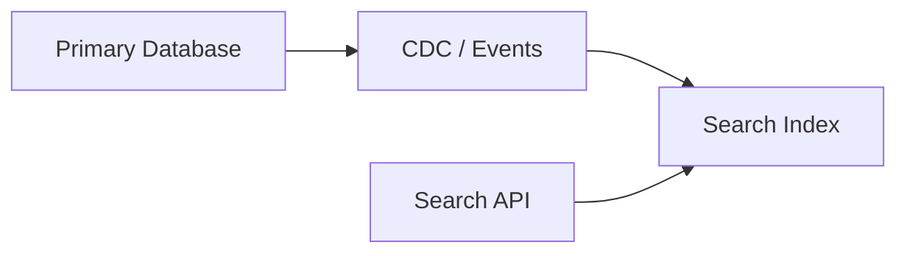

The database remains the source of truth.

---

# 20. Object Storage

Object storage is used for large binary files.

Examples:

- Images
- Documents
- Video
- Backups
- Logs

Typical flow:

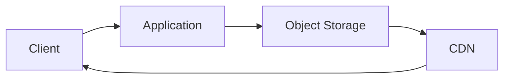

A common design uses pre-signed URLs for direct upload.

---

# 21. Consistency Models

## Strong consistency

Reads return the latest committed write.

## Eventual consistency

Replicas converge over time.

## Read-your-writes

A user sees their own latest update.

## Monotonic reads

A user does not move backward to an older version.

## Causal consistency

Causally related operations are observed in correct order.

## Choosing consistency

Use strong consistency for:

- Payments
- Inventory decrement
- Account balance
- Unique constraints

Use eventual consistency for:

- Analytics
- Search index
- Feed counters
- Recommendations

---

# 22. CAP Theorem

During network partition, choose between:

- Consistency
- Availability

Partition tolerance is generally unavoidable.

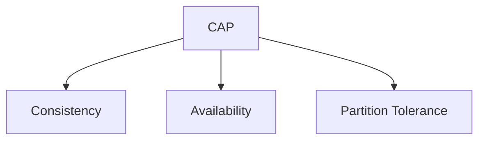

## CP

Reject or delay requests to protect consistency.

## AP

Continue serving requests with possible stale data.

---

# 23. Availability and Reliability

## Availability formula

```text
Availability = Uptime / Total Time
```

Approximate yearly downtime:

| Availability | Downtime/year |
|---|---:|
| 99% | About 3.65 days |
| 99.9% | About 8.76 hours |
| 99.99% | About 52.6 minutes |
| 99.999% | About 5.26 minutes |

## RPO

Recovery Point Objective:

```text
How much data loss is acceptable?
```

## RTO

Recovery Time Objective:

```text
How long can recovery take?
```

---

# 24. Fault-Tolerance Patterns

Important patterns:

- Retry
- Timeout
- Circuit breaker
- Bulkhead
- Fallback
- Health check
- Graceful degradation
- Idempotency
- Dead-letter queue

## Retry

Retry transient failures only.

Use:

- Limited attempts
- Exponential backoff
- Jitter

## Circuit breaker

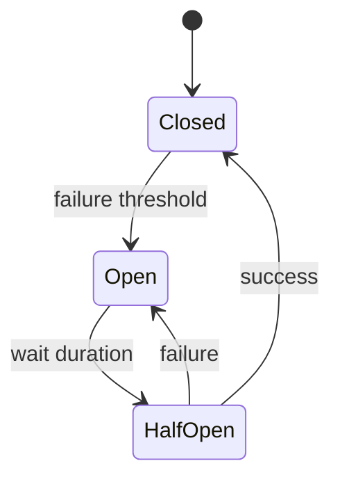

## Bulkhead

Separate thread pools and resource pools by dependency.

---

# 25. Rate Limiting

Rate limiting protects services.

Algorithms:

- Fixed window
- Sliding window
- Token bucket
- Leaky bucket

## Token bucket

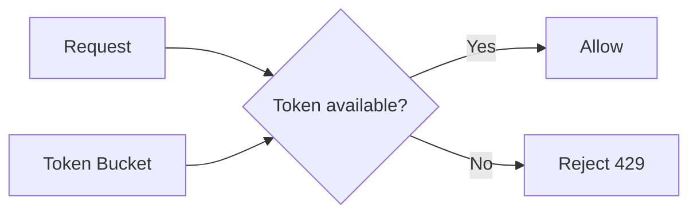

## Distributed implementation

Use:

- Redis
- API gateway
- Central rate-limit service

Key examples:

```text
userId
API key
IP address
tenantId
```

---

# 26. Security

Security belongs in HLD.

## Areas

- Authentication
- Authorization
- Encryption
- Secrets
- Network segmentation
- Audit logging
- Input validation
- Data classification
- Rate limiting

## Authentication

Common mechanisms:

- OAuth 2.0
- OpenID Connect
- JWT
- Session token
- Mutual TLS

## Authorization

Common models:

- RBAC
- ABAC
- Scope-based access

## Data protection

- TLS in transit
- Encryption at rest
- Key rotation
- Secret manager
- Data masking

---

# 27. Observability

Observability includes:

- Logs
- Metrics
- Traces

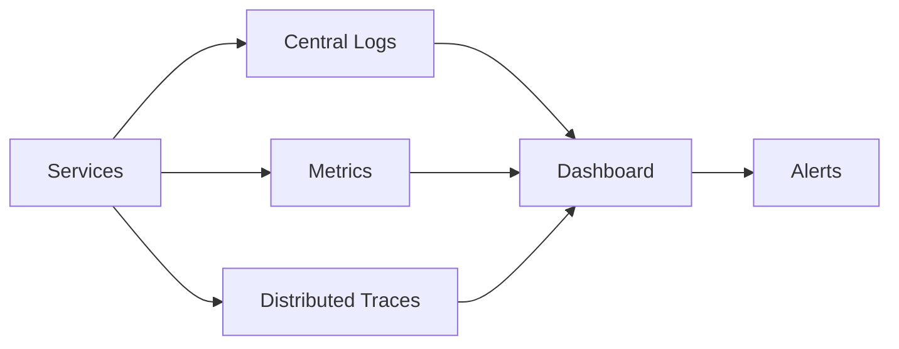

## Important metrics

- Request rate
- Error rate
- Latency
- CPU
- Memory
- Queue depth
- Thread-pool saturation
- Cache hit rate
- Database connections
- Consumer lag

## RED method

- Rate
- Errors
- Duration

## USE method

- Utilization
- Saturation
- Errors

---

# 28. Multi-Region Architecture

Multi-region deployment improves:

- Availability
- Disaster recovery
- User latency
- Regulatory placement

## Active-passive

One active region, one standby region.

## Active-active

Multiple regions serve traffic.

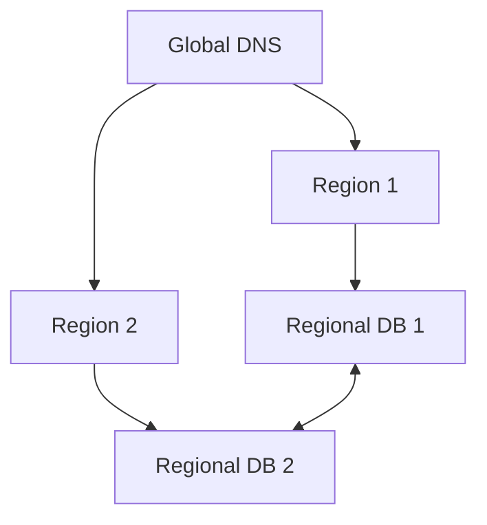

## Challenges

- Cross-region replication
- Conflict resolution
- Data residency
- Global uniqueness
- Higher cost

---

# 29. Deployment and DevOps

HLD should include deployment strategy.

## Common deployment patterns

- Rolling deployment
- Blue-green deployment
- Canary deployment
- Feature flags

## Blue-green

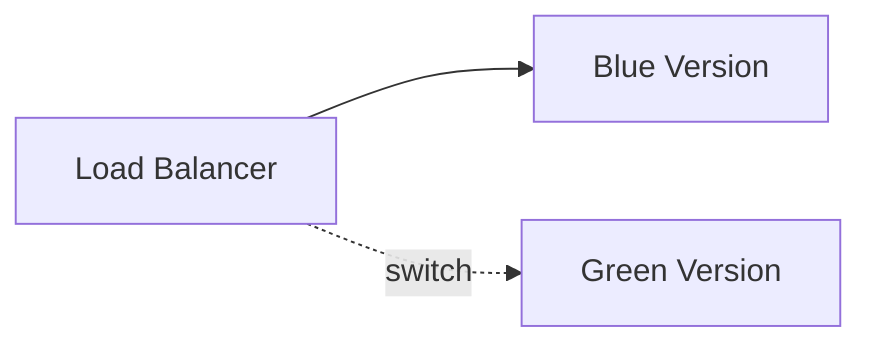

## Canary

Send a small percentage of traffic to new version.

## Infrastructure

Common platform components:

- Containers
- Kubernetes
- CI/CD
- Infrastructure as Code
- Secret management
- Auto scaling

---

# 30. HLD Diagrams

Useful HLD diagrams:

## Component diagram

Shows major services and dependencies.

## Data-flow diagram

Shows movement of requests and events.

## Deployment diagram

Shows infrastructure and regions.

## Sequence diagram

Shows end-to-end operation flow.

## Storage diagram

Shows databases, caches, replicas, and shards.

## Example component diagram

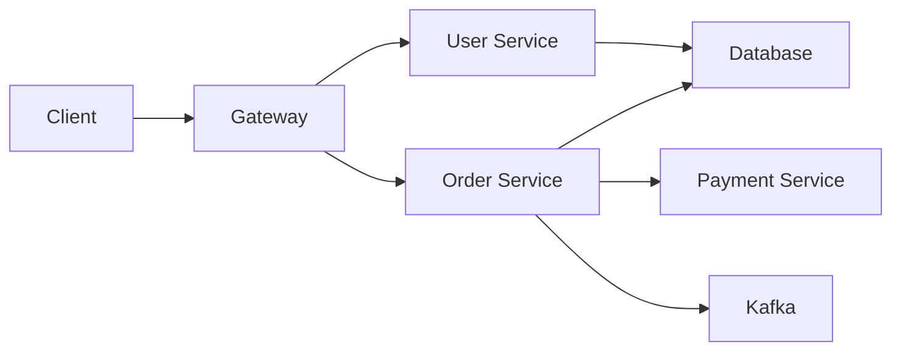

---

# 31. Trade-Off Analysis

Every design has trade-offs.

Common trade-offs:

| Choice | Benefit | Cost |
|---|---|---|
| Cache | Low latency | Stale data |
| Replication | Availability | Consistency complexity |
| Sharding | Scale | Cross-shard complexity |
| Async messaging | Decoupling | Eventual consistency |
| Strong consistency | Correctness | Higher latency |
| Multi-region | Resilience | Cost and conflict handling |

A strong HLD explicitly explains trade-offs.

---

# 32. URL Shortener HLD

## Requirements

- Create short URL
- Redirect
- Support expiry
- Support analytics
- High read volume
- Low redirect latency

## Architecture

```mermaid
flowchart LR
    Client["Client"]
    LB["Load Balancer"]
    URLService["URL Service"]
    Redis["Redis"]
    DB["Database"]
    Kafka["Kafka"]
    Analytics["Analytics Service"]

    Client --> LB
    LB --> URLService
    URLService --> Redis
    URLService --> DB
    URLService --> Kafka
    Kafka --> Analytics
```

## Write flow

1. Validate URL
2. Generate unique ID
3. Encode to Base62
4. Store mapping
5. Cache result
6. Return short URL

## Read flow

1. Read short code
2. Check cache
3. On miss, query database
4. Redirect
5. Publish analytics event

## Database schema

```sql
CREATE TABLE short_urls (
    id BIGINT PRIMARY KEY,
    short_code VARCHAR(20) UNIQUE NOT NULL,
    long_url TEXT NOT NULL,
    created_at TIMESTAMP NOT NULL,
    expires_at TIMESTAMP
);
```

## Scaling

- Stateless service instances
- Redis cluster
- Database sharding by short-code hash
- Kafka for analytics
- CDN for global redirect support

---

# 33. Event-Driven Order System HLD

## Services

- Order service
- Inventory service
- Payment service
- Notification service
- Analytics service

## Architecture

```mermaid
flowchart LR
    Client["Client"]
    Gateway["API Gateway"]
    Order["Order Service"]
    Kafka["Kafka"]
    Inventory["Inventory Service"]
    Payment["Payment Service"]
    Notification["Notification Service"]
    DB1["Order DB"]
    DB2["Inventory DB"]
    DB3["Payment DB"]

    Client --> Gateway
    Gateway --> Order
    Order --> DB1
    Order --> Kafka
    Kafka --> Inventory
    Inventory --> DB2
    Inventory --> Kafka
    Kafka --> Payment
    Payment --> DB3
    Payment --> Kafka
    Kafka --> Notification
```

## Event sequence

```mermaid
sequenceDiagram
    participant Client
    participant Order
    participant Kafka
    participant Inventory
    participant Payment
    participant Notification

    Client->>Order: Create order
    Order->>Kafka: OrderCreated
    Kafka->>Inventory: OrderCreated
    Inventory->>Kafka: InventoryReserved
    Kafka->>Payment: InventoryReserved
    Payment->>Kafka: PaymentCompleted
    Kafka->>Notification: PaymentCompleted
```

## Reliability

- Idempotent consumers
- Retry topics
- Dead-letter topic
- Transactional outbox
- Saga compensation
- Correlation ID
- Schema versioning

---

# 34. Notification System HLD

## Requirements

- Email
- SMS
- Push notification
- Retry
- Scheduling
- Templates
- Delivery status

## Architecture

```mermaid
flowchart LR
    Producers["Business Services"]
    API["Notification API"]
    Broker["Message Broker"]
    Router["Notification Router"]
    Email["Email Worker"]
    SMS["SMS Worker"]
    Push["Push Worker"]
    DB["Notification DB"]

    Producers --> API
    API --> DB
    API --> Broker
    Broker --> Router
    Router --> Email
    Router --> SMS
    Router --> Push
    Email --> DB
    SMS --> DB
    Push --> DB
```

## Key design points

- Per-channel queues
- Provider fallback
- Exponential retry
- User preferences
- Template service
- Deduplication
- Rate limiting
- Delivery tracking

---

# 35. API Gateway HLD

## Responsibilities

- Routing
- Authentication
- Authorization
- Rate limiting
- Circuit breaker
- Request transformation
- Logging
- Metrics
- API aggregation

## Architecture

```mermaid
flowchart LR
    Client["Client"]
    Gateway["Distributed API Gateway"]
    Auth["Auth Service"]
    RouteStore["Route Configuration"]
    Redis["Redis Rate Limit"]
    Service1["Order Service"]
    Service2["Product Service"]

    Client --> Gateway
    Gateway --> Auth
    Gateway --> RouteStore
    Gateway --> Redis
    Gateway --> Service1
    Gateway --> Service2
```

## Scalability

- Stateless gateway nodes
- Distributed rate limiting
- Dynamic route configuration
- Load-balanced downstream calls
- Circuit breaker
- Central tracing

---

# 36. Common HLD Mistakes

## 1. Starting with technologies

Bad:

```text
Use Kafka, Redis, Kubernetes...
```

before requirements are clear.

## 2. Ignoring scale estimation

Without estimates, architecture may be overbuilt or underbuilt.

## 3. No failure strategy

Every remote dependency can fail.

## 4. No trade-off discussion

There is no perfect architecture.

## 5. Assuming strong consistency everywhere

This can increase latency and reduce availability.

## 6. Overusing microservices

A modular monolith may be better at smaller scale.

## 7. Missing idempotency

Retries create duplicate effects.

## 8. Ignoring operational cost

Complex systems are expensive to run.

## 9. No observability

Production issues become difficult to diagnose.

## 10. No data ownership

Shared databases create coupling.

---

# 37. HLD Interview Framework

A practical interview structure:

## Step 1: Clarify requirements

Ask about:

- Users
- Features
- Read/write ratio
- Latency
- Consistency
- Availability
- Geography

## Step 2: Estimate scale

Estimate:

- RPS
- Storage
- Bandwidth
- Peak load

## Step 3: Define APIs

Keep them simple.

## Step 4: Define data model

Identify:

- Entities
- Keys
- Access patterns

## Step 5: Draw architecture

Start simple.

## Step 6: Deep dive

Focus on:

- Database
- Cache
- Partitioning
- Messaging
- Failure handling

## Step 7: Discuss trade-offs

Explain why each major choice was made.

---

# 38. Interview Questions and Answers

## 1. What is HLD?

HLD describes the major components, data flow, storage, scaling, reliability, and deployment of a system.

---

## 2. What is the difference between HLD and LLD?

HLD focuses on architecture. LLD focuses on class-level implementation.

---

## 3. What should be clarified first?

Functional and non-functional requirements.

---

## 4. Why is capacity estimation important?

It guides server count, storage, partitioning, and technology choices.

---

## 5. What is horizontal scaling?

Adding more machines.

---

## 6. Why should application servers be stateless?

Stateless services are easier to scale and replace.

---

## 7. What is a load balancer?

A component that distributes traffic across healthy instances.

---

## 8. Layer 4 vs Layer 7 load balancing?

Layer 4 uses network information. Layer 7 uses application-level information such as HTTP path.

---

## 9. When should SQL be used?

When transactions, joins, and strong consistency are important.

---

## 10. When should NoSQL be used?

When horizontal scale, flexible schema, or key-based access dominate.

---

## 11. What is replication?

Maintaining multiple copies of data.

---

## 12. What is sharding?

Splitting data across database nodes.

---

## 13. What is a hot shard?

A shard receiving much more traffic than others.

---

## 14. What is cache-aside?

Read cache first, then database on miss, then populate cache.

---

## 15. What is cache stampede?

Many requests miss the same key and overload the backend.

---

## 16. How do you prevent cache stampede?

Use request coalescing, locking, early refresh, or randomized TTL.

---

## 17. What is eventual consistency?

Replicas may temporarily differ but converge later.

---

## 18. What is strong consistency?

Reads return the latest committed write.

---

## 19. What is CAP theorem?

During a network partition, choose between consistency and availability.

---

## 20. What is idempotency?

Repeated execution produces the same final result.

---

## 21. Why are idempotency keys important?

They make retries safe for create or payment operations.

---

## 22. What is a message broker used for?

Asynchronous communication, buffering, retries, and decoupling.

---

## 23. Queue vs event stream?

Queues distribute work. Streams retain event history and support replay.

---

## 24. What is a circuit breaker?

A mechanism that stops calls to a failing dependency.

---

## 25. Why use timeouts?

To prevent indefinite blocking and resource exhaustion.

---

## 26. Why use exponential backoff?

To reduce pressure on a failing dependency.

---

## 27. Why add jitter?

To prevent synchronized retry storms.

---

## 28. What is a bulkhead?

Resource isolation between dependencies or workloads.

---

## 29. What is a saga?

A sequence of local transactions with compensating actions.

---

## 30. What is transactional outbox?

Business data and an event are stored in one local transaction and published later.

---

## 31. What is a dead-letter queue?

A queue or topic for messages that cannot be processed.

---

## 32. What is RPO?

Maximum acceptable data loss window.

---

## 33. What is RTO?

Maximum acceptable recovery time.

---

## 34. What is active-active deployment?

Multiple regions serve traffic simultaneously.

---

## 35. What is active-passive deployment?

One region serves traffic while another remains standby.

---

## 36. What is a CDN?

A distributed edge cache for content delivery.

---

## 37. Why use object storage?

For scalable storage of large binary objects.

---

## 38. What is service discovery?

Finding healthy service instances dynamically.

---

## 39. What is an API gateway?

A centralized entry point for routing and cross-cutting concerns.

---

## 40. What is distributed tracing?

Tracking one request across multiple services.

---

## 41. What is a correlation ID?

An identifier used to connect logs and traces.

---

## 42. What is graceful degradation?

Providing reduced functionality instead of full failure.

---

## 43. What is a hot key?

A cache or database key receiving excessive traffic.

---

## 44. How do you handle a hot key?

Replicate, shard, cache locally, or split the key space.

---

## 45. What is consistent hashing?

A distribution technique that minimizes key movement when nodes change.

---

## 46. Why avoid distributed transactions?

They reduce availability and increase coordination complexity.

---

## 47. What is backpressure?

Slowing producers when consumers cannot keep up.

---

## 48. What is canary deployment?

Releasing a new version to a small traffic percentage first.

---

## 49. What is blue-green deployment?

Maintaining two environments and switching traffic between them.

---

## 50. What makes a good HLD answer?

Clear requirements, estimates, simple architecture, failure handling, and trade-off reasoning.

---

# 39. HLD Checklist

## Requirements

- [ ] Functional requirements defined
- [ ] Non-functional requirements defined
- [ ] Scope clarified
- [ ] Read/write ratio estimated
- [ ] Peak load estimated

## Architecture

- [ ] Major components identified
- [ ] APIs defined
- [ ] Data model defined
- [ ] Communication pattern selected
- [ ] Synchronous and asynchronous flows separated

## Scalability

- [ ] Stateless services
- [ ] Load balancing
- [ ] Cache strategy
- [ ] Partitioning strategy
- [ ] Auto scaling

## Reliability

- [ ] Replication
- [ ] Timeouts
- [ ] Retries
- [ ] Circuit breakers
- [ ] Idempotency
- [ ] Dead-letter handling
- [ ] Disaster recovery

## Security

- [ ] Authentication
- [ ] Authorization
- [ ] Encryption
- [ ] Secret management
- [ ] Audit logging
- [ ] Rate limiting

## Operations

- [ ] Logging
- [ ] Metrics
- [ ] Tracing
- [ ] Alerting
- [ ] Deployment strategy
- [ ] Capacity planning

---

# 40. Summary

High-Level Design defines the overall architecture of a software system.

## Core areas

| Area | Questions |
|---|---|
| Requirements | What must the system do? |
| Scale | How much traffic and data? |
| API | How do clients interact? |
| Components | What are the major services? |
| Storage | Where and how is data stored? |
| Cache | How is latency reduced? |
| Messaging | Where is async processing needed? |
| Reliability | How are failures handled? |
| Security | How is access protected? |
| Observability | How is the system monitored? |

## Final HLD mindset

- Start with requirements
- Estimate before choosing technology
- Keep the first architecture simple
- Scale only the bottlenecks
- Assume every network call can fail
- Make operations idempotent
- Explain consistency choices
- Add observability from the beginning
- Discuss trade-offs honestly
- Design for maintainability, not only scale

---

## Recommended Practice Systems

1. URL shortener
2. Distributed API gateway
3. Notification platform
4. Event-driven order system
5. Ride-booking system
6. Food-delivery platform
7. Distributed job scheduler
8. Chat application
9. Video-streaming system
10. Payment-processing platform
