# JVM Internals — In-Depth Guide

A complete guide to Java Virtual Machine internals for backend engineering and FAANG-style interviews. It covers JVM architecture, class loading, runtime memory areas, bytecode execution, object allocation, garbage collection, JIT compilation, Java Memory Model, performance tuning, debugging, profiling, and interview questions.

---

## Table of Contents

1. [What is the JVM?](#1-what-is-the-jvm)
2. [JDK vs JRE vs JVM](#2-jdk-vs-jre-vs-jvm)
3. [JVM Architecture](#3-jvm-architecture)
4. [Class Loading Subsystem](#4-class-loading-subsystem)
5. [Class Loader Hierarchy](#5-class-loader-hierarchy)
6. [Class Loading Phases](#6-class-loading-phases)
7. [Parent Delegation Model](#7-parent-delegation-model)
8. [Runtime Data Areas](#8-runtime-data-areas)
9. [Heap Memory](#9-heap-memory)
10. [Java Stacks](#10-java-stacks)
11. [Metaspace](#11-metaspace)
12. [Program Counter Register](#12-program-counter-register)
13. [Native Method Stack](#13-native-method-stack)
14. [Execution Engine](#14-execution-engine)
15. [Bytecode Interpreter](#15-bytecode-interpreter)
16. [JIT Compiler](#16-jit-compiler)
17. [Tiered Compilation](#17-tiered-compilation)
18. [Code Cache](#18-code-cache)
19. [Object Creation Lifecycle](#19-object-creation-lifecycle)
20. [Object Memory Layout](#20-object-memory-layout)
21. [Compressed OOPs](#21-compressed-oops)
22. [Escape Analysis](#22-escape-analysis)
23. [Stack Allocation and Scalar Replacement](#23-stack-allocation-and-scalar-replacement)
24. [String Pool](#24-string-pool)
25. [Garbage Collection Fundamentals](#25-garbage-collection-fundamentals)
26. [Generational Hypothesis](#26-generational-hypothesis)
27. [Young and Old Generations](#27-young-and-old-generations)
28. [Minor, Major, and Full GC](#28-minor-major-and-full-gc)
29. [GC Roots](#29-gc-roots)
30. [Mark, Sweep, Compact](#30-mark-sweep-compact)
31. [Serial GC](#31-serial-gc)
32. [Parallel GC](#32-parallel-gc)
33. [G1 GC](#33-g1-gc)
34. [ZGC](#34-zgc)
35. [Shenandoah GC](#35-shenandoah-gc)
36. [Choosing a Garbage Collector](#36-choosing-a-garbage-collector)
37. [Stop-the-World Pauses](#37-stop-the-world-pauses)
38. [Safepoints](#38-safepoints)
39. [Memory Leaks in Java](#39-memory-leaks-in-java)
40. [OutOfMemoryError Types](#40-outofmemoryerror-types)
41. [StackOverflowError](#41-stackoverflowerror)
42. [Java Memory Model](#42-java-memory-model)
43. [Happens-Before](#43-happens-before)
44. [Class Initialization](#44-class-initialization)
45. [Reflection and Dynamic Proxies](#45-reflection-and-dynamic-proxies)
46. [JNI and Native Code](#46-jni-and-native-code)
47. [JVM Flags](#47-jvm-flags)
48. [GC Logging](#48-gc-logging)
49. [Heap Dumps](#49-heap-dumps)
50. [Thread Dumps](#50-thread-dumps)
51. [Profiling Tools](#51-profiling-tools)
52. [Java Flight Recorder](#52-java-flight-recorder)
53. [jcmd, jstack, jmap, jstat](#53-jcmd-jstack-jmap-jstat)
54. [Performance Tuning Workflow](#54-performance-tuning-workflow)
55. [Practical Examples](#55-practical-examples)
56. [Best Practices](#56-best-practices)
57. [Common Anti-Patterns](#57-common-anti-patterns)
58. [Interview Questions and Answers](#58-interview-questions-and-answers)
59. [Summary](#59-summary)

---

# 1. What is the JVM?

The Java Virtual Machine is the runtime environment that executes Java bytecode.

Java source code is compiled into platform-independent bytecode.

The JVM translates and executes that bytecode on a specific operating system and CPU architecture.

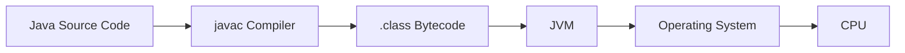

The JVM provides:

- Platform independence
- Memory management
- Garbage collection
- Class loading
- Bytecode verification
- JIT compilation
- Thread management
- Security checks
- Runtime diagnostics

---

# 2. JDK vs JRE vs JVM

## JVM

Executes bytecode.

## JRE

Contains:

- JVM
- Core Java libraries
- Runtime support files

## JDK

Contains:

- JRE
- Java compiler
- Debuggers
- Packaging tools
- Diagnostic tools

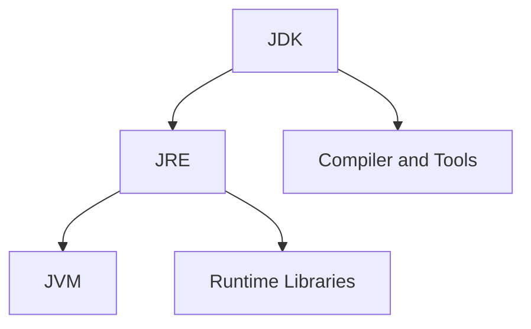

---

# 3. JVM Architecture

The JVM consists of several major subsystems.

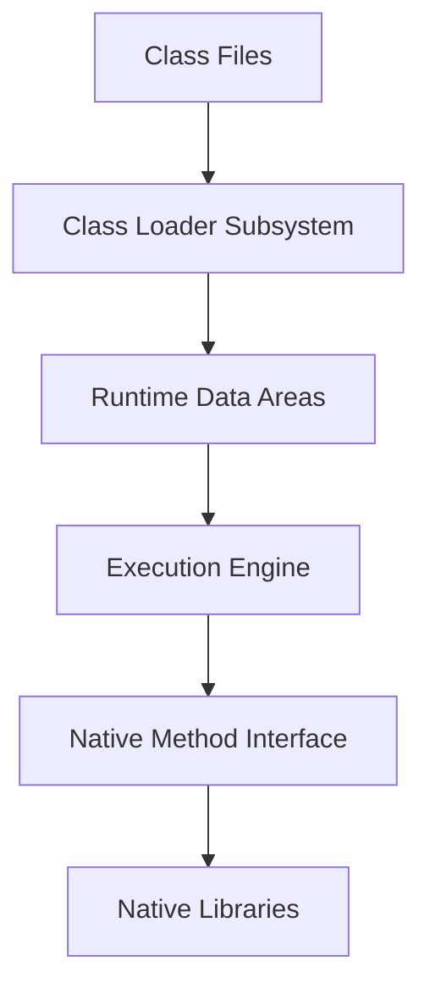

Major components:

- Class loader subsystem
- Runtime data areas
- Execution engine
- Garbage collector
- Native method interface
- Native libraries

---

# 4. Class Loading Subsystem

The class loader subsystem loads `.class` files into memory.

Responsibilities:

- Locate class bytecode
- Load classes
- Verify bytecode
- Allocate static fields
- Resolve symbolic references
- Initialize static state

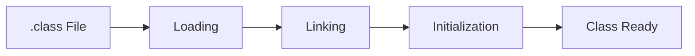

---

# 5. Class Loader Hierarchy

Common built-in class loaders:

- Bootstrap class loader
- Platform class loader
- Application class loader

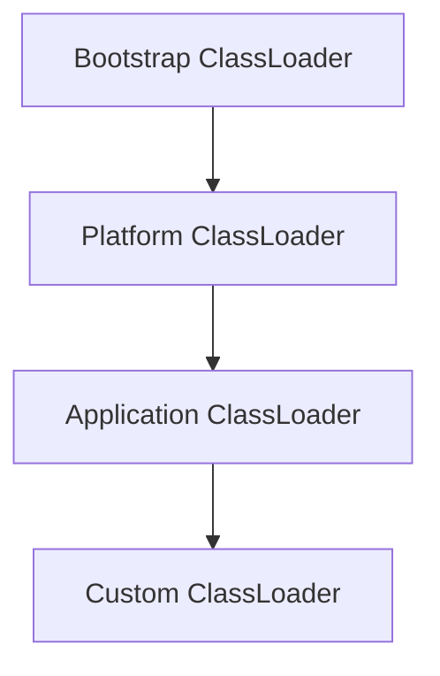

## Bootstrap class loader

Loads core Java classes.

Examples:

```text
java.lang.String
java.util.List
java.lang.Object
```

## Platform class loader

Loads platform modules and libraries.

## Application class loader

Loads application classes from classpath.

## Custom class loader

Used for:

- Plugin systems
- Application servers
- Hot deployment
- Isolation
- Encrypted bytecode
- Dynamic modules

---

# 6. Class Loading Phases

The lifecycle includes:

1. Loading
2. Linking
   - Verification
   - Preparation
   - Resolution
3. Initialization

## Loading

Reads bytecode and creates a `Class` object.

## Verification

Ensures bytecode is valid and safe.

## Preparation

Allocates memory for static fields and gives default values.

```java
static int count = 10;
```

During preparation:

```text
count = 0
```

During initialization:

```text
count = 10
```

## Resolution

Converts symbolic references to direct references.

## Initialization

Executes static initializers and static field assignments.

---

# 7. Parent Delegation Model

A class loader first asks its parent to load a class.

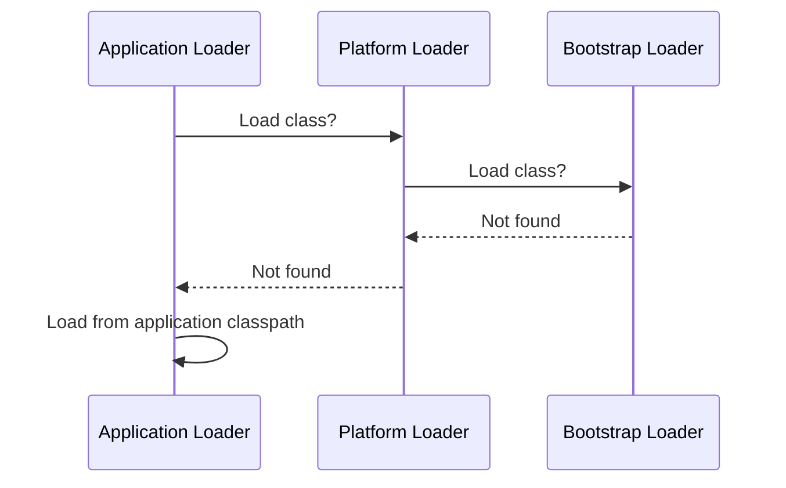

Benefits:

- Prevents core class replacement
- Avoids duplicate loading
- Improves security
- Creates predictable class identity

---

# 8. Runtime Data Areas

JVM memory is divided into thread-shared and thread-private areas.

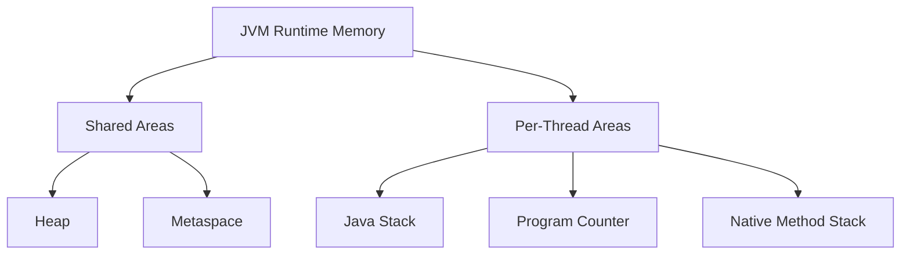

---

# 9. Heap Memory

The heap stores objects and arrays.

It is shared across threads.

Typical logical regions:

- Young generation
- Old generation

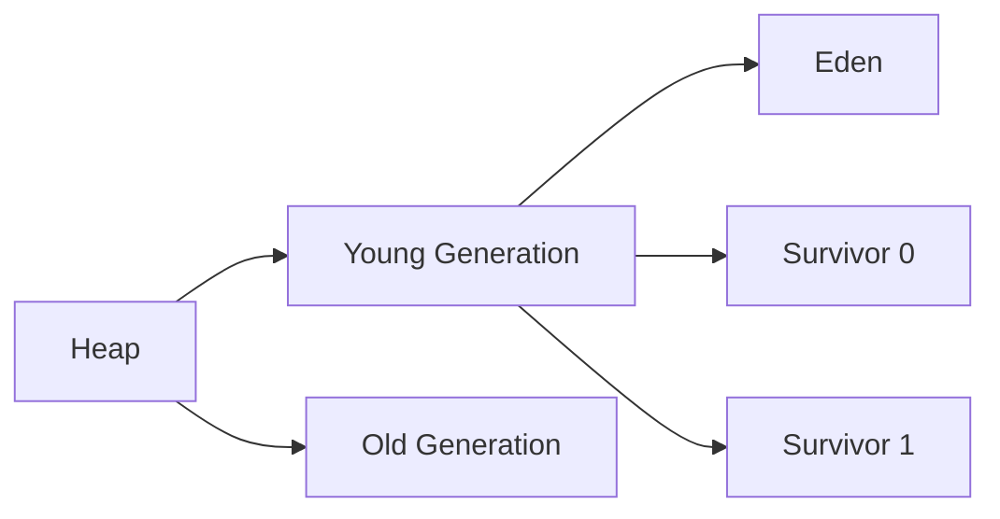

Objects usually start in Eden.

Long-lived objects are promoted to old generation.

---

# 10. Java Stacks

Each thread has its own Java stack.

Each method call creates a stack frame.

A frame contains:

- Local variables
- Operand stack
- Return information
- Constant-pool references

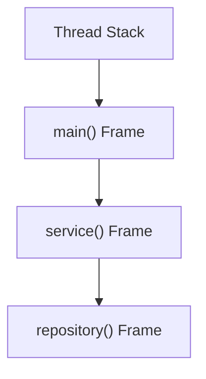

When a method returns, its frame is removed.

Deep recursion can cause `StackOverflowError`.

---

# 11. Metaspace

Metaspace stores class metadata.

It replaced PermGen in Java 8.

Stored information includes:

- Class structure
- Method metadata
- Runtime constant pool
- Annotations
- Class-loader metadata

Metaspace uses native memory rather than normal heap memory.

Potential failure:

```text
OutOfMemoryError: Metaspace
```

Common causes:

- Dynamic class generation
- Class-loader leaks
- Excessive redeployment
- Proxy generation

---

# 12. Program Counter Register

Each thread has a program counter.

It stores the current bytecode instruction position.

It allows the JVM to resume a thread after scheduling or context switching.

---

# 13. Native Method Stack

The native method stack supports methods written in native languages.

Examples:

- C
- C++
- Operating-system calls

Native calls often use JNI.

---

# 14. Execution Engine

The execution engine runs bytecode.

Components:

- Interpreter
- JIT compiler
- Garbage collector

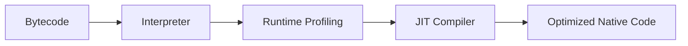

---

# 15. Bytecode Interpreter

The interpreter executes bytecode instruction by instruction.

Advantages:

- Fast startup
- No compile delay

Disadvantages:

- Slower repeated execution

Frequently executed methods are candidates for JIT compilation.

---

# 16. JIT Compiler

The Just-In-Time compiler converts hot bytecode into native machine code.

Common optimizations:

- Method inlining
- Dead-code elimination
- Loop optimization
- Escape analysis
- Lock elimination
- Constant folding
- Devirtualization

## Hot method

A frequently executed method becomes hot and may be compiled.

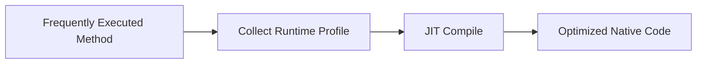

---

# 17. Tiered Compilation

Modern JVMs use tiered compilation.

Execution may progress through levels:

- Interpreter
- Lightweight compiled code
- Highly optimized compiled code

This balances startup speed and peak performance.

```text
Fast startup
+
Runtime profiling
+
Aggressive optimization
```

---

# 18. Code Cache

Compiled native code is stored in the code cache.

If the code cache fills:

- JIT compilation may stop
- Performance can degrade

Monitor code cache in long-running applications with heavy dynamic code generation.

---

# 19. Object Creation Lifecycle

When executing:

```java
User user = new User();
```

The JVM performs several steps.

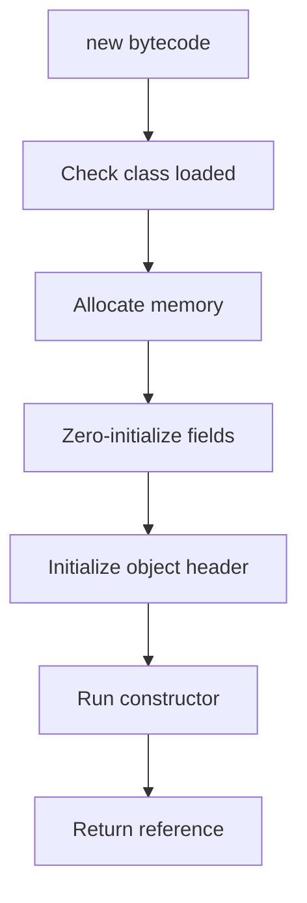

Typical allocation is very fast using thread-local allocation buffers.

---

# 20. Object Memory Layout

A Java object generally contains:

- Object header
- Instance fields
- Padding

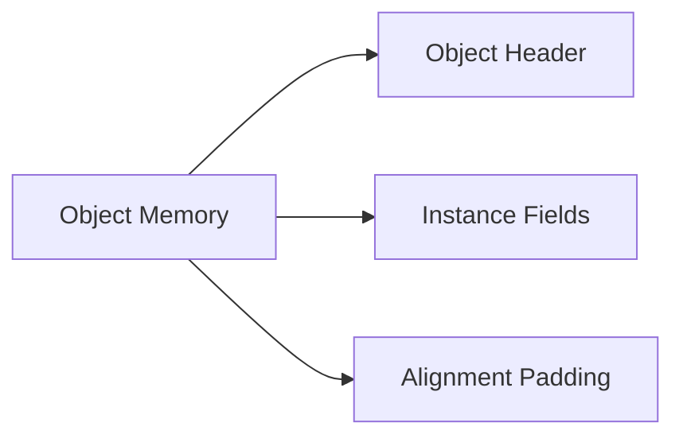

The object header often includes:

- Mark word
- Class pointer
- Array length for arrays

The mark word may contain:

- Identity hash code
- Lock state
- GC age
- Other runtime metadata

---

# 21. Compressed OOPs

OOP means ordinary object pointer.

On 64-bit JVMs, object references may use compressed representation.

Benefits:

- Lower memory usage
- Better cache locality
- Smaller object graphs

Compressed class pointers may also reduce metadata-reference size.

---

# 22. Escape Analysis

Escape analysis determines whether an object escapes a method or thread.

## No escape

Object used only inside a method.

## Method escape

Returned or passed elsewhere.

## Thread escape

Accessible by multiple threads.

The JIT may optimize non-escaping objects.

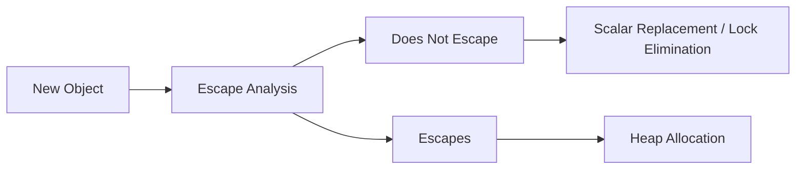

---

# 23. Stack Allocation and Scalar Replacement

The JVM specification does not guarantee stack allocation for objects.

However, JIT optimization may eliminate allocation entirely.

Example:

```java
public int sum() {
    Point point = new Point(10, 20);
    return point.x() + point.y();
}
```

The JVM may replace the object with scalar values:

```text
x = 10
y = 20
```

This is called scalar replacement.

---

# 24. String Pool

The string pool stores interned strings.

```java
String first = "java";
String second = "java";
```

Both references commonly point to the same pooled object.

```java
String third = new String("java");
```

This creates a new object.

```java
third.intern();
```

returns the pooled reference.

## Example

```java
public class StringPoolExample {

    public static void main(String[] args) {
        String first = "java";
        String second = "java";
        String third =
                new String("java");

        System.out.println(
                first == second
        );

        System.out.println(
                first == third
        );

        System.out.println(
                first == third.intern()
        );
    }
}
```

---

# 25. Garbage Collection Fundamentals

Garbage collection automatically reclaims unreachable objects.

An object is eligible for collection when it is not reachable from GC roots.

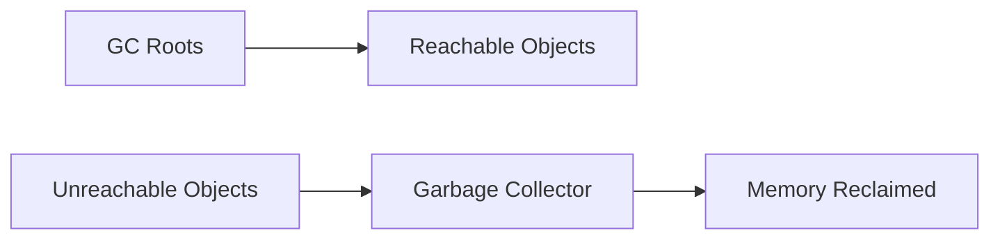

Java GC uses reachability analysis rather than simple reference counting.

---

# 26. Generational Hypothesis

The generational hypothesis states:

- Most objects die young
- A small number survive for a long time

This is why heaps are divided into generations.

Short-lived objects are collected frequently in young generation.

Long-lived objects move to old generation.

---

# 27. Young and Old Generations

## Eden

New objects usually start here.

## Survivor spaces

Objects surviving young collection move between survivor spaces.

## Old generation

Long-lived objects are promoted here.

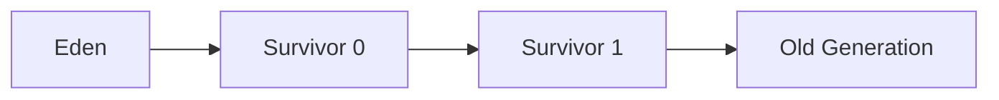

---

# 28. Minor, Major, and Full GC

## Minor GC

Collects young generation.

Usually:

- Frequent
- Shorter pause

## Major GC

Often refers to old-generation collection.

Terminology varies by collector.

## Full GC

Typically collects much or all of heap and may include class unloading.

Usually:

- More expensive
- Longer pause

Always interpret GC log terminology in collector context.

---

# 29. GC Roots

Common GC roots:

- Local variables on active thread stacks
- Static fields
- Active threads
- JNI references
- Monitor-held objects
- Runtime internals

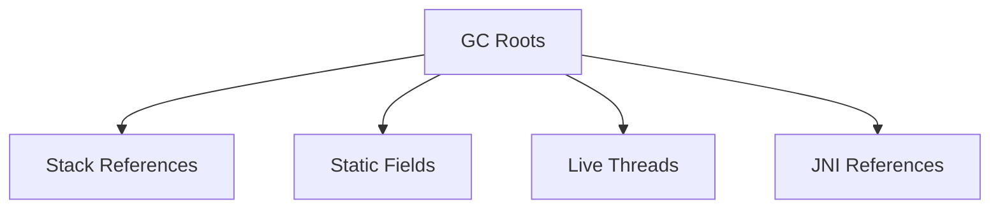

---

# 30. Mark, Sweep, Compact

## Mark

Find reachable objects.

## Sweep

Reclaim unreachable memory.

## Compact

Move surviving objects to reduce fragmentation.

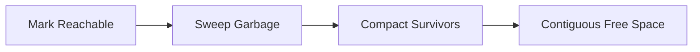

---

# 31. Serial GC

Serial GC uses a single GC thread.

Suitable for:

- Small heaps
- Simple applications
- Low-resource environments

It introduces stop-the-world pauses.

Common selection flag:

```text
-XX:+UseSerialGC
```

---

# 32. Parallel GC

Parallel GC uses multiple threads for collection.

Optimized for throughput.

Suitable for:

- Batch processing
- CPU-heavy applications
- Applications where pause time is less critical

Flag:

```text
-XX:+UseParallelGC
```

---

# 33. G1 GC

G1 divides the heap into regions.

It aims to balance throughput and predictable pauses.

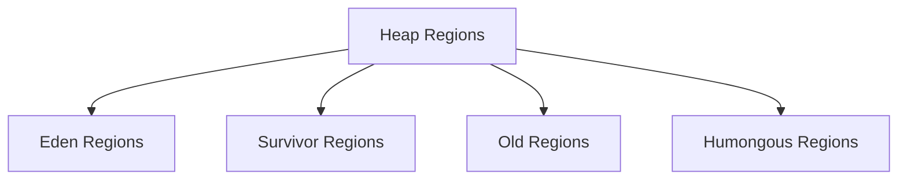

Key features:

- Region-based heap
- Concurrent marking
- Mixed collections
- Pause-time target
- Incremental compaction

Common flag:

```text
-XX:+UseG1GC
```

Pause target:

```text
-XX:MaxGCPauseMillis=200
```

This is a goal, not a guarantee.

---

# 34. ZGC

ZGC is designed for very low pause times and large heaps.

Key characteristics:

- Concurrent collection
- Region-based memory
- Very short pauses
- Suitable for latency-sensitive systems

Flag:

```text
-XX:+UseZGC
```

ZGC shifts more work concurrently with application threads.

---

# 35. Shenandoah GC

Shenandoah is a low-pause collector that performs concurrent compaction.

Key goals:

- Low pause times
- Reduced dependence on heap size
- Concurrent evacuation

Flag availability depends on JVM distribution.

---

# 36. Choosing a Garbage Collector

## Serial GC

Choose for:

- Very small applications
- Limited CPU
- Tiny heaps

## Parallel GC

Choose for:

- High throughput
- Batch workloads

## G1

Choose for:

- General-purpose server applications
- Balanced latency and throughput

## ZGC or Shenandoah

Choose for:

- Very low pause requirements
- Large heaps
- Latency-sensitive services

Selection must be validated with realistic workload testing.

---

# 37. Stop-the-World Pauses

During a stop-the-world pause, application threads stop at safepoints.

Reasons include:

- Garbage collection
- Deoptimization
- Class redefinition
- Thread stack inspection
- Biased-lock-related operations in older JVM behavior

Pause time directly affects latency.

---

# 38. Safepoints

A safepoint is a JVM state where threads can be safely paused.

The JVM may need all threads to reach safepoints.

A slow-to-safepoint thread can delay global operations.

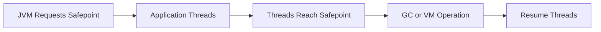

---

# 39. Memory Leaks in Java

Java can still have memory leaks.

A leak occurs when objects are no longer useful but remain reachable.

Common causes:

- Static collections
- Unbounded caches
- Listener registrations
- ThreadLocal values
- Class-loader leaks
- Long-lived maps
- Unclosed resources
- Retained callbacks

## Example

```java
public class MemoryLeakExample {

    private static final List<byte[]> DATA =
            new ArrayList<>();

    public static void add() {
        DATA.add(
                new byte[1024 * 1024]
        );
    }
}
```

The static list prevents reclamation.

---

# 40. OutOfMemoryError Types

Common variants:

## Java heap space

Heap cannot allocate more objects.

```text
OutOfMemoryError: Java heap space
```

## GC overhead limit exceeded

JVM spends excessive time collecting with little memory recovered.

## Metaspace

Too much class metadata.

## Direct buffer memory

Native direct-buffer allocation exhausted.

## Unable to create native thread

OS or process cannot create another thread.

## Requested array size exceeds VM limit

Array request is too large.

---

# 41. StackOverflowError

Caused by excessive stack depth.

Common cause:

```java
public void recurse() {
    recurse();
}
```

Each call creates another frame until stack is exhausted.

---

# 42. Java Memory Model

The JMM defines how threads observe shared memory.

It covers:

- Visibility
- Atomicity
- Ordering
- Synchronization semantics
- Final-field guarantees

Without proper synchronization, behavior may be legal but surprising.

---

# 43. Happens-Before

Important happens-before relationships:

- Program order
- Monitor unlock to later lock
- Volatile write to later read
- Thread start
- Thread join
- Static initialization

These rules ensure writes become visible across threads.

---

# 44. Class Initialization

A class initializes when first actively used.

Triggers include:

- Creating an instance
- Accessing a non-constant static field
- Invoking a static method
- Reflective initialization

Class initialization is synchronized by the JVM.

This supports safe singleton patterns.

## Initialization-on-demand holder

```java
public final class Singleton {

    private Singleton() {
    }

    private static class Holder {
        private static final Singleton INSTANCE =
                new Singleton();
    }

    public static Singleton getInstance() {
        return Holder.INSTANCE;
    }
}
```

---

# 45. Reflection and Dynamic Proxies

Reflection inspects and invokes classes at runtime.

It is used by:

- Spring
- Hibernate
- Serialization libraries
- Testing frameworks

Dynamic proxies create implementations at runtime.

Types:

- JDK dynamic proxy
- Bytecode-generated subclass proxies

Costs may include:

- Extra indirection
- Reduced optimization in some cases
- More metadata
- Harder debugging

---

# 46. JNI and Native Code

JNI allows Java to call native code.

Uses:

- Operating-system integration
- Hardware access
- Existing native libraries
- Performance-specialized components

Risks:

- JVM crash
- Memory leaks outside GC
- Platform dependence
- Security issues
- Harder debugging

---

# 47. JVM Flags

Common memory flags:

```text
-Xms
-Xmx
-Xss
-XX:MaxMetaspaceSize
```

Examples:

```text
-Xms2g
-Xmx2g
-Xss1m
```

GC selection:

```text
-XX:+UseG1GC
-XX:+UseZGC
-XX:+UseParallelGC
```

Diagnostic flags should be used carefully and tested.

---

# 48. GC Logging

Modern JVM logging can use unified logging.

Example:

```text
-Xlog:gc*
```

Write to file:

```text
-Xlog:gc*:file=gc.log:time,uptime,level,tags
```

GC logs reveal:

- Collection frequency
- Pause duration
- Heap occupancy
- Promotion behavior
- Full GC events
- Allocation pressure

---

# 49. Heap Dumps

A heap dump captures objects and references.

Useful for:

- Memory leaks
- Retained-size analysis
- Dominator trees
- Large collections
- Class-loader leaks

Common option:

```text
-XX:+HeapDumpOnOutOfMemoryError
```

Dump path:

```text
-XX:HeapDumpPath=/tmp/heapdump.hprof
```

---

# 50. Thread Dumps

A thread dump shows:

- Thread state
- Stack traces
- Locks
- Deadlocks
- Blocked operations

Useful for:

- Deadlocks
- Thread-pool exhaustion
- Slow requests
- CPU loops
- Blocking I/O

---

# 51. Profiling Tools

Common tools:

- Java Flight Recorder
- Java Mission Control
- VisualVM
- Async Profiler
- Eclipse MAT
- YourKit
- JProfiler
- JMH

Choose tools based on the problem.

---

# 52. Java Flight Recorder

JFR records low-overhead runtime events.

It can capture:

- CPU usage
- Allocation
- Locks
- Threads
- GC
- Exceptions
- I/O
- Method profiling

Example command:

```text
jcmd <pid> JFR.start name=profile duration=60s filename=recording.jfr
```

---

# 53. jcmd, jstack, jmap, jstat

## jcmd

General-purpose diagnostic command.

## jstack

Print thread dump.

## jmap

Inspect heap or create heap dump.

## jstat

View JVM statistics such as GC activity.

Examples:

```text
jcmd <pid> VM.flags
jstack <pid>
jmap -dump:live,format=b,file=heap.hprof <pid>
jstat -gcutil <pid> 1000
```

---

# 54. Performance Tuning Workflow

A good tuning workflow:

```mermaid
flowchart LR
    Measure["Measure"]
    Identify["Identify Bottleneck"]
    Hypothesis["Form Hypothesis"]
    Change["Change One Variable"]
    Test["Load Test"]
    Compare["Compare Results"]

    Measure --> Identify
    Identify --> Hypothesis
    Hypothesis --> Change
    Change --> Test
    Test --> Compare
    Compare --> Measure
```

Never tune based only on assumptions.

Measure:

- Throughput
- p95/p99 latency
- GC pause
- Allocation rate
- CPU
- Memory
- Thread count
- Queue depth
- Lock contention

---

# 55. Practical Examples

## 55.1 Inspect memory usage

```java
public class MemoryInfo {

    public static void main(String[] args) {
        Runtime runtime =
                Runtime.getRuntime();

        long max =
                runtime.maxMemory();

        long total =
                runtime.totalMemory();

        long free =
                runtime.freeMemory();

        long used =
                total - free;

        System.out.println(
                "Max memory: " + max
        );

        System.out.println(
                "Used memory: " + used
        );
    }
}
```

---

## 55.2 Class initialization order

```java
public class InitializationOrder {

    static {
        System.out.println(
                "Static block"
        );
    }

    {
        System.out.println(
                "Instance block"
        );
    }

    public InitializationOrder() {
        System.out.println(
                "Constructor"
        );
    }

    public static void main(String[] args) {
        new InitializationOrder();
    }
}
```

Output:

```text
Static block
Instance block
Constructor
```

---

## 55.3 Demonstrate stack overflow

```java
public class StackOverflowDemo {

    public static void recurse() {
        recurse();
    }

    public static void main(String[] args) {
        recurse();
    }
}
```

---

## 55.4 Demonstrate heap pressure

```java
public class HeapPressureDemo {

    public static void main(String[] args) {
        List<byte[]> values =
                new ArrayList<>();

        while (true) {
            values.add(
                    new byte[1024 * 1024]
            );
        }
    }
}
```

Run only in an isolated environment with a small heap.

---

## 55.5 Custom class loader

```java
public class SimpleClassLoader
        extends ClassLoader {

    @Override
    protected Class<?> findClass(
            String name
    ) throws ClassNotFoundException {

        throw new ClassNotFoundException(
                "Custom loading not implemented: "
                        + name
        );
    }
}
```

---

# 56. Best Practices

1. Use modern LTS Java versions.
2. Measure before tuning.
3. Set realistic heap limits.
4. Enable GC logging in production.
5. Capture heap dumps on OOM.
6. Use JFR for low-overhead diagnostics.
7. Avoid unbounded caches.
8. Close resources.
9. Monitor thread counts.
10. Avoid excessive object allocation in hot paths.
11. Prefer immutable objects where practical.
12. Investigate full GC events.
13. Test collector choice with realistic workloads.
14. Watch native memory, not only heap.
15. Document JVM flags.

---

# 57. Common Anti-Patterns

## 1. Increasing heap without diagnosis

This may only delay failure.

## 2. Calling System.gc()

It is only a request and may create unpredictable pauses.

## 3. Tuning many flags at once

You cannot identify which change helped.

## 4. Ignoring native memory

Threads, direct buffers, metaspace, and code cache use native memory.

## 5. Treating every high heap usage as a leak

High usage may be normal if GC successfully reclaims memory.

## 6. Using finalizers

Finalization is unreliable and deprecated.

## 7. Keeping accidental static references

Static state often outlives business objects.

---

# 58. Interview Questions and Answers

## 1. What is the JVM?

A runtime that loads, verifies, executes bytecode, and manages memory.

## 2. JDK vs JRE vs JVM?

JDK includes development tools, JRE includes runtime libraries and JVM, and JVM executes bytecode.

## 3. What are JVM runtime memory areas?

Heap, stacks, metaspace, program counters, and native method stacks.

## 4. What is stored in heap?

Objects and arrays.

## 5. What is stored in stack?

Per-thread method frames, local variables, and operand stacks.

## 6. What is metaspace?

Native memory storing class metadata.

## 7. What replaced PermGen?

Metaspace.

## 8. What are class-loading phases?

Loading, linking, and initialization.

## 9. What happens during verification?

Bytecode is checked for structural and safety correctness.

## 10. What is parent delegation?

A class loader asks its parent to load a class first.

## 11. Why is parent delegation useful?

Security, consistency, and prevention of duplicate core classes.

## 12. What is bytecode?

Platform-independent JVM instruction format.

## 13. Interpreter vs JIT?

Interpreter executes bytecode directly; JIT compiles hot code to native code.

## 14. What is tiered compilation?

Using multiple compilation levels to balance startup and peak performance.

## 15. What is code cache?

Memory storing JIT-compiled native code.

## 16. How is an object allocated?

Class check, memory allocation, zeroing, header setup, constructor execution.

## 17. What is object header?

Runtime metadata including class pointer and mark word.

## 18. What are compressed OOPs?

Compressed object references used to reduce memory footprint.

## 19. What is escape analysis?

Analysis of whether an object escapes a method or thread.

## 20. What is scalar replacement?

Replacing an object with separate scalar values and eliminating allocation.

## 21. What is the string pool?

A shared pool of interned strings.

## 22. How does GC identify garbage?

By reachability from GC roots.

## 23. What are GC roots?

Stacks, static fields, live threads, JNI references, and runtime references.

## 24. What is the generational hypothesis?

Most objects die young.

## 25. What is young generation?

Heap area where most new objects are allocated.

## 26. What is promotion?

Moving long-lived objects to old generation.

## 27. What is Minor GC?

Collection focused on young generation.

## 28. What is Full GC?

A broad collection that is usually expensive and collector-dependent.

## 29. What is mark-sweep-compact?

Find live objects, reclaim dead memory, and reduce fragmentation.

## 30. What is G1?

A region-based collector balancing pause goals and throughput.

## 31. What is ZGC?

A low-pause concurrent collector designed for large heaps.

## 32. What is stop-the-world?

Application threads pause for a JVM operation.

## 33. What is a safepoint?

A state where the JVM can safely pause threads.

## 34. Can Java have memory leaks?

Yes, when unused objects remain reachable.

## 35. Common Java memory-leak causes?

Static collections, ThreadLocal, listeners, caches, and class loaders.

## 36. What causes heap-space OOM?

The JVM cannot allocate required heap memory.

## 37. What causes Metaspace OOM?

Too much class metadata or class-loader leakage.

## 38. What causes unable-to-create-native-thread?

OS limits or excessive thread creation.

## 39. What causes StackOverflowError?

Excessive call-stack depth.

## 40. What is JMM?

Rules for memory visibility, ordering, and synchronization.

## 41. What is happens-before?

A relationship guaranteeing visibility and ordering between actions.

## 42. Why is class initialization thread-safe?

The JVM synchronizes initialization.

## 43. What is JNI?

An interface allowing Java to call native code.

## 44. What is a heap dump?

A snapshot of heap objects and references.

## 45. What is a thread dump?

A snapshot of threads, states, stacks, and locks.

## 46. What is JFR?

A low-overhead JVM event recorder.

## 47. What is jstat used for?

Monitoring JVM and GC statistics.

## 48. Should System.gc() be used?

Generally no; it can create unpredictable pauses.

## 49. How do you investigate a memory leak?

Capture heap dump, inspect dominators and retained paths, verify growth over time.

## 50. What is the correct JVM tuning mindset?

Measure, identify the real bottleneck, change one variable, and validate under load.

---

# 59. Summary

The JVM is responsible for loading classes, managing memory, executing bytecode, compiling hot code, collecting garbage, and exposing runtime diagnostics.

## Core components

| Component | Responsibility |
|---|---|
| Class loader | Loads and initializes classes |
| Heap | Stores objects |
| Stack | Stores method frames |
| Metaspace | Stores class metadata |
| Interpreter | Executes bytecode |
| JIT compiler | Produces optimized native code |
| Garbage collector | Reclaims unreachable memory |
| JFR and tools | Diagnose runtime behavior |

## Final JVM mindset

- Understand memory areas.
- Know class-loading phases.
- Understand bytecode and JIT.
- Learn object allocation.
- Know GC roots and collector trade-offs.
- Treat native memory as part of total memory.
- Diagnose with evidence.
- Use heap dumps, thread dumps, GC logs, and JFR.
- Avoid random JVM tuning.
- Validate every optimization under realistic load.

---

## Recommended Practice Tasks

1. Inspect bytecode using `javap`.
2. Compare interpreter and JIT warmup behavior.
3. Generate and analyze a heap dump.
4. Capture and inspect a thread dump.
5. Enable GC logging.
6. Compare G1 and ZGC on a sample service.
7. Create a controlled memory leak.
8. Demonstrate StackOverflowError.
9. Build a custom class loader.
10. Record a Java Flight Recorder profile.
