# Apache Kafka — In-Depth Guide

A complete guide to Apache Kafka with architecture diagrams, internal working, producers, consumers, partitions, replication, consumer groups, offsets, delivery guarantees, retries, dead-letter topics, transactions, Spring Boot examples, production design practices, and interview questions.

---

## Table of Contents

1. [What is Apache Kafka?](#1-what-is-apache-kafka)
2. [Why Kafka is Used](#2-why-kafka-is-used)
3. [Core Kafka Concepts](#3-core-kafka-concepts)
4. [Kafka Architecture](#4-kafka-architecture)
5. [Topics and Partitions](#5-topics-and-partitions)
6. [Brokers and Clusters](#6-brokers-and-clusters)
7. [Producers](#7-producers)
8. [Consumers](#8-consumers)
9. [Consumer Groups](#9-consumer-groups)
10. [Offsets](#10-offsets)
11. [Replication](#11-replication)
12. [Leader and Followers](#12-leader-and-followers)
13. [ISR](#13-isr)
14. [Message Ordering](#14-message-ordering)
15. [Message Delivery Semantics](#15-message-delivery-semantics)
16. [Acknowledgment Modes](#16-acknowledgment-modes)
17. [Producer Retries and Idempotence](#17-producer-retries-and-idempotence)
18. [Kafka Transactions](#18-kafka-transactions)
19. [Consumer Rebalancing](#19-consumer-rebalancing)
20. [Partition Assignment Strategies](#20-partition-assignment-strategies)
21. [Retention and Log Segments](#21-retention-and-log-segments)
22. [Compacted Topics](#22-compacted-topics)
23. [Serialization and Deserialization](#23-serialization-and-deserialization)
24. [Schema Management](#24-schema-management)
25. [Retries and Dead-Letter Topics](#25-retries-and-dead-letter-topics)
26. [Kafka Connect](#26-kafka-connect)
27. [Kafka Streams](#27-kafka-streams)
28. [KRaft and Metadata Management](#28-kraft-and-metadata-management)
29. [Spring Boot Producer Example](#29-spring-boot-producer-example)
30. [Spring Boot Consumer Example](#30-spring-boot-consumer-example)
31. [Retry and DLT with Spring Kafka](#31-retry-and-dlt-with-spring-kafka)
32. [Exactly-Once Processing in Spring](#32-exactly-once-processing-in-spring)
33. [Practical Event-Driven Example](#33-practical-event-driven-example)
34. [Performance Tuning](#34-performance-tuning)
35. [Monitoring and Observability](#35-monitoring-and-observability)
36. [Security](#36-security)
37. [Common Failure Scenarios](#37-common-failure-scenarios)
38. [Best Practices](#38-best-practices)
39. [Anti-Patterns](#39-anti-patterns)
40. [Interview Questions and Answers](#40-interview-questions-and-answers)
41. [Summary](#41-summary)

---

# 1. What is Apache Kafka?

Apache Kafka is a distributed event-streaming platform used to publish, store, and process events at high throughput.

Kafka is commonly used for:

- Event-driven microservices
- Real-time analytics
- Log aggregation
- Data pipelines
- Change data capture
- Notification systems
- Audit trails
- Stream processing

A Kafka event usually contains:

```text
Key
Value
Timestamp
Headers
Partition
Offset
```

Example event:

```json
{
  "orderId": "ORDER-101",
  "customerId": "CUSTOMER-501",
  "status": "CREATED",
  "totalAmount": 2499.0
}
```

---

# 2. Why Kafka is Used

Kafka solves several distributed-system problems:

- Decouples producers from consumers
- Buffers traffic spikes
- Supports replay
- Preserves event order within partitions
- Scales horizontally
- Supports fault tolerance
- Handles large volumes of events
- Enables asynchronous communication

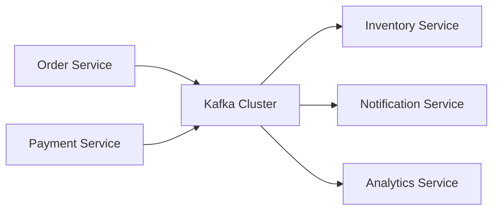

Without Kafka, every service may need direct synchronous communication.

With Kafka, services communicate through durable events.

---

# 3. Core Kafka Concepts

The most important Kafka concepts are:

- Producer
- Consumer
- Broker
- Cluster
- Topic
- Partition
- Offset
- Consumer group
- Replication
- Leader
- Follower
- ISR
- Retention

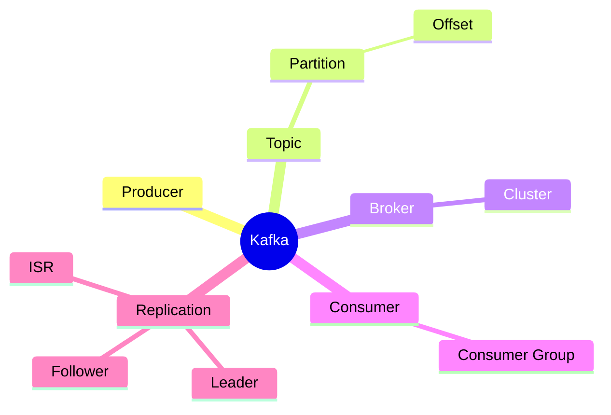

---

# 4. Kafka Architecture

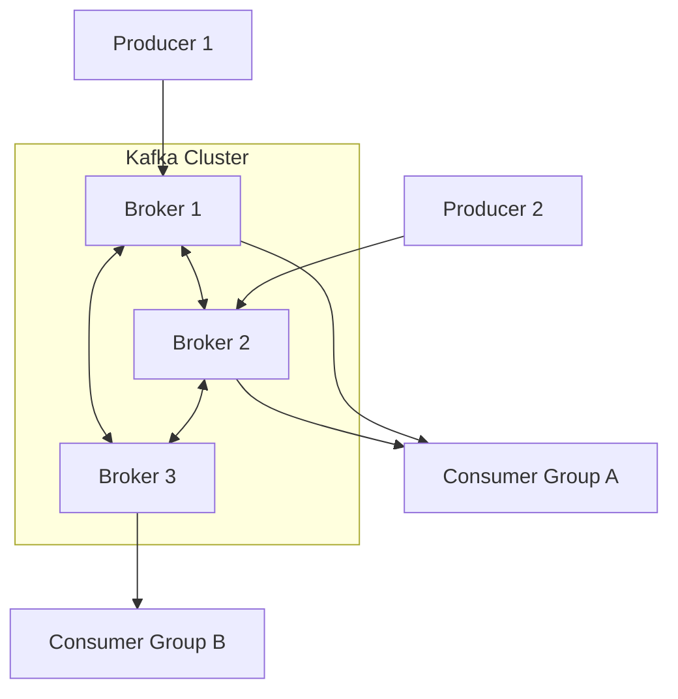

Kafka stores data as an append-only distributed log.

---

# 5. Topics and Partitions

A topic is a logical category of events.

Examples:

```text
order-created
payment-completed
inventory-reserved
notification-requested
```

A topic is divided into partitions.

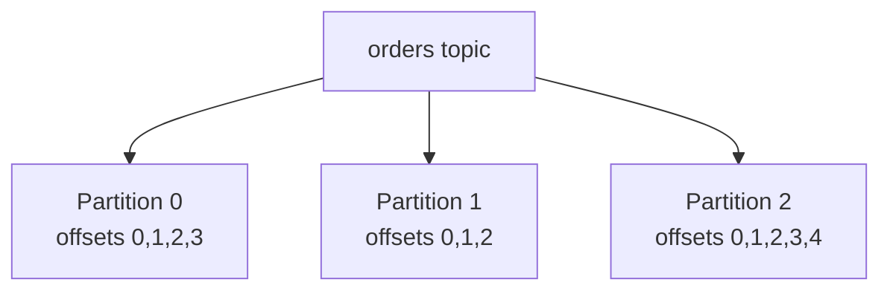

## Why partitions exist

Partitions provide:

- Parallelism
- Scalability
- Distribution across brokers
- Ordering within a partition

## Important rule

Kafka guarantees ordering only within a single partition.

It does not guarantee global ordering across all partitions.

---

# 6. Brokers and Clusters

A broker is a Kafka server.

A Kafka cluster contains multiple brokers.

Each broker:

- Stores partitions
- Handles producer requests
- Handles consumer fetch requests
- Replicates partition data
- Participates in metadata management

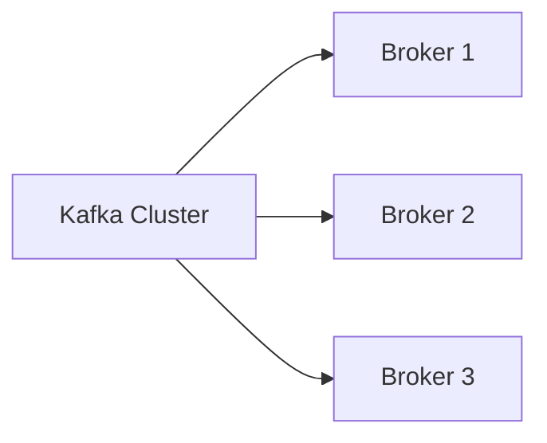

Multiple brokers improve:

- Availability
- Throughput
- Fault tolerance
- Horizontal scalability

---

# 7. Producers

A producer publishes events to Kafka topics.

```java
producer.send(
        new ProducerRecord<>(
                "order-created",
                orderId,
                orderEvent
        )
);
```

Producer responsibilities include:

- Choosing the topic
- Choosing a partition
- Serializing keys and values
- Batching records
- Retrying failed requests
- Handling acknowledgments

## Producer flow

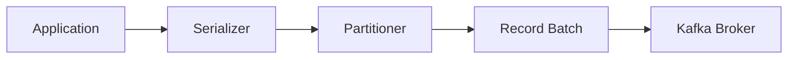

---

# 8. Consumers

A consumer reads events from topics.

```java
consumer.subscribe(
        List.of("order-created")
);
```

Consumer responsibilities include:

- Joining a consumer group
- Receiving partition assignments
- Polling records
- Processing events
- Managing offsets
- Handling rebalances

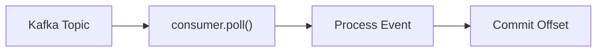

---

# 9. Consumer Groups

A consumer group is a set of consumers that cooperate to consume a topic.

Within one group:

- A partition is assigned to only one consumer at a time
- A consumer may own multiple partitions
- Consumers share work

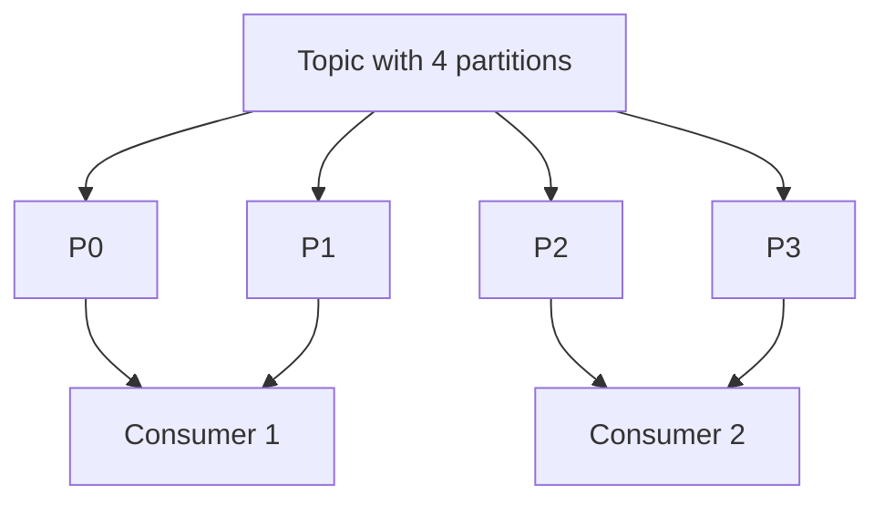

## Important rule

If a topic has 3 partitions and a consumer group has 5 consumers:

```text
3 consumers are active
2 consumers remain idle
```

Maximum active consumers in a group are limited by partition count.

---

# 10. Offsets

An offset is the position of an event inside a partition.

```text
Partition 0:
offset 0 -> Event A
offset 1 -> Event B
offset 2 -> Event C
```

Offsets are unique only within a partition.

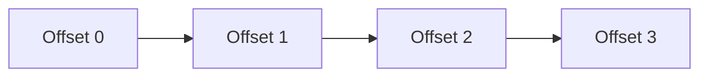

Consumers use offsets to track progress.

## Committed offset

A committed offset represents the next record a consumer group should read.

Example:

```text
Committed offset = 5
```

The next consumed event starts from offset 5.

---

# 11. Replication

Replication creates copies of partitions on multiple brokers.

Example:

```text
Replication factor = 3
```

Each partition has:

- One leader replica
- Multiple follower replicas

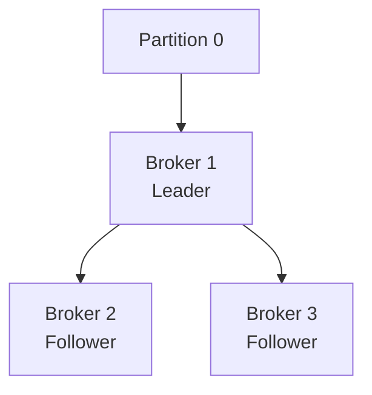

Replication protects against broker failure.

---

# 12. Leader and Followers

For each partition:

- Leader handles reads and writes
- Followers replicate the leader's log

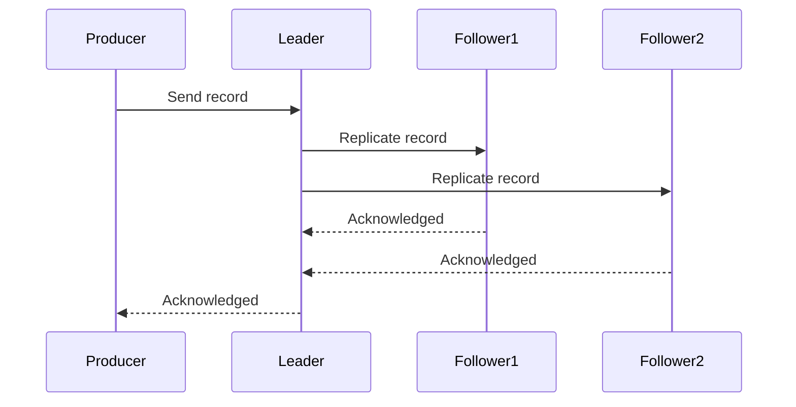

If the leader fails, an eligible follower may become the new leader.

---

# 13. ISR

ISR means In-Sync Replicas.

ISR contains replicas that are sufficiently caught up with the leader.

Example:

```text
Leader: Broker 1
ISR: [Broker 1, Broker 2, Broker 3]
```

If Broker 3 falls too far behind:

```text
ISR: [Broker 1, Broker 2]
```

## Why ISR matters

Acknowledgment and leader election depend on ISR.

A healthy ISR improves durability.

---

# 14. Message Ordering

Kafka preserves order inside one partition.

If events for the same business entity must remain ordered, use a stable key.

Example:

```java
new ProducerRecord<>(
        "order-events",
        orderId,
        orderEvent
);
```

Kafka hashes the key and typically routes the same key to the same partition.

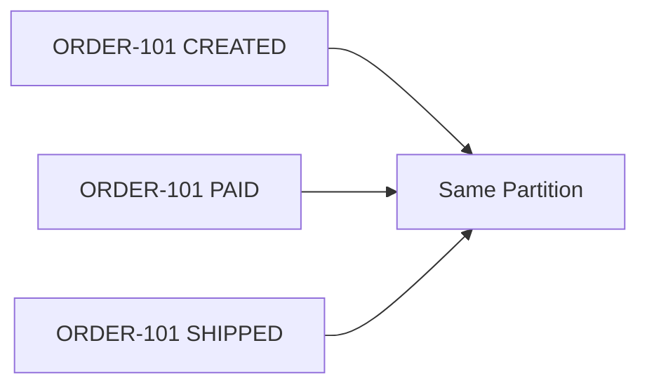

## Common key choices

- Order ID
- Customer ID
- Account ID
- Payment ID
- Device ID

---

# 15. Message Delivery Semantics

Kafka systems commonly use:

- At-most-once
- At-least-once
- Exactly-once

## At-most-once

```text
Commit offset first
Then process
```

Possible outcome:

- No duplicate processing
- Message may be lost

## At-least-once

```text
Process first
Then commit
```

Possible outcome:

- No message loss
- Duplicate processing may occur

## Exactly-once

Requires coordination between:

- Producer idempotence
- Transactions
- Consumer isolation
- External side effects

Exactly-once is easiest when processing entirely inside Kafka.

---

# 16. Acknowledgment Modes

Producer acknowledgment setting:

```text
acks=0
acks=1
acks=all
```

## acks=0

Producer does not wait for broker acknowledgment.

Advantages:

- Lowest latency

Risks:

- Data loss

## acks=1

Leader acknowledges after writing locally.

Risks:

- Data may be lost if leader fails before replication

## acks=all

Leader waits for required in-sync replicas.

Advantages:

- Strongest durability

Typically paired with:

```text
min.insync.replicas
```

---

# 17. Producer Retries and Idempotence

Retries help handle transient failures.

Without idempotence, retrying may create duplicates.

Producer idempotence ensures duplicate retry attempts are not appended multiple times within the producer session.

Important producer settings commonly include:

```properties
enable.idempotence=true
acks=all
retries=2147483647
max.in.flight.requests.per.connection=5
```

## Idempotent producer flow

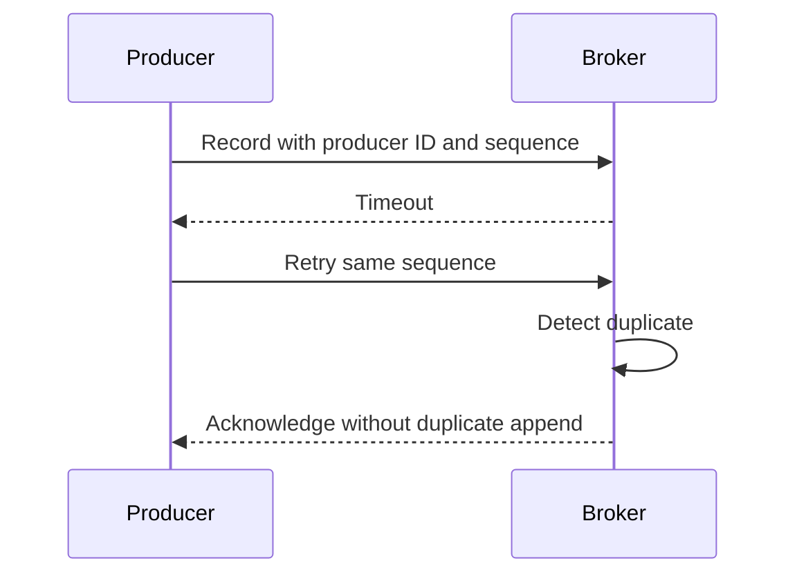

---

# 18. Kafka Transactions

Kafka transactions allow multiple records across partitions to be committed atomically.

Use case:

```text
Consume from topic A
Process
Produce to topic B
Commit consumed offsets
```

All steps can be coordinated transactionally.

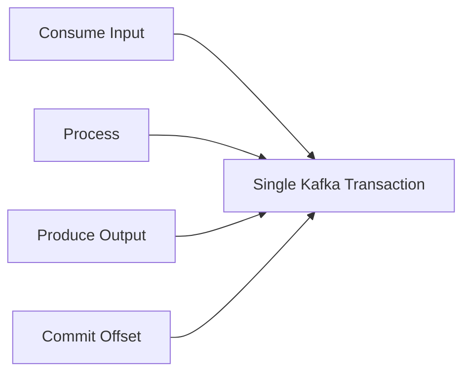

## Important limitation

Kafka transactions do not automatically make external database writes exactly-once.

For Kafka plus database consistency, consider:

- Transactional outbox
- Idempotent consumer
- Change data capture
- Saga pattern

---

# 19. Consumer Rebalancing

Rebalancing occurs when partition assignments change.

Triggers:

- Consumer joins
- Consumer leaves
- Consumer crashes
- Topic partition count changes
- Subscription changes

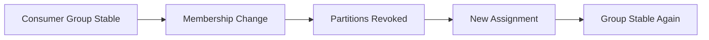

During rebalancing, processing may pause.

Frequent rebalances reduce throughput.

---

# 20. Partition Assignment Strategies

Common assignment strategies include:

- Range assignor
- Round-robin assignor
- Sticky assignor
- Cooperative sticky assignor

## Range

Assigns contiguous partition ranges per topic.

## Round-robin

Distributes partitions more evenly across consumers.

## Sticky

Tries to preserve existing assignments while balancing.

## Cooperative sticky

Uses incremental rebalancing to reduce stop-the-world reassignment.

---

# 21. Retention and Log Segments

Kafka stores events based on retention policies.

Common retention types:

- Time-based
- Size-based
- Compaction

Example settings:

```properties
retention.ms=604800000
retention.bytes=10737418240
```

Kafka partitions are stored as log segments.

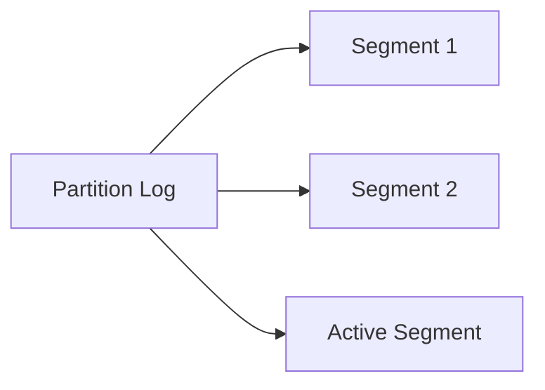

Old segments are deleted based on retention rules.

---

# 22. Compacted Topics

Log compaction keeps the latest value for each key.

Example:

```text
customer-101 -> address A
customer-101 -> address B
customer-101 -> address C
```

After compaction, Kafka eventually retains:

```text
customer-101 -> address C
```

## Tombstone record

A record with:

```text
key = some key
value = null
```

acts as a deletion marker.

Compacted topics are useful for:

- Latest entity state
- Configuration
- Cache rebuilding
- Change logs

---

# 23. Serialization and Deserialization

Kafka stores bytes.

Producers serialize objects.

Consumers deserialize bytes.

Common serializers:

- String serializer
- Integer serializer
- JSON serializer
- Avro serializer
- Protobuf serializer

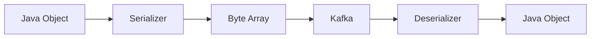

## JSON example

```java
public record OrderCreatedEvent(
        String orderId,
        String customerId,
        double totalAmount
) {
}
```

---

# 24. Schema Management

Schemas help producers and consumers agree on event structure.

Common schema formats:

- Avro
- JSON Schema
- Protobuf

Benefits:

- Compatibility checks
- Safer evolution
- Smaller payloads
- Clear contracts

## Compatibility types

- Backward
- Forward
- Full

Example safe evolution:

```text
Add an optional field with a default value
```

Example risky evolution:

```text
Rename a required field without compatibility handling
```

---

# 25. Retries and Dead-Letter Topics

A failed event should not block a partition forever.

Common approach:

```text
Main topic
Retry topic
Dead-letter topic
```

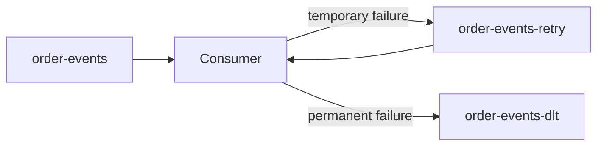

## Retryable failures

- Temporary network issue
- Downstream service unavailable
- Database timeout

## Non-retryable failures

- Invalid schema
- Missing required field
- Unsupported event type
- Business validation failure

---

# 26. Kafka Connect

Kafka Connect moves data between Kafka and external systems.

Examples:

- Database to Kafka
- Kafka to Elasticsearch
- Kafka to object storage
- Kafka to data warehouse


Benefits:

- Less custom integration code
- Scalable connector workers
- Offset management
- Standardized configuration

---

# 27. Kafka Streams

Kafka Streams is a Java library for stream processing.

Common operations:

- Filter
- Map
- Group
- Aggregate
- Join
- Window

```java
StreamsBuilder builder =
        new StreamsBuilder();

KStream<String, OrderEvent> orders =
        builder.stream("order-events");

orders
        .filter(
                (key, event) ->
                        event.totalAmount() > 1000
        )
        .to(
                "high-value-orders"
        );
```

## Stream-table duality

- `KStream` represents event records
- `KTable` represents latest value by key

---

# 28. KRaft and Metadata Management

Modern Kafka deployments use KRaft-based metadata management.

KRaft removes the dependency on a separate ZooKeeper ensemble.

Kafka metadata includes:

- Topics
- Partitions
- Replicas
- Broker registrations
- Configurations
- Controller state

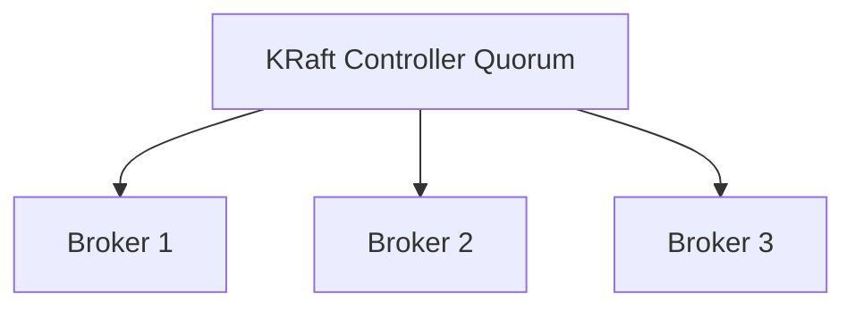

---

# 29. Spring Boot Producer Example

## Maven dependencies

```xml
<dependency>
    <groupId>org.springframework.kafka</groupId>
    <artifactId>spring-kafka</artifactId>
</dependency>
```

## application.yml

```yaml
spring:
  kafka:
    bootstrap-servers: localhost:9092
    producer:
      key-serializer: org.apache.kafka.common.serialization.StringSerializer
      value-serializer: org.springframework.kafka.support.serializer.JsonSerializer
      properties:
        enable.idempotence: true
        acks: all
```

## Event

```java
public record OrderCreatedEvent(
        String orderId,
        String customerId,
        double totalAmount
) {
}
```

## Producer service

```java
import org.springframework.kafka.core.KafkaTemplate;
import org.springframework.stereotype.Service;

@Service
public class OrderEventProducer {

    private static final String TOPIC =
            "order-created";

    private final KafkaTemplate<
            String,
            OrderCreatedEvent
            > kafkaTemplate;

    public OrderEventProducer(
            KafkaTemplate<
                    String,
                    OrderCreatedEvent
                    > kafkaTemplate
    ) {
        this.kafkaTemplate = kafkaTemplate;
    }

    public void publish(
            OrderCreatedEvent event
    ) {
        kafkaTemplate.send(
                TOPIC,
                event.orderId(),
                event
        );
    }
}
```

## Handling send result

```java
public void publish(
        OrderCreatedEvent event
) {
    kafkaTemplate
            .send(
                    TOPIC,
                    event.orderId(),
                    event
            )
            .whenComplete(
                    (result, exception) -> {
                        if (exception != null) {
                            System.err.println(
                                    "Publish failed: "
                                            + exception.getMessage()
                            );
                            return;
                        }

                        var metadata =
                                result.getRecordMetadata();

                        System.out.println(
                                "Published to partition "
                                        + metadata.partition()
                                        + " at offset "
                                        + metadata.offset()
                        );
                    }
            );
}
```

---

# 30. Spring Boot Consumer Example

## application.yml

```yaml
spring:
  kafka:
    bootstrap-servers: localhost:9092
    consumer:
      group-id: inventory-service
      auto-offset-reset: earliest
      enable-auto-commit: false
      key-deserializer: org.apache.kafka.common.serialization.StringDeserializer
      value-deserializer: org.springframework.kafka.support.serializer.JsonDeserializer
      properties:
        spring.json.trusted.packages: "com.example.events"
    listener:
      ack-mode: record
```

## Consumer

```java
import org.springframework.kafka.annotation.KafkaListener;
import org.springframework.stereotype.Service;

@Service
public class OrderCreatedConsumer {

    @KafkaListener(
            topics = "order-created",
            groupId = "inventory-service"
    )
    public void consume(
            OrderCreatedEvent event
    ) {
        System.out.println(
                "Received order: "
                        + event.orderId()
        );

        reserveInventory(event);
    }

    private void reserveInventory(
            OrderCreatedEvent event
    ) {
        System.out.println(
                "Inventory reserved for "
                        + event.orderId()
        );
    }
}
```

---

# 31. Retry and DLT with Spring Kafka

Spring Kafka supports retries and dead-letter topics.

## Configuration example

```java
import org.apache.kafka.common.TopicPartition;
import org.springframework.context.annotation.Bean;
import org.springframework.context.annotation.Configuration;
import org.springframework.kafka.core.KafkaTemplate;
import org.springframework.kafka.listener.DeadLetterPublishingRecoverer;
import org.springframework.kafka.listener.DefaultErrorHandler;
import org.springframework.util.backoff.FixedBackOff;

@Configuration
public class KafkaErrorHandlingConfig {

    @Bean
    public DefaultErrorHandler errorHandler(
            KafkaTemplate<Object, Object>
                    kafkaTemplate
    ) {
        DeadLetterPublishingRecoverer recoverer =
                new DeadLetterPublishingRecoverer(
                        kafkaTemplate,
                        (record, exception) ->
                                new TopicPartition(
                                        record.topic()
                                                + "-dlt",
                                        record.partition()
                                )
                );

        FixedBackOff backOff =
                new FixedBackOff(
                        1000L,
                        3L
                );

        return new DefaultErrorHandler(
                recoverer,
                backOff
        );
    }
}
```

This means:

- Wait 1 second
- Retry 3 times
- Publish to DLT after retries fail

---

# 32. Exactly-Once Processing in Spring

Spring Kafka can coordinate Kafka transactions.

## Producer configuration

```yaml
spring:
  kafka:
    producer:
      transaction-id-prefix: order-service-
```

## Transactional service

```java
import org.springframework.kafka.annotation.KafkaListener;
import org.springframework.kafka.core.KafkaTemplate;
import org.springframework.stereotype.Service;
import org.springframework.transaction.annotation.Transactional;

@Service
public class OrderProcessingService {

    private final KafkaTemplate<
            String,
            Object
            > kafkaTemplate;

    public OrderProcessingService(
            KafkaTemplate<
                    String,
                    Object
                    > kafkaTemplate
    ) {
        this.kafkaTemplate = kafkaTemplate;
    }

    @Transactional
    @KafkaListener(
            topics = "order-created",
            groupId = "payment-service"
    )
    public void process(
            OrderCreatedEvent event
    ) {
        PaymentCompletedEvent paymentEvent =
                new PaymentCompletedEvent(
                        event.orderId(),
                        "TXN-101"
                );

        kafkaTemplate.send(
                "payment-completed",
                event.orderId(),
                paymentEvent
        );
    }
}
```

Exactly-once guarantees depend on correct transactional configuration.

---

# 33. Practical Event-Driven Example

Consider an order-processing system.

```mermaid
sequenceDiagram
    participant Client
    participant OrderService
    participant Kafka
    participant InventoryService
    participant PaymentService
    participant NotificationService

    Client->>OrderService: Create order
    OrderService->>Kafka: OrderCreated
    Kafka->>InventoryService: OrderCreated
    InventoryService->>Kafka: InventoryReserved
    Kafka->>PaymentService: InventoryReserved
    PaymentService->>Kafka: PaymentCompleted
    Kafka->>NotificationService: PaymentCompleted
    NotificationService-->>Client: Confirmation
```

## Event flow

```text
OrderCreated
InventoryReserved
PaymentCompleted
NotificationRequested
```

## Benefits

- Loose coupling
- Independent scaling
- Failure isolation
- Replay support
- Auditability

---

# 34. Performance Tuning

## Producer tuning

Important settings:

```properties
batch.size
linger.ms
compression.type
buffer.memory
acks
retries
delivery.timeout.ms
max.in.flight.requests.per.connection
```

### batch.size

Larger batches may improve throughput.

### linger.ms

Allows a small wait to accumulate a batch.

### compression.type

Common options:

```text
gzip
snappy
lz4
zstd
```

Compression reduces network and disk usage.

## Consumer tuning

Important settings:

```properties
fetch.min.bytes
fetch.max.wait.ms
max.poll.records
max.poll.interval.ms
session.timeout.ms
heartbeat.interval.ms
```

## Broker tuning

Important areas:

- Disk throughput
- Network throughput
- Page cache
- Partition count
- Replication factor
- Segment size
- Retention policy

---

# 35. Monitoring and Observability

Monitor:

- Consumer lag
- Under-replicated partitions
- Offline partitions
- Request latency
- Broker disk usage
- ISR shrink/expand
- Produce and fetch throughput
- Failed requests
- Rebalance count
- DLT volume

```mermaid
flowchart LR
    Kafka["Kafka Cluster"]
    Metrics["Metrics"]
    Monitoring["Monitoring Platform"]
    Alerts["Alerts"]

    Kafka --> Metrics
    Metrics --> Monitoring
    Monitoring --> Alerts
```

## Consumer lag

Consumer lag:

```text
latest partition offset - consumer committed offset
```

High lag may indicate:

- Slow processing
- Too few consumers
- Downstream bottleneck
- Rebalance instability
- Large backlog

---

# 36. Security

Kafka security commonly includes:

- TLS encryption
- SASL authentication
- ACL authorization
- Secret management

## Authentication mechanisms

Examples:

- SASL/PLAIN
- SASL/SCRAM
- Kerberos
- OAuth-based authentication

## Authorization

ACLs can restrict:

- Topic read
- Topic write
- Group access
- Cluster operations

Never commit Kafka credentials into source control.

---

# 37. Common Failure Scenarios

## Broker failure

Followers replicate data and an eligible follower becomes leader.

## Consumer crash

Partitions are reassigned to another consumer.

## Producer timeout

Producer may retry.

## Poison message

Message repeatedly fails processing.

Solution:

- Validate
- Retry selectively
- Send to DLT

## Slow consumer

Lag increases.

Solutions:

- Optimize processing
- Increase partitions
- Add consumers
- Batch downstream operations

## Duplicate message

Possible under at-least-once processing.

Solution:

- Idempotent consumer
- Deduplication store
- Unique business key

---

# 38. Best Practices

## 1. Use meaningful event names

Good:

```text
OrderCreated
PaymentCompleted
InventoryReservationFailed
```

Avoid vague names like:

```text
OrderUpdated
ProcessEvent
```

## 2. Use stable keys

Choose keys based on ordering requirements.

## 3. Design consumers to be idempotent

Processing the same event twice should not corrupt state.

## 4. Separate retryable and non-retryable failures

Do not retry invalid events forever.

## 5. Use DLTs with monitoring

A DLT without alerts becomes a hidden failure queue.

## 6. Keep events backward compatible

Avoid breaking existing consumers.

## 7. Avoid very large messages

Store large payloads externally and publish references when needed.

## 8. Monitor consumer lag

Lag is a primary health signal.

## 9. Use replication factor greater than one in production

Single-replica topics are not fault tolerant.

## 10. Avoid excessive partition counts

Partitions have operational cost.

## 11. Commit offsets after successful processing

This supports at-least-once semantics.

## 12. Use transactional outbox for database-to-Kafka consistency

Avoid dual-write inconsistency.

---

# 39. Anti-Patterns

## 1. Using Kafka as a synchronous request-response system

Kafka is primarily asynchronous.

## 2. Creating a topic for every tiny event variant

This increases operational complexity.

## 3. Ignoring key design

Bad keys cause uneven partitions or broken ordering.

## 4. Retrying permanent failures

This creates retry storms.

## 5. Processing without idempotency

Duplicates may cause incorrect results.

## 6. Large monolithic events

Consumers become tightly coupled.

## 7. Assuming global ordering

Ordering is only within a partition.

## 8. Relying only on auto-commit

Offsets may be committed before successful processing.

## 9. No schema governance

Event evolution becomes risky.

## 10. No DLT ownership

Failed events remain unresolved.

---

# 40. Interview Questions and Answers

## 1. What is Kafka?

Kafka is a distributed event-streaming platform for publishing, storing, and processing events.

---

## 2. What is a topic?

A topic is a named logical stream of events.

---

## 3. What is a partition?

A partition is an ordered append-only log within a topic.

---

## 4. Why are partitions needed?

For scalability, parallelism, distribution, and ordered processing.

---

## 5. Is ordering guaranteed across a topic?

Only within each partition, not across all partitions.

---

## 6. What is an offset?

An offset is the position of a record inside a partition.

---

## 7. What is a consumer group?

A set of consumers sharing partitions of subscribed topics.

---

## 8. Can two consumers in the same group consume the same partition simultaneously?

Normally no.

---

## 9. What happens if consumers exceed partitions?

Extra consumers remain idle.

---

## 10. What is replication factor?

The number of replicas maintained for each partition.

---

## 11. What is a partition leader?

The replica that handles reads and writes for a partition.

---

## 12. What is ISR?

The set of replicas sufficiently synchronized with the leader.

---

## 13. What does acks=all mean?

The producer waits for acknowledgments based on the in-sync replication requirement.

---

## 14. What is at-most-once delivery?

Messages are processed zero or one time, with possible loss.

---

## 15. What is at-least-once delivery?

Messages are processed one or more times, with possible duplicates.

---

## 16. What is exactly-once delivery?

A processing model where committed results appear once, usually requiring transactions and idempotence.

---

## 17. What is producer idempotence?

It prevents duplicate record appends caused by producer retries.

---

## 18. What is a Kafka transaction?

An atomic unit containing multiple Kafka writes and possibly consumer offset commits.

---

## 19. Can Kafka transactions guarantee database exactly-once?

Not automatically.

---

## 20. What is consumer lag?

The difference between the latest partition offset and the consumer's committed offset.

---

## 21. What causes a rebalance?

Consumer join, leave, crash, subscription change, or partition-count change.

---

## 22. Why are frequent rebalances bad?

They pause processing and increase instability.

---

## 23. What is log retention?

The policy controlling how long or how much Kafka data is stored.

---

## 24. What is log compaction?

A policy that retains the latest value for each key.

---

## 25. What is a tombstone record?

A key with a null value used to represent deletion in compacted topics.

---

## 26. What is Kafka Connect?

A framework for moving data between Kafka and external systems.

---

## 27. What is Kafka Streams?

A Java library for processing Kafka records.

---

## 28. What is the difference between KStream and KTable?

KStream represents event history. KTable represents latest state by key.

---

## 29. How should event keys be selected?

Based on ordering, partition locality, and load-distribution requirements.

---

## 30. What is partition skew?

Uneven event distribution across partitions.

---

## 31. What causes partition skew?

Poor key selection or highly repetitive keys.

---

## 32. What is a dead-letter topic?

A topic that stores events that cannot be processed successfully.

---

## 33. Should all failures be retried?

No. Only transient failures should usually be retried.

---

## 34. What is an idempotent consumer?

A consumer that can safely process the same event multiple times.

---

## 35. How can consumer idempotency be implemented?

Using unique event IDs, database constraints, deduplication tables, or state checks.

---

## 36. What is the transactional outbox pattern?

Business data and an outbox record are written in one database transaction, then published asynchronously.

---

## 37. What happens when a broker fails?

Partition leadership may move to an eligible replica.

---

## 38. What is min.insync.replicas?

The minimum number of in-sync replicas required for successful writes under strong acknowledgment settings.

---

## 39. What is auto.offset.reset?

It controls where a consumer starts when no valid committed offset exists.

Common values:

```text
earliest
latest
none
```

---

## 40. What is enable.auto.commit?

It controls automatic periodic offset commits.

---

## 41. Why can auto-commit be risky?

Offsets may be committed before application processing succeeds.

---

## 42. What is max.poll.interval.ms?

The maximum allowed delay between consumer polls before the consumer is considered failed.

---

## 43. What is max.poll.records?

The maximum number of records returned by one poll.

---

## 44. What is session.timeout.ms?

The time before the group considers a consumer dead after missing heartbeats.

---

## 45. What is linger.ms?

The producer wait time used to build larger batches.

---

## 46. What is batch.size?

The target batch size for producer records per partition.

---

## 47. Why use compression?

To reduce network and disk usage and often improve throughput.

---

## 48. Can Kafka preserve event order during retries?

Yes within constraints, especially with idempotence and suitable in-flight request settings.

---

## 49. Why should event schemas be versioned?

To support safe evolution across independently deployed producers and consumers.

---

## 50. What is KRaft?

Kafka's built-in metadata quorum system that replaces separate ZooKeeper-based metadata management.

---

# 41. Summary

Apache Kafka is a distributed event-streaming platform built around durable partitioned logs.

## Core concepts

| Concept | Meaning |
|---|---|
| Topic | Logical event stream |
| Partition | Ordered log segment |
| Offset | Record position |
| Broker | Kafka server |
| Producer | Publishes events |
| Consumer | Reads events |
| Consumer group | Shares partition work |
| Replication | Copies partitions |
| ISR | Healthy synchronized replicas |
| Retention | Data lifecycle policy |
| DLT | Failed-event destination |

## Key design rules

- Ordering exists within a partition.
- Partition count controls consumer parallelism.
- Stable keys preserve entity ordering.
- At-least-once consumers must be idempotent.
- Retries must distinguish transient and permanent failures.
- Schema compatibility matters.
- Consumer lag must be monitored.
- DLTs require operational ownership.
- Use transactions carefully.
- Use the outbox pattern for database and Kafka consistency.

---

## Recommended Practice Projects

1. Build an order-event producer and consumer.
2. Implement idempotent event processing.
3. Add retry and dead-letter topics.
4. Create a consumer group with multiple consumers.
5. Test partition ordering with keyed events.
6. Build a transactional outbox.
7. Create a Kafka Streams aggregation.
8. Monitor consumer lag.
9. Implement schema versioning.
10. Build an event-driven order-processing system.
