# Operating Systems — In-Depth Guide

A complete guide to Operating Systems for backend engineering and FAANG-style interviews. It covers processes, threads, CPU scheduling, context switching, memory management, virtual memory, paging, synchronization, deadlocks, file systems, I/O, system calls, networking, Linux concepts, practical examples, and interview questions.

---

## Table of Contents

1. [What is an Operating System?](#1-what-is-an-operating-system)
2. [Core Responsibilities of an OS](#2-core-responsibilities-of-an-os)
3. [Kernel and User Space](#3-kernel-and-user-space)
4. [System Calls](#4-system-calls)
5. [Process](#5-process)
6. [Process Control Block](#6-process-control-block)
7. [Process States](#7-process-states)
8. [Process Creation](#8-process-creation)
9. [Process vs Program](#9-process-vs-program)
10. [Threads](#10-threads)
11. [Process vs Thread](#11-process-vs-thread)
12. [User Threads vs Kernel Threads](#12-user-threads-vs-kernel-threads)
13. [Context Switching](#13-context-switching)
14. [CPU Scheduling](#14-cpu-scheduling)
15. [Scheduling Algorithms](#15-scheduling-algorithms)
16. [Preemptive vs Non-Preemptive Scheduling](#16-preemptive-vs-non-preemptive-scheduling)
17. [Concurrency and Parallelism](#17-concurrency-and-parallelism)
18. [Race Conditions](#18-race-conditions)
19. [Critical Section](#19-critical-section)
20. [Mutex](#20-mutex)
21. [Semaphore](#21-semaphore)
22. [Spinlock](#22-spinlock)
23. [Monitor](#23-monitor)
24. [Deadlock](#24-deadlock)
25. [Deadlock Prevention and Avoidance](#25-deadlock-prevention-and-avoidance)
26. [Banker's Algorithm](#26-bankers-algorithm)
27. [Livelock and Starvation](#27-livelock-and-starvation)
28. [Inter-Process Communication](#28-inter-process-communication)
29. [Shared Memory](#29-shared-memory)
30. [Pipes and Message Queues](#30-pipes-and-message-queues)
31. [Sockets](#31-sockets)
32. [Memory Management](#32-memory-management)
33. [Address Spaces](#33-address-spaces)
34. [Paging](#34-paging)
35. [Page Tables](#35-page-tables)
36. [Translation Lookaside Buffer](#36-translation-lookaside-buffer)
37. [Virtual Memory](#37-virtual-memory)
38. [Demand Paging](#38-demand-paging)
39. [Page Faults](#39-page-faults)
40. [Page Replacement Algorithms](#40-page-replacement-algorithms)
41. [Thrashing](#41-thrashing)
42. [Segmentation](#42-segmentation)
43. [Heap and Stack](#43-heap-and-stack)
44. [Memory Fragmentation](#44-memory-fragmentation)
45. [File Systems](#45-file-systems)
46. [Inodes](#46-inodes)
47. [Directories and File Descriptors](#47-directories-and-file-descriptors)
48. [Journaling](#48-journaling)
49. [Disk Scheduling](#49-disk-scheduling)
50. [I/O Management](#50-io-management)
51. [Interrupts](#51-interrupts)
52. [DMA](#52-dma)
53. [Blocking vs Non-Blocking I/O](#53-blocking-vs-non-blocking-io)
54. [Synchronous vs Asynchronous I/O](#54-synchronous-vs-asynchronous-io)
55. [Polling, Select, and Epoll](#55-polling-select-and-epoll)
56. [Networking in the OS](#56-networking-in-the-os)
57. [Containers and Namespaces](#57-containers-and-namespaces)
58. [cgroups](#58-cgroups)
59. [Linux Process and Memory Tools](#59-linux-process-and-memory-tools)
60. [Practical Backend Relevance](#60-practical-backend-relevance)
61. [Common Production Problems](#61-common-production-problems)
62. [Best Practices](#62-best-practices)
63. [Interview Questions and Answers](#63-interview-questions-and-answers)
64. [Summary](#64-summary)

---

# 1. What is an Operating System?

An Operating System is system software that manages computer hardware and provides services to applications.

It acts as an abstraction layer between applications and the CPU, memory, storage, network devices, and other hardware.

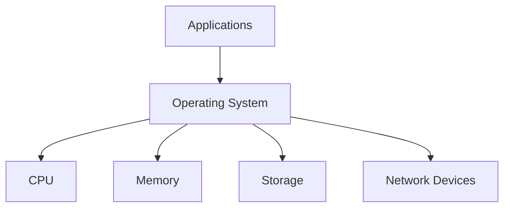

Examples include Linux, Windows, macOS, Android, and iOS.

---

# 2. Core Responsibilities of an OS

The OS manages:

- Processes
- Threads
- CPU scheduling
- Memory
- Files
- Devices
- Security
- Networking
- Resource isolation

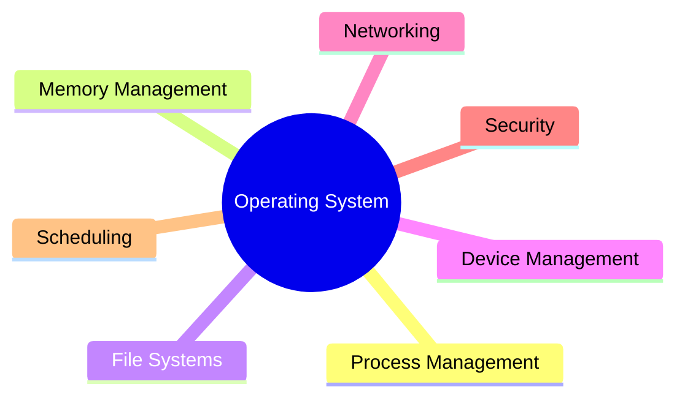

---

# 3. Kernel and User Space

## Kernel space

The kernel has full access to hardware and privileged instructions.

Responsibilities include scheduling, memory management, device drivers, networking, file systems, and interrupt handling.

## User space

Applications run with restricted privileges.

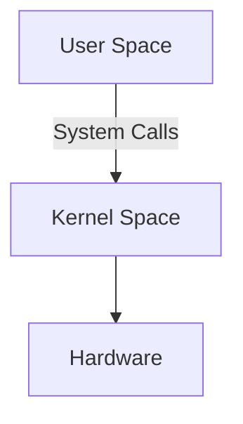

Separating user and kernel space improves security and stability.

---

# 4. System Calls

Applications request OS services through system calls.

Examples:

- `open`
- `read`
- `write`
- `fork`
- `exec`
- `socket`
- `mmap`

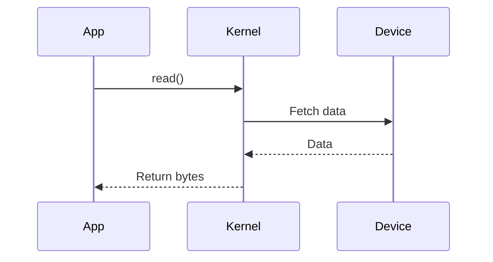

System calls are more expensive than normal function calls because they cross privilege boundaries.

---

# 5. Process

A process is a running instance of a program.

A process has:

- Address space
- Code
- Heap
- Stack
- Open files
- Registers
- Process ID
- Security context

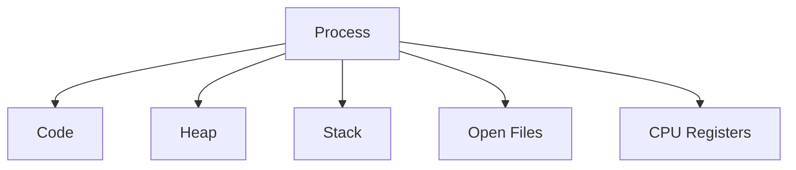

---

# 6. Process Control Block

The OS stores process information in a Process Control Block.

It may include process ID, state, program counter, registers, scheduling information, memory mappings, and open files.

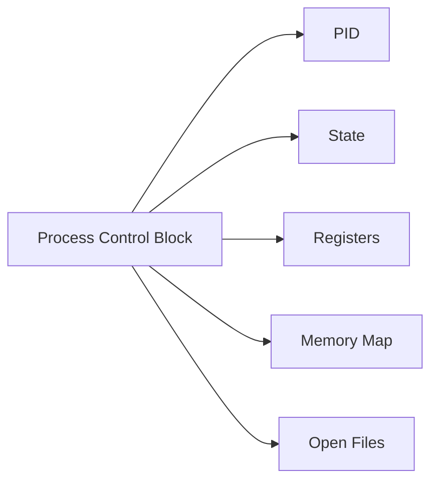

---

# 7. Process States

Common process states:

- New
- Ready
- Running
- Waiting
- Terminated

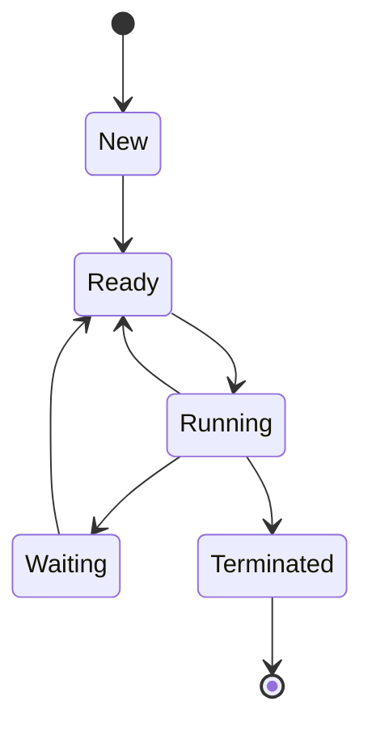

- **Ready:** waiting for CPU.
- **Running:** currently executing.
- **Waiting:** waiting for I/O or another event.

---

# 8. Process Creation

On Unix-like systems:

- `fork()` creates a child process.
- `exec()` replaces the process image with another program.

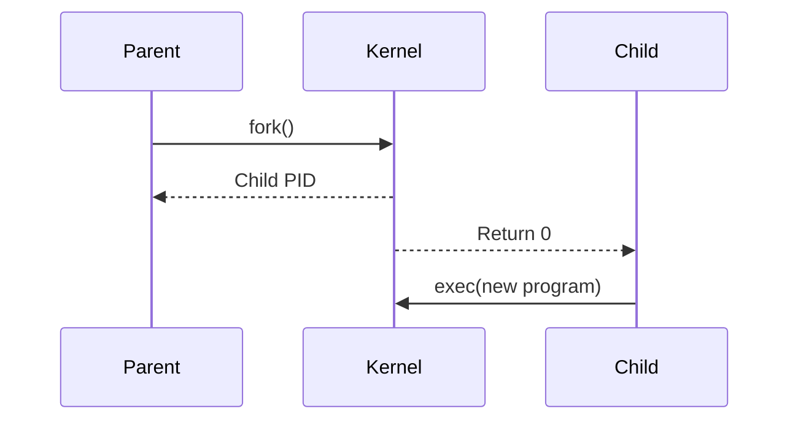

Modern systems use copy-on-write to avoid copying all memory immediately.

---

# 9. Process vs Program

A program is passive code stored on disk.

A process is an active execution instance.

One program can have multiple running process instances.

---

# 10. Threads

A thread is the smallest execution unit inside a process.

Threads share:

- Heap
- Code
- Open files

Each thread has its own:

- Stack
- Registers
- Program counter

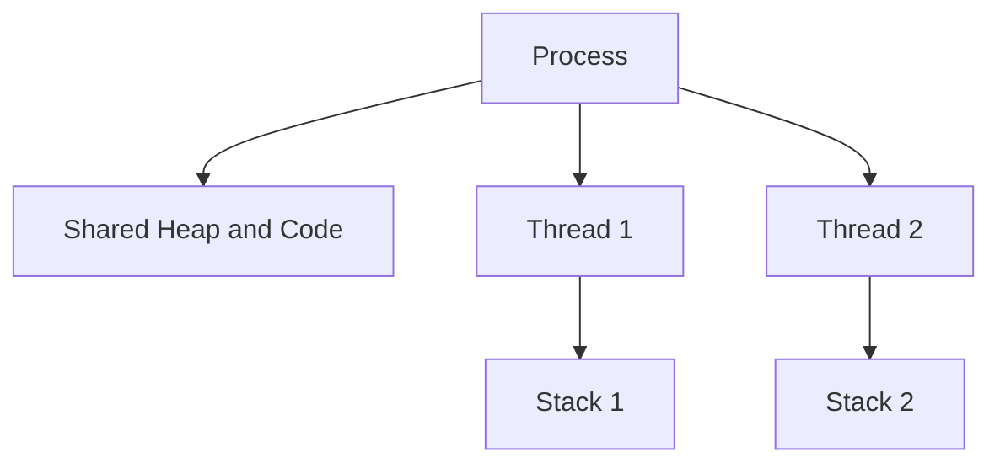

---

# 11. Process vs Thread

| Feature | Process | Thread |
|---|---|---|
| Memory | Separate | Shared within process |
| Creation cost | Higher | Lower |
| Communication | IPC | Shared memory |
| Failure isolation | Stronger | Weaker |
| Context switch | More expensive | Usually cheaper |

---

# 12. User Threads vs Kernel Threads

## User-level threads

Managed by a runtime or library.

Advantages:

- Fast creation
- Fast switching

Disadvantages:

- Kernel may not see individual threads
- Blocking behavior depends on thread-mapping model

## Kernel threads

Managed directly by the OS.

Advantages:

- True parallel scheduling
- One blocked thread does not block all others

---

# 13. Context Switching

A context switch occurs when the CPU switches from one task to another.

The OS saves registers, program counter, stack pointer, and scheduling state.


Context switching adds overhead. Too many threads can reduce performance.

---

# 14. CPU Scheduling

CPU scheduling decides which ready process or thread runs next.

Goals include:

- High CPU utilization
- Low response time
- High throughput
- Fairness
- Low waiting time

---

# 15. Scheduling Algorithms

## First-Come, First-Served

Runs in arrival order. Simple, but it can suffer from convoy effect.

## Shortest Job First

Runs the shortest job first. It minimizes average waiting time but requires burst prediction.

## Round Robin

Each task receives a time quantum. It is useful for interactive systems.

## Priority Scheduling

Higher-priority tasks run first. It can cause starvation.

## Multilevel Feedback Queue

Tasks move between queues based on behavior. This is common in general-purpose systems.

---

# 16. Preemptive vs Non-Preemptive Scheduling

## Preemptive

The OS can interrupt a running task.

Benefits:

- Better responsiveness
- Improved fairness

## Non-preemptive

A task keeps the CPU until completion or blocking.

Benefits:

- Simpler scheduling
- Fewer context switches

---

# 17. Concurrency and Parallelism

Concurrency means tasks overlap in progress.

Parallelism means tasks run at the same time on multiple cores.

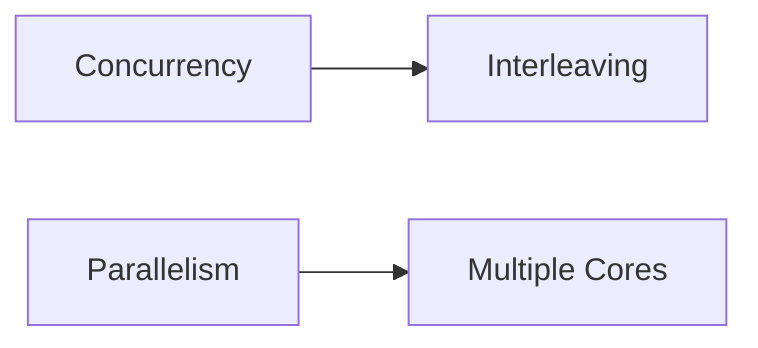

---

# 18. Race Conditions

A race condition occurs when a result depends on the timing of concurrent operations.

The expression `count++` is not atomic.

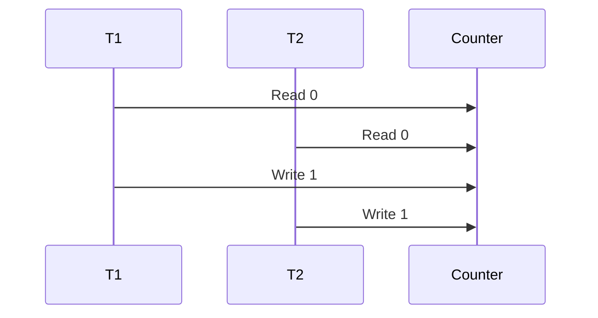

Expected result: `2`

Actual result may be: `1`

---

# 19. Critical Section

A critical section accesses shared mutable state.

Requirements for a correct critical-section solution:

- Mutual exclusion
- Progress
- Bounded waiting

---

# 20. Mutex

A mutex allows one thread or process to enter a critical section.

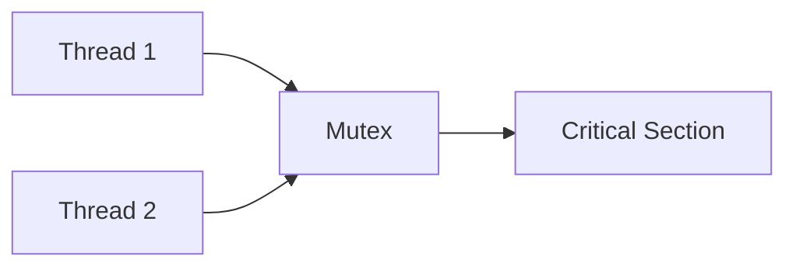

The owner usually must release the mutex.

---

# 21. Semaphore

A semaphore maintains a permit count.

## Binary semaphore

Similar to a mutex.

## Counting semaphore

Allows a limited number of concurrent users.

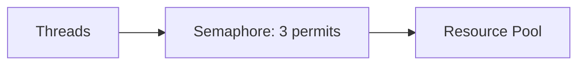

---

# 22. Spinlock

A spinlock repeatedly checks until a lock becomes available.

```text
while lock is busy:
    keep checking
```

It can be useful when the expected wait is extremely short.

It wastes CPU when the wait is long.

---

# 23. Monitor

A monitor combines:

- Mutual exclusion
- Shared state
- Condition variables

Java's `synchronized`, `wait`, and `notify` provide monitor-style coordination.

---

# 24. Deadlock

Deadlock occurs when tasks wait forever for resources held by one another.

The four required Coffman conditions are:

1. Mutual exclusion
2. Hold and wait
3. No preemption
4. Circular wait

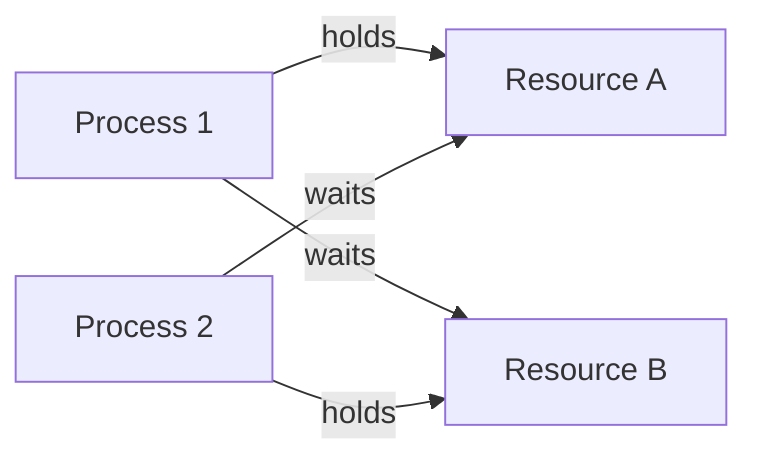

---

# 25. Deadlock Prevention and Avoidance

## Prevention

Break one Coffman condition.

Examples:

- Use consistent lock ordering
- Request resources together
- Allow preemption
- Avoid hold-and-wait

## Detection

Build a wait-for graph and detect cycles.

## Recovery

- Abort a process
- Roll back work
- Preempt resources

---

# 26. Banker's Algorithm

Banker's algorithm avoids unsafe resource allocation.

It checks whether granting a request leaves the system in a safe state.

Key concepts:

- Available resources
- Maximum demand
- Allocated resources
- Remaining need

It is mainly important academically and in interviews.

---

# 27. Livelock and Starvation

## Livelock

Tasks keep reacting to each other but make no progress.

## Starvation

A task repeatedly fails to receive CPU time or required resources.

Mitigation:

- Fair scheduling
- Aging
- Bounded waiting
- Fair locks

---

# 28. Inter-Process Communication

IPC mechanisms include:

- Shared memory
- Pipes
- Message queues
- Sockets
- Signals
- Memory-mapped files

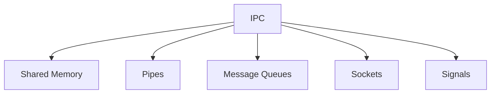

---

# 29. Shared Memory

Processes map the same memory region.

Advantages:

- Very fast
- Minimal copying

Disadvantages:

- Explicit synchronization required
- Harder correctness

---

# 30. Pipes and Message Queues

## Pipe

A byte stream between processes.

## Named pipe

A pipe represented in the file-system namespace.

## Message queue

Transfers structured messages and provides better decoupling.

---

# 31. Sockets

Sockets provide communication endpoints.

Types:

- TCP sockets
- UDP sockets
- Unix domain sockets

Unix domain sockets are efficient for same-machine communication.

---

# 32. Memory Management

The OS manages:

- Allocation
- Deallocation
- Protection
- Address translation
- Swapping
- Virtual memory

Each process sees its own virtual address space.

---

# 33. Address Spaces

A process address space commonly includes:

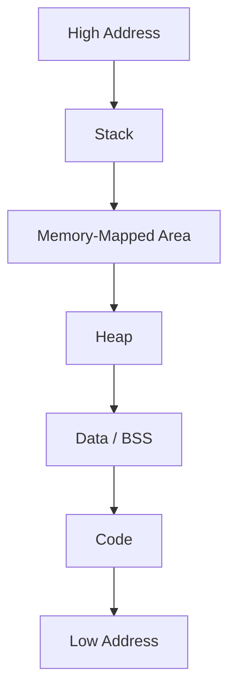

Exact layout varies by OS and architecture.

---

# 34. Paging

Paging divides virtual memory into pages and physical memory into frames.

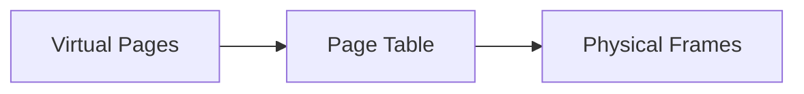

Pages and frames have equal size.

---

# 35. Page Tables

A page table maps virtual pages to physical frames.

A page-table entry may store:

- Frame number
- Present bit
- Read/write permission
- Dirty bit
- Accessed bit

Large address spaces commonly use multi-level page tables.

---

# 36. Translation Lookaside Buffer

The TLB caches recent virtual-to-physical address translations.

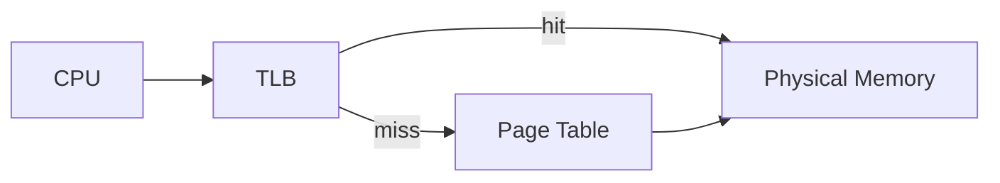

A TLB miss is more expensive than a hit.

---

# 37. Virtual Memory

Virtual memory gives each process a large private address space.

Benefits:

- Isolation
- Protection
- Larger apparent memory
- Simpler programming model
- Shared libraries
- Memory-mapped files

---

# 38. Demand Paging

Pages are loaded only when accessed.

This reduces startup time and physical-memory use.

If a page is absent, a page fault occurs.

---

# 39. Page Faults

A page fault occurs when a referenced page is not currently mapped in physical memory.

Steps:

1. CPU traps to the kernel
2. OS validates access
3. Page is loaded from storage if needed
4. Page table is updated
5. Instruction is restarted


Page faults involving disk are expensive.

---

# 40. Page Replacement Algorithms

When memory is full, the OS chooses a page to evict.

Algorithms include:

- FIFO
- Optimal
- LRU
- Clock
- Second Chance

Exact LRU is expensive, so operating systems often approximate it.

---

# 41. Thrashing

Thrashing occurs when a system spends most of its time swapping pages instead of performing useful work.

Symptoms:

- High disk activity
- Low useful CPU utilization
- Poor response time

Causes:

- Too many active processes
- Insufficient memory
- Large working sets

---

# 42. Segmentation

Segmentation divides memory into logical variable-size regions, such as code, data, and stack.

Paging uses fixed-size units.

Modern systems rely primarily on paging, often with limited segmentation support.

---

# 43. Heap and Stack

## Stack

Stores:

- Function calls
- Local variables
- Return addresses

Characteristics:

- Fast
- Per-thread
- Limited size

## Heap

Stores dynamically allocated objects.

Characteristics:

- Shared within a process
- Larger
- Flexible
- Requires an allocator or garbage collector

---

# 44. Memory Fragmentation

## Internal fragmentation

An allocated block is larger than the requested memory.

## External fragmentation

Free memory exists but is split into small non-contiguous pieces.

Paging largely avoids external fragmentation in physical memory.

---

# 45. File Systems

A file system organizes data on storage.

Responsibilities:

- Naming
- Metadata
- Permissions
- Allocation
- Directories
- Recovery
- Caching

Examples:

- ext4
- XFS
- NTFS
- APFS

---

# 46. Inodes

Unix-like file systems use inodes to store metadata.

An inode stores:

- File type
- Permissions
- Owner
- Size
- Timestamps
- Data-block pointers

The filename is stored in the directory entry, not in the inode.

```mermaid
flowchart LR
    Dir["Directory Entry"]
    Name["File Name"]
    Inode["Inode"]
    Data["Data Blocks"]

    Dir --> Name
    Dir --> Inode
    Inode --> Data
```

---

# 47. Directories and File Descriptors

A directory maps names to inode references.

A file descriptor is a small integer representing an open file or socket.

Standard descriptors:

```text
0 -> standard input
1 -> standard output
2 -> standard error
```

Each process has a file-descriptor table.

---

# 48. Journaling

A journaling file system records intended changes before applying them fully.

Benefits:

- Faster crash recovery
- Reduced corruption risk

The concept is similar to write-ahead logging in databases.

---

# 49. Disk Scheduling

Disk scheduling orders I/O requests.

Algorithms include:

- FCFS
- SSTF
- SCAN
- C-SCAN

For SSDs, seek time is less important, but queue depth and parallelism still matter.

---

# 50. I/O Management

The OS manages:

- Device drivers
- Buffers
- Queues
- Interrupts
- DMA
- Scheduling
- Caching

Applications use abstractions such as files and sockets rather than device-specific commands.

---

# 51. Interrupts

An interrupt signals the CPU that an event occurred.

Examples:

- Network packet arrived
- Disk operation completed
- Timer fired
- Keyboard input

The CPU pauses normal execution and runs an interrupt handler.

---

# 52. DMA

Direct Memory Access allows devices to transfer data to memory without the CPU copying every byte.

```mermaid
flowchart LR
    Device["Device"]
    DMA["DMA Controller"]
    Memory["Main Memory"]
    CPU["CPU"]

    Device --> DMA
    DMA --> Memory
    DMA --> CPU
```

The CPU is notified when the transfer completes.

---

# 53. Blocking vs Non-Blocking I/O

## Blocking I/O

The thread waits until the operation completes.

## Non-blocking I/O

The call returns quickly when data is unavailable.

```mermaid
flowchart LR
    Blocking["Blocking Read"]
    Wait["Thread Waits"]
    Data["Data Arrives"]

    NonBlocking["Non-Blocking Read"]
    Return["Returns Immediately"]

    Blocking --> Wait
    Wait --> Data
    NonBlocking --> Return
```

---

# 54. Synchronous vs Asynchronous I/O

## Synchronous I/O

The application waits for operation completion, either directly or through readiness polling.

## Asynchronous I/O

The application submits an operation and receives a completion notification later.

Blocking/non-blocking and synchronous/asynchronous are related but not identical.

---

# 55. Polling, Select, and Epoll

## select

Monitors many file descriptors but repeatedly scans descriptor sets.

## poll

Similar to `select` with a different API and limits.

## epoll

A Linux event-notification mechanism designed for large numbers of file descriptors.

```mermaid
flowchart LR
    Sockets["Many Sockets"]
    Epoll["epoll"]
    Ready["Ready Events"]
    App["Application"]

    Sockets --> Epoll
    Epoll --> Ready
    Ready --> App
```

This is important for high-concurrency servers.

---

# 56. Networking in the OS

The OS networking stack handles:

- Sockets
- TCP
- UDP
- Routing
- Buffers
- Packet processing
- Connection state

```mermaid
flowchart TB
    App["Application"]
    Socket["Socket API"]
    TCP["TCP / UDP"]
    IP["IP Layer"]
    NIC["Network Interface"]

    App --> Socket
    Socket --> TCP
    TCP --> IP
    IP --> NIC
```

---

# 57. Containers and Namespaces

Containers use OS isolation rather than full hardware virtualization.

Linux namespaces isolate:

- Processes
- Networking
- Mounts
- Hostname
- Users
- IPC

```mermaid
flowchart TB
    Host["Linux Host"]
    C1["Container 1 Namespace"]
    C2["Container 2 Namespace"]
    Kernel["Shared Kernel"]

    Host --> C1
    Host --> C2
    C1 --> Kernel
    C2 --> Kernel
```

Containers share the host kernel.

---

# 58. cgroups

Control groups limit and account for resources.

They manage:

- CPU
- Memory
- I/O
- Process count

Containers use namespaces for isolation and cgroups for resource control.

---

# 59. Linux Process and Memory Tools

Useful commands:

```text
ps
top
htop
vmstat
iostat
free
pidstat
strace
lsof
ss
netstat
dmesg
```

## ps

Shows processes.

## top or htop

Shows CPU and memory usage.

## vmstat

Shows CPU, memory, process, and I/O statistics.

## iostat

Shows disk activity.

## strace

Traces system calls.

## lsof

Lists open files and sockets.

## ss

Shows network sockets.

---

# 60. Practical Backend Relevance

Operating-system knowledge helps with:

- Thread-pool sizing
- Context-switch overhead
- Memory limits
- Container OOM
- File-descriptor exhaustion
- Network latency
- Blocking I/O
- CPU saturation
- Disk bottlenecks
- JVM tuning

## Too many threads

More threads can cause:

- More stack memory
- More context switching
- Scheduler overhead
- Cache misses

## File descriptor leak

Symptoms:

```text
Too many open files
```

Causes include unclosed sockets, files, and connections.

---

# 61. Common Production Problems

## High CPU

Possible causes:

- Busy loop
- Excessive context switching
- Lock contention
- Garbage collection
- Compression
- Serialization

## High memory

Possible causes:

- Memory leak
- Cache growth
- Too many threads
- Large buffers
- Page cache

## High I/O wait

Possible causes:

- Slow disk
- Large scans
- Excessive logging
- Swapping

## OOM-killed container

Possible causes:

- Memory limit exceeded
- Native memory growth
- Oversized heap
- Too many threads

## File-descriptor exhaustion

Possible causes:

- Socket leak
- File leak
- Connection leak

---

# 62. Best Practices

1. Use bounded thread pools.
2. Close files and sockets.
3. Set sensible process limits.
4. Monitor context switches.
5. Avoid unnecessary blocking.
6. Understand container memory limits.
7. Use timeouts on I/O.
8. Monitor file-descriptor usage.
9. Use asynchronous I/O where scale requires it.
10. Avoid oversubscribing CPU.
11. Size thread stacks carefully.
12. Measure disk latency and IOPS.
13. Profile before optimizing.
14. Separate CPU-bound and I/O-bound workloads.
15. Understand kernel-level limits.

---

# 63. Interview Questions and Answers

## 1. What is an operating system?

Software that manages hardware and provides services to applications.

## 2. What is a kernel?

The privileged core of the OS.

## 3. User mode vs kernel mode?

User mode is restricted; kernel mode has full privileges.

## 4. What is a system call?

A controlled request from user space to the kernel.

## 5. What is a process?

A running program with its own address space and resources.

## 6. What is a PCB?

A kernel structure storing process state.

## 7. What are common process states?

New, ready, running, waiting, and terminated.

## 8. What is a thread?

The smallest schedulable execution unit inside a process.

## 9. Process vs thread?

Processes have separate memory; threads share process memory.

## 10. What is context switching?

Saving one task's state and loading another task's state.

## 11. Why is context switching expensive?

It requires register saving, scheduler work, and can disrupt caches and the TLB.

## 12. What is CPU scheduling?

Selecting the next ready task to run.

## 13. What is round robin?

A time-sliced scheduling algorithm.

## 14. What is preemption?

Interrupting a running task to schedule another.

## 15. What is a race condition?

A result depends on the timing of concurrent operations.

## 16. What is a critical section?

Code accessing shared mutable state.

## 17. What is a mutex?

A mutual-exclusion lock.

## 18. What is a semaphore?

A synchronization primitive with a permit count.

## 19. Mutex vs semaphore?

A mutex usually has ownership and one permit; a semaphore may have multiple permits.

## 20. What is a spinlock?

A lock that busy-waits.

## 21. What is deadlock?

Circular waiting for resources.

## 22. What are the four deadlock conditions?

Mutual exclusion, hold and wait, no preemption, and circular wait.

## 23. How do you prevent deadlock?

Break one condition, use lock ordering, avoid nested locks, or use timeouts.

## 24. What is starvation?

A task never receives the resources it needs.

## 25. What is livelock?

Tasks remain active but make no progress.

## 26. What is IPC?

Communication between processes.

## 27. What is shared memory?

Multiple processes mapping the same memory region.

## 28. What is a pipe?

A byte-stream IPC mechanism.

## 29. What is a socket?

A communication endpoint.

## 30. What is virtual memory?

An abstraction providing each process with a private address space.

## 31. What is paging?

Mapping virtual pages to physical frames.

## 32. What is a page table?

A structure mapping virtual addresses to physical memory.

## 33. What is a TLB?

A cache of recent address translations.

## 34. What is a page fault?

Access to a page not currently mapped in physical memory.

## 35. What is demand paging?

Loading pages only when they are first accessed.

## 36. What is thrashing?

Excessive paging that prevents useful work.

## 37. What is internal fragmentation?

Unused space inside allocated blocks.

## 38. What is external fragmentation?

Free memory split into small, unusable pieces.

## 39. What is an inode?

A Unix file metadata structure.

## 40. What is a file descriptor?

An integer handle representing an open file or socket.

## 41. What is journaling?

Recording file-system changes for crash recovery.

## 42. What is an interrupt?

A hardware or software signal requiring CPU attention.

## 43. What is DMA?

Direct transfer between a device and memory with minimal CPU involvement.

## 44. Blocking vs non-blocking I/O?

Blocking waits; non-blocking returns when data is unavailable.

## 45. Synchronous vs asynchronous I/O?

Synchronous I/O waits for completion; asynchronous I/O reports completion later.

## 46. What is epoll?

A Linux event mechanism for efficiently monitoring many file descriptors.

## 47. What are namespaces?

Linux isolation mechanisms for process, network, mount, and other resources.

## 48. What are cgroups?

Linux mechanisms for resource limits and accounting.

## 49. Why can too many threads hurt performance?

They increase context switching, stack memory, cache misses, and scheduler overhead.

## 50. Why is OS knowledge important for backend engineers?

Application performance depends on threads, memory, I/O, networking, and resource limits managed by the OS.

---

# 64. Summary

Operating systems manage processes, memory, storage, networking, and hardware access.

## Core concepts

| Topic | Key Idea |
|---|---|
| Process | Running program |
| Thread | Execution unit |
| Scheduler | Chooses CPU work |
| Context switch | Switches task state |
| Mutex | Mutual exclusion |
| Semaphore | Permit-based synchronization |
| Virtual memory | Private address space |
| Paging | Virtual-to-physical mapping |
| TLB | Translation cache |
| File descriptor | Open resource handle |
| Interrupt | Event signal |
| epoll | Scalable event notification |
| Namespace | Resource isolation |
| cgroup | Resource control |

## Final mindset

- Threads are not free.
- Every system call has a cost.
- Memory pressure affects performance.
- Blocking I/O consumes execution capacity.
- File descriptors are limited.
- Virtual memory hides physical complexity.
- Kernel scheduling affects application latency.
- Containers share the host kernel.
- Measure CPU, memory, I/O, and networking together.
- Understand OS behavior when debugging production systems.

---

## Recommended Practice Tasks

1. Compare processes and threads.
2. Trace a Java process using `strace`.
3. Inspect file descriptors using `lsof`.
4. Analyze CPU and memory using `top` and `vmstat`.
5. Reproduce a deadlock.
6. Simulate page-replacement algorithms.
7. Build IPC examples using pipes and sockets.
8. Compare blocking and non-blocking servers.
9. Inspect container cgroup limits.
10. Analyze context-switch overhead with different thread counts.
