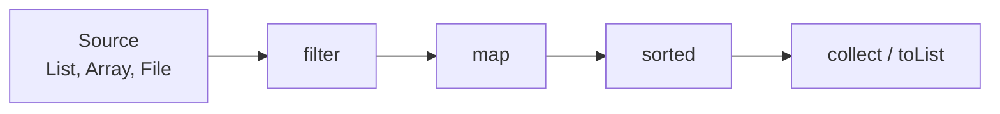
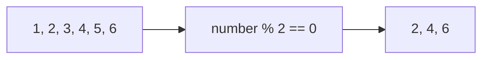
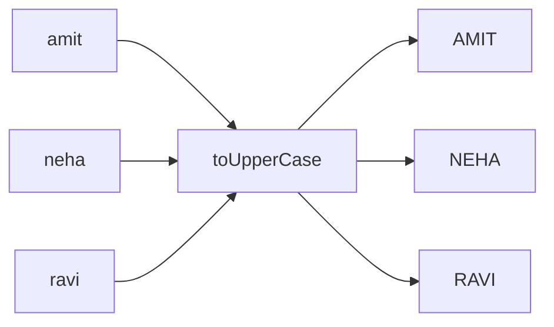
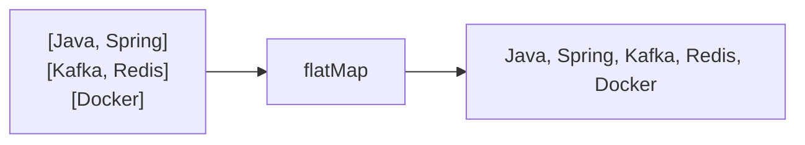
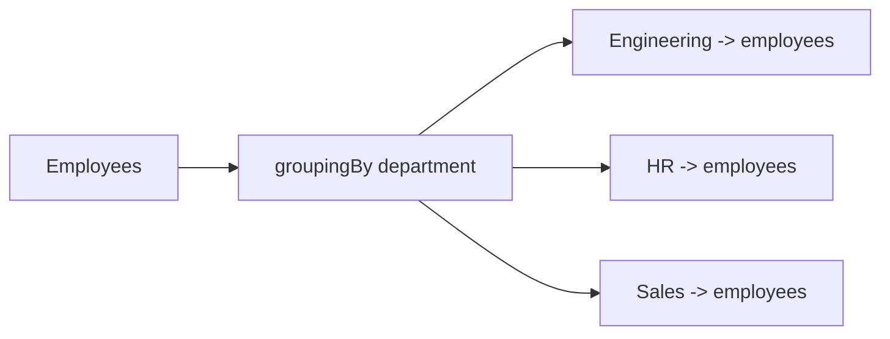
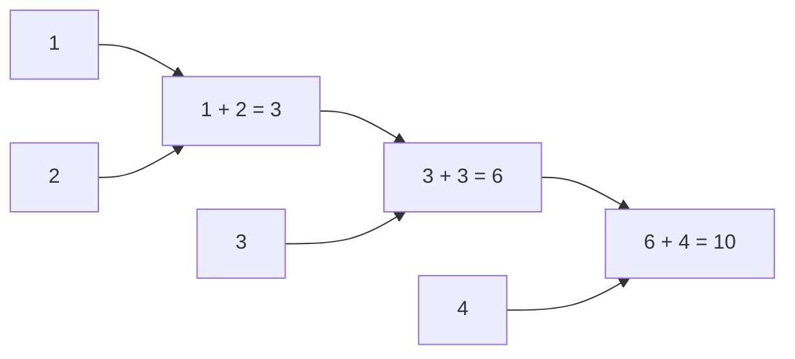
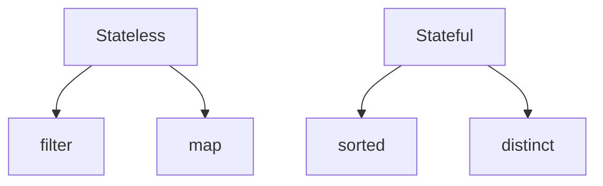
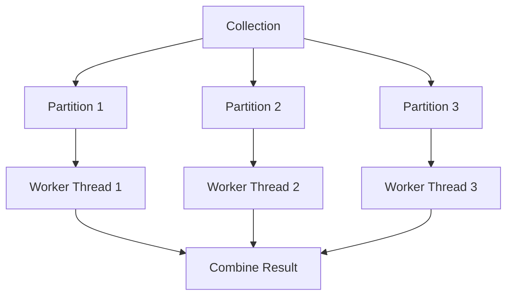

# Java 8 Stream API — In-Depth Guide

A complete guide to the Java 8 Stream API with pipeline diagrams, intermediate and terminal operations, collectors, grouping, sorting, reduction, parallel streams, practical coding examples, best practices, and interview questions.

---

## Table of Contents

1. [What is Stream API?](#1-what-is-stream-api)
2. [Why Stream API Was Introduced](#2-why-stream-api-was-introduced)
3. [Collections vs Streams](#3-collections-vs-streams)
4. [Stream Pipeline](#4-stream-pipeline)
5. [Creating Streams](#5-creating-streams)
6. [Intermediate Operations](#6-intermediate-operations)
7. [Terminal Operations](#7-terminal-operations)
8. [filter](#8-filter)
9. [map](#9-map)
10. [flatMap](#10-flatmap)
11. [distinct](#11-distinct)
12. [sorted](#12-sorted)
13. [limit and skip](#13-limit-and-skip)
14. [peek](#14-peek)
15. [forEach and forEachOrdered](#15-foreach-and-foreachordered)
16. [collect](#16-collect)
17. [Collectors](#17-collectors)
18. [groupingBy](#18-groupingby)
19. [partitioningBy](#19-partitioningby)
20. [mapping and collectingAndThen](#20-mapping-and-collectingandthen)
21. [reduce](#21-reduce)
22. [min, max, count](#22-min-max-count)
23. [findFirst and findAny](#23-findfirst-and-findany)
24. [match Operations](#24-match-operations)
25. [Primitive Streams](#25-primitive-streams)
26. [Optional with Streams](#26-optional-with-streams)
27. [Lazy Evaluation](#27-lazy-evaluation)
28. [Short-Circuit Operations](#28-short-circuit-operations)
29. [Stateless vs Stateful Operations](#29-stateless-vs-stateful-operations)
30. [Parallel Streams](#30-parallel-streams)
31. [Common Coding Problems](#31-common-coding-problems)
32. [Best Practices](#32-best-practices)
33. [Anti-Patterns](#33-anti-patterns)
34. [Interview Questions and Answers](#34-interview-questions-and-answers)
35. [Summary](#35-summary)

---

# 1. What is Stream API?

The Stream API was introduced in Java 8 to process collections of data in a declarative and functional style.

A stream is not a data structure.

It is a sequence of elements supporting operations such as:

- Filtering
- Mapping
- Sorting
- Grouping
- Reducing
- Collecting

```java
List<String> names =
        List.of(
                "Amit",
                "Neha",
                "Ravi",
                "Ankit"
        );

List<String> result =
        names.stream()
                .filter(name ->
                        name.startsWith("A")
                )
                .map(String::toUpperCase)
                .sorted()
                .toList();

System.out.println(result);
```

Output:

```text
[AMIT, ANKIT]
```

---

# 2. Why Stream API Was Introduced

Before Java 8, collection processing required explicit loops.

## Traditional approach

```java
List<String> result =
        new ArrayList<>();

for (String name : names) {
    if (name.startsWith("A")) {
        result.add(
                name.toUpperCase()
        );
    }
}

Collections.sort(result);
```

## Stream approach

```java
List<String> result =
        names.stream()
                .filter(name ->
                        name.startsWith("A")
                )
                .map(String::toUpperCase)
                .sorted()
                .toList();
```

Benefits:

- More readable
- More declarative
- Less boilerplate
- Easy composition
- Supports parallel execution
- Encourages immutability
- Easier aggregation

---

# 3. Collections vs Streams

| Feature | Collection | Stream |
|---|---|---|
| Purpose | Store data | Process data |
| Reusable | Yes | No |
| Eager | Usually | Lazy |
| External iteration | Common | Internal iteration |
| Modification | Supports | Does not modify source directly |
| Parallel support | Manual | Built-in |
| Data ownership | Owns elements | Views elements from source |

Important:

```java
Stream<String> stream = names.stream();

stream.forEach(System.out::println);

// Invalid: stream already consumed
stream.forEach(System.out::println);
```

A stream can be consumed only once.

---

# 4. Stream Pipeline

A stream pipeline contains:

1. Source
2. Intermediate operations
3. Terminal operation



Example:

```java
List<Integer> result =
        numbers.stream()
                .filter(number ->
                        number % 2 == 0
                )
                .map(number ->
                        number * number
                )
                .sorted()
                .toList();
```

- Source: `numbers`
- Intermediate: `filter`, `map`, `sorted`
- Terminal: `toList`

---

# 5. Creating Streams

## From collection

```java
Stream<String> stream =
        names.stream();
```

## Parallel stream

```java
Stream<String> stream =
        names.parallelStream();
```

## From array

```java
String[] values = {
        "Java",
        "Spring",
        "Kafka"
};

Stream<String> stream =
        Arrays.stream(values);
```

## Using Stream.of

```java
Stream<Integer> stream =
        Stream.of(1, 2, 3, 4);
```

## Empty stream

```java
Stream<String> stream =
        Stream.empty();
```

## Infinite stream using generate

```java
Stream<Double> randomNumbers =
        Stream.generate(Math::random);
```

Use with limit:

```java
randomNumbers
        .limit(5)
        .forEach(System.out::println);
```

## Infinite stream using iterate

```java
Stream<Integer> numbers =
        Stream.iterate(
                1,
                number -> number + 1
        );
```

```java
numbers.limit(10)
        .forEach(System.out::println);
```

---

# 6. Intermediate Operations

Intermediate operations return another stream.

Examples:

- `filter`
- `map`
- `flatMap`
- `distinct`
- `sorted`
- `limit`
- `skip`
- `peek`

They are lazy.

```java
Stream<String> pipeline =
        names.stream()
                .filter(name ->
                        name.length() > 4
                )
                .map(String::toUpperCase);
```

Nothing executes until a terminal operation is called.

---

# 7. Terminal Operations

Terminal operations trigger stream execution.

Examples:

- `forEach`
- `collect`
- `reduce`
- `count`
- `min`
- `max`
- `findFirst`
- `findAny`
- `anyMatch`
- `allMatch`
- `noneMatch`

```java
long count =
        names.stream()
                .filter(name ->
                        name.length() > 4
                )
                .count();
```

---

# 8. filter

`filter` selects elements matching a predicate.

```java
List<Integer> evenNumbers =
        numbers.stream()
                .filter(number ->
                        number % 2 == 0
                )
                .toList();
```

## Diagram



## Employee example

```java
record Employee(
        int id,
        String name,
        String department,
        double salary
) {
}
```

```java
List<Employee> highPaidEmployees =
        employees.stream()
                .filter(employee ->
                        employee.salary() > 100000
                )
                .toList();
```

---

# 9. map

`map` transforms each element into another value.

```java
List<String> upperCaseNames =
        names.stream()
                .map(String::toUpperCase)
                .toList();
```

## Diagram



## Extract employee names

```java
List<String> employeeNames =
        employees.stream()
                .map(Employee::name)
                .toList();
```

---

# 10. flatMap

`flatMap` converts nested structures into a single flattened stream.

## Example

```java
List<List<String>> nested =
        List.of(
                List.of("Java", "Spring"),
                List.of("Kafka", "Redis"),
                List.of("Docker")
        );

List<String> flattened =
        nested.stream()
                .flatMap(List::stream)
                .toList();
```

Output:

```text
[Java, Spring, Kafka, Redis, Docker]
```

## Diagram



## Words from sentences

```java
List<String> sentences =
        List.of(
                "Java Stream API",
                "Spring Boot Kafka"
        );

List<String> words =
        sentences.stream()
                .flatMap(sentence ->
                        Arrays.stream(
                                sentence.split("\\s+")
                        )
                )
                .toList();
```

---

# 11. distinct

`distinct` removes duplicate elements using `equals()` and `hashCode()`.

```java
List<Integer> unique =
        List.of(1, 2, 2, 3, 1, 4)
                .stream()
                .distinct()
                .toList();
```

Output:

```text
[1, 2, 3, 4]
```

For custom objects, implement `equals()` and `hashCode()` correctly.

---

# 12. sorted

## Natural ordering

```java
List<Integer> sorted =
        numbers.stream()
                .sorted()
                .toList();
```

## Reverse order

```java
List<Integer> descending =
        numbers.stream()
                .sorted(
                        Comparator.reverseOrder()
                )
                .toList();
```

## Sort employees by salary

```java
List<Employee> sortedEmployees =
        employees.stream()
                .sorted(
                        Comparator.comparingDouble(
                                Employee::salary
                        )
                )
                .toList();
```

## Multiple-field sorting

```java
List<Employee> sortedEmployees =
        employees.stream()
                .sorted(
                        Comparator
                                .comparing(
                                        Employee::department
                                )
                                .thenComparing(
                                        Employee::name
                                )
                )
                .toList();
```

## Descending salary

```java
List<Employee> result =
        employees.stream()
                .sorted(
                        Comparator
                                .comparingDouble(
                                        Employee::salary
                                )
                                .reversed()
                )
                .toList();
```

---

# 13. limit and skip

## limit

Returns first `n` elements.

```java
List<Integer> firstThree =
        numbers.stream()
                .limit(3)
                .toList();
```

## skip

Skips first `n` elements.

```java
List<Integer> remaining =
        numbers.stream()
                .skip(3)
                .toList();
```

## Pagination example

```java
int pageNumber = 2;
int pageSize = 5;

List<Employee> page =
        employees.stream()
                .skip(
                        (long) (pageNumber - 1)
                                * pageSize
                )
                .limit(pageSize)
                .toList();
```

---

# 14. peek

`peek` is mainly for debugging.

```java
List<String> result =
        names.stream()
                .peek(name ->
                        System.out.println(
                                "Before filter: " + name
                        )
                )
                .filter(name ->
                        name.startsWith("A")
                )
                .peek(name ->
                        System.out.println(
                                "After filter: " + name
                        )
                )
                .toList();
```

Do not use `peek` for essential business side effects.

---

# 15. forEach and forEachOrdered

## forEach

```java
names.stream()
        .forEach(System.out::println);
```

In parallel streams, order is not guaranteed.

## forEachOrdered

```java
names.parallelStream()
        .forEachOrdered(System.out::println);
```

Preserves encounter order.

---

# 16. collect

`collect` converts stream output into a container or result.

```java
List<String> result =
        names.stream()
                .filter(name ->
                        name.length() > 4
                )
                .collect(
                        Collectors.toList()
                );
```

Modern Java also supports:

```java
List<String> result =
        names.stream()
                .filter(name ->
                        name.length() > 4
                )
                .toList();
```

`Stream.toList()` returns an unmodifiable list.

---

# 17. Collectors

Common collectors:

- `toList`
- `toSet`
- `toMap`
- `joining`
- `counting`
- `summingInt`
- `averagingDouble`
- `summarizingDouble`
- `groupingBy`
- `partitioningBy`

## toSet

```java
Set<String> departments =
        employees.stream()
                .map(Employee::department)
                .collect(
                        Collectors.toSet()
                );
```

## toMap

```java
Map<Integer, String> employeeMap =
        employees.stream()
                .collect(
                        Collectors.toMap(
                                Employee::id,
                                Employee::name
                        )
                );
```

## Duplicate key handling

```java
Map<String, Employee> byDepartment =
        employees.stream()
                .collect(
                        Collectors.toMap(
                                Employee::department,
                                employee -> employee,
                                (first, second) -> first
                        )
                );
```

## joining

```java
String namesText =
        employees.stream()
                .map(Employee::name)
                .collect(
                        Collectors.joining(
                                ", ",
                                "[",
                                "]"
                        )
                );
```

---

# 18. groupingBy

`groupingBy` groups elements by a classifier.

## Group employees by department

```java
Map<String, List<Employee>> byDepartment =
        employees.stream()
                .collect(
                        Collectors.groupingBy(
                                Employee::department
                        )
                );
```

## Diagram



## Count employees by department

```java
Map<String, Long> countByDepartment =
        employees.stream()
                .collect(
                        Collectors.groupingBy(
                                Employee::department,
                                Collectors.counting()
                        )
                );
```

## Average salary by department

```java
Map<String, Double> averageSalary =
        employees.stream()
                .collect(
                        Collectors.groupingBy(
                                Employee::department,
                                Collectors.averagingDouble(
                                        Employee::salary
                                )
                        )
                );
```

## Highest-paid employee by department

```java
Map<String, Optional<Employee>> highestPaid =
        employees.stream()
                .collect(
                        Collectors.groupingBy(
                                Employee::department,
                                Collectors.maxBy(
                                        Comparator.comparingDouble(
                                                Employee::salary
                                        )
                                )
                        )
                );
```

---

# 19. partitioningBy

`partitioningBy` divides elements into two groups:

- `true`
- `false`

## Example

```java
Map<Boolean, List<Employee>> partitioned =
        employees.stream()
                .collect(
                        Collectors.partitioningBy(
                                employee ->
                                        employee.salary() >= 100000
                        )
                );
```

Result:

```text
true  -> high-paid employees
false -> remaining employees
```

---

# 20. mapping and collectingAndThen

## mapping

Use `mapping` inside another collector.

```java
Map<String, List<String>> namesByDepartment =
        employees.stream()
                .collect(
                        Collectors.groupingBy(
                                Employee::department,
                                Collectors.mapping(
                                        Employee::name,
                                        Collectors.toList()
                                )
                        )
                );
```

## collectingAndThen

Applies a final transformation after collection.

```java
List<String> immutableNames =
        employees.stream()
                .map(Employee::name)
                .collect(
                        Collectors.collectingAndThen(
                                Collectors.toList(),
                                List::copyOf
                        )
                );
```

---

# 21. reduce

`reduce` combines stream elements into one result.

## Sum

```java
int sum =
        numbers.stream()
                .reduce(
                        0,
                        Integer::sum
                );
```

## Product

```java
int product =
        numbers.stream()
                .reduce(
                        1,
                        (first, second) ->
                                first * second
                );
```

## Maximum

```java
Optional<Integer> maximum =
        numbers.stream()
                .reduce(Integer::max);
```

## Diagram



## Three-argument reduce

Useful in parallel streams.

```java
int totalLength =
        names.parallelStream()
                .reduce(
                        0,
                        (length, name) ->
                                length + name.length(),
                        Integer::sum
                );
```

Arguments:

- Identity
- Accumulator
- Combiner

---

# 22. min, max, count

## min

```java
Optional<Employee> lowestPaid =
        employees.stream()
                .min(
                        Comparator.comparingDouble(
                                Employee::salary
                        )
                );
```

## max

```java
Optional<Employee> highestPaid =
        employees.stream()
                .max(
                        Comparator.comparingDouble(
                                Employee::salary
                        )
                );
```

## count

```java
long engineeringCount =
        employees.stream()
                .filter(employee ->
                        "Engineering".equals(
                                employee.department()
                        )
                )
                .count();
```

---

# 23. findFirst and findAny

## findFirst

Returns the first element according to encounter order.

```java
Optional<Employee> first =
        employees.stream()
                .filter(employee ->
                        employee.salary() > 100000
                )
                .findFirst();
```

## findAny

Returns any matching element.

```java
Optional<Employee> any =
        employees.parallelStream()
                .filter(employee ->
                        employee.salary() > 100000
                )
                .findAny();
```

`findAny` may perform better in parallel streams.

---

# 24. match Operations

## anyMatch

```java
boolean anyHighPaid =
        employees.stream()
                .anyMatch(employee ->
                        employee.salary() > 150000
                );
```

## allMatch

```java
boolean allActive =
        users.stream()
                .allMatch(User::active);
```

## noneMatch

```java
boolean noneInvalid =
        values.stream()
                .noneMatch(value ->
                        value < 0
                );
```

These operations short-circuit.

---

# 25. Primitive Streams

Primitive streams avoid boxing overhead.

Types:

- `IntStream`
- `LongStream`
- `DoubleStream`

## IntStream range

```java
IntStream.range(1, 5)
        .forEach(System.out::println);
```

Output:

```text
1
2
3
4
```

## rangeClosed

```java
IntStream.rangeClosed(1, 5)
        .forEach(System.out::println);
```

Output includes 5.

## Sum

```java
int total =
        IntStream.rangeClosed(1, 100)
                .sum();
```

## Average

```java
OptionalDouble average =
        employees.stream()
                .mapToDouble(Employee::salary)
                .average();
```

## Summary statistics

```java
DoubleSummaryStatistics statistics =
        employees.stream()
                .mapToDouble(Employee::salary)
                .summaryStatistics();

System.out.println(statistics.getCount());
System.out.println(statistics.getMin());
System.out.println(statistics.getMax());
System.out.println(statistics.getAverage());
System.out.println(statistics.getSum());
```

---

# 26. Optional with Streams

Many terminal operations return `Optional`.

```java
Optional<Employee> employee =
        employees.stream()
                .filter(value ->
                        value.id() == 101
                )
                .findFirst();
```

## orElse

```java
Employee result =
        employee.orElse(defaultEmployee);
```

## orElseGet

```java
Employee result =
        employee.orElseGet(
                this::createDefaultEmployee
        );
```

## orElseThrow

```java
Employee result =
        employee.orElseThrow(
                () -> new IllegalStateException(
                        "Employee not found"
                )
        );
```

Prefer `orElseGet` when fallback creation is expensive.

---

# 27. Lazy Evaluation

Intermediate operations do not execute immediately.

```java
Stream<String> stream =
        names.stream()
                .filter(name -> {
                    System.out.println(
                            "Filtering: " + name
                    );

                    return name.startsWith("A");
                });
```

No output appears until:

```java
stream.count();
```

## Why lazy?

- Avoid unnecessary work
- Support short-circuiting
- Enable pipeline optimization
- Allow infinite streams

---

# 28. Short-Circuit Operations

Short-circuit operations can stop processing early.

Intermediate:

- `limit`

Terminal:

- `findFirst`
- `findAny`
- `anyMatch`
- `allMatch`
- `noneMatch`

## Example

```java
Optional<Integer> firstEven =
        numbers.stream()
                .filter(number -> {
                    System.out.println(
                            "Checking: " + number
                    );

                    return number % 2 == 0;
                })
                .findFirst();
```

Processing stops after the first match.

---

# 29. Stateless vs Stateful Operations

## Stateless

Each element is processed independently.

Examples:

- `filter`
- `map`
- `flatMap`

## Stateful

Operation may need information about other elements.

Examples:

- `sorted`
- `distinct`
- `limit`
- `skip`

Stateful operations may require buffering.



---

# 30. Parallel Streams

Parallel streams process elements using multiple threads, usually through the common `ForkJoinPool`.

```java
long count =
        employees.parallelStream()
                .filter(employee ->
                        employee.salary() > 100000
                )
                .count();
```

## Diagram



## Good use cases

- Large data sets
- CPU-intensive operations
- Independent elements
- Associative reductions
- Splittable sources such as arrays

## Avoid parallel streams when

- Data set is small
- Work is blocking I/O
- Ordering is strict
- Shared mutable state exists
- Application already uses common pool heavily

## Unsafe example

```java
List<Integer> result =
        new ArrayList<>();

numbers.parallelStream()
        .forEach(result::add);
```

`ArrayList` is not thread-safe.

Correct:

```java
List<Integer> result =
        numbers.parallelStream()
                .map(number ->
                        number * 2
                )
                .toList();
```

---

# 31. Common Coding Problems

## 31.1 Find even numbers

```java
List<Integer> evenNumbers =
        numbers.stream()
                .filter(number ->
                        number % 2 == 0
                )
                .toList();
```

---

## 31.2 Find duplicate elements

```java
Set<Integer> seen =
        new HashSet<>();

Set<Integer> duplicates =
        numbers.stream()
                .filter(number ->
                        !seen.add(number)
                )
                .collect(
                        Collectors.toSet()
                );
```

For parallel streams, avoid this mutable shared-state approach.

---

## 31.3 Find frequency of each element

```java
Map<String, Long> frequency =
        words.stream()
                .collect(
                        Collectors.groupingBy(
                                word -> word,
                                Collectors.counting()
                        )
                );
```

---

## 31.4 Find first non-repeated character

```java
String value = "swiss";

Character result =
        value.chars()
                .mapToObj(character ->
                        (char) character
                )
                .collect(
                        Collectors.groupingBy(
                                character -> character,
                                LinkedHashMap::new,
                                Collectors.counting()
                        )
                )
                .entrySet()
                .stream()
                .filter(entry ->
                        entry.getValue() == 1
                )
                .map(Map.Entry::getKey)
                .findFirst()
                .orElse(null);
```

---

## 31.5 Find second-highest salary

```java
Optional<Double> secondHighest =
        employees.stream()
                .map(Employee::salary)
                .distinct()
                .sorted(
                        Comparator.reverseOrder()
                )
                .skip(1)
                .findFirst();
```

---

## 31.6 Highest-paid employee by department

```java
Map<String, Employee> highestPaid =
        employees.stream()
                .collect(
                        Collectors.groupingBy(
                                Employee::department,
                                Collectors.collectingAndThen(
                                        Collectors.maxBy(
                                                Comparator
                                                        .comparingDouble(
                                                                Employee::salary
                                                        )
                                        ),
                                        Optional::orElseThrow
                                )
                        )
                );
```

---

## 31.7 Count employees by department

```java
Map<String, Long> result =
        employees.stream()
                .collect(
                        Collectors.groupingBy(
                                Employee::department,
                                Collectors.counting()
                        )
                );
```

---

## 31.8 Sort employees by salary descending

```java
List<Employee> result =
        employees.stream()
                .sorted(
                        Comparator
                                .comparingDouble(
                                        Employee::salary
                                )
                                .reversed()
                )
                .toList();
```

---

## 31.9 Join employee names

```java
String result =
        employees.stream()
                .map(Employee::name)
                .collect(
                        Collectors.joining(", ")
                );
```

---

## 31.10 Find top three salaries

```java
List<Double> topThree =
        employees.stream()
                .map(Employee::salary)
                .distinct()
                .sorted(
                        Comparator.reverseOrder()
                )
                .limit(3)
                .toList();
```

---

## 31.11 Group words by length

```java
Map<Integer, List<String>> byLength =
        words.stream()
                .collect(
                        Collectors.groupingBy(
                                String::length
                        )
                );
```

---

## 31.12 Flatten nested lists

```java
List<Integer> flattened =
        nestedLists.stream()
                .flatMap(List::stream)
                .toList();
```

---

## 31.13 Sum employee salaries

```java
double totalSalary =
        employees.stream()
                .mapToDouble(Employee::salary)
                .sum();
```

---

## 31.14 Average salary by department

```java
Map<String, Double> averageSalary =
        employees.stream()
                .collect(
                        Collectors.groupingBy(
                                Employee::department,
                                Collectors.averagingDouble(
                                        Employee::salary
                                )
                        )
                );
```

---

## 31.15 Partition employees by salary

```java
Map<Boolean, List<Employee>> result =
        employees.stream()
                .collect(
                        Collectors.partitioningBy(
                                employee ->
                                        employee.salary() >= 100000
                        )
                );
```

---

# 32. Best Practices

## 1. Keep operations stateless

Avoid shared mutable state.

## 2. Prefer method references when readable

```java
.map(Employee::name)
```

## 3. Use primitive streams for numeric work

```java
.mapToInt(Order::quantity)
```

## 4. Avoid side effects

Bad:

```java
stream.forEach(sharedList::add);
```

Better:

```java
List<T> result =
        stream.toList();
```

## 5. Use clear variable names

Avoid overly compressed pipelines.

## 6. Break complex pipelines into steps

```java
Stream<Employee> engineering =
        employees.stream()
                .filter(employee ->
                        "Engineering".equals(
                                employee.department()
                        )
                );

List<Employee> result =
        engineering
                .sorted(
                        Comparator.comparingDouble(
                                Employee::salary
                        )
                )
                .toList();
```

## 7. Do not reuse consumed streams

Create a new stream from the source.

## 8. Measure before using parallel streams

Parallel execution has overhead.

## 9. Handle duplicate keys in toMap

Always consider merge behavior.

## 10. Prefer Optional over null for search results

---

# 33. Anti-Patterns

## 1. Huge unreadable pipelines

Avoid deeply nested lambdas and dozens of chained operations.

## 2. Using peek for business logic

`peek` is intended mainly for debugging.

## 3. Modifying source inside stream

Bad:

```java
names.stream()
        .forEach(names::remove);
```

## 4. Parallel stream with shared mutable state

Can produce race conditions.

## 5. Using streams for very simple loops

A basic loop may be clearer for indexed mutation.

## 6. Calling get on Optional blindly

Bad:

```java
optional.get();
```

Prefer:

```java
optional.orElseThrow();
```

## 7. Ignoring duplicate keys in toMap

This may throw `IllegalStateException`.

---

# 34. Interview Questions and Answers

## 1. What is Stream API?

Stream API is a Java 8 feature for declarative processing of sequences of data.

---

## 2. Is a stream a data structure?

No. A stream processes data from a source.

---

## 3. Can a stream be reused?

No. A stream can be consumed only once.

---

## 4. What is a stream pipeline?

A pipeline contains a source, intermediate operations, and a terminal operation.

---

## 5. What are intermediate operations?

Operations returning another stream, such as `filter`, `map`, and `sorted`.

---

## 6. What are terminal operations?

Operations that produce a result or side effect, such as `collect`, `count`, and `forEach`.

---

## 7. Are intermediate operations lazy?

Yes.

---

## 8. What is lazy evaluation?

Operations execute only when a terminal operation is invoked.

---

## 9. Difference between map and flatMap?

`map` transforms each element into one result.

`flatMap` transforms and flattens nested streams.

---

## 10. Difference between filter and map?

`filter` removes elements based on a condition.

`map` transforms elements.

---

## 11. How does distinct work?

It uses `equals()` and `hashCode()`.

---

## 12. What is reduce?

`reduce` combines stream elements into one value.

---

## 13. What are identity, accumulator, and combiner?

- Identity: initial value
- Accumulator: combines result with element
- Combiner: combines partial results in parallel

---

## 14. What is collect?

A mutable reduction operation that gathers stream elements into a result container.

---

## 15. Difference between groupingBy and partitioningBy?

`groupingBy` creates multiple groups based on a classifier.

`partitioningBy` creates exactly two boolean groups.

---

## 16. Difference between findFirst and findAny?

`findFirst` respects encounter order.

`findAny` may return any element and can be more efficient in parallel.

---

## 17. What is short-circuiting?

Stopping stream processing before visiting every element.

---

## 18. Name short-circuit operations.

- `limit`
- `findFirst`
- `findAny`
- `anyMatch`
- `allMatch`
- `noneMatch`

---

## 19. What is a primitive stream?

A stream specialized for primitives, such as `IntStream`.

---

## 20. Why use primitive streams?

To avoid boxing and unboxing overhead.

---

## 21. Difference between stream and parallelStream?

`stream()` is sequential.

`parallelStream()` may process elements using multiple threads.

---

## 22. Are parallel streams always faster?

No. They may be slower because of splitting, scheduling, and combining overhead.

---

## 23. Which thread pool does parallel stream use?

Usually the common `ForkJoinPool`.

---

## 24. Is forEach ordered in parallel streams?

No.

Use `forEachOrdered` to preserve encounter order.

---

## 25. What is encounter order?

The order in which elements are presented by the source.

---

## 26. Difference between Stream.toList and Collectors.toList?

`Stream.toList()` returns an unmodifiable list.

`Collectors.toList()` does not guarantee a specific list type or mutability contract.

---

## 27. What happens with duplicate keys in Collectors.toMap?

Without a merge function, `IllegalStateException` is thrown.

---

## 28. What is peek used for?

Mostly debugging and observing pipeline elements.

---

## 29. Why should side effects be avoided?

They reduce predictability and can cause concurrency problems in parallel streams.

---

## 30. What is a stateful operation?

An operation requiring information about other elements, such as `sorted` or `distinct`.

---

## 31. What is a stateless operation?

An operation processing each element independently, such as `map` or `filter`.

---

## 32. Can infinite streams exist?

Yes, using `generate` or `iterate`.

---

## 33. How do you terminate an infinite stream?

Use a short-circuit operation such as `limit`.

---

## 34. How do checked exceptions work in streams?

They usually need wrapping because standard functional interfaces do not declare checked exceptions.

---

## 35. What is Optional's role with streams?

It represents possible absence of results from operations like `findFirst`, `min`, and `max`.

---

## 36. Difference between orElse and orElseGet?

`orElse` evaluates its argument immediately.

`orElseGet` evaluates lazily.

---

## 37. Can streams modify the source collection?

Streams do not modify the source unless operations contain side effects.

---

## 38. What is internal iteration?

The stream library controls iteration rather than the caller writing the loop.

---

## 39. Can sorted work with custom objects?

Yes, using `Comparable` or a `Comparator`.

---

## 40. How do you find second-highest salary?

Map salaries, remove duplicates, sort descending, skip one, and find first.

---

## 41. How do you group employees by department?

Use `Collectors.groupingBy(Employee::department)`.

---

## 42. How do you count frequency of words?

Use `groupingBy` with `counting`.

---

## 43. What is Collectors.mapping?

It transforms grouped values before downstream collection.

---

## 44. What is collectingAndThen?

It applies a final transformation after collection.

---

## 45. Can parallel streams preserve order?

Yes, but preserving order may reduce performance.

---

## 46. Why are associative operations important in parallel reduction?

Partial results may be combined in different groupings. Associativity ensures correctness.

---

## 47. Is subtraction safe for parallel reduce?

Generally no, because subtraction is not associative.

---

## 48. Can a stream contain null values?

Yes, but many operations may throw exceptions. Filtering nulls early is safer.

```java
.filter(Objects::nonNull)
```

---

## 49. What is summaryStatistics?

It calculates count, min, max, sum, and average in one pass for primitive streams.

---

## 50. When should streams not be used?

Avoid streams when indexed mutation, complex control flow, checked exception handling, or debugging becomes less clear than a loop.

---

# 35. Summary

The Java 8 Stream API provides a powerful declarative approach to collection processing.

## Core operations

| Requirement | Operation |
|---|---|
| Select elements | `filter` |
| Transform elements | `map` |
| Flatten nested data | `flatMap` |
| Remove duplicates | `distinct` |
| Sort elements | `sorted` |
| Restrict results | `limit` |
| Skip results | `skip` |
| Group data | `groupingBy` |
| Split into two groups | `partitioningBy` |
| Combine values | `reduce` |
| Gather results | `collect` |
| Search | `findFirst`, `findAny` |
| Validate | `anyMatch`, `allMatch`, `noneMatch` |

## Key points

- Streams do not store data.
- Streams are single-use.
- Intermediate operations are lazy.
- Terminal operations trigger execution.
- Avoid shared mutable state.
- Use primitive streams for numeric operations.
- Use parallel streams only after measurement.
- Prefer readable pipelines over clever pipelines.
- Handle duplicate keys explicitly in `toMap`.
- Use `Optional` safely.

---

## Recommended Practice Problems

1. Find even and odd numbers.
2. Find duplicate values.
3. Count word frequency.
4. Find first non-repeated character.
5. Find second-highest salary.
6. Group employees by department.
7. Find highest-paid employee by department.
8. Sort employees by multiple fields.
9. Flatten nested lists.
10. Partition employees by salary.
11. Calculate summary statistics.
12. Join names into a formatted string.
13. Find top three salaries.
14. Compare sequential and parallel streams.
15. Handle checked exceptions in stream pipelines.
