# Java Object-Oriented Programming (OOP) Concepts

A complete guide to Object-Oriented Programming in Java with explanations, diagrams, practical examples, best practices, and interview notes.

---

## Table of Contents

1. [What is Object-Oriented Programming?](#1-what-is-object-oriented-programming)
2. [Class and Object](#2-class-and-object)
3. [The Four Pillars of OOP](#3-the-four-pillars-of-oop)
   - [Encapsulation](#31-encapsulation)
   - [Abstraction](#32-abstraction)
   - [Inheritance](#33-inheritance)
   - [Polymorphism](#34-polymorphism)
4. [Association, Aggregation, and Composition](#4-association-aggregation-and-composition)
5. [Constructor](#5-constructor)
6. [`this` and `super` Keywords](#6-this-and-super-keywords)
7. [Method Overloading and Method Overriding](#7-method-overloading-and-method-overriding)
8. [Abstract Class vs Interface](#8-abstract-class-vs-interface)
9. [Access Modifiers](#9-access-modifiers)
10. [Static and Final Keywords](#10-static-and-final-keywords)
11. [Object Class](#11-object-class)
12. [Immutable Classes](#12-immutable-classes)
13. [SOLID Principles](#13-solid-principles)
14. [Complete OOP Example](#14-complete-oop-example)
15. [Common Interview Questions](#15-common-interview-questions)
16. [Summary](#16-summary)

---

# 1. What is Object-Oriented Programming?

Object-Oriented Programming is a programming paradigm in which software is designed using **objects**.

An object contains:

- **State**: data stored in fields.
- **Behavior**: operations defined using methods.
- **Identity**: a unique reference that distinguishes one object from another.

For example, a `Car` object may contain:

- State: color, model, speed.
- Behavior: start, accelerate, brake.
- Identity: the individual car object stored in memory.

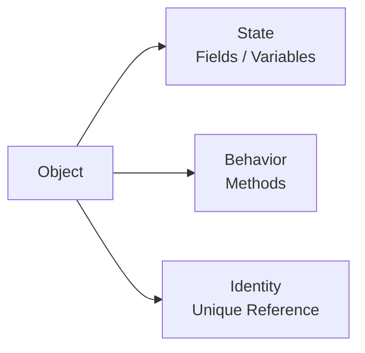

## Why use OOP?

OOP helps developers create software that is:

- Modular
- Reusable
- Maintainable
- Testable
- Extensible
- Easier to understand

---

# 2. Class and Object

## 2.1 Class

A class is a blueprint or template used to create objects.

A class defines:

- Fields
- Methods
- Constructors
- Nested classes
- Initialization blocks

```java
public class Car {

    private String brand;
    private String model;
    private int speed;

    public Car(String brand, String model) {
        this.brand = brand;
        this.model = model;
    }

    public void accelerate(int increment) {
        speed += increment;
    }

    public void displayDetails() {
        System.out.println("Brand: " + brand);
        System.out.println("Model: " + model);
        System.out.println("Speed: " + speed);
    }
}
```

## 2.2 Object

An object is a runtime instance of a class.

```java
public class Main {

    public static void main(String[] args) {
        Car car = new Car("Tata", "Nexon");

        car.accelerate(40);
        car.displayDetails();
    }
}
```

## Object creation process

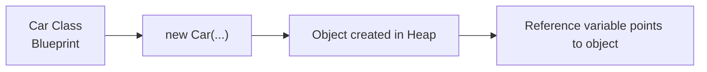

When this statement is executed:

```java
Car car = new Car("Tata", "Nexon");
```

- `Car` is the class type.
- `car` is the reference variable.
- `new` creates an object in heap memory.
- `Car(...)` invokes the constructor.

---

# 3. The Four Pillars of OOP

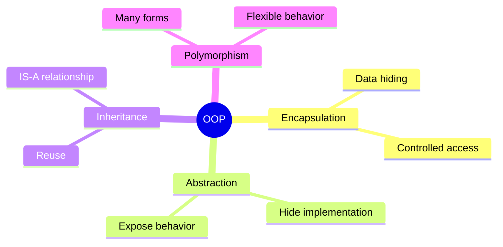

---

## 3.1 Encapsulation

Encapsulation means wrapping data and behavior together inside a class and restricting direct access to internal data.

It is commonly achieved using:

- `private` fields
- Public getter and setter methods
- Validation inside methods
- Immutable objects

## Example without encapsulation

```java
class BankAccount {
    public double balance;
}
```

This is unsafe because any code can assign an invalid value:

```java
BankAccount account = new BankAccount();
account.balance = -100000;
```

## Example with encapsulation

```java
public class BankAccount {

    private final String accountNumber;
    private double balance;

    public BankAccount(String accountNumber, double openingBalance) {
        if (openingBalance < 0) {
            throw new IllegalArgumentException(
                    "Opening balance cannot be negative"
            );
        }

        this.accountNumber = accountNumber;
        this.balance = openingBalance;
    }

    public void deposit(double amount) {
        validatePositiveAmount(amount);
        balance += amount;
    }

    public void withdraw(double amount) {
        validatePositiveAmount(amount);

        if (amount > balance) {
            throw new IllegalStateException("Insufficient balance");
        }

        balance -= amount;
    }

    public double getBalance() {
        return balance;
    }

    public String getAccountNumber() {
        return accountNumber;
    }

    private void validatePositiveAmount(double amount) {
        if (amount <= 0) {
            throw new IllegalArgumentException(
                    "Amount must be greater than zero"
            );
        }
    }
}
```

## Usage

```java
public class Main {

    public static void main(String[] args) {
        BankAccount account =
                new BankAccount("ACC-1001", 5000);

        account.deposit(1500);
        account.withdraw(1000);

        System.out.println(account.getBalance());
    }
}
```

## Encapsulation diagram

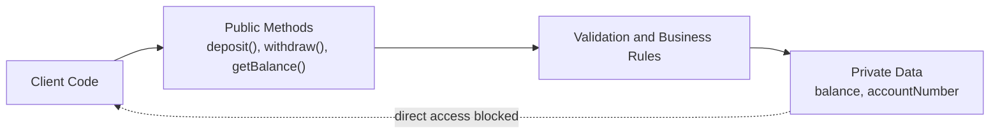

## Benefits of encapsulation

- Protects object state.
- Prevents invalid data.
- Centralizes validation.
- Makes implementation easier to change.
- Reduces coupling.

## Important interview point

Encapsulation is not just creating getters and setters. A class with setters for every field may still expose too much internal state.

Good encapsulation exposes meaningful business operations:

```java
account.withdraw(500);
```

Instead of unrestricted state mutation:

```java
account.setBalance(account.getBalance() - 500);
```

---

## 3.2 Abstraction

Abstraction means exposing only essential behavior while hiding implementation details.

A user should know **what an object does**, not necessarily **how it does it**.

Abstraction in Java is achieved through:

- Interfaces
- Abstract classes
- Public APIs
- Service layers
- Design patterns

## Real-world example

A user drives a car using:

- Steering wheel
- Accelerator
- Brake

The driver does not need to understand the complete internal engine implementation.

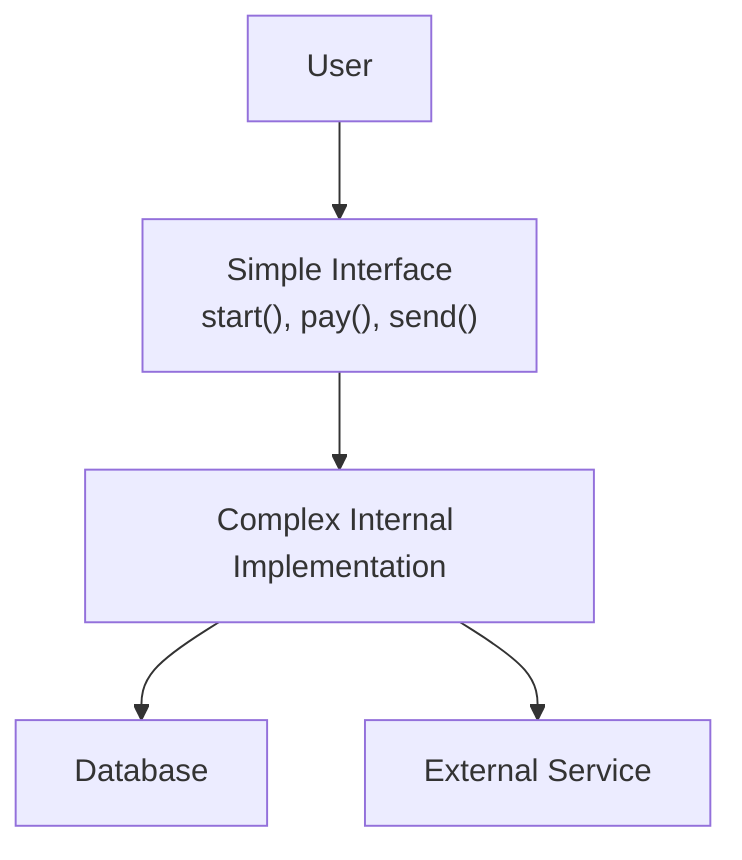

## Abstraction using an interface

```java
public interface PaymentProcessor {

    PaymentResult processPayment(
            String orderId,
            double amount
    );
}
```

```java
public record PaymentResult(
        boolean successful,
        String transactionId,
        String message
) {
}
```

```java
import java.util.UUID;

public class CreditCardPaymentProcessor
        implements PaymentProcessor {

    @Override
    public PaymentResult processPayment(
            String orderId,
            double amount
    ) {
        validateAmount(amount);

        String transactionId =
                UUID.randomUUID().toString();

        return new PaymentResult(
                true,
                transactionId,
                "Credit card payment completed"
        );
    }

    private void validateAmount(double amount) {
        if (amount <= 0) {
            throw new IllegalArgumentException(
                    "Payment amount must be positive"
            );
        }
    }
}
```

```java
public class CheckoutService {

    private final PaymentProcessor paymentProcessor;

    public CheckoutService(
            PaymentProcessor paymentProcessor
    ) {
        this.paymentProcessor = paymentProcessor;
    }

    public PaymentResult checkout(
            String orderId,
            double amount
    ) {
        return paymentProcessor.processPayment(
                orderId,
                amount
        );
    }
}
```

## Usage

```java
public class Main {

    public static void main(String[] args) {
        PaymentProcessor processor =
                new CreditCardPaymentProcessor();

        CheckoutService checkoutService =
                new CheckoutService(processor);

        PaymentResult result =
                checkoutService.checkout(
                        "ORDER-101",
                        2499
                );

        System.out.println(result);
    }
}
```

The `CheckoutService` depends on an abstraction instead of a concrete payment implementation.

This makes it easier to add:

- UPI payment
- Net banking
- Wallet payment
- PayPal payment

without changing the checkout logic.

---

## 3.3 Inheritance

Inheritance allows one class to acquire accessible fields and methods from another class.

It represents an **IS-A relationship**.

Examples:

- Dog IS-A Animal.
- Manager IS-A Employee.
- SavingsAccount IS-A BankAccount.

## Syntax

```java
class Parent {
}

class Child extends Parent {
}
```

## Example

```java
public class Employee {

    private final String employeeId;
    private final String name;

    public Employee(
            String employeeId,
            String name
    ) {
        this.employeeId = employeeId;
        this.name = name;
    }

    public void work() {
        System.out.println(name + " is working");
    }

    public String getEmployeeId() {
        return employeeId;
    }

    public String getName() {
        return name;
    }
}
```

```java
public class SoftwareEngineer extends Employee {

    private final String programmingLanguage;

    public SoftwareEngineer(
            String employeeId,
            String name,
            String programmingLanguage
    ) {
        super(employeeId, name);
        this.programmingLanguage =
                programmingLanguage;
    }

    public void writeCode() {
        System.out.println(
                getName()
                        + " is writing "
                        + programmingLanguage
                        + " code"
        );
    }
}
```

```java
public class Main {

    public static void main(String[] args) {
        SoftwareEngineer engineer =
                new SoftwareEngineer(
                        "EMP-101",
                        "Shailendra",
                        "Java"
                );

        engineer.work();
        engineer.writeCode();
    }
}
```

## Inheritance diagram

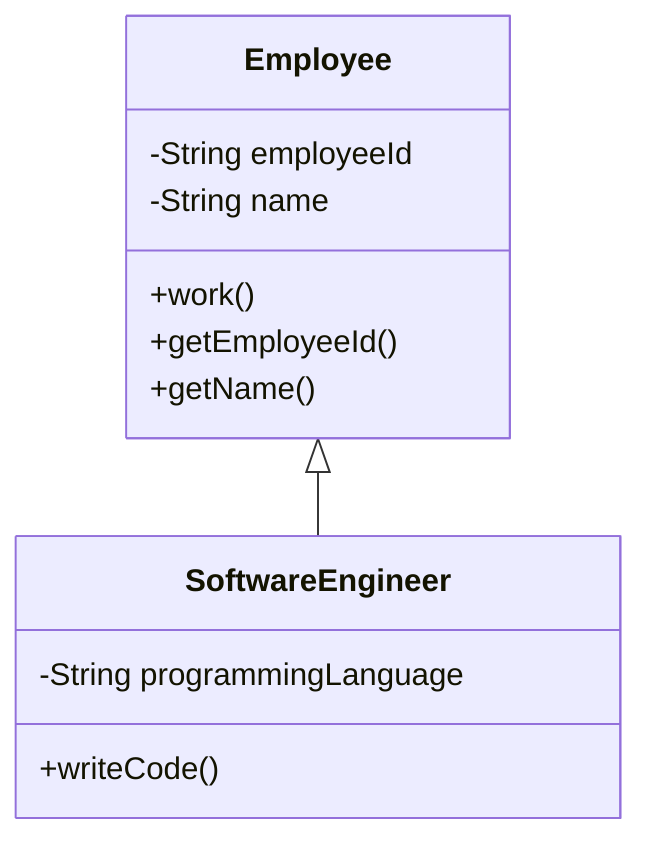

## Types of inheritance in Java

### Single inheritance

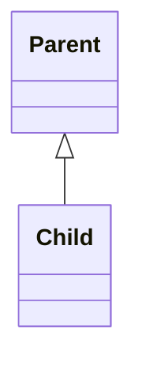

### Multilevel inheritance

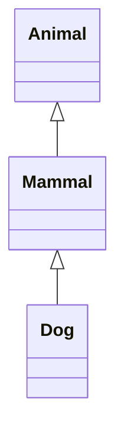

### Hierarchical inheritance

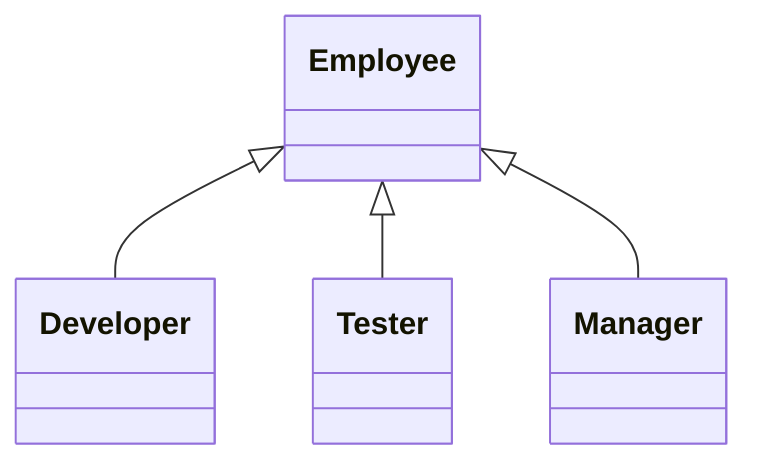

### Multiple inheritance

Java does not support multiple inheritance with classes.

This is not allowed:

```java
// Invalid Java code
class Child extends ParentOne, ParentTwo {
}
```

Java supports multiple inheritance of type using interfaces:

```java
interface Printable {
    void print();
}

interface Scannable {
    void scan();
}

class MultiFunctionPrinter
        implements Printable, Scannable {

    @Override
    public void print() {
        System.out.println("Printing");
    }

    @Override
    public void scan() {
        System.out.println("Scanning");
    }
}
```

## Why Java avoids multiple class inheritance

It prevents ambiguity such as the diamond problem.

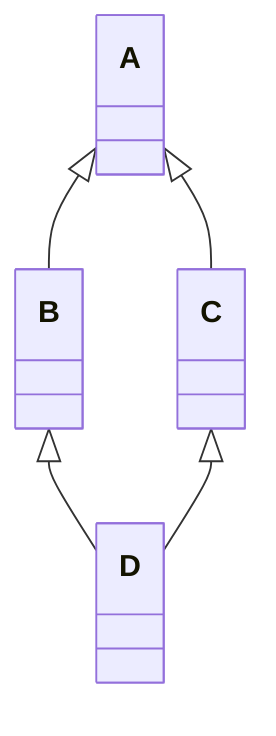

If both `B` and `C` override a method from `A`, class `D` may not know which implementation to inherit.

## Inheritance best practices

Use inheritance only when:

- A genuine IS-A relationship exists.
- The subclass can safely replace the parent class.
- Shared behavior is stable and meaningful.

Prefer composition when reuse is the only goal.

---

## 3.4 Polymorphism

Polymorphism means "many forms."

The same method call or abstraction can produce different behavior depending on the actual object.

Java supports:

1. Compile-time polymorphism
2. Runtime polymorphism

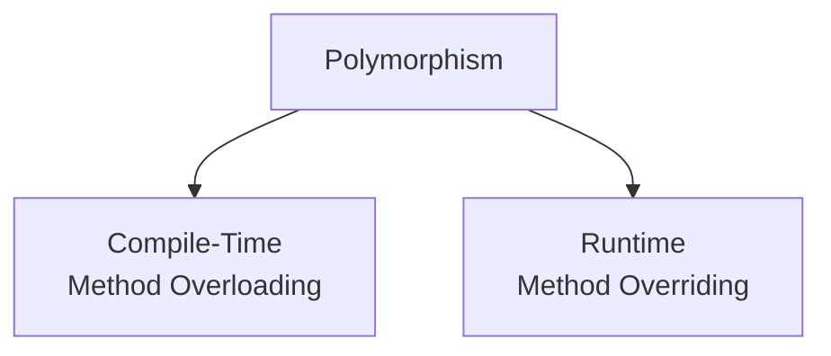

### Compile-time polymorphism

Compile-time polymorphism is achieved through method overloading.

```java
public class Calculator {

    public int add(int first, int second) {
        return first + second;
    }

    public int add(
            int first,
            int second,
            int third
    ) {
        return first + second + third;
    }

    public double add(
            double first,
            double second
    ) {
        return first + second;
    }
}
```

The compiler selects the correct method based on:

- Number of arguments
- Argument types
- Argument order

### Runtime polymorphism

Runtime polymorphism is achieved through method overriding.

```java
public interface NotificationSender {

    void send(String recipient, String message);
}
```

```java
public class EmailNotificationSender
        implements NotificationSender {

    @Override
    public void send(
            String recipient,
            String message
    ) {
        System.out.println(
                "Sending email to "
                        + recipient
                        + ": "
                        + message
        );
    }
}
```

```java
public class SmsNotificationSender
        implements NotificationSender {

    @Override
    public void send(
            String recipient,
            String message
    ) {
        System.out.println(
                "Sending SMS to "
                        + recipient
                        + ": "
                        + message
        );
    }
}
```

```java
public class NotificationService {

    public void notifyUser(
            NotificationSender sender,
            String recipient,
            String message
    ) {
        sender.send(recipient, message);
    }
}
```

```java
public class Main {

    public static void main(String[] args) {
        NotificationService service =
                new NotificationService();

        NotificationSender emailSender =
                new EmailNotificationSender();

        NotificationSender smsSender =
                new SmsNotificationSender();

        service.notifyUser(
                emailSender,
                "user@example.com",
                "Order confirmed"
        );

        service.notifyUser(
                smsSender,
                "+91-9999999999",
                "Order dispatched"
        );
    }
}
```

## Runtime dispatch diagram

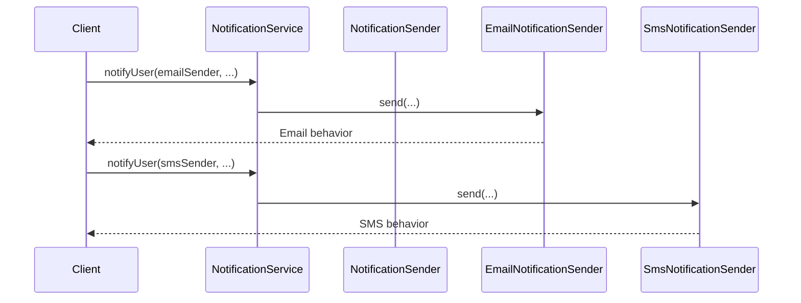

The method implementation is selected at runtime according to the actual object.

---

# 4. Association, Aggregation, and Composition

These concepts describe relationships between objects.

---

## 4.1 Association

Association is a general relationship in which one object uses or knows another object.

Example:

- Teacher teaches Student.
- Doctor treats Patient.
- OrderService uses PaymentService.

```java
public class Doctor {

    private final String name;

    public Doctor(String name) {
        this.name = name;
    }

    public void treat(Patient patient) {
        System.out.println(
                name + " is treating "
                        + patient.getName()
        );
    }
}
```

```java
public class Patient {

    private final String name;

    public Patient(String name) {
        this.name = name;
    }

    public String getName() {
        return name;
    }
}
```

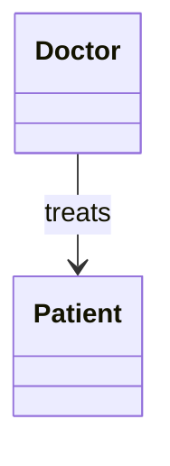

Both objects can exist independently.

---

## 4.2 Aggregation

Aggregation is a weak HAS-A relationship.

The contained object can exist independently of the container.

Example:

- Department has Employees.
- Team has Players.
- Library has Books.

```java
import java.util.List;

public class Department {

    private final String name;
    private final List<Employee> employees;

    public Department(
            String name,
            List<Employee> employees
    ) {
        this.name = name;
        this.employees = List.copyOf(employees);
    }

    public void displayEmployees() {
        System.out.println("Department: " + name);

        employees.forEach(employee ->
                System.out.println(employee.getName())
        );
    }
}
```

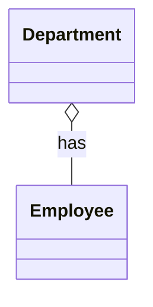

If a department is deleted, employees can still exist.

---

## 4.3 Composition

Composition is a strong HAS-A relationship.

The child object is strongly owned by the parent and usually does not meaningfully exist independently.

Example:

- House has Rooms.
- Order has OrderItems.
- Car has Engine.

```java
public class Engine {

    private boolean running;

    public void start() {
        running = true;
        System.out.println("Engine started");
    }

    public void stop() {
        running = false;
        System.out.println("Engine stopped");
    }

    public boolean isRunning() {
        return running;
    }
}
```

```java
public class Car {

    private final Engine engine;

    public Car() {
        this.engine = new Engine();
    }

    public void start() {
        engine.start();
    }

    public void stop() {
        engine.stop();
    }
}
```

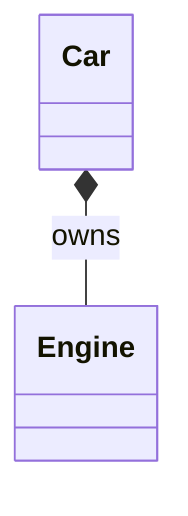

## Comparison

| Relationship | Meaning | Lifecycle dependency | UML notation |
|---|---|---:|---|
| Association | Uses or knows | No | Simple line |
| Aggregation | Weak HAS-A | Usually no | Hollow diamond |
| Composition | Strong HAS-A | Usually yes | Filled diamond |

---

# 5. Constructor

A constructor initializes an object.

Constructor rules:

- Constructor name must match the class name.
- A constructor has no return type.
- It runs when an object is created.
- Constructors can be overloaded.
- Constructors are not inherited.
- The first statement may call `this(...)` or `super(...)`.

## Default constructor

If no constructor is declared, Java provides a default no-argument constructor.

```java
public class User {
}
```

Equivalent behavior:

```java
public class User {

    public User() {
    }
}
```

Java does not generate a default constructor after you define any constructor yourself.

## Parameterized constructor

```java
public class Product {

    private final long id;
    private final String name;
    private final double price;

    public Product(
            long id,
            String name,
            double price
    ) {
        if (price < 0) {
            throw new IllegalArgumentException(
                    "Price cannot be negative"
            );
        }

        this.id = id;
        this.name = name;
        this.price = price;
    }
}
```

## Constructor overloading

```java
public class User {

    private final String name;
    private final String email;
    private final boolean active;

    public User(String name, String email) {
        this(name, email, true);
    }

    public User(
            String name,
            String email,
            boolean active
    ) {
        this.name = name;
        this.email = email;
        this.active = active;
    }
}
```

Calling another constructor using `this(...)` reduces duplicate initialization code.

---

# 6. `this` and `super` Keywords

## 6.1 `this`

`this` refers to the current object.

Uses:

- Resolve field and parameter name conflicts.
- Call another constructor.
- Pass the current object.
- Return the current object.
- Access current instance members.

```java
public class Customer {

    private String name;

    public Customer(String name) {
        this.name = name;
    }

    public Customer rename(String name) {
        this.name = name;
        return this;
    }
}
```

## 6.2 `super`

`super` refers to the immediate parent-class object.

Uses:

- Invoke the parent constructor.
- Access a parent method.
- Access a parent field when hidden by the subclass.

```java
public class Vehicle {

    public Vehicle(String registrationNumber) {
        System.out.println(
                "Vehicle created: "
                        + registrationNumber
        );
    }

    public void start() {
        System.out.println("Vehicle started");
    }
}
```

```java
public class ElectricCar extends Vehicle {

    public ElectricCar(String registrationNumber) {
        super(registrationNumber);
    }

    @Override
    public void start() {
        super.start();
        System.out.println(
                "Electric motor activated"
        );
    }
}
```

Important rule:

```java
super(...);
```

or

```java
this(...);
```

must be the first statement in a constructor.

---

# 7. Method Overloading and Method Overriding

## 7.1 Method overloading

Method overloading means multiple methods share the same name but have different parameter lists.

```java
public class Printer {

    public void print(String value) {
        System.out.println(value);
    }

    public void print(int value) {
        System.out.println(value);
    }

    public void print(String value, int copies) {
        for (int i = 0; i < copies; i++) {
            System.out.println(value);
        }
    }
}
```

Changing only the return type is not enough:

```java
// Invalid
public int calculate() {
    return 1;
}

// Invalid because parameter list is identical
public double calculate() {
    return 1.0;
}
```

## 7.2 Method overriding

Method overriding means a subclass provides a new implementation of an inherited method.

```java
public class Animal {

    public void makeSound() {
        System.out.println("Animal sound");
    }
}
```

```java
public class Dog extends Animal {

    @Override
    public void makeSound() {
        System.out.println("Dog barks");
    }
}
```

## Overriding rules

- Method name must be the same.
- Parameter list must be the same.
- Return type must be the same or covariant.
- Access level cannot be more restrictive.
- Checked exceptions cannot be broader.
- `final` methods cannot be overridden.
- `private` methods are not overridden.
- Static methods are hidden, not overridden.

## Comparison

| Feature | Overloading | Overriding |
|---|---|---|
| Polymorphism | Compile time | Runtime |
| Inheritance required | No | Yes |
| Parameter list | Must differ | Must match |
| Return type | May differ, but not alone | Same or covariant |
| Method selection | Compiler | JVM at runtime |
| Static methods | Can be overloaded | Hidden, not overridden |

---

# 8. Abstract Class vs Interface

## 8.1 Abstract class

An abstract class cannot be instantiated directly.

It may contain:

- Abstract methods
- Concrete methods
- Constructors
- Instance fields
- Static methods
- Final methods

```java
public abstract class Account {

    private final String accountNumber;
    protected double balance;

    protected Account(
            String accountNumber,
            double balance
    ) {
        this.accountNumber = accountNumber;
        this.balance = balance;
    }

    public abstract double calculateInterest();

    public void deposit(double amount) {
        if (amount <= 0) {
            throw new IllegalArgumentException(
                    "Amount must be positive"
            );
        }

        balance += amount;
    }

    public String getAccountNumber() {
        return accountNumber;
    }
}
```

```java
public class SavingsAccount extends Account {

    private final double interestRate;

    public SavingsAccount(
            String accountNumber,
            double balance,
            double interestRate
    ) {
        super(accountNumber, balance);
        this.interestRate = interestRate;
    }

    @Override
    public double calculateInterest() {
        return balance * interestRate / 100;
    }
}
```

## 8.2 Interface

An interface defines a contract that implementing classes must follow.

Modern Java interfaces can contain:

- Abstract methods
- Default methods
- Static methods
- Private methods
- Constants

```java
public interface Auditable {

    void audit();

    default void printAuditHeader() {
        System.out.println("Audit started");
        logInternalMessage();
    }

    static String version() {
        return "1.0";
    }

    private void logInternalMessage() {
        System.out.println("Internal audit log");
    }
}
```

## Comparison

| Feature | Abstract class | Interface |
|---|---|---|
| Instantiation | Not allowed | Not allowed |
| Constructor | Supported | Not supported |
| Instance fields | Supported | Not supported |
| Multiple inheritance | No | A class can implement many |
| Concrete methods | Supported | Default/static/private methods |
| Primary use | Shared base behavior/state | Contract or capability |
| Keyword | `extends` | `implements` |

## When to use an abstract class

Use an abstract class when:

- Related classes share state.
- Common constructor logic is needed.
- Protected helper methods are needed.
- A strong family relationship exists.

## When to use an interface

Use an interface when:

- You need a capability or contract.
- Unrelated classes should support the same operation.
- Multiple implementations are expected.
- Loose coupling is important.

---

# 9. Access Modifiers

Java provides four access levels.

| Modifier | Same class | Same package | Subclass outside package | Other packages |
|---|---:|---:|---:|---:|
| `private` | Yes | No | No | No |
| package-private | Yes | Yes | No | No |
| `protected` | Yes | Yes | Yes | No |
| `public` | Yes | Yes | Yes | Yes |

## Example

```java
public class AccessExample {

    private int privateValue;
    int packagePrivateValue;
    protected int protectedValue;
    public int publicValue;
}
```

## Best practice

Use the most restrictive access level that still satisfies the requirement.

Typical recommendation:

- Fields: usually `private`
- Public APIs: `public`
- Internal inheritance helpers: sometimes `protected`
- Package implementation details: package-private

---

# 10. Static and Final Keywords

## 10.1 `static`

A static member belongs to the class, not to an individual object.

```java
public class User {

    private static int count;

    public User() {
        count++;
    }

    public static int getCount() {
        return count;
    }
}
```

```java
public class Main {

    public static void main(String[] args) {
        new User();
        new User();

        System.out.println(User.getCount());
    }
}
```

Static methods cannot directly access instance fields because no current object is guaranteed to exist.

## 10.2 `final`

`final` has different meanings depending on where it is used.

### Final variable

A final variable can be assigned only once.

```java
final int maxRetries = 3;
```

For object references, the reference cannot change, but the object may still be mutable.

```java
final List<String> names = new ArrayList<>();

names.add("Java"); // Allowed
// names = new ArrayList<>(); // Not allowed
```

### Final method

A final method cannot be overridden.

```java
public class SecurityService {

    public final void validateToken() {
        System.out.println("Token validated");
    }
}
```

### Final class

A final class cannot be extended.

```java
public final class UtilityClass {

    private UtilityClass() {
    }
}
```

Examples from the Java standard library:

- `String`
- Wrapper classes such as `Integer`
- Many immutable value classes

---

# 11. Object Class

Every Java class directly or indirectly extends `java.lang.Object`.

Important methods include:

- `toString()`
- `equals(Object object)`
- `hashCode()`
- `getClass()`
- `clone()`
- `finalize()` — deprecated and should not be used
- `wait()`
- `notify()`
- `notifyAll()`

## `toString()`

```java
public class Product {

    private final long id;
    private final String name;

    public Product(long id, String name) {
        this.id = id;
        this.name = name;
    }

    @Override
    public String toString() {
        return "Product{"
                + "id=" + id
                + ", name='" + name + '\''
                + '}';
    }
}
```

## `equals()` and `hashCode()`

If two objects are logically equal, their hash codes must also be equal.

Contract:

```text
a.equals(b) == true
=> a.hashCode() == b.hashCode()
```

The reverse is not guaranteed.

```java
import java.util.Objects;

public class Employee {

    private final String employeeId;
    private final String name;

    public Employee(
            String employeeId,
            String name
    ) {
        this.employeeId = employeeId;
        this.name = name;
    }

    @Override
    public boolean equals(Object object) {
        if (this == object) {
            return true;
        }

        if (!(object instanceof Employee employee)) {
            return false;
        }

        return Objects.equals(
                employeeId,
                employee.employeeId
        );
    }

    @Override
    public int hashCode() {
        return Objects.hash(employeeId);
    }

    @Override
    public String toString() {
        return "Employee{"
                + "employeeId='" + employeeId + '\''
                + ", name='" + name + '\''
                + '}';
    }
}
```

This is especially important for:

- `HashMap`
- `HashSet`
- Caching
- Entity comparison
- Deduplication

## Identity vs equality

```java
Employee first =
        new Employee("EMP-1", "Amit");

Employee second =
        new Employee("EMP-1", "Amit");

System.out.println(first == second);
System.out.println(first.equals(second));
```

- `==` compares references for objects.
- `equals()` compares logical equality when overridden.

---

# 12. Immutable Classes

An immutable object's state cannot change after construction.

Examples:

- `String`
- `Integer`
- `LocalDate`
- Records whose components are themselves immutable

## Benefits

- Thread safety
- Predictability
- Safe sharing
- Easier caching
- Reliable map keys
- Fewer side effects

## Rules for creating an immutable class

1. Make the class `final`.
2. Make fields `private` and `final`.
3. Initialize all fields in the constructor.
4. Do not provide setters.
5. Defensively copy mutable inputs.
6. Return defensive copies or unmodifiable views.

## Example

```java
import java.time.LocalDate;
import java.util.List;

public final class EmployeeProfile {

    private final String employeeId;
    private final String name;
    private final LocalDate joiningDate;
    private final List<String> skills;

    public EmployeeProfile(
            String employeeId,
            String name,
            LocalDate joiningDate,
            List<String> skills
    ) {
        this.employeeId = employeeId;
        this.name = name;
        this.joiningDate = joiningDate;
        this.skills = List.copyOf(skills);
    }

    public String getEmployeeId() {
        return employeeId;
    }

    public String getName() {
        return name;
    }

    public LocalDate getJoiningDate() {
        return joiningDate;
    }

    public List<String> getSkills() {
        return skills;
    }
}
```

Because `List.copyOf()` creates an unmodifiable copy, external code cannot mutate the original internal list.

---

# 13. SOLID Principles

SOLID is a collection of five object-oriented design principles.

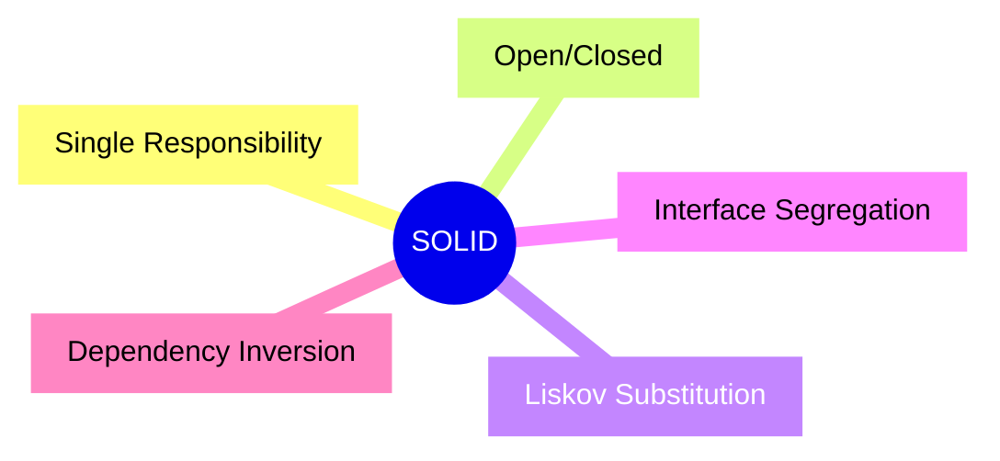

---

## 13.1 Single Responsibility Principle

A class should have one reason to change.

### Poor design

```java
public class InvoiceService {

    public void calculateInvoice() {
    }

    public void saveToDatabase() {
    }

    public void sendEmail() {
    }

    public void generatePdf() {
    }
}
```

This class has multiple responsibilities.

### Better design

```java
public class InvoiceCalculator {

    public double calculate(Invoice invoice) {
        return invoice.items()
                .stream()
                .mapToDouble(InvoiceItem::totalPrice)
                .sum();
    }
}
```

```java
public class InvoiceRepository {

    public void save(Invoice invoice) {
        System.out.println("Invoice saved");
    }
}
```

```java
public class InvoiceEmailService {

    public void send(Invoice invoice) {
        System.out.println("Invoice emailed");
    }
}
```

Each class has a focused responsibility.

---

## 13.2 Open/Closed Principle

Software entities should be:

- Open for extension.
- Closed for modification.

### Poor design

```java
public class DiscountCalculator {

    public double calculate(
            String customerType,
            double amount
    ) {
        if ("REGULAR".equals(customerType)) {
            return amount * 0.05;
        }

        if ("PREMIUM".equals(customerType)) {
            return amount * 0.10;
        }

        return 0;
    }
}
```

Every new customer type requires modifying the class.

### Better design

```java
public interface DiscountPolicy {

    double calculateDiscount(double amount);
}
```

```java
public class RegularDiscountPolicy
        implements DiscountPolicy {

    @Override
    public double calculateDiscount(double amount) {
        return amount * 0.05;
    }
}
```

```java
public class PremiumDiscountPolicy
        implements DiscountPolicy {

    @Override
    public double calculateDiscount(double amount) {
        return amount * 0.10;
    }
}
```

```java
public class DiscountService {

    public double applyDiscount(
            double amount,
            DiscountPolicy policy
    ) {
        return amount
                - policy.calculateDiscount(amount);
    }
}
```

New discount behavior can be added without changing `DiscountService`.

---

## 13.3 Liskov Substitution Principle

A subclass should be usable wherever its parent type is expected without breaking correctness.

### Violation example

```java
public class Bird {

    public void fly() {
        System.out.println("Flying");
    }
}
```

```java
public class Penguin extends Bird {

    @Override
    public void fly() {
        throw new UnsupportedOperationException(
                "Penguins cannot fly"
        );
    }
}
```

A `Penguin` cannot safely replace a `Bird` when the caller expects all birds to fly.

### Better design

```java
public interface Bird {

    void eat();
}
```

```java
public interface FlyingBird extends Bird {

    void fly();
}
```

```java
public class Sparrow implements FlyingBird {

    @Override
    public void eat() {
        System.out.println("Sparrow is eating");
    }

    @Override
    public void fly() {
        System.out.println("Sparrow is flying");
    }
}
```

```java
public class Penguin implements Bird {

    @Override
    public void eat() {
        System.out.println("Penguin is eating");
    }
}
```

---

## 13.4 Interface Segregation Principle

Clients should not depend on methods they do not use.

### Poor design

```java
public interface Worker {

    void work();

    void eat();

    void sleep();
}
```

A robot may work but does not eat or sleep.

### Better design

```java
public interface Workable {

    void work();
}
```

```java
public interface Eatable {

    void eat();
}
```

```java
public class HumanWorker
        implements Workable, Eatable {

    @Override
    public void work() {
        System.out.println("Human working");
    }

    @Override
    public void eat() {
        System.out.println("Human eating");
    }
}
```

```java
public class RobotWorker
        implements Workable {

    @Override
    public void work() {
        System.out.println("Robot working");
    }
}
```

---

## 13.5 Dependency Inversion Principle

High-level modules should depend on abstractions, not concrete implementations.

### Poor design

```java
public class OrderService {

    private final EmailNotificationSender sender =
            new EmailNotificationSender();

    public void placeOrder() {
        sender.send(
                "user@example.com",
                "Order placed"
        );
    }
}
```

`OrderService` is tightly coupled to email notifications.

### Better design

```java
public class OrderService {

    private final NotificationSender sender;

    public OrderService(
            NotificationSender sender
    ) {
        this.sender = sender;
    }

    public void placeOrder(
            String recipient
    ) {
        System.out.println("Order placed");

        sender.send(
                recipient,
                "Your order has been placed"
        );
    }
}
```

Dependencies are supplied from outside, commonly using constructor injection.

This principle is heavily used by Spring's dependency injection container.

---

# 14. Complete OOP Example

The following example models an order-processing system using:

- Encapsulation
- Abstraction
- Inheritance
- Runtime polymorphism
- Composition
- Dependency inversion
- Immutable value objects

## System design

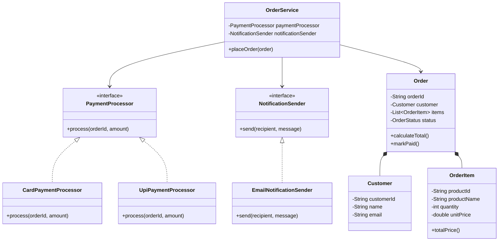

## `Customer.java`

```java
public record Customer(
        String customerId,
        String name,
        String email
) {

    public Customer {
        if (customerId == null
                || customerId.isBlank()) {
            throw new IllegalArgumentException(
                    "Customer ID is required"
            );
        }

        if (name == null || name.isBlank()) {
            throw new IllegalArgumentException(
                    "Customer name is required"
            );
        }

        if (email == null
                || !email.contains("@")) {
            throw new IllegalArgumentException(
                    "Valid email is required"
            );
        }
    }
}
```

## `OrderItem.java`

```java
public record OrderItem(
        String productId,
        String productName,
        int quantity,
        double unitPrice
) {

    public OrderItem {
        if (productId == null
                || productId.isBlank()) {
            throw new IllegalArgumentException(
                    "Product ID is required"
            );
        }

        if (quantity <= 0) {
            throw new IllegalArgumentException(
                    "Quantity must be positive"
            );
        }

        if (unitPrice < 0) {
            throw new IllegalArgumentException(
                    "Unit price cannot be negative"
            );
        }
    }

    public double totalPrice() {
        return quantity * unitPrice;
    }
}
```

## `OrderStatus.java`

```java
public enum OrderStatus {
    CREATED,
    PAID,
    FAILED
}
```

## `Order.java`

```java
import java.util.List;

public class Order {

    private final String orderId;
    private final Customer customer;
    private final List<OrderItem> items;
    private OrderStatus status;

    public Order(
            String orderId,
            Customer customer,
            List<OrderItem> items
    ) {
        if (orderId == null
                || orderId.isBlank()) {
            throw new IllegalArgumentException(
                    "Order ID is required"
            );
        }

        if (customer == null) {
            throw new IllegalArgumentException(
                    "Customer is required"
            );
        }

        if (items == null || items.isEmpty()) {
            throw new IllegalArgumentException(
                    "Order must contain an item"
            );
        }

        this.orderId = orderId;
        this.customer = customer;
        this.items = List.copyOf(items);
        this.status = OrderStatus.CREATED;
    }

    public double calculateTotal() {
        return items.stream()
                .mapToDouble(OrderItem::totalPrice)
                .sum();
    }

    public void markPaid() {
        if (status != OrderStatus.CREATED) {
            throw new IllegalStateException(
                    "Only created orders can be paid"
            );
        }

        status = OrderStatus.PAID;
    }

    public void markFailed() {
        status = OrderStatus.FAILED;
    }

    public String getOrderId() {
        return orderId;
    }

    public Customer getCustomer() {
        return customer;
    }

    public List<OrderItem> getItems() {
        return items;
    }

    public OrderStatus getStatus() {
        return status;
    }
}
```

## `PaymentProcessor.java`

```java
public interface PaymentProcessor {

    PaymentResult process(
            String orderId,
            double amount
    );
}
```

## `PaymentResult.java`

```java
public record PaymentResult(
        boolean successful,
        String transactionId,
        String message
) {
}
```

## `CardPaymentProcessor.java`

```java
import java.util.UUID;

public class CardPaymentProcessor
        implements PaymentProcessor {

    @Override
    public PaymentResult process(
            String orderId,
            double amount
    ) {
        validateAmount(amount);

        return new PaymentResult(
                true,
                UUID.randomUUID().toString(),
                "Card payment successful"
        );
    }

    private void validateAmount(double amount) {
        if (amount <= 0) {
            throw new IllegalArgumentException(
                    "Amount must be positive"
            );
        }
    }
}
```

## `UpiPaymentProcessor.java`

```java
import java.util.UUID;

public class UpiPaymentProcessor
        implements PaymentProcessor {

    @Override
    public PaymentResult process(
            String orderId,
            double amount
    ) {
        if (amount <= 0) {
            throw new IllegalArgumentException(
                    "Amount must be positive"
            );
        }

        return new PaymentResult(
                true,
                UUID.randomUUID().toString(),
                "UPI payment successful"
        );
    }
}
```

## `NotificationSender.java`

```java
public interface NotificationSender {

    void send(String recipient, String message);
}
```

## `EmailNotificationSender.java`

```java
public class EmailNotificationSender
        implements NotificationSender {

    @Override
    public void send(
            String recipient,
            String message
    ) {
        System.out.println(
                "Email sent to "
                        + recipient
                        + ": "
                        + message
        );
    }
}
```

## `OrderService.java`

```java
public class OrderService {

    private final PaymentProcessor paymentProcessor;
    private final NotificationSender notificationSender;

    public OrderService(
            PaymentProcessor paymentProcessor,
            NotificationSender notificationSender
    ) {
        this.paymentProcessor = paymentProcessor;
        this.notificationSender =
                notificationSender;
    }

    public PaymentResult placeOrder(Order order) {
        double total = order.calculateTotal();

        PaymentResult paymentResult =
                paymentProcessor.process(
                        order.getOrderId(),
                        total
                );

        if (paymentResult.successful()) {
            order.markPaid();

            notificationSender.send(
                    order.getCustomer().email(),
                    "Order "
                            + order.getOrderId()
                            + " placed successfully"
            );
        } else {
            order.markFailed();
        }

        return paymentResult;
    }
}
```

## `Main.java`

```java
import java.util.List;

public class Main {

    public static void main(String[] args) {
        Customer customer = new Customer(
                "CUST-101",
                "Shailendra",
                "shailendra@example.com"
        );

        List<OrderItem> items = List.of(
                new OrderItem(
                        "P-101",
                        "Mechanical Keyboard",
                        1,
                        4999
                ),
                new OrderItem(
                        "P-102",
                        "Wireless Mouse",
                        2,
                        1499
                )
        );

        Order order = new Order(
                "ORDER-1001",
                customer,
                items
        );

        PaymentProcessor paymentProcessor =
                new UpiPaymentProcessor();

        NotificationSender notificationSender =
                new EmailNotificationSender();

        OrderService orderService =
                new OrderService(
                        paymentProcessor,
                        notificationSender
                );

        PaymentResult result =
                orderService.placeOrder(order);

        System.out.println(
                "Payment result: " + result
        );

        System.out.println(
                "Order status: "
                        + order.getStatus()
        );

        System.out.println(
                "Order total: "
                        + order.calculateTotal()
        );
    }
}
```

## Execution flow

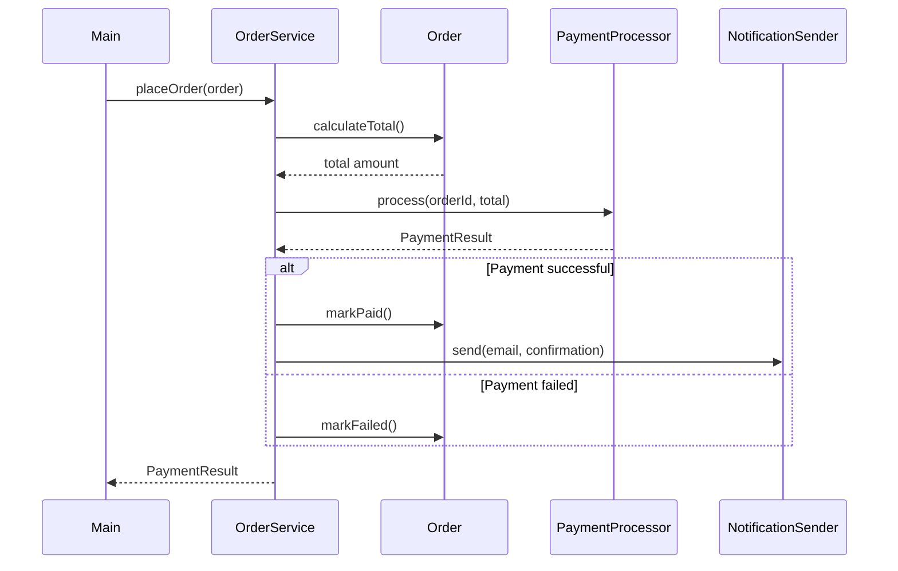

## OOP concepts used

| Concept | Usage |
|---|---|
| Encapsulation | `Order` controls status changes |
| Abstraction | `PaymentProcessor`, `NotificationSender` |
| Inheritance | Implementations inherit interface contracts |
| Polymorphism | UPI or card processor can be selected at runtime |
| Composition | An order contains customer and order items |
| Immutability | Records and `List.copyOf()` |
| Dependency inversion | `OrderService` depends on interfaces |
| Open/Closed Principle | New payment methods can be added independently |

---

# 15. Common Interview Questions

## 1. What is the difference between a class and an object?

A class is a blueprint. An object is a runtime instance of that class.

## 2. What are the four pillars of OOP?

- Encapsulation
- Abstraction
- Inheritance
- Polymorphism

## 3. What is the difference between abstraction and encapsulation?

- Abstraction hides unnecessary implementation details.
- Encapsulation protects internal state and controls access.

## 4. Can Java support multiple inheritance?

Java does not support multiple inheritance through classes, but a class can implement multiple interfaces.

## 5. What is runtime polymorphism?

Runtime polymorphism occurs when an overridden method is selected according to the object's actual runtime type.

## 6. Can static methods be overridden?

No. Static methods are hidden because they belong to the class.

## 7. Can private methods be overridden?

No. Private methods are not visible to subclasses.

## 8. Can a constructor be inherited?

No. A subclass may invoke a parent constructor using `super(...)`, but constructors are not inherited.

## 9. Can an abstract class have a constructor?

Yes. Its constructor is called while constructing a concrete subclass.

## 10. Can an interface have method implementations?

Yes. Modern Java interfaces may contain default, static, and private methods.

## 11. Why should `equals()` and `hashCode()` be overridden together?

Hash-based collections use both. Logically equal objects must produce equal hash codes.

## 12. What is the difference between `==` and `equals()`?

- `==` compares primitive values or object references.
- `equals()` can compare logical object equality.

## 13. What is composition over inheritance?

It means preferring object collaboration through HAS-A relationships rather than extending classes only for code reuse.

## 14. What is method hiding?

When a subclass declares a static method with the same signature as a parent static method, the subclass method hides the parent method.

## 15. What is a covariant return type?

An overriding method may return a subtype of the parent method's return type.

```java
class Animal {
}

class Dog extends Animal {
}

class Parent {

    public Animal createAnimal() {
        return new Animal();
    }
}

class Child extends Parent {

    @Override
    public Dog createAnimal() {
        return new Dog();
    }
}
```

## 16. Can a final reference point to a mutable object?

Yes. The reference cannot be reassigned, but the object's internal state may change.

## 17. What is tight coupling?

Tight coupling occurs when a class directly depends on concrete implementation details.

## 18. What is loose coupling?

Loose coupling occurs when classes depend on abstractions and can be changed independently.

## 19. Why are immutable objects thread-safe?

Their state cannot change after construction, so concurrent threads cannot observe partial mutations.

## 20. Is inheritance always good?

No. Incorrect inheritance can create fragile hierarchies and violate Liskov substitution. Composition is often safer.

---

# 16. Summary

Object-Oriented Programming in Java organizes software using classes and objects.

The four main pillars are:

| Pillar | Purpose |
|---|---|
| Encapsulation | Protect state and control modification |
| Abstraction | Hide complexity and expose contracts |
| Inheritance | Model valid IS-A relationships |
| Polymorphism | Allow one abstraction to support many behaviors |

High-quality Java OOP code generally:

- Keeps fields private.
- Exposes meaningful operations.
- Depends on interfaces.
- Uses inheritance carefully.
- Prefers composition for flexible reuse.
- Builds immutable objects where practical.
- Overrides `equals()` and `hashCode()` correctly.
- Follows SOLID principles.
- Keeps each class focused on one responsibility.

---

## Recommended Practice Exercises

1. Build a library-management system.
2. Build a parking-lot model.
3. Build a payment-processing system.
4. Build an employee payroll system.
5. Build a notification service with email, SMS, and push implementations.
6. Refactor a large class using SOLID principles.
7. Create an immutable `Money` class.
8. Implement a strategy-based discount engine.
9. Model a food-delivery order workflow.
10. Write unit tests for polymorphic implementations.
